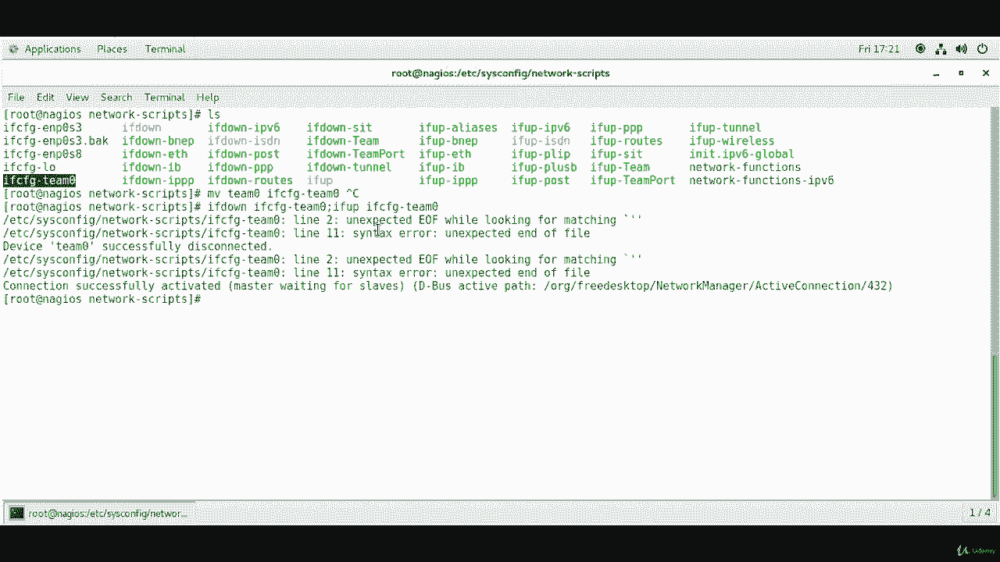
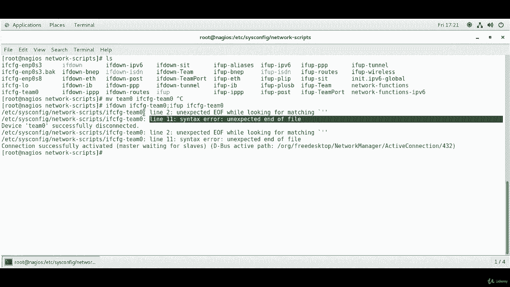
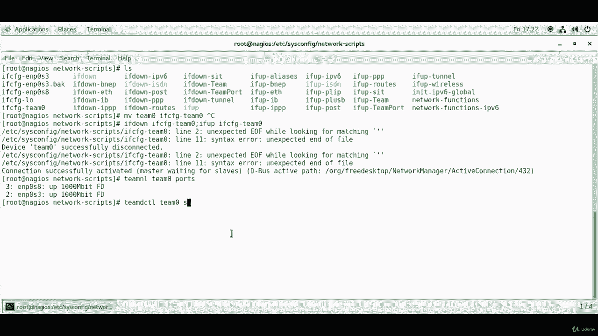
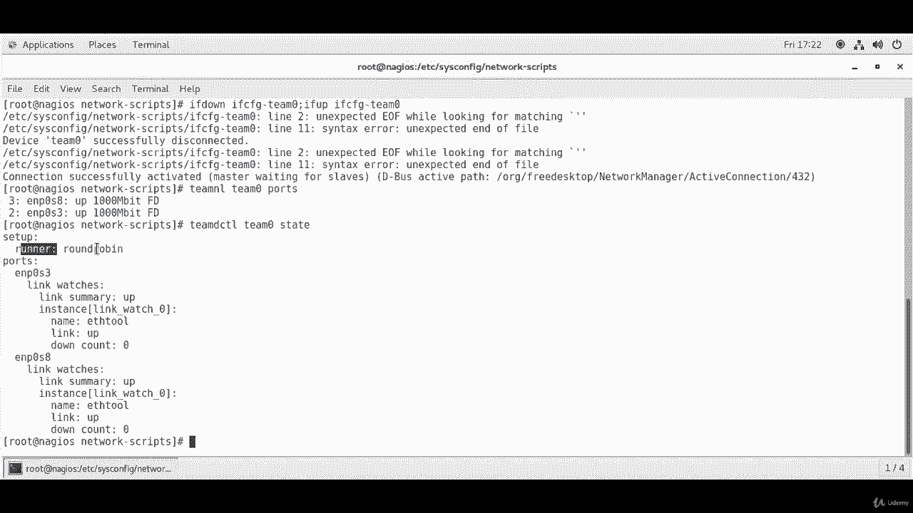
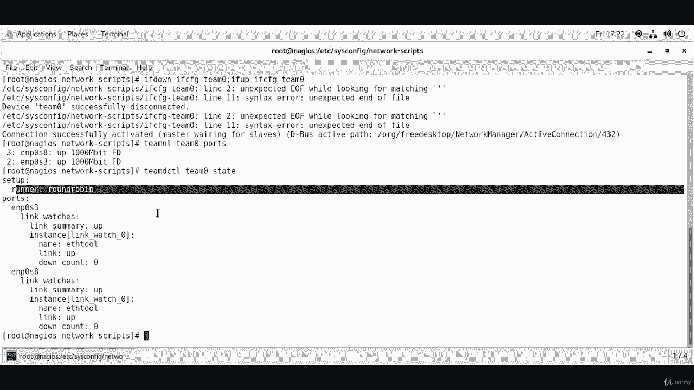

# Red Hat 认证工程师 (RHCE) 课程：P10：2. 网络接口组合 (Bonding)-----8. 组合测试

在本节课程中，我们将学习如何重启已配置的网络组合接口，并验证其状态。我们将使用命令行工具来停止和启动接口，并检查组合的运行状态和端口信息。

上一节我们完成了网络组合接口的配置，本节中我们来看看如何激活配置并进行测试。

## 重启接口以应用新配置

要应用新的网络组合配置，需要先停止再启动相关接口。以下是操作步骤。

首先，确保配置文件名称符合规范。如果之前创建了名为 `Team0` 的配置文件，建议将其重命名为 `ifcfg-Team0`，以保持与其他网络配置文件的一致性。可以使用 `mv` 命令进行移动。

```
mv /etc/sysconfig/network-scripts/Team0 /etc/sysconfig/network-scripts/ifcfg-Team0
```

接下来，使用 `ifdown` 和 `ifup` 命令来重启接口。

```
ifdown ifcfg-Team0 && ifup ifcfg-Team0
```

这个命令会先停止 `ifcfg-Team0` 接口，然后再启动它，从而使新的配置生效。在执行过程中，可能会遇到一些关于语法的警告信息，例如提示某一行存在错误。如果确认配置文件内容正确，可以暂时忽略这些警告，主要关注接口是否能成功连接。





如图所示，接口连接成功建立。这是我们最关心的结果。

## 检查组合接口状态


接口重启后，我们需要验证组合的工作状态。以下是用于检查的几个关键命令。


首先，使用 `teamnl` 命令查看组合端口的状态。

```
teamnl team0 ports
```

该命令会显示组合 `team0` 中所有端口（即从属接口）的信息。输出应表明两个从属接口均处于 **active**（活动）和 **current**（当前）状态。



接下来，使用 `teamdctl` 命令查看组合的详细状态。

```
teamdctl team0 state
```


运行此命令后，将显示组合的详细信息。例如，**runner**（运行模式）显示为 **roundrobin**（轮询），这表明数据包将在两个从属接口间轮流发送。同时，命令会列出所有端口（如 `enp0s3` 和 `enp0s8`）及其链接状态，确认它们都是 **up**（启用）的。






至此，我们完成了对网络组合接口的测试。


本节课中我们一起学习了如何重启网络组合接口以应用配置，并使用 `teamnl` 和 `teamdctl` 命令验证了接口的状态和运行模式。确认组合配置正确且所有从属接口工作正常，是网络管理中的重要步骤。