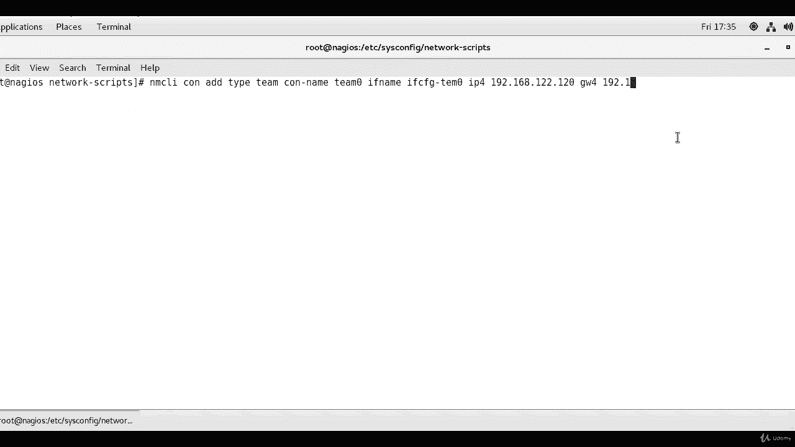
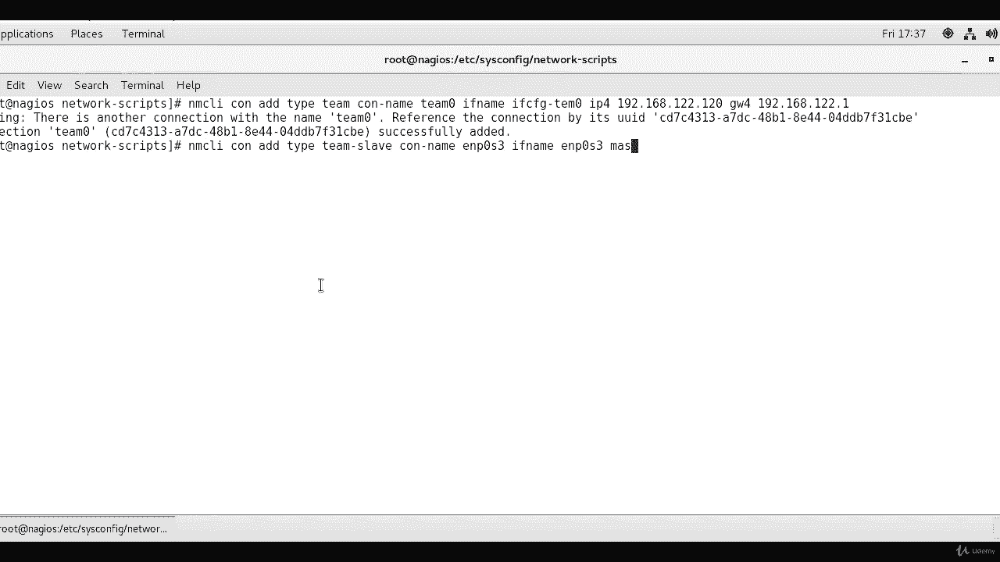
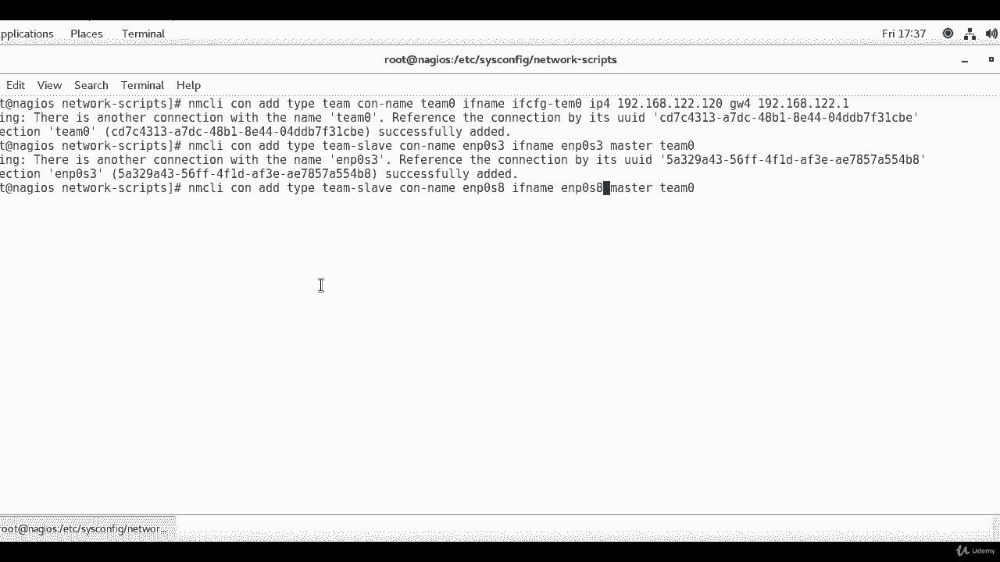
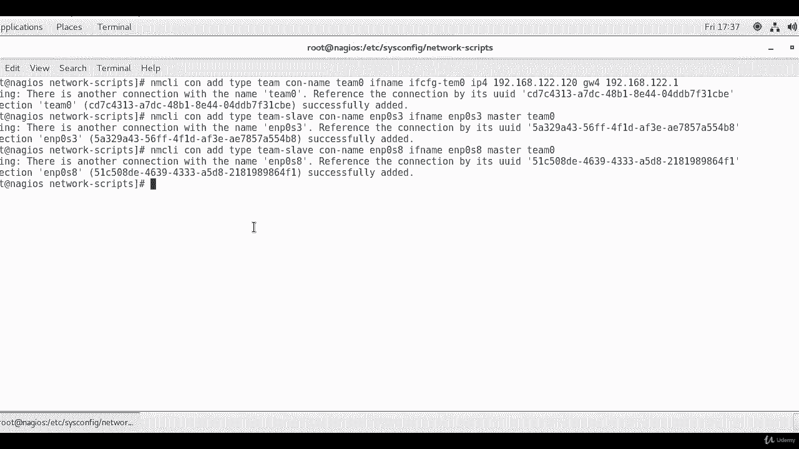
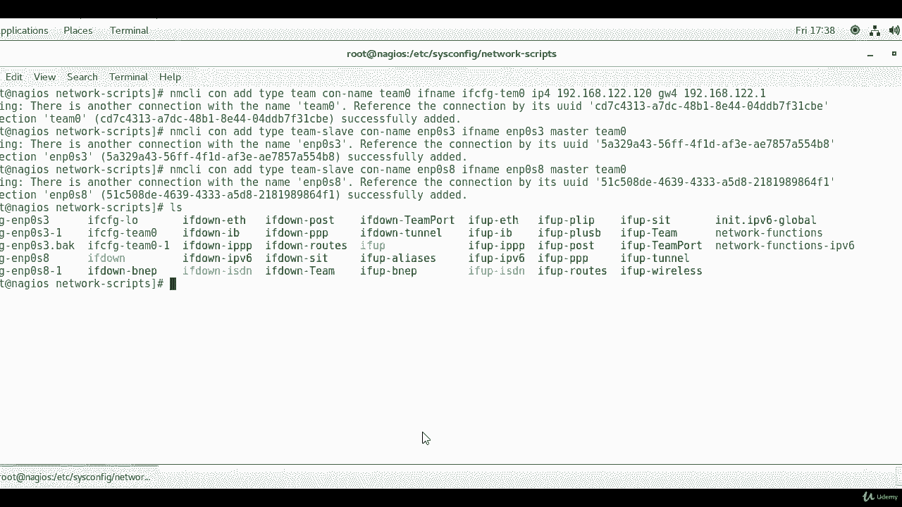

# RHCE课程：P11：使用nmcli配置网络接口聚合（Teaming）

在本节课中，我们将学习如何使用`nmcli`命令行工具来创建和配置网络接口聚合（Teaming）。这是一种在Red Hat Enterprise Linux 7及更高版本中推荐的网络冗余和负载均衡方法。

## 概述

网络接口聚合（Teaming）允许将多个物理网络接口绑定为一个逻辑接口，以提高带宽和冗余。我们将使用`nmcli`工具，通过单条命令创建聚合接口`Team0`，并为其配置IP地址和网关，然后将两个物理接口添加为其成员（slave）。

## 创建聚合接口



首先，我们使用`nmcli`命令创建名为`Team0`的聚合接口，并同时为其配置IPv4地址和默认网关。

以下是创建聚合接口`Team0`的命令：

```bash
nmcli con add type team con-name Team0 ifname Team0 ip4 192.168.122.120 gw4 192.168.122.1
```

执行此命令时，如果系统中已存在同名的连接配置，系统会给出警告，但命令通常会成功执行。更规范的做法是先删除已存在的同名配置，再执行创建命令。



## 添加成员接口

创建好聚合接口后，下一步需要将物理网络接口添加为`Team0`的成员。



以下是添加成员接口的命令步骤：

1.  添加第一个成员接口`enp0s3`：
    ```bash
    nmcli con add type team-slave con-name enp0s3 ifname enp0s3 master Team0
    ```

2.  添加第二个成员接口`enp0s8`：
    ```bash
    nmcli con add type team-slave con-name enp0s8 ifname enp0s8 master Team0
    ```



这些命令会将`enp0s3`和`enp0s8`两个物理接口配置为`Team0`的从属接口。配置完成后，相关的配置文件会生成在`/etc/sysconfig/network-scripts/`目录下。

## 总结

本节课我们一起学习了使用`nmcli`工具配置网络接口聚合（Teaming）的方法。我们通过命令创建了逻辑聚合接口`Team0`，并为其分配了IP地址和网关，随后将两个物理接口添加为其成员。



从RHEL/CentOS 7开始，Teaming是替代传统Bonding的新技术。虽然目前两种方式均可使用，但Bonding配置未来将逐渐被弃用。因此，掌握并使用`teamd`守护进程和Teaming配置是更佳的选择。