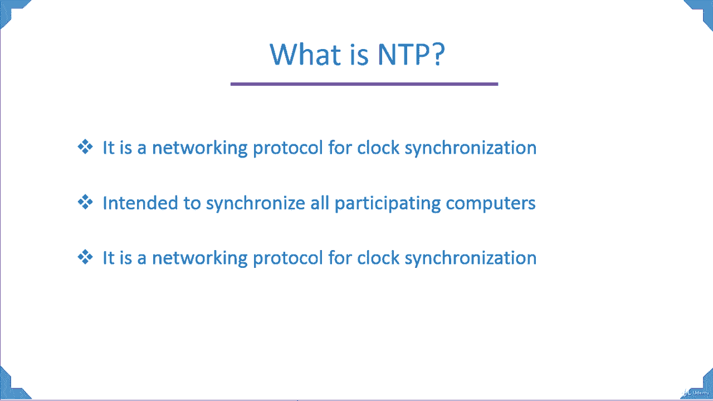
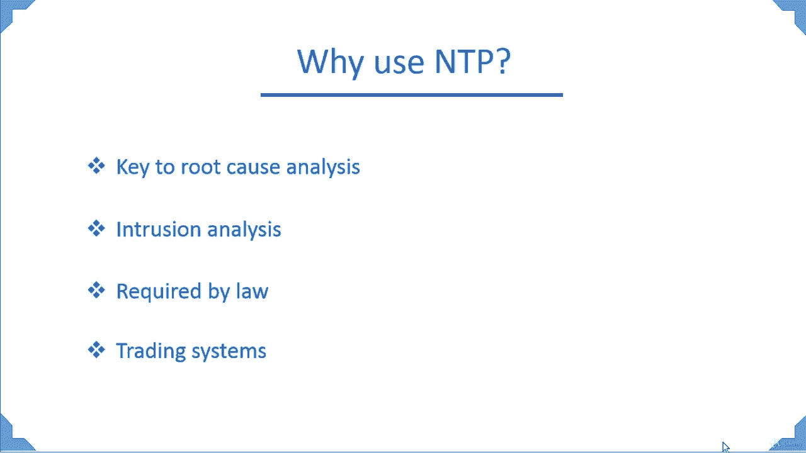

# Red Hat Linux 网络服务：3.1：NTP 网络时间协议简介 🕐

在本节课程中，我们将学习 NTP（网络时间协议）的基本概念，了解它在企业环境中的重要性，并探讨其关键应用场景。

## 什么是 NTP？

NTP 是一种用于时钟同步的网络协议。这意味着，如果一个组织内拥有多台计算机，确保这些系统之间的时间同步至关重要。这就是为什么我们需要在环境中部署 NTP 服务器，有时甚至是多个 NTP 备份服务器的主要原因。NTP 旨在同步所有参与计算机的时间。

因为许多计算机将要运行的任务必须在同一时间执行。如果时间不同步，一个系统可能在运行某项任务，而另一个系统的时间可能落后或超前，这可能导致脚本、定时任务或备份等操作失败。因此，部署 NTP 服务器，在大多数情况下是部署内部 NTP 服务器，对一个组织来说非常重要。

NTP 是一种用于时钟同步的网络协议，也是现存最古老的网络协议之一。目前我们使用的是 NTP 第 4 版，其最初版本始于 20 世纪 80 年代。

## 为什么使用 NTP？

理解了 NTP 的基本定义后，我们来看看它在实际环境中的关键作用。

以下是 NTP 的几个主要应用场景：

*   **根本原因分析的关键**：在技术支持环境中，如果系统出现问题，客户会要求进行根本原因分析，以防止未来再次发生。其中最重要的因素之一就是事件发生的具体时间。通过精确的时间戳，你可以将问题与之前的事件关联起来，或者检查客户、支持团队是否在相应时间对系统进行了操作，亦或是某个设备（如网卡）故障导致了服务中断。
*   **入侵分析**：如果你的系统遭到外部或内部入侵者的攻击，你必须确切知道攻击发生的时间。这对于排查问题和防止再次发生至关重要。
*   **法律要求**：许多组织，例如美国食品药品监督管理局（FDA），要求公司必须部署 NTP 服务器，如果没有，则会面临审计。
*   **交易系统**：以华尔街为例，每秒可能进行数十亿笔交易。如果运行这些交易的系统时间不同步，交易可能会被延迟。这种延迟可能给客户造成数千甚至数百万美元的损失。因此，对于交易系统而言，部署 NTP 服务器极其重要。

## 总结

本节课中，我们一起学习了 NTP 网络时间协议。我们了解到 NTP 是一种用于在多台计算机间同步时钟的古老而重要的网络协议。它在根本原因分析、安全入侵调查、满足合规性要求以及确保金融交易系统精确运行等方面发挥着不可替代的作用。在接下来的章节中，我们将深入探讨如何在 Red Hat Linux 中配置和管理 NTP 服务。