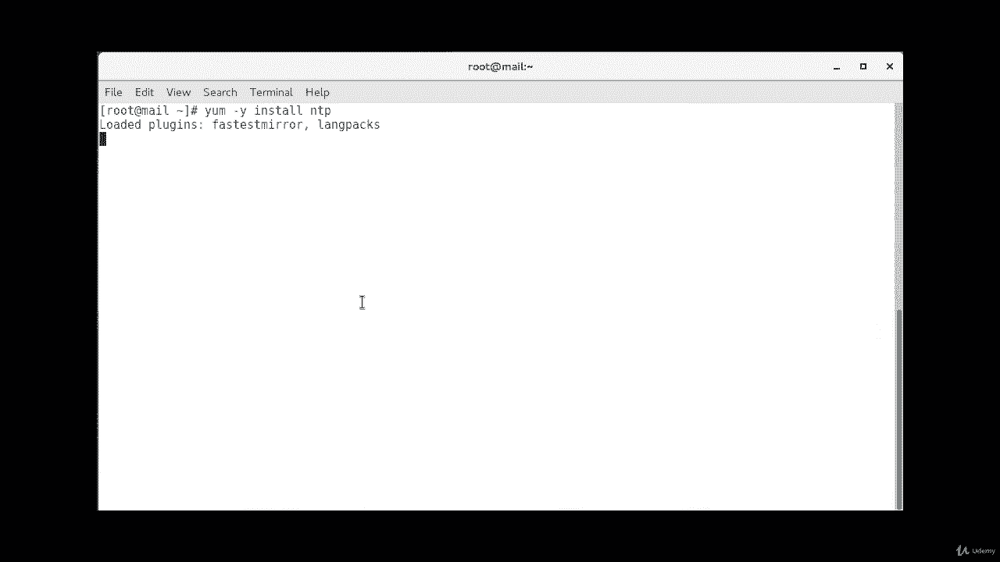
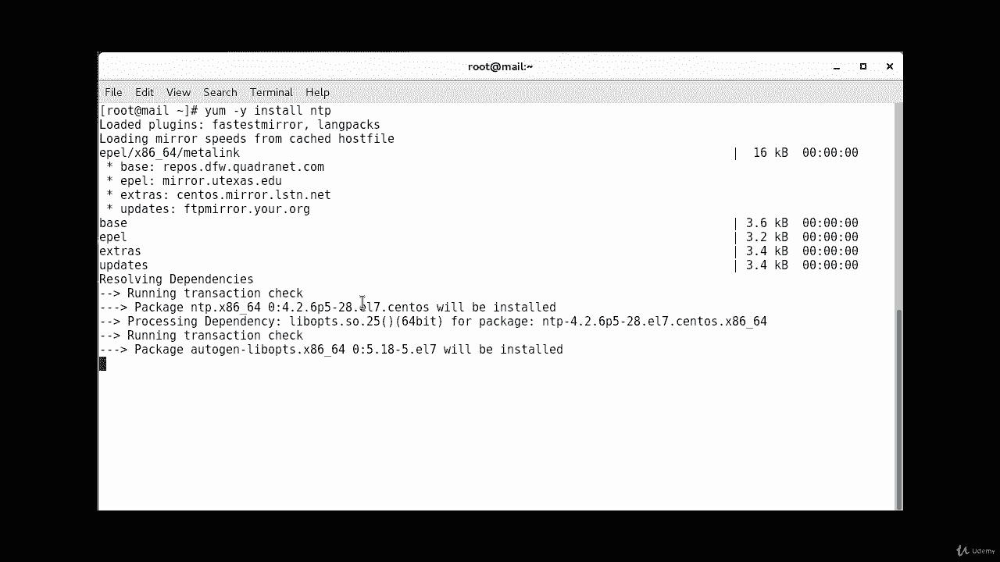
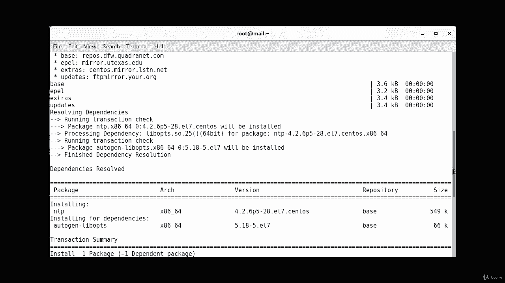
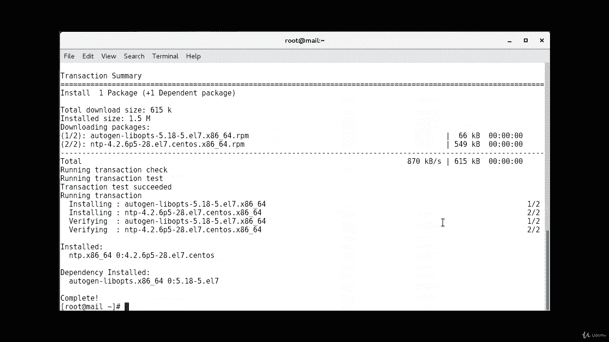
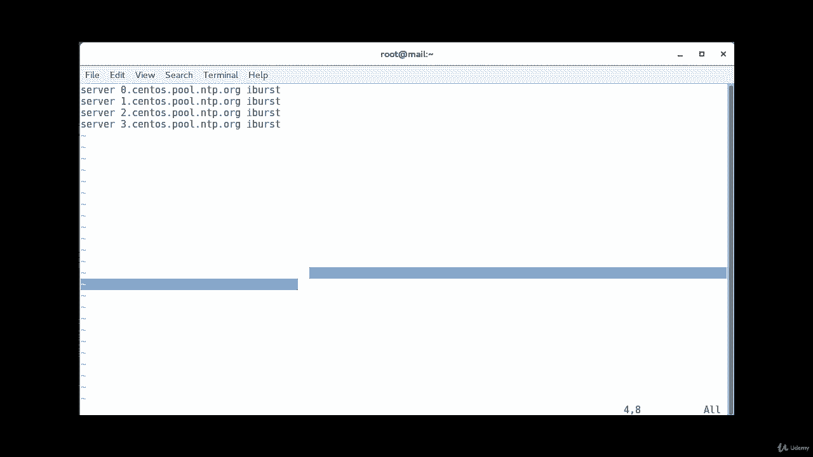
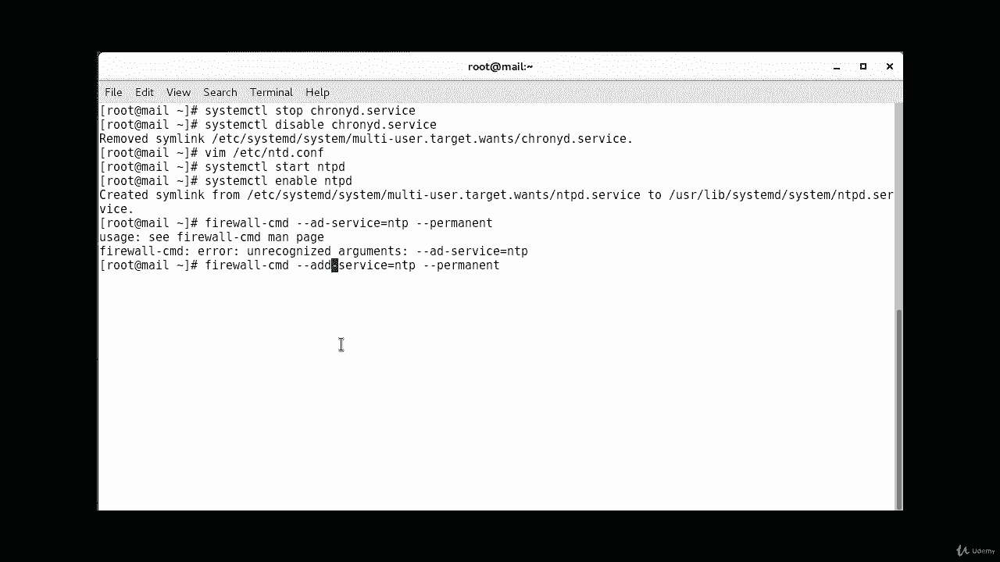
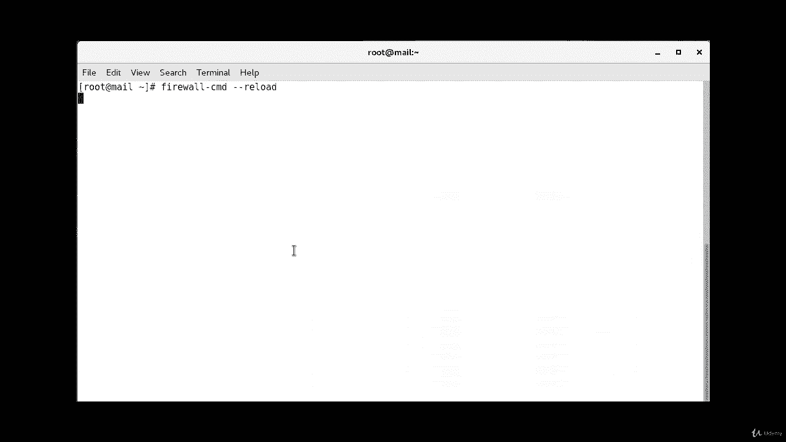
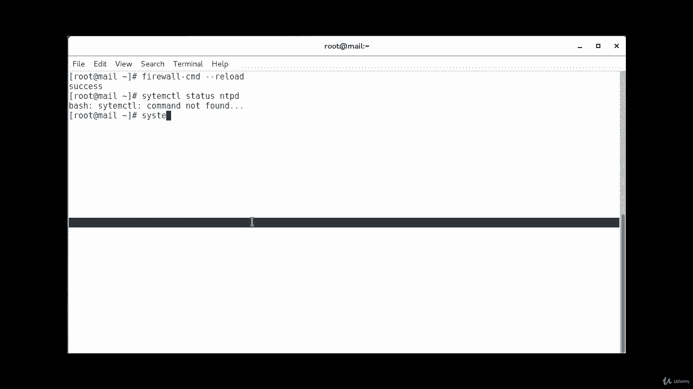
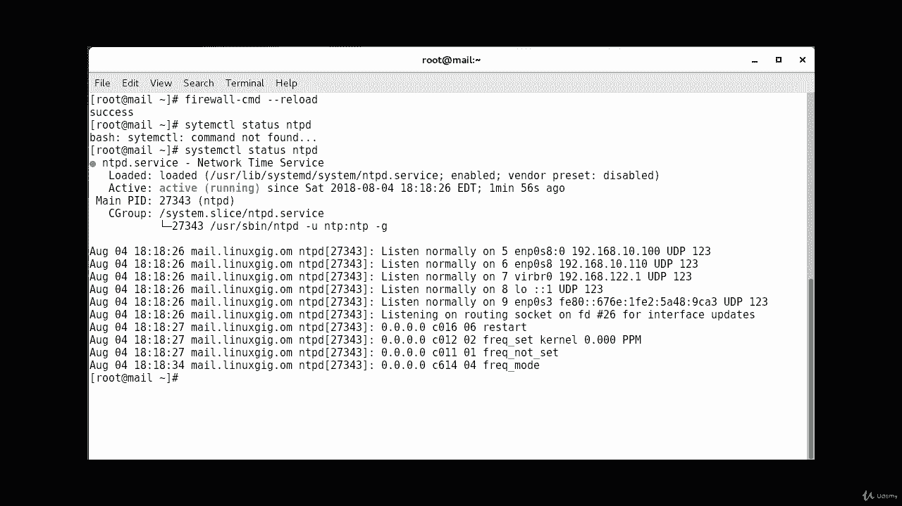

# Red Hat Certified Engineer (RHCE) 课程：P13：NTP 配置教程 🕐

在本节课中，我们将学习如何在 CentOS 服务器上安装和配置网络时间协议（NTP）服务。我们将从检查系统状态开始，逐步完成安装、配置、启动服务以及防火墙设置等步骤。

---

## 检查当前状态

首先，我们需要检查系统中 NTP 服务的当前状态。这有助于我们确认服务是否已安装。

执行以下命令：
```bash
systemctl status ntpd
```
如果系统提示“not found”，则表明 NTP 服务尚未安装。

---





## 安装 NTP 服务



上一节我们确认了 NTP 服务未安装，本节中我们来看看如何安装它。安装过程非常简单。



使用 YUM 包管理器进行安装：
```bash
yum -y install ntp
```
安装完成后，系统会提示安装成功。

---

## 禁用冲突服务 ChronyD

CentOS 7 默认带有一个名为 `chronyd` 的时间同步服务。为了避免它与 NTP 服务冲突，我们需要将其禁用。

以下是需要执行的步骤：
1.  停止 `chronyd` 服务。
2.  禁用 `chronyd` 服务，防止其开机自启。

执行以下命令：
```bash
systemctl stop chronyd.service
systemctl disable chronyd.service
```
命令执行成功后，系统会提示链接已被移除。

---

## 配置 NTP 服务器

现在，我们可以开始配置 NTP 服务了。配置主要通过编辑 NTP 的主配置文件来完成。

使用 `vi` 编辑器打开配置文件：
```bash
vi /etc/ntp.conf
```
在配置文件中，我们需要指定要同步的外部 NTP 服务器。这里我们添加三个公共 NTP 服务器地址。

在配置文件的相应部分添加或修改以下行：
```
server 0.centos.pool.ntp.org iburst
server 1.centos.pool.ntp.org iburst
server 2.centos.pool.ntp.org iburst
```
`iburst` 选项可以在服务启动时快速进行初始时间同步。

编辑完成后，保存并退出编辑器。

---

## 启动并启用 NTP 服务

配置文件修改完成后，我们需要启动 NTP 服务，并设置其开机自动启动。



执行以下命令：
```bash
systemctl start ntpd
systemctl enable ntpd
```
第一条命令启动服务，第二条命令将其设置为启用状态，确保系统重启后服务能自动运行。

---

## 配置防火墙

为了让 NTP 服务能够正常通信，我们需要在防火墙中开放其端口。

执行以下命令将 NTP 服务添加到防火墙规则中：
```bash
firewall-cmd --add-service=ntp --permanent
```
`--permanent` 选项使规则永久生效。

添加规则后，需要重新加载防火墙配置以使更改生效：
```bash
firewall-cmd --reload
```



---

## 验证服务状态



最后，我们来验证 NTP 服务是否已成功运行。

执行以下命令检查服务状态：
```bash
systemctl status ntpd
```
如果配置正确，输出应显示服务状态为“active (running)”。



---



本节课中我们一起学习了在 CentOS 7 上配置 NTP 服务的完整流程。我们从检查安装状态开始，完成了安装软件包、禁用冲突服务、编辑配置文件、启动服务以及在防火墙中添加规则等关键步骤。现在，你的服务器应该已经能够与公共时间服务器同步时间了。