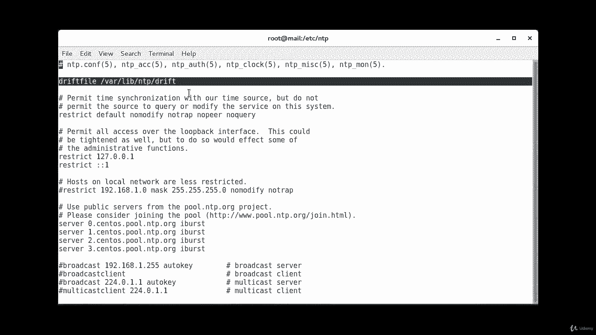
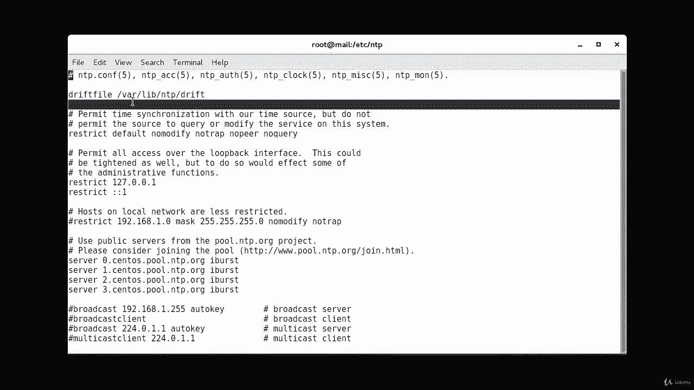
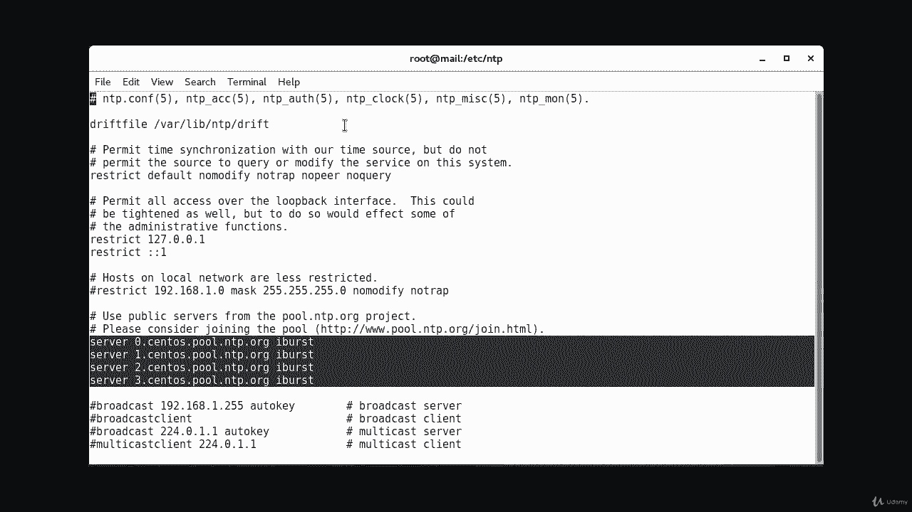
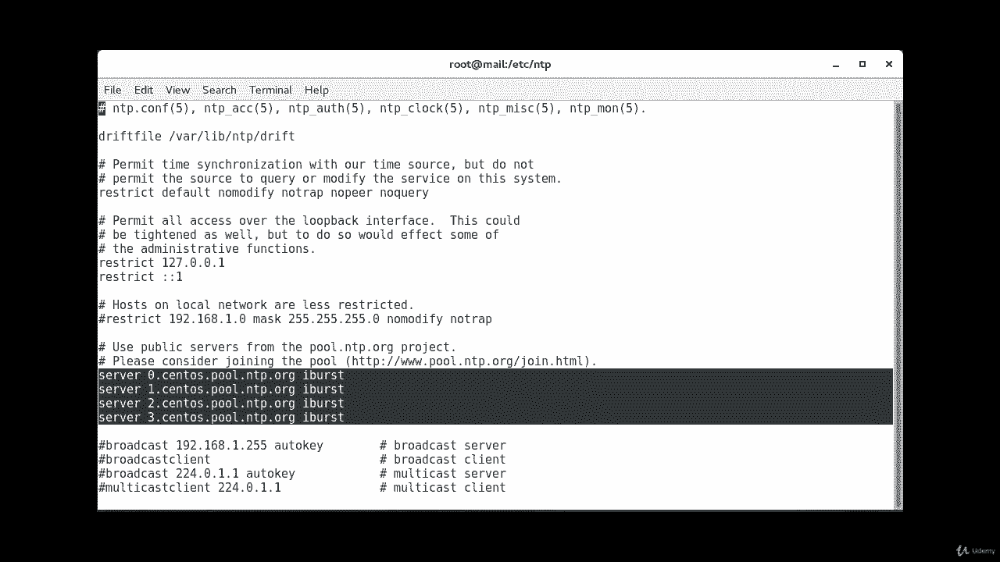
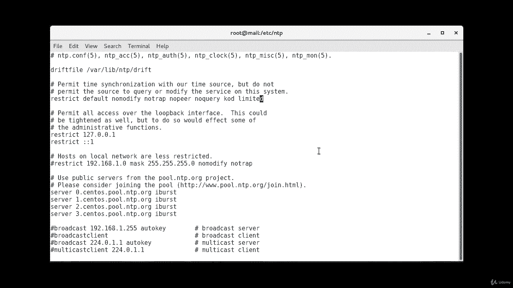
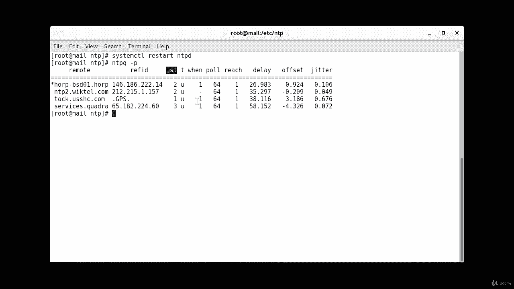

# RHCE课程：P14：3. NTP - 网络时间协议：3. 配置（续）⏰

在本节课中，我们将继续学习NTP的配置，重点介绍配置文件的细节、关键参数的作用，以及如何验证NTP服务是否正常工作。

上一节我们介绍了如何编辑NTP配置文件并添加时间服务器。本节中我们来看看配置文件中其他重要的条目和参数。

## 配置 `driftfile`

在 `/etc/ntp.conf` 配置文件中，必须确保存在一行配置，用于指定 `driftfile` 的路径。



```
driftfile /var/lib/ntp/drift
```





漂移文件用于存储系统时钟运行频率与保持同步所需正确频率之间的频率偏移值。它有助于实现稳定且准确的时间同步。在默认安装的配置文件中，这一行通常位于文件顶部。如果你使用的是默认安装且只添加了服务器，那么它应该已经存在。如果不存在，请手动添加。


## 管理默认服务器与 `iburst` 选项



如果配置文件中已经存在任何默认的服务器条目，在添加新的服务器之前，请确保将它们移除。

以下是我们在配置中使用的一个选项，称为 `iburst`。

```
server 0.pool.ntp.org iburst
server 1.pool.ntp.org iburst
server 2.pool.ntp.org iburst
```

我们为每个服务器条目使用了 `iburst` 选项。根据NTP池项目的建议，当服务器暂时无法到达时，此选项会发送一连串（8个）数据包，而不是通常的一个数据包。在NTP池项目中使用 `burst` 选项被视为滥用行为，因为它会在每个轮询间隔都发送8个数据包。而 `iburst` 选项仅在首次尝试时发送这8个数据包，这是两者的主要区别。

## 配置 `restrict` 指令以增强安全

此外，你还会在配置文件中找到一行 `restrict` 指令，默认情况下它也应该存在。

```
restrict default nomodify notrap nopeer noquery
```

这条指令的作用是确保默认配置不允许管理查询。如果不进行此限制，你的服务器可能被用于NTP反射攻击，或者容易受到试图修改服务器状态的 `ntpq` 和 `ntpdc` 查询的攻击。

因此，你需要检查并确认配置中包含 `noquery` 选项。同时，建议添加 `kod` 和 `limited` 选项，它们可以限制过于频繁的客户端请求并强制进行速率限制。如果配置中没有这些选项，我们可以手动添加。

```
restrict default kod nomodify notrap nopeer noquery limited
```



完成上述编辑后，保存并退出配置文件。

## 重启服务与验证同步

现在，我们将重启NTP服务，让我们的时间服务器根据刚刚配置的上游服务器同步时钟。

执行以下命令重启服务：

```bash
systemctl restart ntpd
```

等待几分钟后，我们将使用 `ntpq` 命令检查时间服务器的健康状态。

```bash
ntpq -p
```

命令输出包含多个信息列：
*   **`remote`** 列：显示NTP守护进程正在使用的时间服务器的主机名。
*   **`refid`** 列：显示这些服务器自身所使用的时间源。对于层级（Stratum）为1的服务器，此字段应显示 `GPS`、`PPS`、`ATOM` 或 `PTB`。对于层级为2及更高的服务器，此字段将显示其上游服务器的IP地址。
*   **`st`、`delay`、`offset`、`jitter`** 列：这些列（例如 `st` 代表层级）告诉你时间源的质量。对于延迟（delay）、偏移（offset）和抖动（jitter）这三个值，数值越低代表质量越好。



本节课中我们一起学习了NTP配置文件的几个关键部分：`driftfile` 的作用、`iburst` 选项的用途、通过 `restrict` 指令增强安全性，以及如何使用 `ntpq -p` 命令验证NTP同步状态。正确配置这些选项对于搭建一个稳定、安全且准确的时间服务器至关重要。