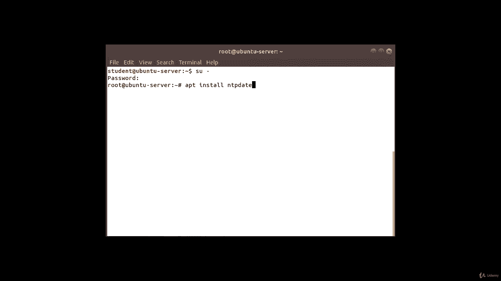
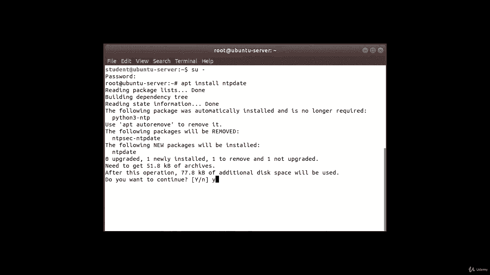
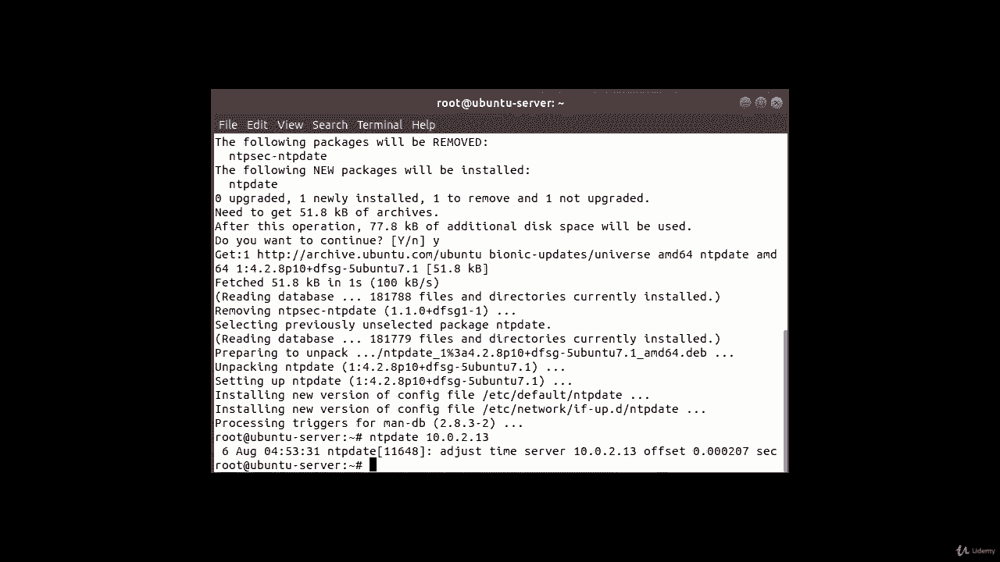
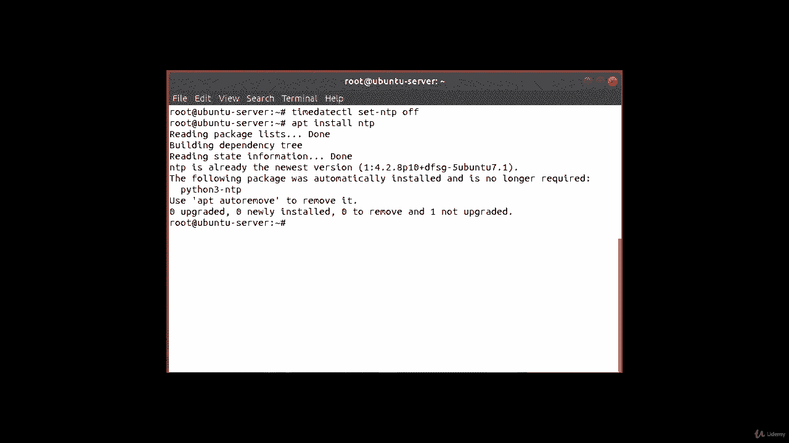
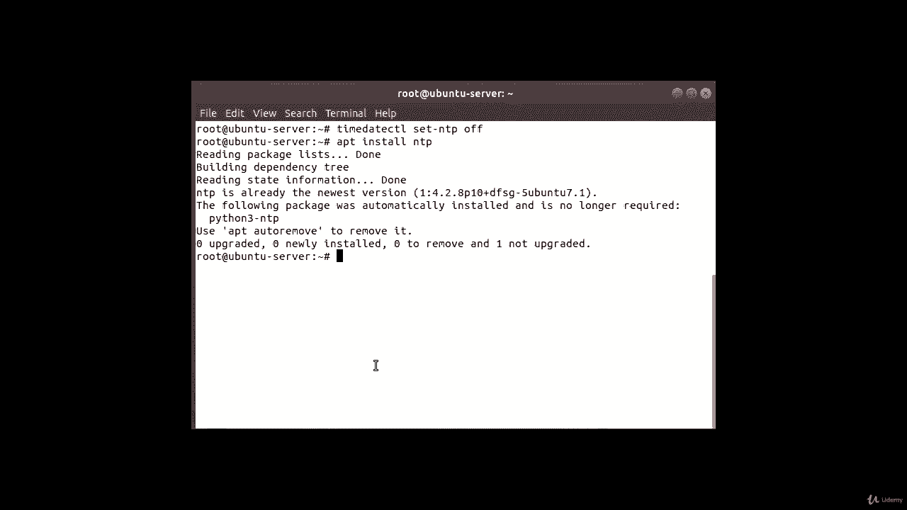
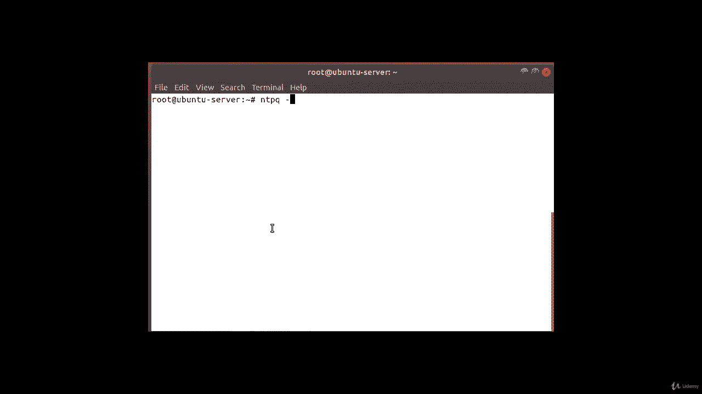
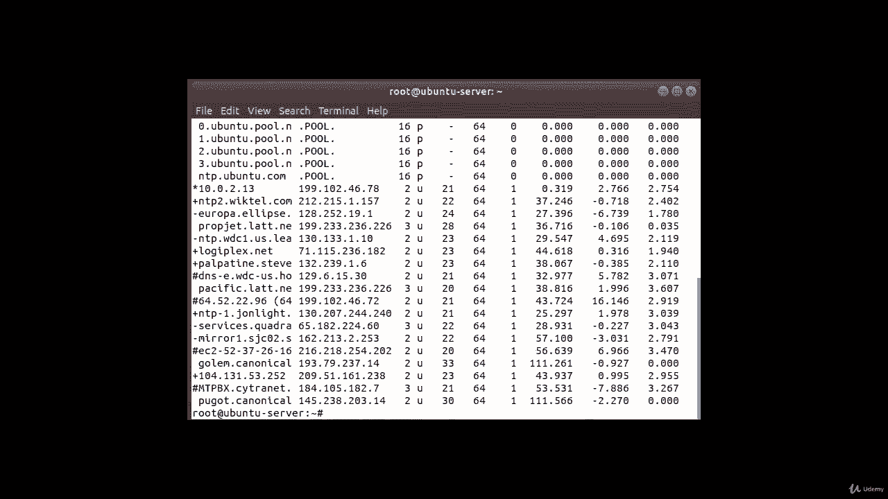
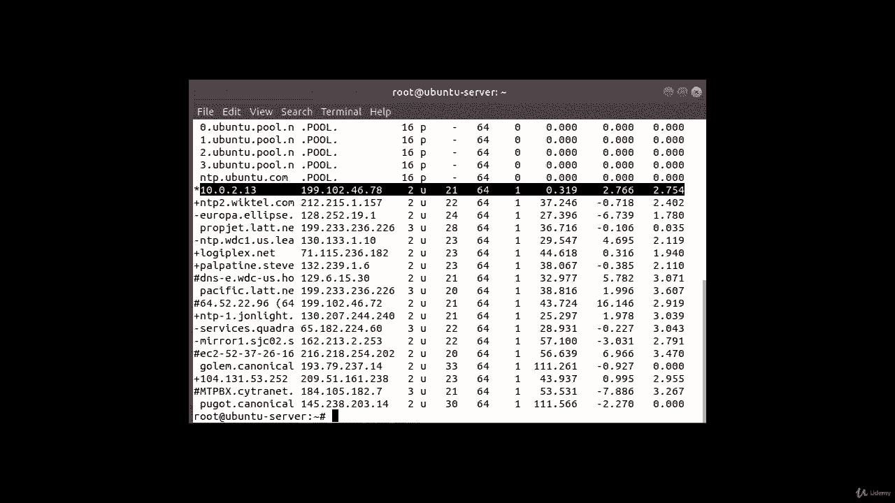

# Red Hat Certified Engineer (RHCE) 课程：P15：3. NTP - 网络时间协议：4. 客户端配置 ⏰

在本节课程中，我们将学习如何配置一个Ubuntu客户端，使其与之前搭建的CentOS NTP服务器进行时间同步。我们将完成从软件安装到服务配置的全过程。

---



上一节我们搭建了NTP服务器，本节中我们来看看如何配置客户端与其同步。



首先，需要在Ubuntu客户端上安装必要的软件包。如果系统尚未安装，可以使用以下命令。请确保你拥有管理员权限（例如使用`sudo`）。

以下是安装`ntpdate`工具的命令：
```bash
sudo apt install ntpdate
```
安装过程中，系统会提示确认，输入`y`并按回车键继续。

安装完成后，我们可以手动尝试与NTP服务器进行一次时间同步。由于环境中可能没有配置DNS，这里我们直接使用服务器的IP地址。

使用以下命令进行手动同步，请将`10.0.2.13`替换为你实际的NTP服务器IP地址：
```bash
sudo ntpdate 10.0.2.13
```
命令执行后，终端会显示时间同步的结果，包括时间服务器的信息和时间偏移量。

---



接下来，我们需要禁用Ubuntu系统默认的`systemd-timesyncd`服务，以便使用我们配置的NTP服务。

以下是禁用该系统服务的命令：
```bash
sudo timedatectl set-ntp off
```
禁用默认服务后，我们将安装完整的NTP守护进程，并将其配置为优先使用我们指定的NTP服务器。

首先，安装`ntp`软件包：
```bash
sudo apt install ntp
```
在许多Ubuntu服务器版本中，该软件包可能已预装。



安装完成后，需要编辑NTP的配置文件，指定我们的服务器。我们将使用一行命令直接写入配置。



以下命令会将我们的NTP服务器地址添加到配置文件中，并标记为“优先”服务器：
```bash
sudo bash -c ‘echo “server 10.0.2.13 prefer iburst” >> /etc/ntp.conf’
```
请确保将`10.0.2.13`替换为你的NTP服务器IP地址。

配置写入后，需要重启NTP服务以使更改生效。

使用以下命令重启服务：
```bash
sudo service ntp restart
```
最后，我们可以验证客户端是否已成功与指定的服务器同步。



使用`ntpq`命令查看NTP对等体状态：
```bash
ntpq -p
```
在输出的列表中，找到你配置的服务器IP地址（例如`10.0.2.13`）。如果其旁边有一个星号`*`，则表示该服务器是当前正在使用的、优选的时间源。



---



本节课中我们一起学习了在Ubuntu系统上配置NTP客户端的完整步骤：从安装`ntpdate`进行初步测试，到禁用系统默认时间服务、安装并配置`ntp`守护进程，最后验证同步状态。确保客户端时间与服务器保持一致，是维护分布式系统一致性的重要基础。