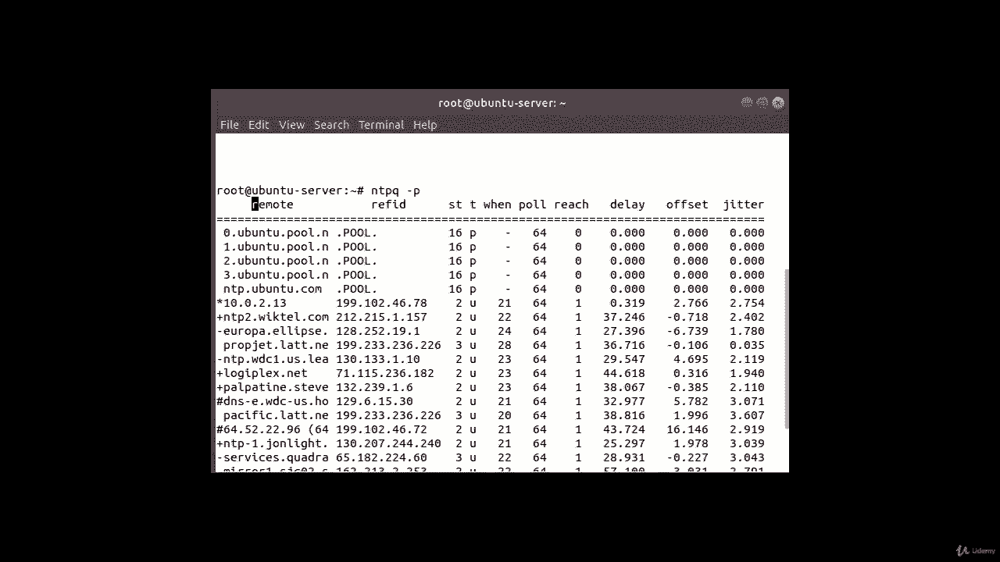
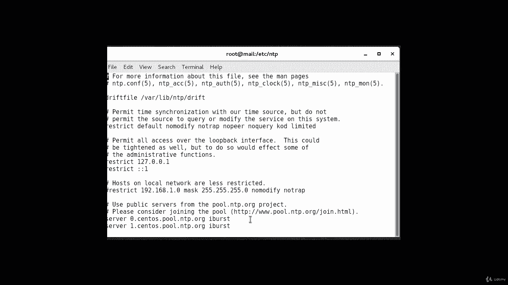
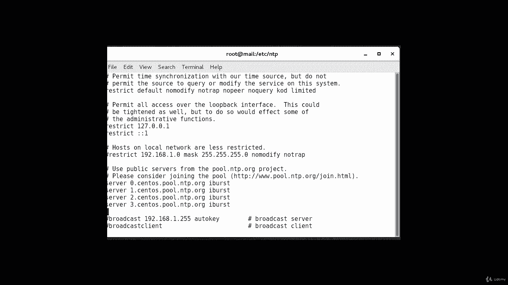
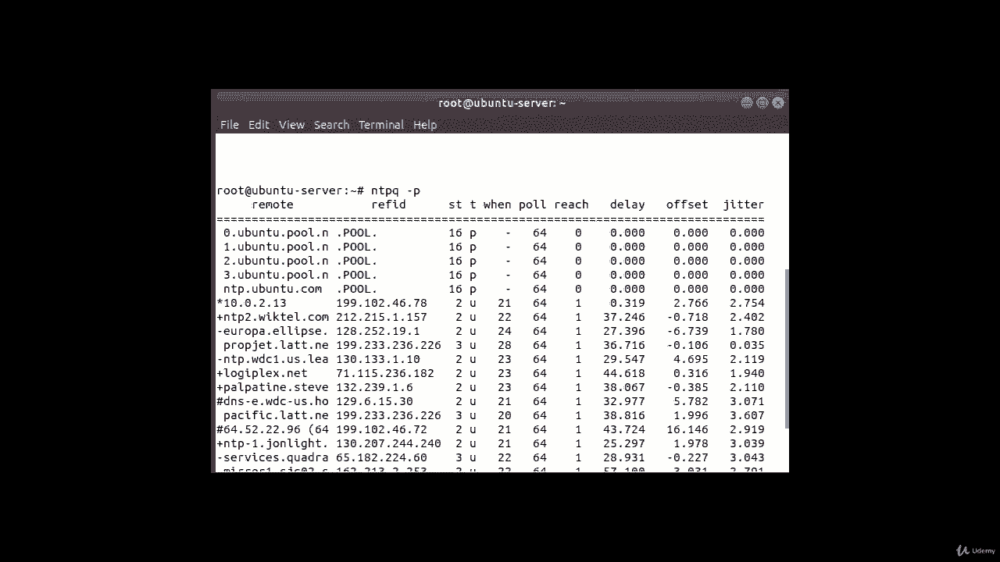

# NTP 网络时间协议：5：ntpq 命令输出解读 🕐

在本节课中，我们将详细解读 `ntpq -p` 命令的输出结果。通过理解每一列的含义，你将能够诊断和监控你的 NTP 客户端与时间服务器的同步状态。

上一节我们介绍了如何使用 `ntpq` 命令，本节中我们来看看其输出的具体含义。

## 输出列详解

以下是 `ntpq -p` 命令输出中各列的含义解释。

*   **remote**
    这是你的客户端希望与之同步时钟的远程 NTP 服务器。在我们的例子中，是 `centos.pool.ntp.org` 等服务器。

*   **RefID**
    这是远程服务器所同步的上游层级（Stratum）源。对于层级为 1 的服务器，这里将显示其层级 0 的源（如 GPS、原子钟）。例如，服务器 `server0.centos.pool.ntp.org` 的上游层级链可能从 0 一直到 3。

*   **ST**
    这是远程服务器的层级（Stratum）级别，范围从 0 到 16。层级 0 是最高精度的时间源，层级数字越大，距离权威时间源越远。

*   **T**
    这表示连接类型。常见类型包括：
    *   `u`：单播
    *   `b`：广播
    *   `m`：多播
    *   `l`：本地参考时钟
    *   `s`：对称对等体
    *   `a`：任播服务器
    *   `p`：表示该服务器属于一个 NTP 池（Pool），这就是你在这里看到 `p` 的原因。

*   **when**
    这表示上次向该服务器查询时间是在多久以前。默认单位是秒，也可能显示为 `m`（分钟）、`h`（小时）或 `d`（天）。

*   **poll**
    这表示查询服务器时间的频率，以 2 的幂秒数表示。最小值是 16 秒，最大值是 36 小时，通常在 64 秒到 1024 秒之间。

*   **reach**
    这是一个 8 位左移八进制值，显示与远程服务器通信的成功与失败历史记录。`1` 表示成功（位被设置），`0` 表示失败。值 `377`（八进制，对应二进制 `11111111`）是最高值，表示最近 8 次查询全部成功。

*   **delay**
    这个值以毫秒为单位显示，表示你的计算机与远程服务器通信的往返时间。

*   **offset**
    这个值以毫秒为单位显示，使用均方根计算，表示你的本地时钟与服务器报告时间之间的偏差。它可以是正数（你的时钟快）或负数（你的时钟慢）。在前几个服务器中，偏差为 0，表示完全同步；有些服务器显示正偏差，有些显示负偏差。

*   **jitter**
    这个值是一个以毫秒为单位的绝对值，表示你的时钟偏移量的均方根偏差，反映了时间同步的稳定性。数值越小，同步越稳定。

## 总结

本节课中，我们一起学习了 `ntpq -p` 命令输出中每一列的具体含义，包括远程服务器地址、层级、连接类型、查询间隔、通信状态、网络延迟、时钟偏差和抖动等关键指标。理解这些信息对于监控 NTP 同步的健康状况和进行故障排查至关重要。