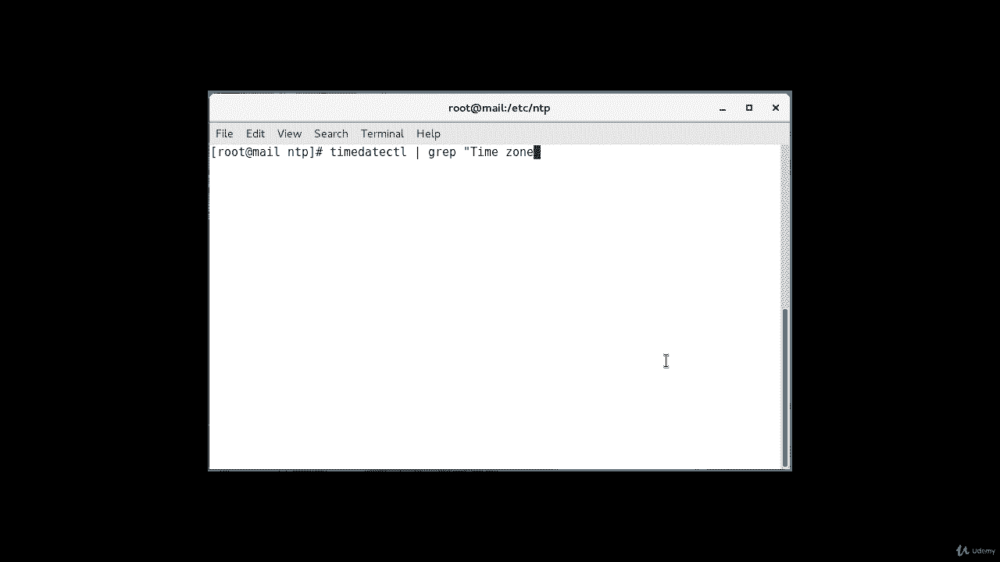
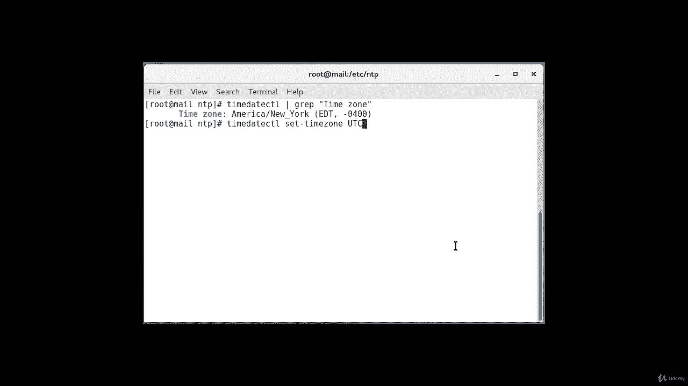
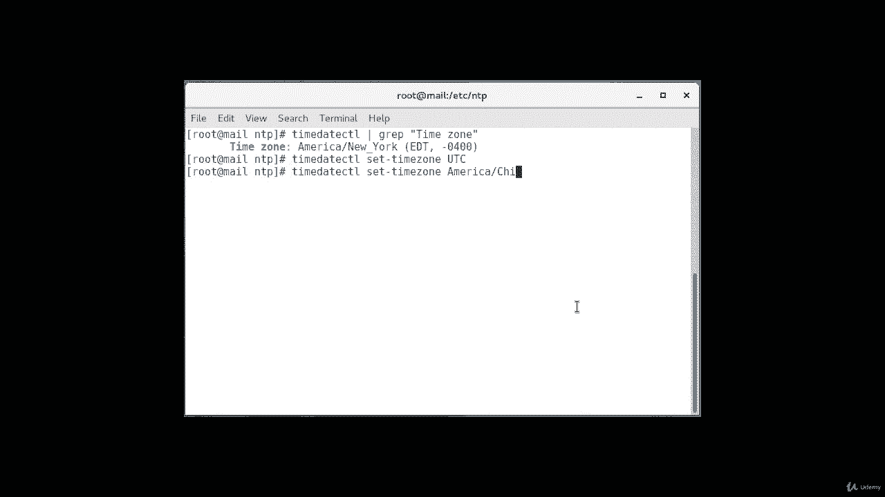
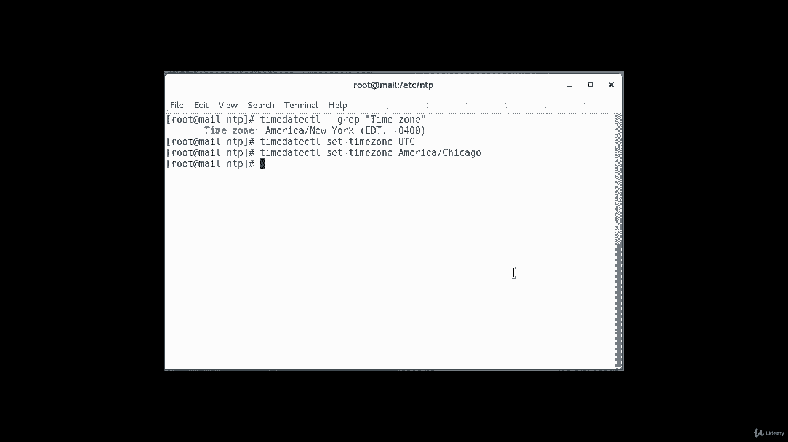
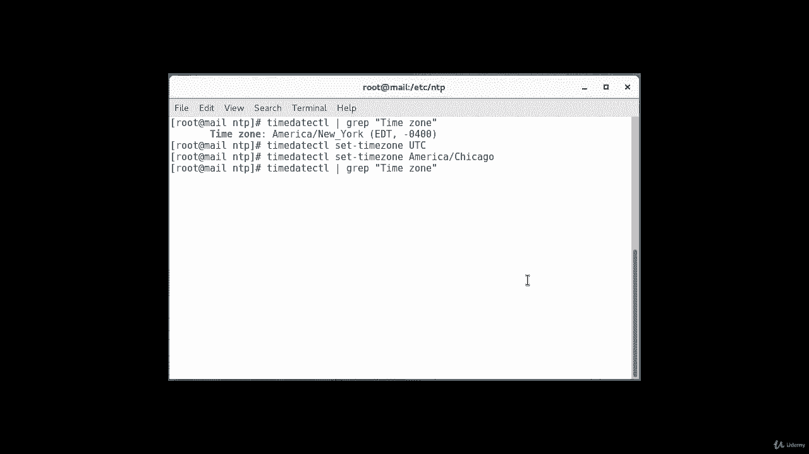
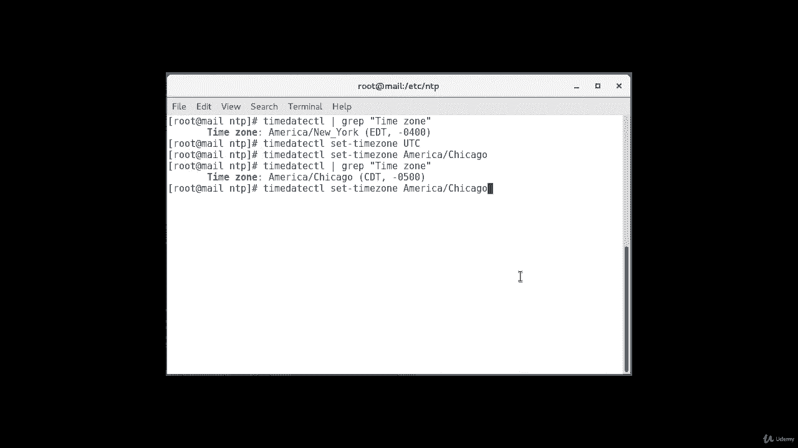
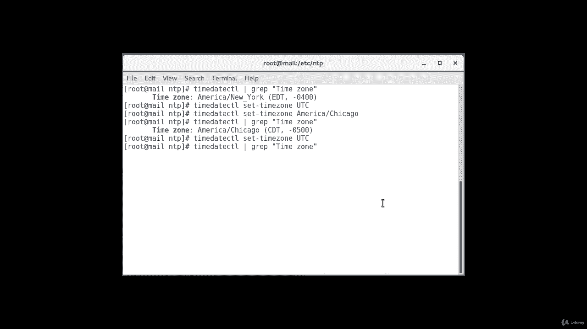

# Red Hat Certified Engineer (RHCE) 课程：P18：3. NTP - 网络时间协议：7. 时区设置 🕐

在本节课中，我们将要学习在安装和配置NTP服务器之前，如何正确设置系统的时区。这是确保服务器时间准确同步的重要前提。

## 检查当前时区



在设置时区之前，首先需要了解系统当前的时区配置。我们可以使用 `timedatectl` 命令来获取这些信息。

以下是检查当前时区的命令：
```bash
timedatectl
```
执行此命令后，系统会显示当前设置的时区。例如，在演示中，系统默认设置的时区可能与用户的实际地理位置不符。

## 选择并设置时区

上一节我们介绍了如何查看当前时区，本节中我们来看看如何更改它。对于服务器，强烈建议使用**协调世界时**作为时区，因为它能提供更精确的时间基准，并简化跨时区的管理。当然，你也可以根据需求设置为本地时区。

以下是设置时区的步骤：

1.  **设置UTC时区**：要将系统时区设置为UTC，请执行以下命令。
    ```bash
    timedatectl set-timezone UTC
    ```



2.  **设置本地时区**：如果你想设置为特定本地时区，可以用相应的时区名称替换 `UTC`。首先，你可以通过列出可用时区来找到正确的名称。
    ```bash
    timedatectl list-timezones | grep -i america
    ```
    然后，使用找到的时区名称进行设置。例如，设置为美国芝加哥时间：
    ```bash
    timedatectl set-timezone America/Chicago
    ```

## 验证时区设置



设置完成后，务必验证更改是否生效。我们可以再次使用 `timedatectl` 命令来确认。



以下是验证时区设置的命令：
```bash
timedatectl
```
执行后，输出信息中的“Time zone”一行会显示当前生效的时区，例如 `UTC` 或 `America/Chicago`，这证明设置已成功。



---





本节课中我们一起学习了如何检查、设置和验证Linux系统的时区。正确配置时区是确保NTP服务和其他时间相关应用正常运行的基础。建议服务器环境优先使用UTC时区以简化管理。