# RHCE课程：P19：3. NTP - 网络时间协议：8. 使用chrony ⏰

在本节课中，我们将学习如何使用chrony工具在服务器上配置时间同步。chrony是NTP的替代方案之一，我们将完成从移除现有NTP服务到配置并验证chrony服务的完整流程。

上一节我们介绍了NTP的基本配置，本节中我们来看看如何使用chrony实现时间同步。

## 移除现有NTP服务

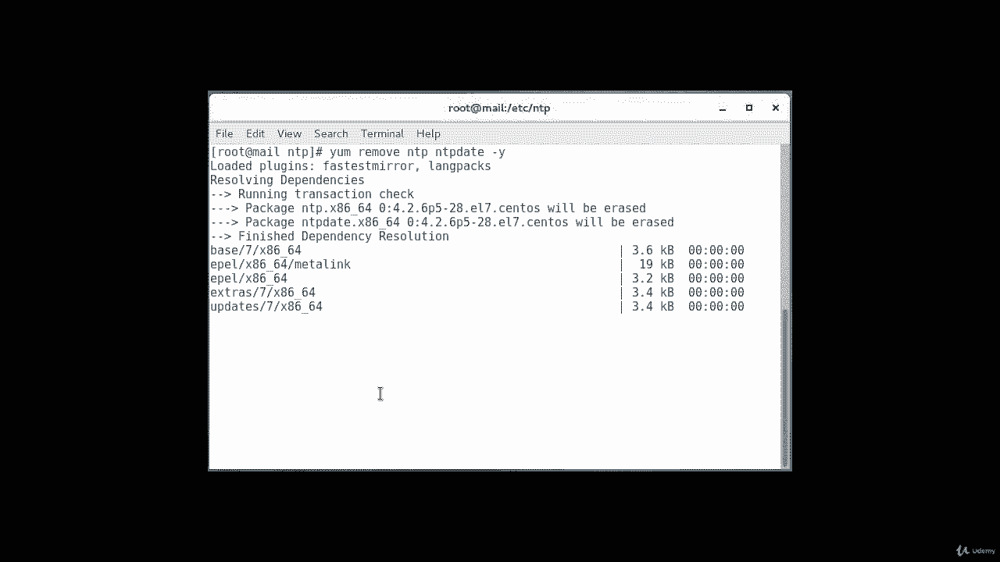

在配置chrony之前，必须确保系统上没有运行NTP服务。以下是移除NTP的步骤。

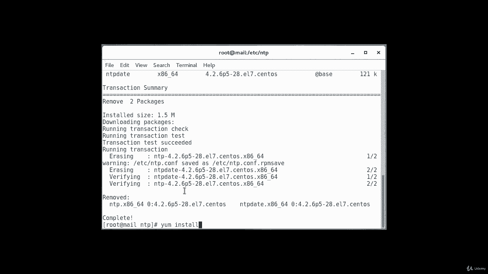

执行以下命令移除NTP及其相关工具：
```bash
yum remove ntp ntpdate -y
```
此命令将卸载当前已安装的NTP软件包。

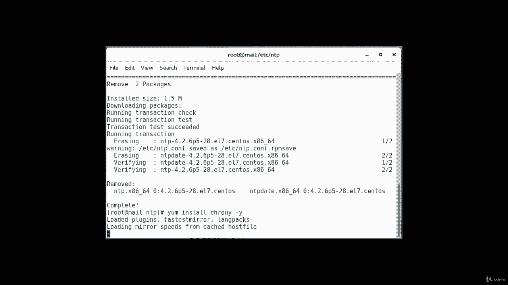

## 安装chrony

确认NTP已移除后，需要检查并安装chrony。通常chrony已默认安装，但进行确认是良好的实践。

执行以下命令安装chrony：
```bash
yum install chrony -y
```
如果系统提示软件包已安装，则无需进行其他操作。

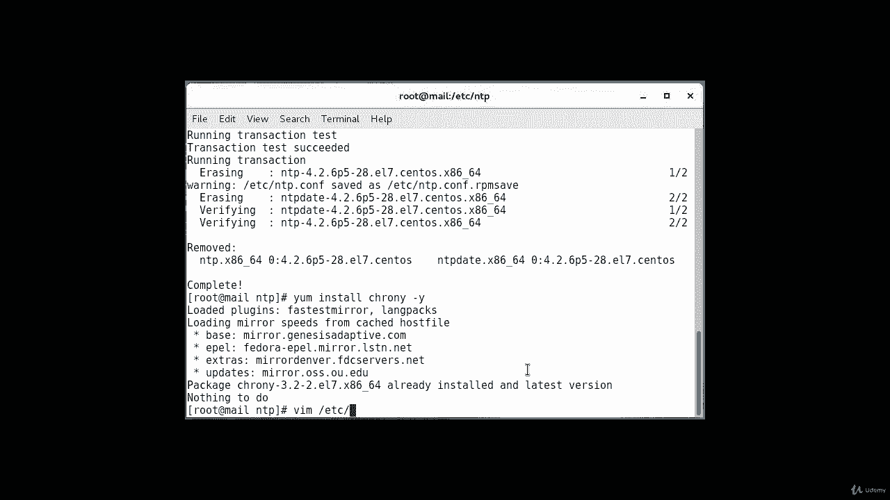

## 配置chrony

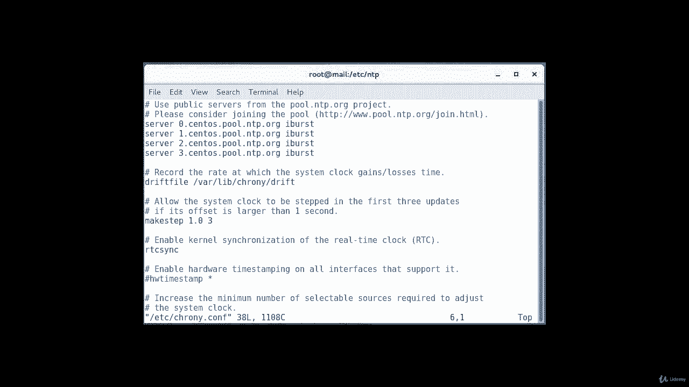

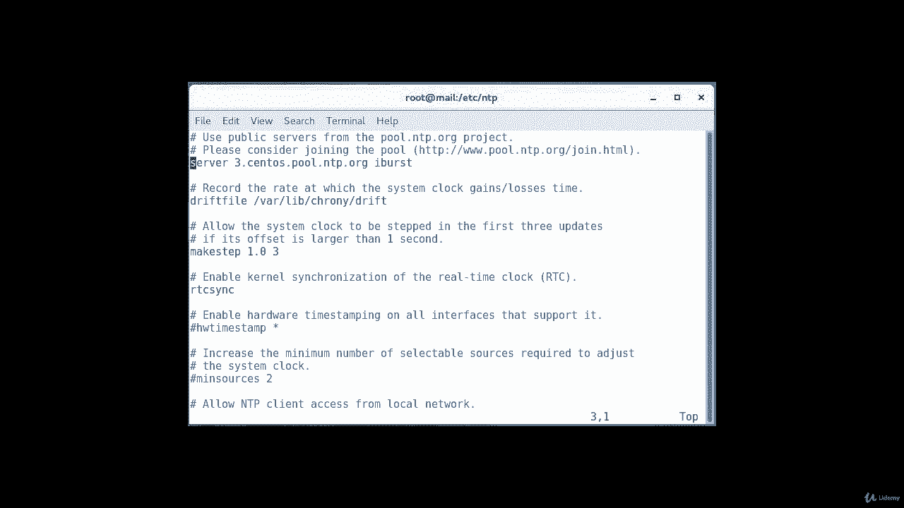

与之前配置NTP类似，我们需要配置chrony以从外部NTP服务器池同步时间。我们将使用`pool.ntp.org`作为时间源。

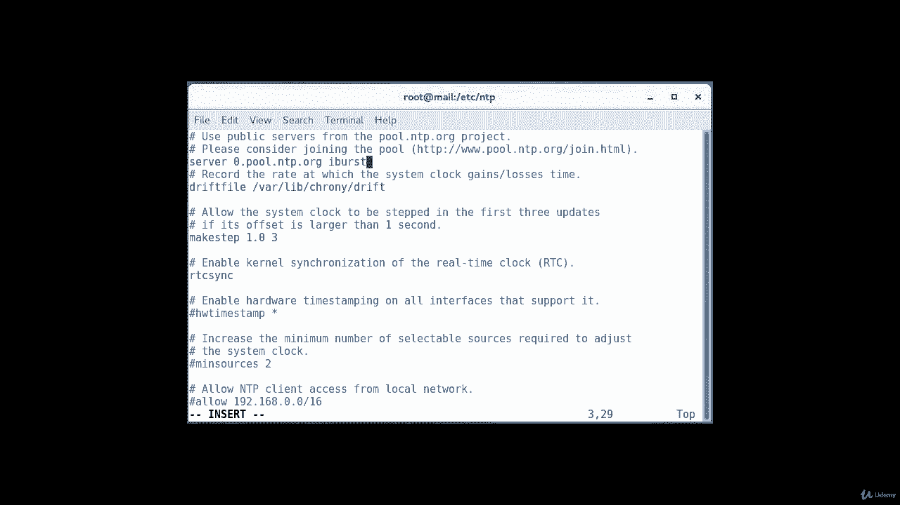

chrony的主配置文件是`/etc/chrony.conf`。我们需要编辑此文件以添加时间服务器。

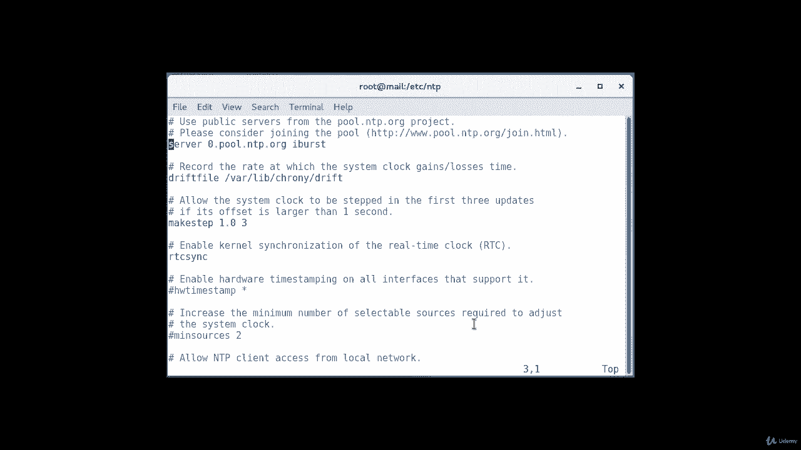

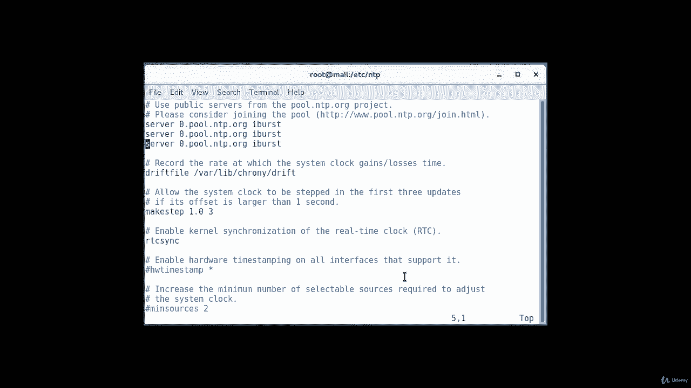

以下是编辑配置文件的核心步骤：
1.  打开配置文件：`vi /etc/chrony.conf`
2.  删除或注释掉文件中现有的`server`配置行。
3.  添加新的NTP服务器池地址。例如，添加以下四行配置：
    ```bash
    server 0.pool.ntp.org iburst
    server 1.pool.ntp.org iburst
    server 2.pool.ntp.org iburst
    server 3.pool.ntp.org iburst
    ```
    其中`iburst`选项可以在服务启动时快速进行初始同步。
4.  保存并退出编辑器。

## 启动并启用chrony服务

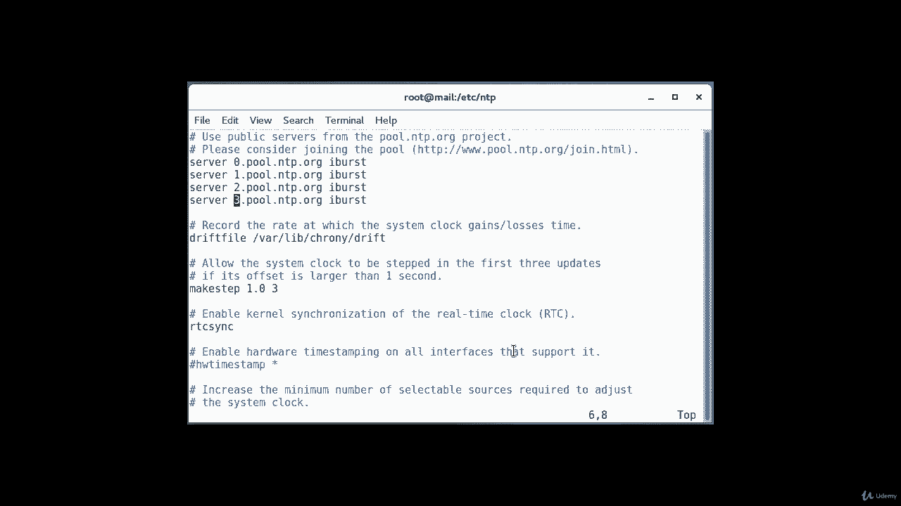

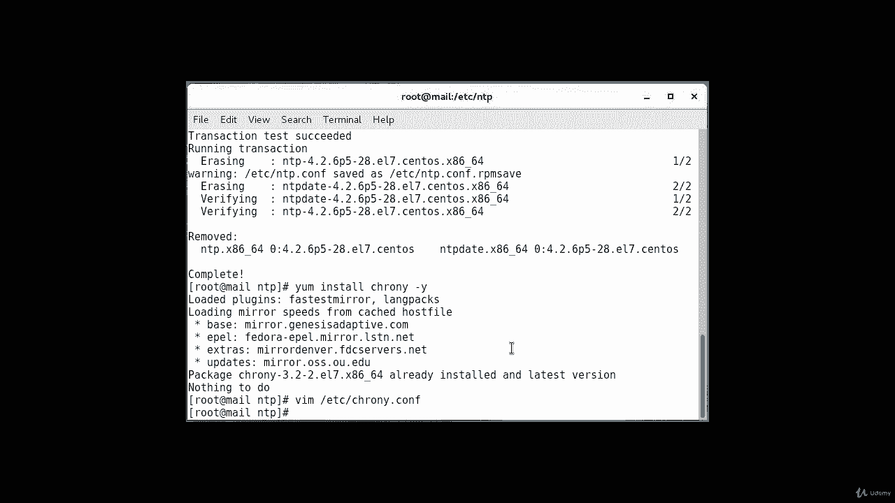

配置文件修改完成后，需要重启chrony服务以使更改生效，并设置其开机自启。

以下是管理chrony服务的命令：
```bash
# 重启chrony服务
systemctl restart chronyd.service

# 设置chrony服务开机自启
systemctl enable chronyd.service
```

## 验证chrony状态

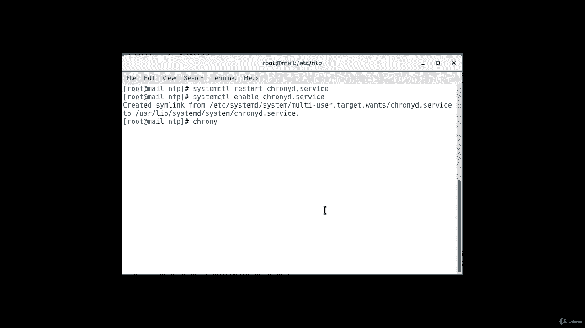

服务启动后，需要验证时间同步是否正常工作。chrony提供了几个有用的命令来检查状态。

以下是用于验证的两个主要命令：

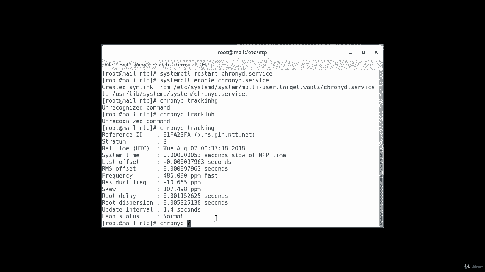

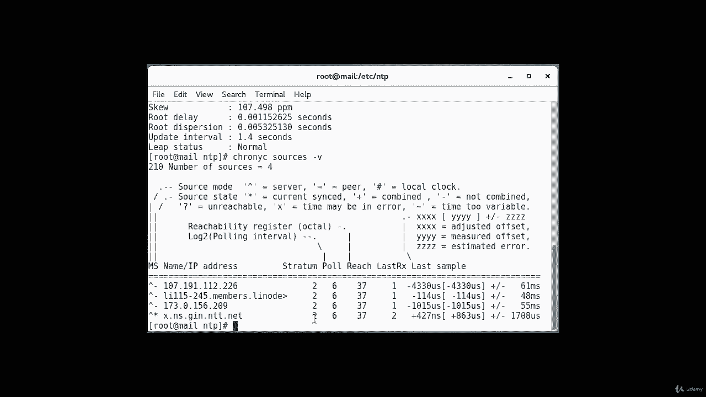

*   **检查同步状态**：运行`chronyc tracking`命令。该命令将输出当前的时间同步状态，包括参考时钟ID、层数（stratum）、参考时间、系统时间、频率偏移等信息。
*   **查看时间源**：运行`chronyc sources -v`命令。该命令将列出所有配置的时间源及其详细信息，如IP地址、名称和状态。

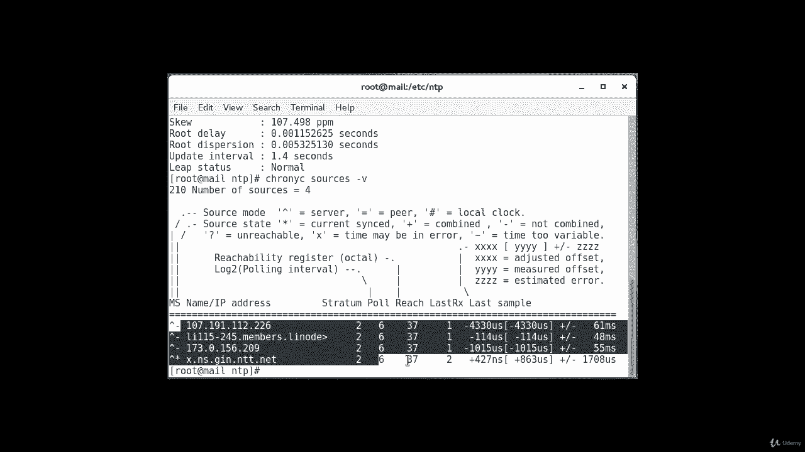

本节课中我们一起学习了如何使用chrony配置Linux系统的时间同步。我们完成了从移除旧NTP服务、安装chrony、编辑配置文件指定外部时间源，到启动服务并验证同步状态的完整过程。chrony是一个高效且易于配置的NTP替代方案。