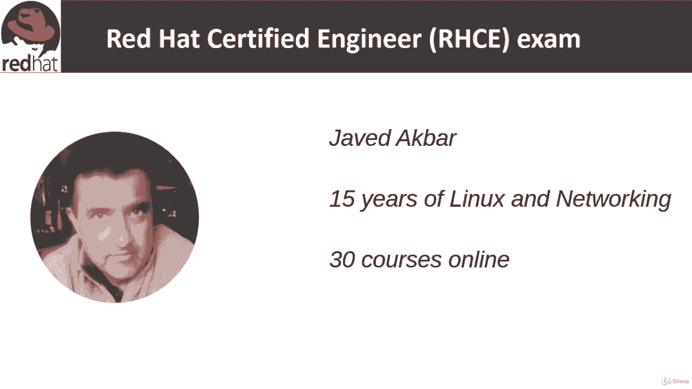
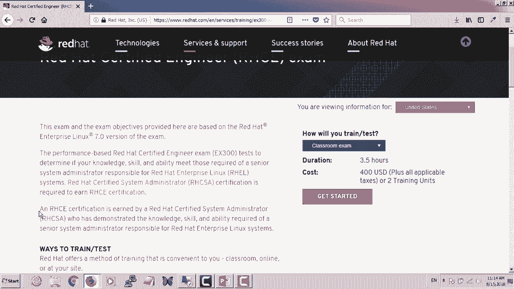

**红帽认证工程师（RHCE）课程：第1章：课程与讲师介绍** 😊

在本节课中，我们将了解本课程的基本信息、讲师背景以及RHCE考试的相关概况。

大家好，欢迎来到红帽认证工程师课程。我是Ja Dkbar，我将担任本课程的讲师。我拥有超过15年的Linux和网络管理经验。

并且，我在线上平台教授超过30门课程。

目前，我已登录红帽官方网站，上面有关于考试的信息。

这是一门基于实际操作能力的考试，考试时长为三个半小时。截至2018年8月，考试费用为400美元。

考试编号为EX 300。该考试旨在评估您的知识、技能和能力是否达到红帽企业Linux高级系统管理员的要求。

因此，这是一门高级水平的课程。我们默认您已通过RHCSA认证，这是RHCE的前置认证。我在Udemy上也有相应的RHCSA课程。

您必须已通过RHCSA考试。当然，您在本课程中将学到更多。RHCSA本身已颇具挑战性，而RHCE则更具难度。

与RHCSA相比，RHCE更具挑战性，因为它要求您具备高级系统管理员的能力。在本课程中，我将尽力确保您掌握通过考试所需的所有技能和工具。

在接下来的几张幻灯片中，我们将逐一讲解所有的考试目标。

本节课中，我们一起了解了课程讲师、RHCE考试的基本要求及其与RHCSA的关系，为后续深入学习奠定了基础。