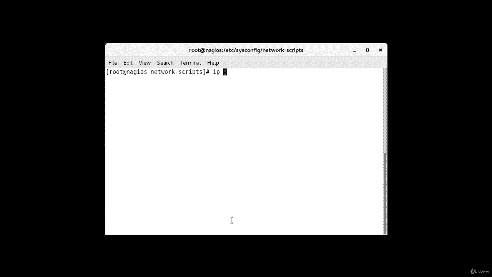
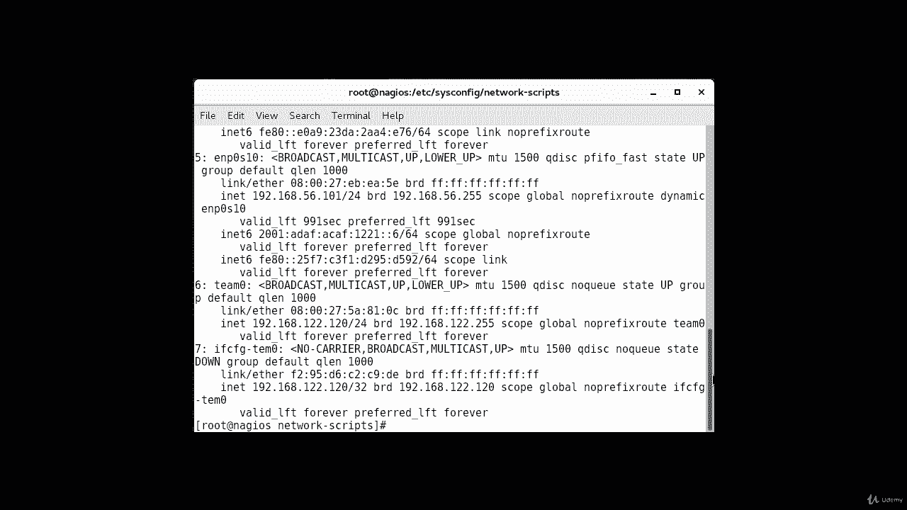
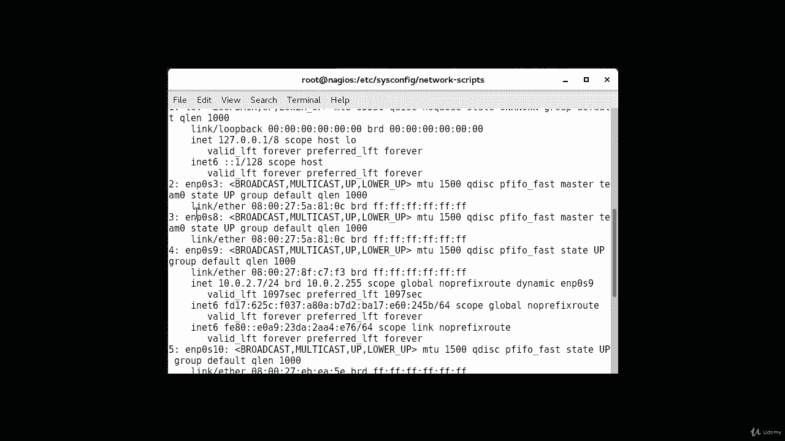
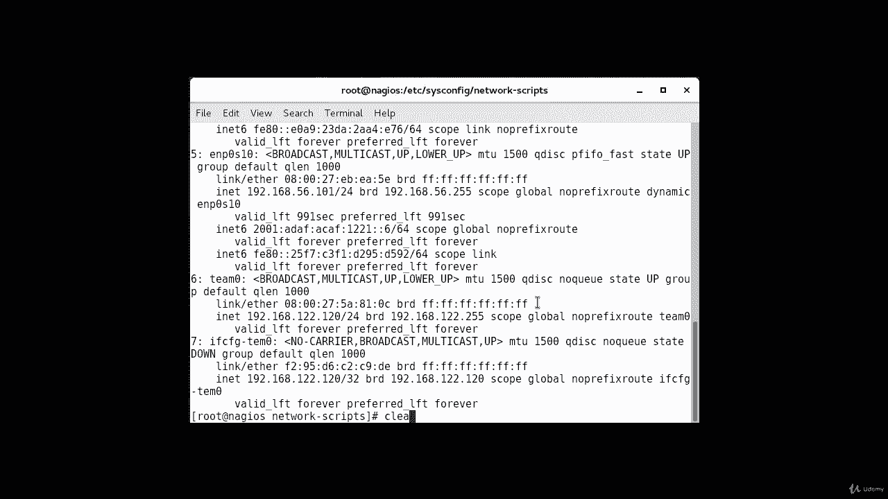
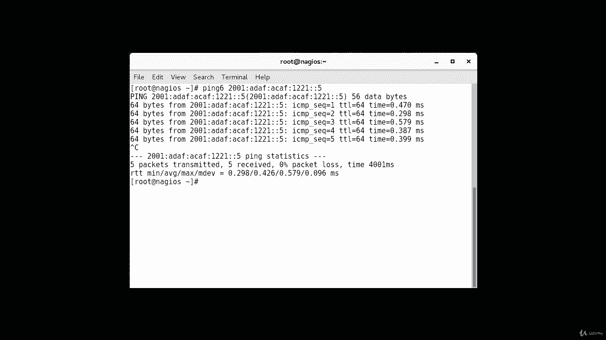

# Red Hat Certified Engineer (RHCE) 课程：P20：4. IPV6----1. 使用 nmcli 配置 IPv6 🌐

在本节课中，我们将学习如何在两台机器上配置 IPv6 地址，并通过相互 ping 通来验证网络连接是否成功。

## 检查当前网络配置

首先，我们需要检查当前机器上已配置的网络接口和地址。



以下是当前配置的网络接口信息。




这些是当前在我的机器上配置的接口。







我将使用接口 `enp0s8` 进行本次配置。


现在，让我们开始配置。


## 在第一台机器上配置 IPv6

我们将使用 `nmcli` 命令来添加和激活 IPv6 连接。

以下是添加新连接的步骤：

1.  **添加连接**：使用 `nmcli connection add` 命令创建一个名为 “test” 的新连接。
2.  **指定接口**：将新连接绑定到 `enp0s8` 接口。
3.  **设置类型**：指定连接类型为以太网。
4.  **配置 IPv6 地址**：为其分配一个 IPv6 地址。

具体命令如下：
```bash
nmcli connection add connection.name test ifname enp0s8 type ethernet ip6 2001:ad:af::1221::5/64
```
命令成功执行，连接已添加。

接下来，激活设备连接：
```bash
nmcli device connect enp0s8
```
设备已连接。

最后，启动我们刚刚创建的连接：
```bash
nmcli connection up test
```
连接现已启动并运行。

## 在第二台机器上配置 IPv6

现在，我们转到第二台机器，并执行类似的配置步骤。

以下是需要在第二台机器上执行的命令：

1.  **添加连接**：同样创建一个名为 “test” 的连接。
2.  **指定接口**：绑定到 `enp0s8` 接口。
3.  **设置类型**：指定为以太网类型。
4.  **配置 IPv6 地址**：分配一个与第一台机器在同一子网但不同的 IPv6 地址。

具体命令如下：
```bash
nmcli connection add connection.name test ifname enp0s8 type ethernet ip6 2001:ad:af::1221::7/64
```
连接添加成功。

激活设备连接：
```bash
nmcli device connect enp0s8
```
设备已连接。

启动连接：
```bash
nmcli connection up test
```
连接现已启动。

## 测试 IPv6 连接

配置完成后，我们需要测试两台机器之间的连通性。

首先，从第一台机器 ping 第二台机器的 IPv6 地址。请注意，ping IPv6 地址需要使用 `ping6` 命令。
```bash
ping6 2001:ad:af::1221::7
```
可以看到，ping 命令成功执行，数据包有回复，证明连接是通的。

接下来，从第二台机器 ping 第一台机器的 IPv6 地址。
```bash
ping6 2001:ad:af::1221::5
```
同样，ping 命令成功执行。这表明我们可以在两个方向上成功通信。




## 课程总结


本节课中，我们一起学习了如何使用 **Network Manager CLI (`nmcli`)** 工具来配置 **IPv6 地址**。我们通过分步操作，在两台机器上分别创建并激活了 IPv6 连接，最后使用 `ping6` 命令成功验证了双向的网络连通性。