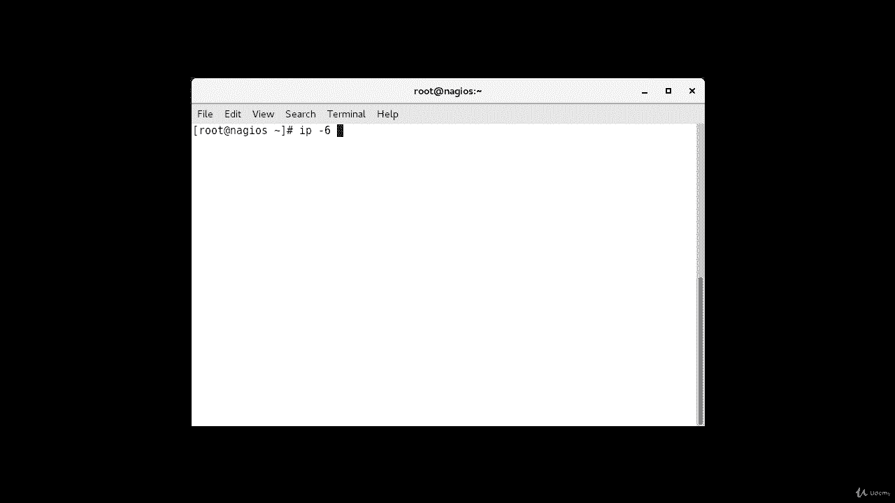
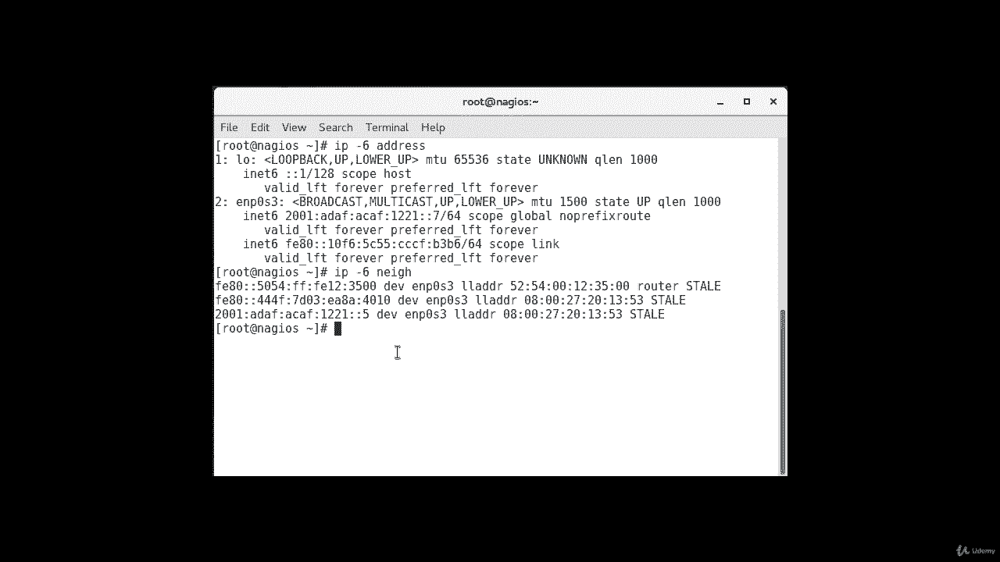
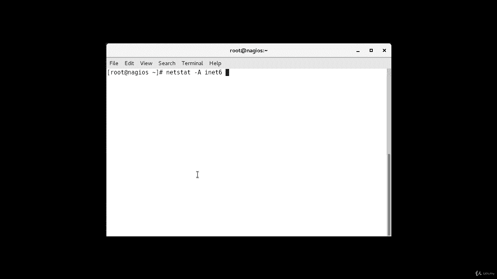
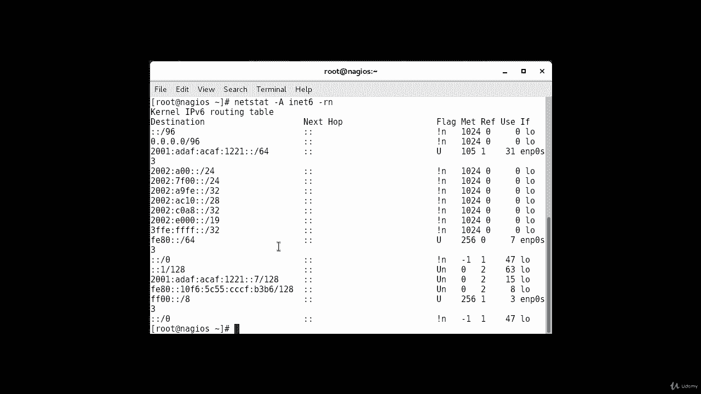
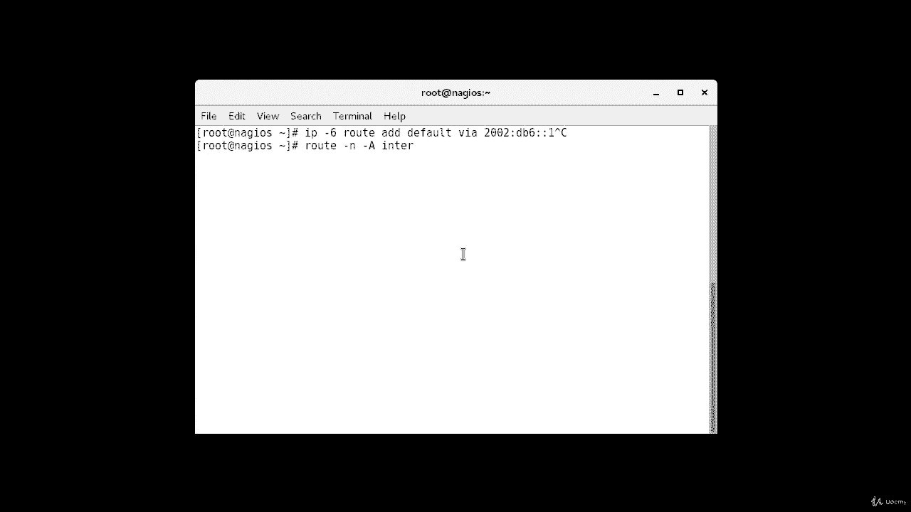
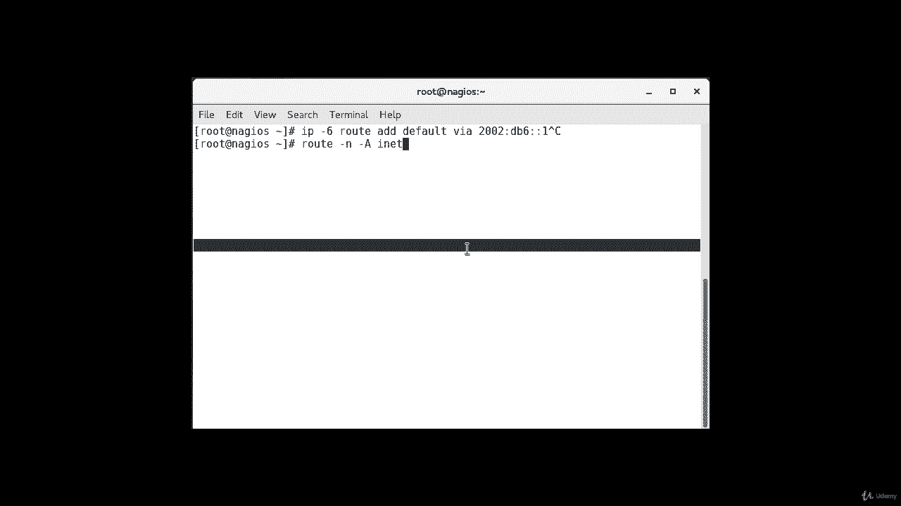
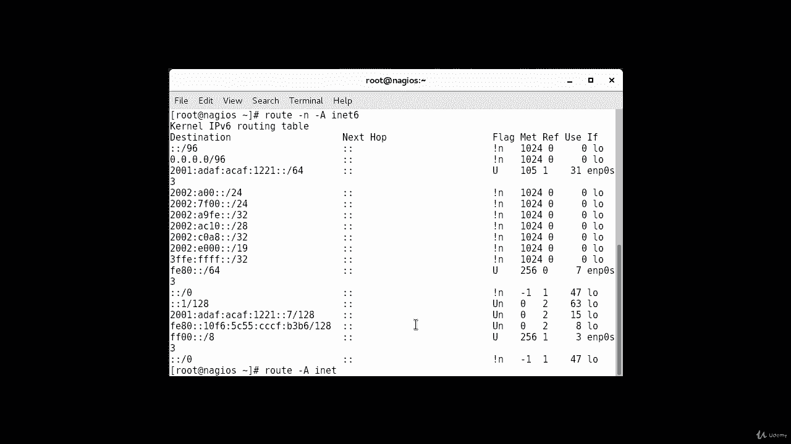
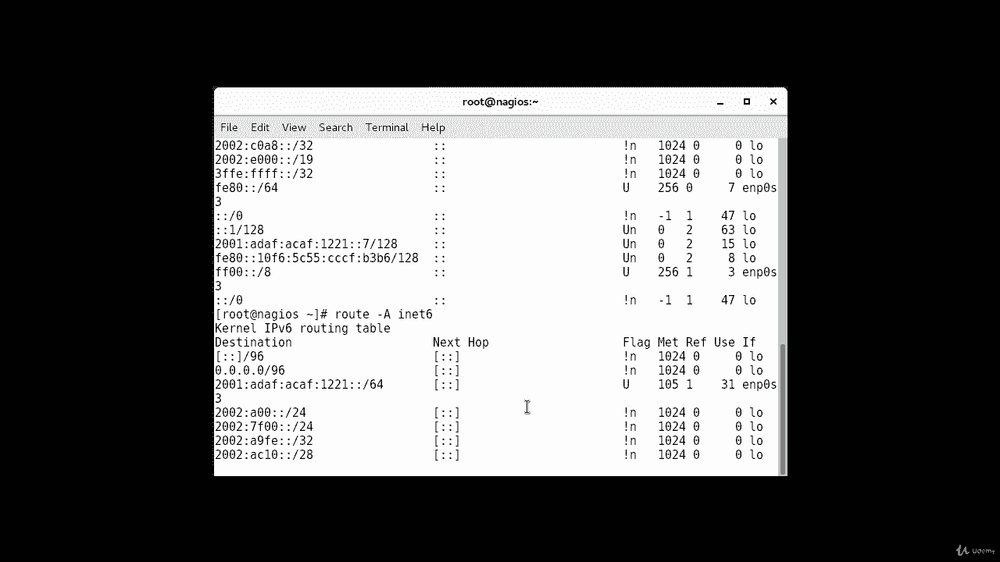
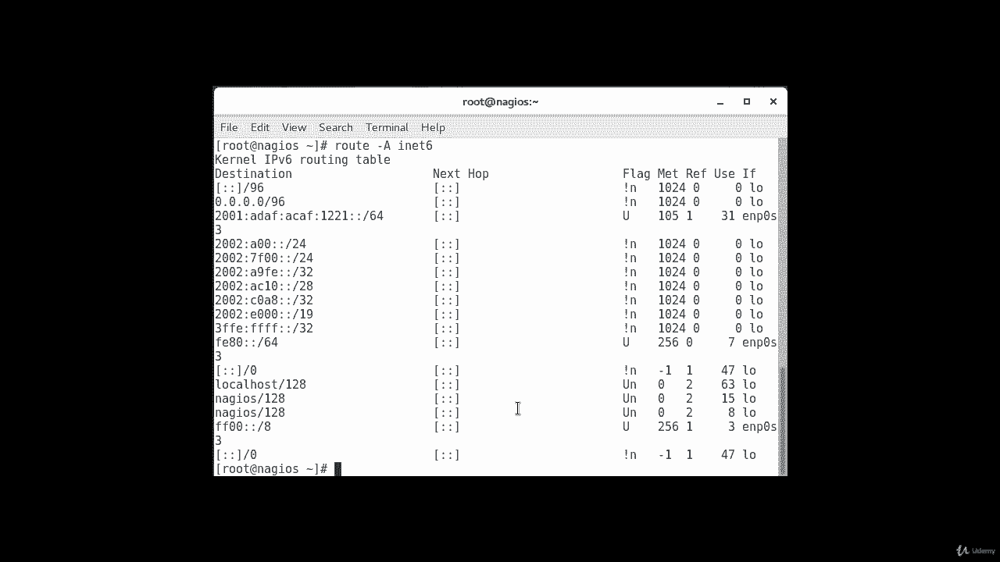

**RHCE认证课程：P21：IPv6故障排查辅助命令** 🔧

在本节课程中，我们将学习在Linux系统上用于IPv6网络故障排查的一系列辅助命令。这些命令与标准的IPv4命令略有不同，掌握它们对于诊断和验证IPv6网络配置至关重要。

---



上一节我们完成了两台机器上的IPv6配置。本节中，我们来看看用于查看和诊断IPv6网络状态的关键命令。

### 查看IPv6地址

要查看本机上配置的IPv6地址，可以使用 `ip -6` 命令。此命令与查看所有接口的 `ip addr` 不同，它只显示已配置了IPv6地址的接口。

**命令示例：**
```bash
ip -6 addr
```
执行该命令后，输出将包括回环接口以及我们之前配置了IPv6地址的特定网络接口。

### 发现IPv6邻居

另一个有用的命令类似于思科的CDP协议，用于显示连接到本设备的邻居信息。这对于确认网络连通性很有帮助。

**命令示例：**
```bash
ip -6 neigh show
```
在输出中，可以找到我们配置的另一台机器，它通常以一个特定的字段（如示例中的“field of five”）标识，表明它被识别为一个邻居。



### 查看本地IPv6连接



就像Linux中有用于IPv4的 `netstat` 命令一样，IPv6也有对应的工具。



**命令示例：**
```bash
netstat -6
```
使用 `-r` 选项可以查看所有本地接口的连接路由信息。

**命令示例：**
```bash
netstat -6 -r
```

### 网络流量监控与路由配置

以下是进行流量监控和路由管理的相关命令：

*   **流量抓取**：可以使用嗅探工具如 `tcpdump` 来监控IPv6流量。
    **命令示例：**
    ```bash
    tcpdump ip6
    ```
    此命令将在指定接口上开始捕获IPv6网络流量。

*   **配置默认路由**：要配置IPv6默认路由，可使用以下命令格式。
    **命令示例：**
    ```bash
    ip -6 route add default via <IPv6网关地址>
    ```
    例如：`ip -6 route add default via fe80::1`。请注意，如果配置错误可能导致网络连接中断。





*   **查看路由表**：要查看机器上配置的所有路由（包括IPv4和IPv6），可以使用以下命令。
    **命令示例：**
    ```bash
    route -A inet6
    ```
    或者使用 `ip` 命令：
    ```bash
    ip -6 route show
    ```
    这将显示为你的网络接口设置的路由信息。

*   **路径追踪**：要对一个IPv6地址执行路径追踪，使用 `traceroute` 命令的 `-6` 选项。
    **命令示例：**
    ```bash
    traceroute -6 <目标IPv6地址>
    ```

*   **检查配置**：综合检查当前网络配置的命令如下。
    **命令示例：**
    ```bash
    netstat -A inet6
    ```
    此命令将显示详细的IPv6配置和连接状态。





---



本节课中我们一起学习了用于IPv6网络故障排查的核心命令，包括查看地址、发现邻居、监控连接与流量、以及管理路由表。熟练掌握这些命令是有效管理和维护IPv6网络环境的基础技能。