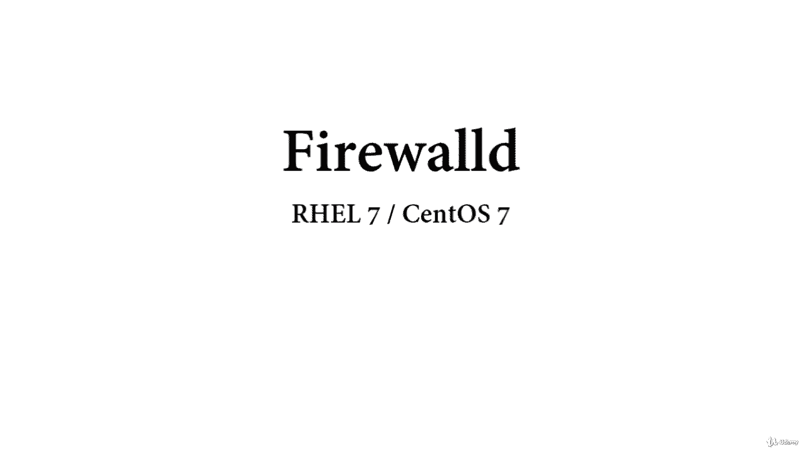
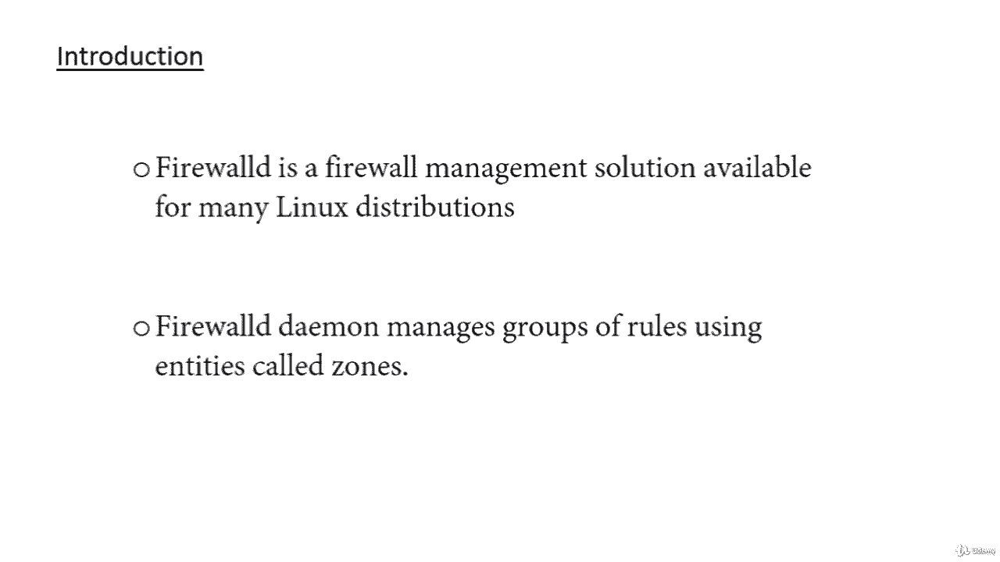
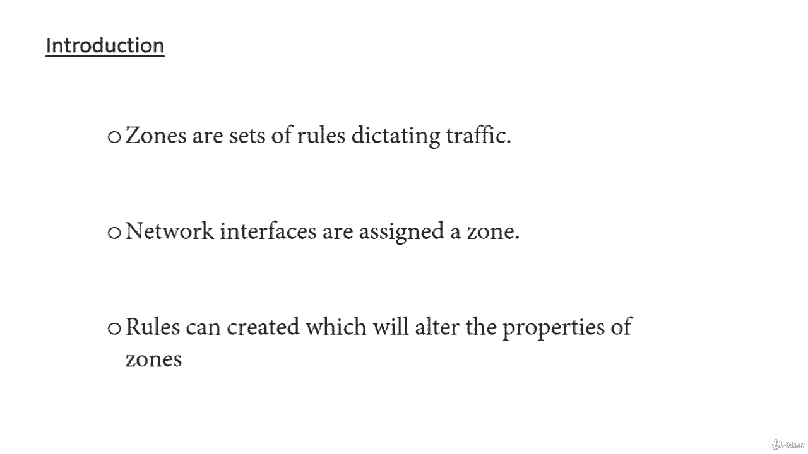
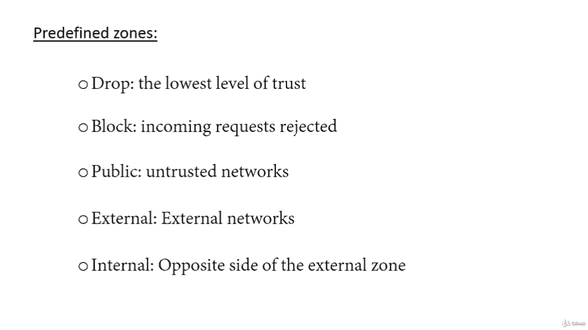
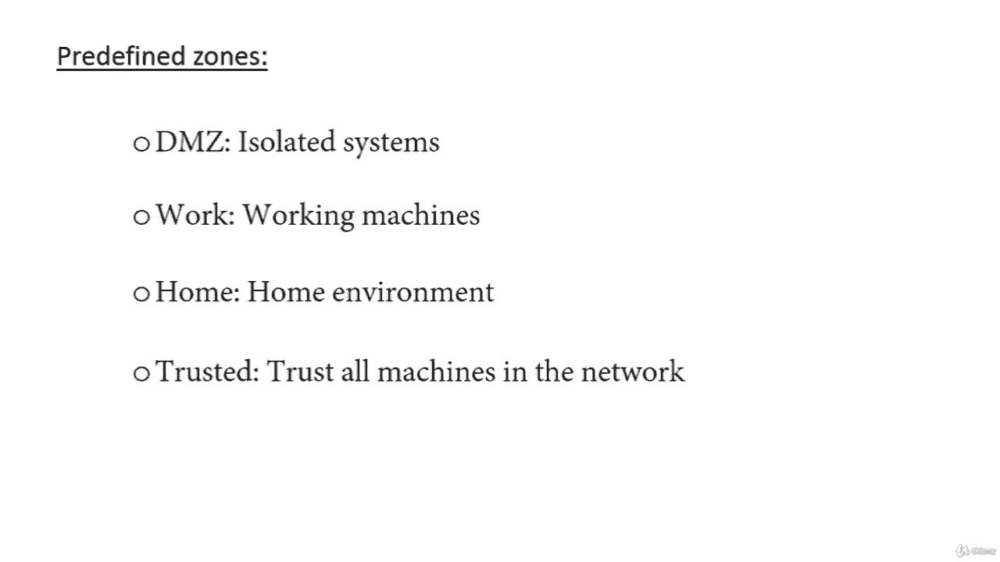

**防火墙管理：第1章：Firewalld 简介 🔥**

在本课程中，我们将学习如何在 Red Hat 7 和 CentOS 7 系统上部署、配置和排查 Firewalld 防火墙。Firewalld 是一个适用于多种 Linux 发行版的防火墙管理解决方案，它作为 Linux 内核提供的 iptables 包过滤系统的前端。

我们将介绍如何为服务器设置防火墙，并展示使用 `firewall-cmd` 管理工具进行防火墙管理的基础知识。

在开始学习如何使用 `firewall-cmd` 工具管理防火墙配置之前，我们需要先熟悉该工具引入的几个基本概念。

**区域的概念**

Firewalld 通过称为“区域”的实体来管理规则组。区域本质上是一组规则，根据您对计算机所连接网络的信任程度，来决定应允许哪些流量。网络接口被分配到一个区域，以决定防火墙应允许的行为。

对于可能在网络间频繁移动的计算机（如笔记本电脑），这种灵活性提供了一种根据环境改变规则的好方法。例如，在公共 Wi-Fi 网络上操作时，您可能设置严格的规则禁止大多数流量，而在连接到家庭网络时则允许更宽松的限制。对于服务器而言，这些区域通常不那么重要，因为其网络环境很少改变。

无论您的网络环境动态性如何，熟悉 Firewalld 中每个预定义区域背后的基本理念都是有益的。以下是按信任度从低到高排列的预定义区域：

*   **drop（丢弃）**：信任级别最低。所有传入连接都被无声丢弃，只有传出连接是可能的。
*   **block（阻塞）**：与 drop 类似，但传入请求会被拒绝，并回复 ICMP 主机禁止或 ICMPv6 管理禁止消息。
*   **public（公共）**：代表公共或不信任的网络。您不信任其他计算机，但可以视情况允许选定的传入连接。
*   **external（外部）**：用于外部网络。当您将防火墙用作网关时，会为此区域配置网络地址转换或伪装，以便您的内部网络保持私有但可访问。
*   **internal（内部）**：external 区域的反面，用于网关的内部部分。计算机之间相当可信，并且可以使用一些额外的服务。
*   **DMZ（隔离区）**：用于位于 DMZ 中的计算机，即无法访问您网络其余部分的隔离计算机。它是您网络中的一个隔离子网。
*   **work（工作区）**：用于工作机器。信任网络中的大多数计算机，可能允许更多一些服务。
*   **home（家庭区）**：家庭环境通常意味着您信任大多数其他计算机，并且会接受更多一些服务。
*   **trusted（信任区）**：信任网络中的所有机器。这是可用选项中最开放的，应谨慎使用。

要使用防火墙，我们可以创建规则并修改区域的属性，然后将网络接口分配到最合适的区域。

**规则持久性**

在 Firewalld 中，规则可以被指定为“永久”或“立即”。默认情况下，添加或修改规则时，会更改当前运行防火墙的行为，但在下次启动时，旧规则会恢复。大多数 `firewall-cmd` 操作可以加上 `--permanent` 标志，以表示针对非临时（即永久）防火墙规则集进行操作，这将影响启动时加载的规则集。

这种分离意味着您可以在活动的防火墙实例中测试规则，如果出现问题可以重新加载。您还可以使用 `--permanent` 标志逐步构建一整套规则，然后在执行重载命令时一次性应用。

**总结**

在本节课中，我们一起学习了 Firewalld 的基本概念。我们了解到 Firewalld 是 iptables 的前端管理工具，通过“区域”来管理不同信任级别网络的访问规则，并且规则有“立即”生效和“永久”生效之分。理解这些核心概念是后续进行具体配置和管理的基础。