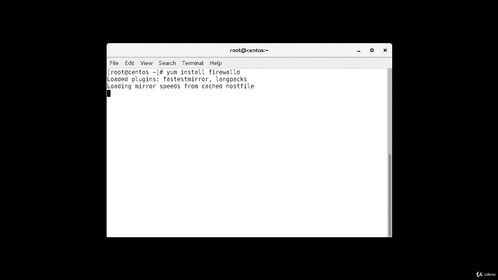
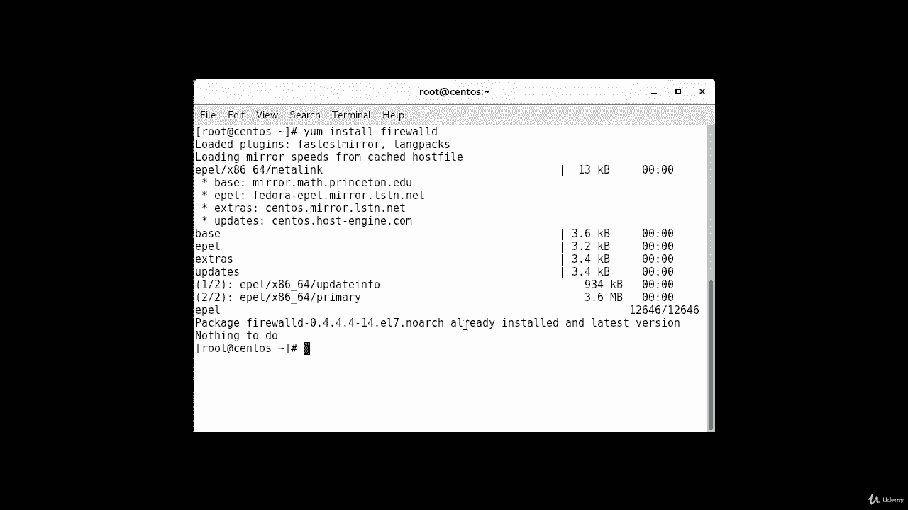
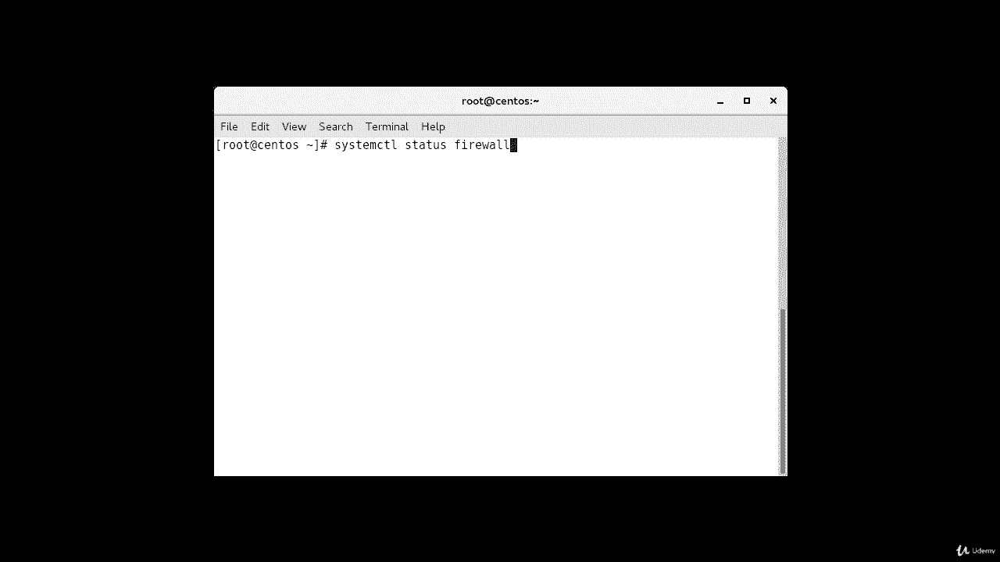
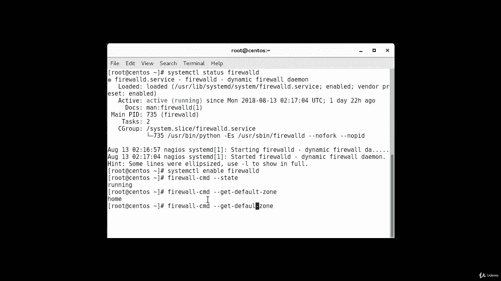
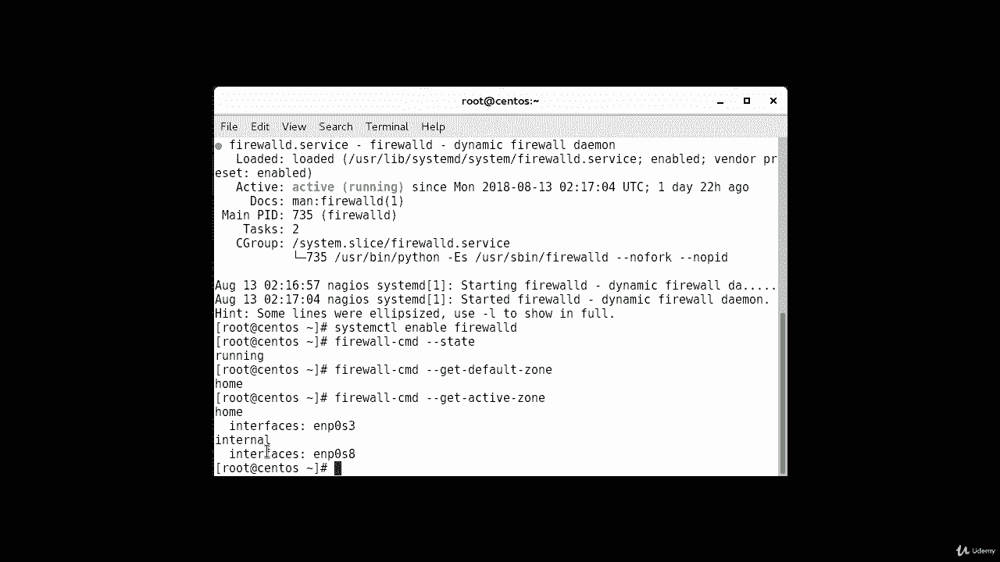
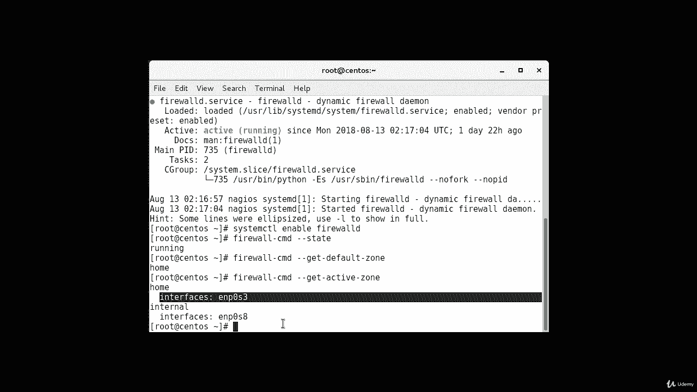
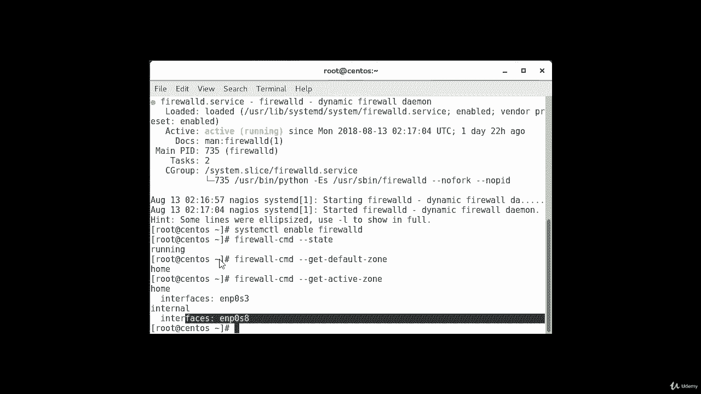
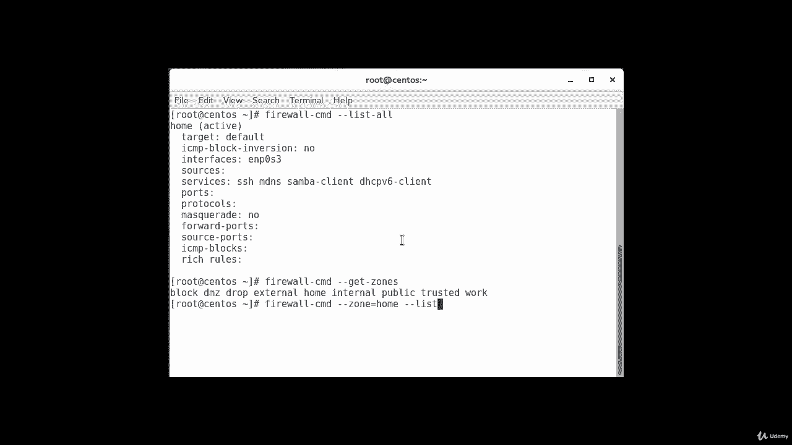
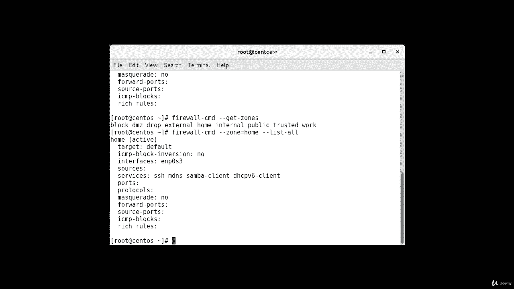
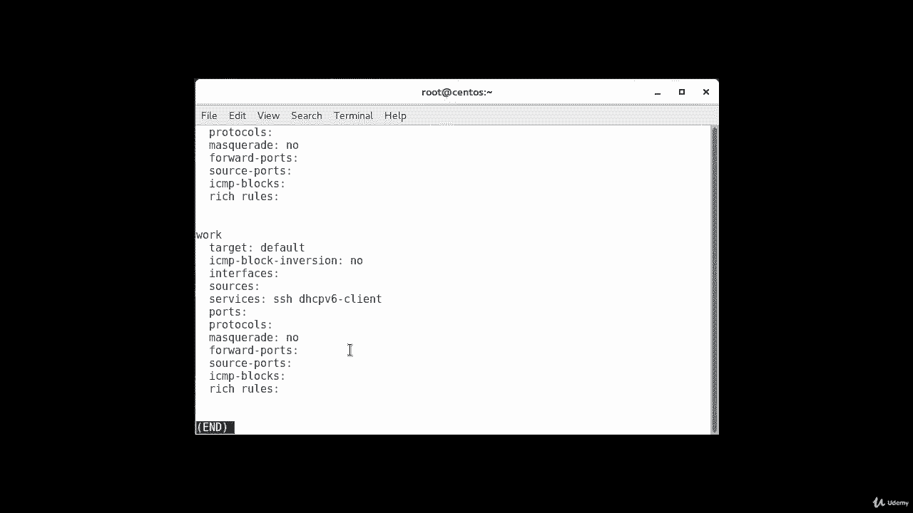

# Red Hat Certified Engineer (RHCE) - 2018：P23：5. Firewalld--2. 探索默认配置 🔍

在本节课中，我们将学习 Firewalld 的基础知识，包括如何检查其安装状态、启用服务以及探索其默认的配置和区域规则。这些是管理 CentOS 7 或类似系统防火墙的第一步。

---

## 安装与启用 Firewalld

默认情况下，Firewalld 已安装在许多 Linux 发行版上，包括 CentOS 7 的多数镜像。然而，有时可能需要手动安装它。



在我的系统中，Firewalld 已经安装好了，但我仍会展示安装过程。安装命令是：

```bash
yum install firewalld
```



如果系统尚未安装 Firewalld，执行此命令并确认即可完成安装。如果已安装，命令会提示软件包已是最新版本，无需操作。

安装完成后，可以启用 Firewalld 服务。启用服务意味着 Firewalld 将在系统启动时自动运行。最佳实践是，在配置此行为前，先创建并测试防火墙规则，以避免潜在问题。

检查 Firewalld 当前状态的命令是：

```bash
systemctl status firewalld
```

要启用 Firewalld 使其在启动时运行，使用命令：



```bash
systemctl enable firewalld
```

另一种验证防火墙是否运行的方法是：

```bash
firewall-cmd --state
```

---

## 探索默认环境与规则

在开始修改配置之前，我们需要熟悉 Firewalld 守护进程提供的默认环境和规则。

首先，我们可以查看当前的默认区域：

```bash
firewall-cmd --get-default-zone
```

输出显示当前默认区域是 `home`。由于我们没有命令 Firewalld 偏离默认区域，且没有接口绑定到其他区域，`home` 区域也是当前唯一的活跃区域，控制着我们所有接口的流量。

我们可以通过以下命令验证活跃区域：



```bash
firewall-cmd --get-active-zones
```



此命令会列出活跃区域及其关联的网络接口。



---

## 查看区域配置详情



那么，我们如何知道 `home` 区域关联了哪些规则呢？要打印出默认区域的配置详情，可以使用：

```bash
firewall-cmd --list-all
```

输出会显示 `home` 区域的配置，包括目标策略、ICMP 块设置、接口、允许的服务等。在默认配置中，通常只允许如 `ssh`、`dhcpv6-client`、`samba-client` 等基础服务，且未启用伪装功能。

现在我们对默认和活跃区域的配置有了基本了解。我们也可以查看其他预定义区域的信息。

要获取所有可用区域的列表，使用命令：

```bash
firewall-cmd --get-zones
```

要查看特定区域（如 `home`）的详细配置，可以在 `--list-all` 命令中指定区域参数：

```bash
firewall-cmd --zone=home --list-all
```



---

## 查看所有区域定义



如果想一次性输出所有区域的定义详情，可以使用 `--list-all-zones` 选项。由于输出内容可能很长，建议通过管道传递给分页器（如 `less`）以便于查看：

```bash
firewall-cmd --list-all-zones | less
```

使用空格键可以向下翻页，浏览所有区域的定义细节。

---

## 总结



本节课中，我们一起学习了 Firewalld 的初始步骤。我们了解了如何检查并安装 Firewalld，如何启用服务使其开机自启，以及如何探索系统的默认防火墙配置，包括查看默认区域、活跃区域和各个区域的详细规则。这些操作为后续自定义防火墙规则打下了基础。