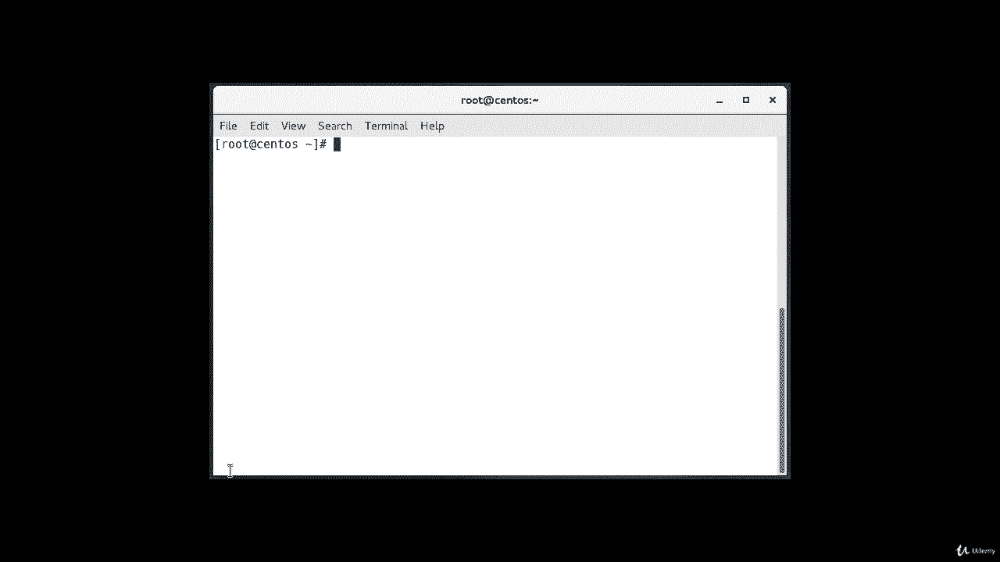
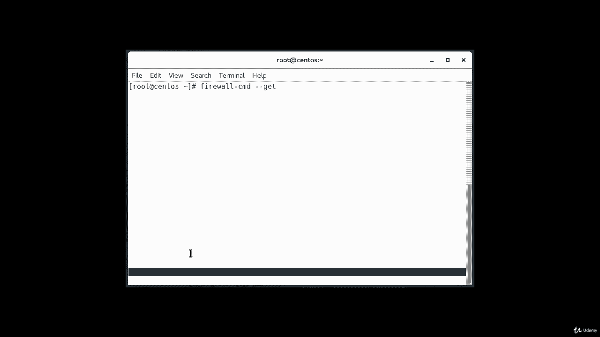
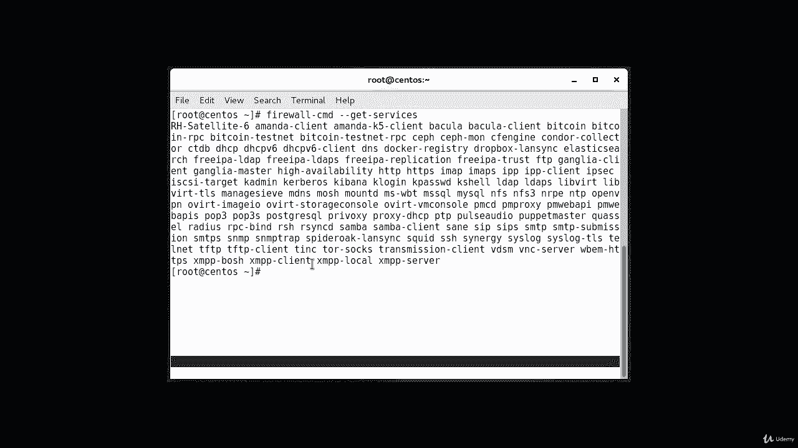
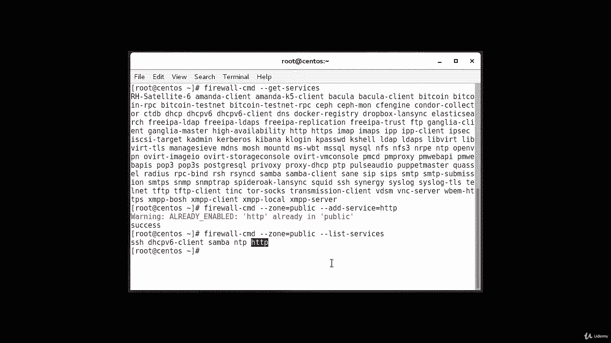
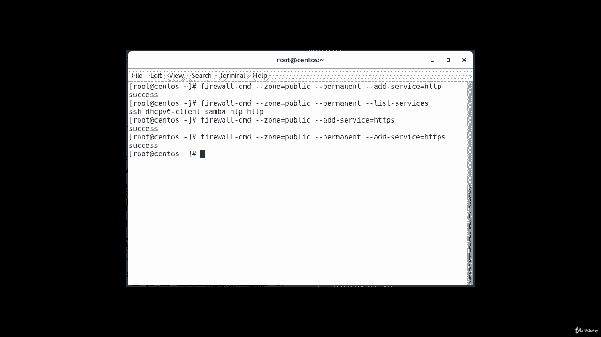

# Firewalld教程：P24：5.3 为应用程序设置规则 🔥

在本节课中，我们将学习如何使用Firewalld为特定的应用程序或服务设置防火墙规则。我们将重点介绍如何允许HTTP和HTTPS流量通过防火墙，并确保这些设置在系统重启后依然有效。



---



上一节我们介绍了Firewalld的基本概念和区域。本节中，我们来看看如何为运行在系统上的服务（如Web服务器）添加防火墙例外规则。



为希望对外开放的服务定义防火墙例外规则，其基本方法相当简单。将服务添加到您所使用的区域，最简单的方法就是将所需的服务或端口添加到相应区域。

首先，我们需要查看当前系统上运行了哪些可以应用防火墙规则的服务。这会是一个很长且杂乱的列表，但目的只是为了展示这些信息是可获取的。

以下是查看可用服务的命令：
```bash
firewall-cmd --get-services
```
执行此命令后，您将看到本机上所有可应用防火墙规则的服务列表。

假设我们希望在公共（public）区域允许HTTP流量，该如何操作呢？我们可以使用以下命令：
```bash
firewall-cmd --zone=public --add-service=http
```
在我的案例中，该服务可能已经运行。但请注意命令输出的底部，如果操作成功，它会显示成功信息。如果您的机器是新安装的，很可能没有运行HTTP服务，那么就不会出现红色的错误提示，这表示命令已成功执行。

如果您希望修改默认区域，可以省略 `--zone=public` 参数。我们可以通过列出服务的操作来验证上述操作是否成功。

以下是验证命令：
```bash
firewall-cmd --zone=public --list-services
```
如您所见，我们已经成功配置允许了HTTP流量，该服务现已启用。



一旦测试确认一切工作正常，您很可能希望修改永久性防火墙规则，以确保服务在系统重启后仍然可用。

我们可以使对公共区域的更改永久化，操作命令如下：
```bash
firewall-cmd --zone=public --permanent --add-service=http
```
要验证此永久规则是否添加成功，需要在列出服务的命令中也加上 `--permanent` 标志。

验证命令如下：
```bash
firewall-cmd --zone=public --permanent --list-services
```
如您所见，我们的HTTP服务已存在于列表中。现在，您的公共区域将在80端口上允许HTTP流量。

如果您的Web服务器配置使用了SSL或TLS（即HTTPS），您还需要添加HTTPS服务（即安全的HTTP）。

我们可以通过以下命令将其添加到当前会话和永久规则集中：
```bash
# 添加到当前运行时配置
firewall-cmd --zone=public --add-service=https

# 添加到永久配置，使其在重启后生效
firewall-cmd --zone=public --permanent --add-service=https
```
这样，HTTPS服务也将被永久允许。

---



本节课中，我们一起学习了如何为应用程序（如HTTP/HTTPS服务）设置Firewalld规则。关键步骤包括：查看可用服务、为指定区域添加服务例外、验证更改，以及将运行时规则转换为永久规则以确保配置持久化。通过掌握这些操作，您可以有效地管理服务器对外提供的网络服务。