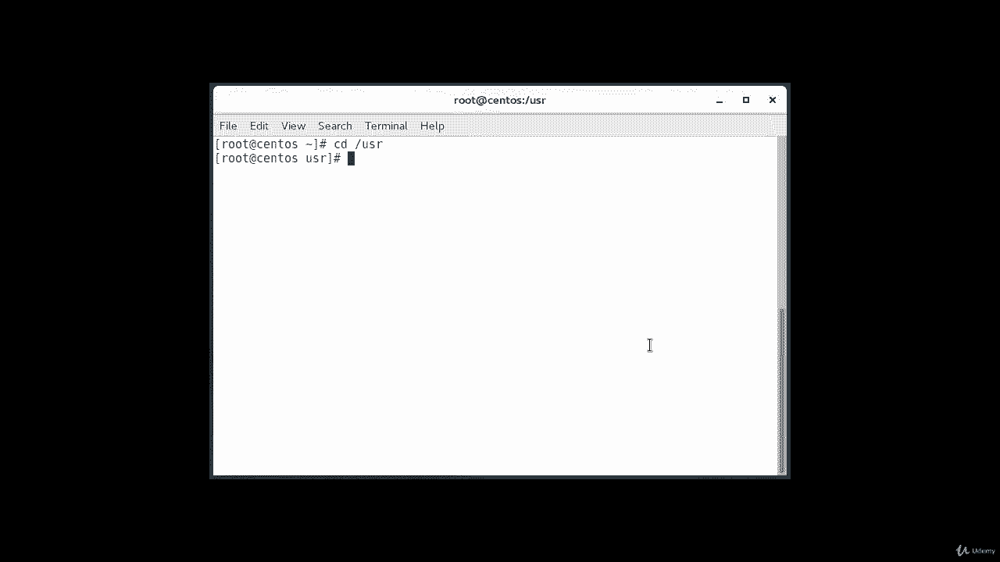
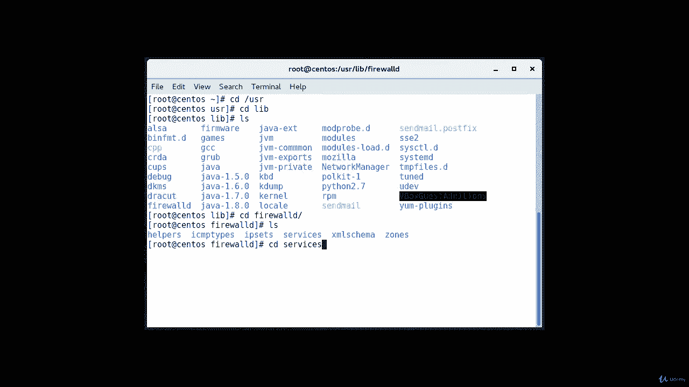
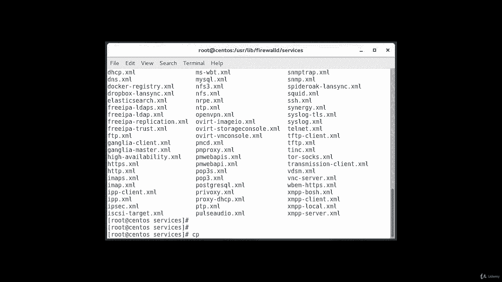
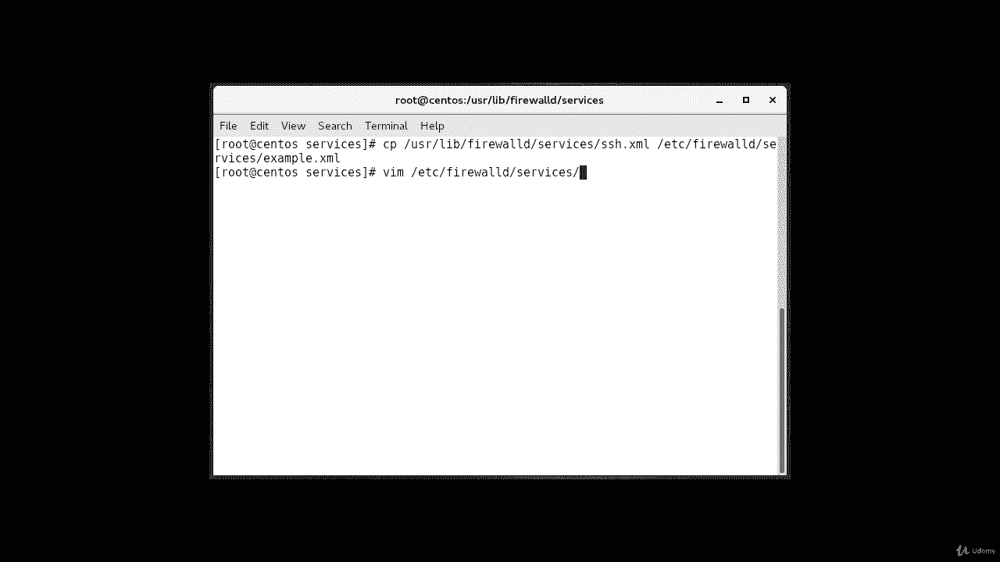
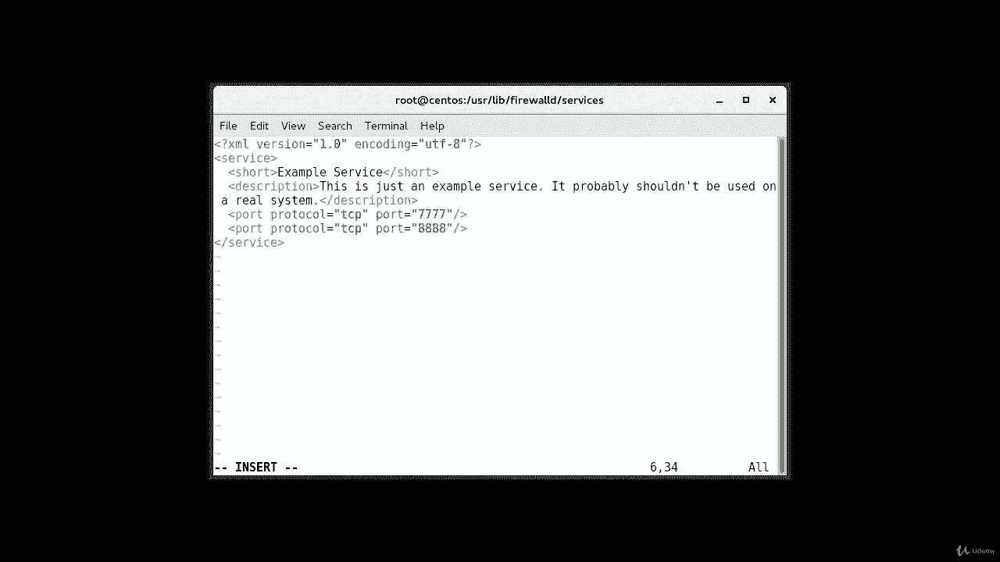
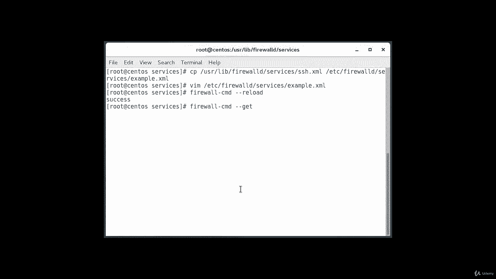
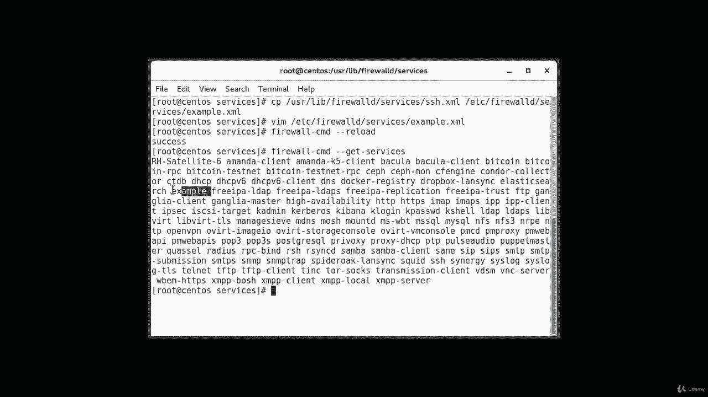

# Firewalld 教程：5：定义服务 🔧

在本节课中，我们将学习如何在 Firewalld 中定义服务。通过定义服务，我们可以将一组端口及其相关信息（如名称和描述）打包管理，这比单独管理每个端口更加清晰和高效。我们将通过复制和修改现有服务模板来创建一个自定义服务。

## 概述





为防火墙区域开放端口虽然简单，但难以跟踪每个端口的用途。当系统停用时，可能难以记住哪些已开放的端口仍然需要。为了避免这种情况，可以定义服务来代替直接管理端口。服务本质上是**端口的集合**，并附带相关的名称和描述。使用服务比管理单个端口更易于管理，但需要一些初始设置工作。



## 定义服务的步骤

上一节我们介绍了服务的概念，本节中我们来看看如何具体创建一个自定义服务。最简单的方法是复制一个现有的服务定义脚本。



以下是创建自定义服务的具体步骤：

1.  **定位并复制现有服务文件**
    所有预定义的服务脚本都位于 `/usr/lib/firewalld/services/` 目录中。我们可以复制其中一个（例如 SSH 服务）作为模板。

    ```bash
    sudo cp /usr/lib/firewalld/services/ssh.xml /etc/firewalld/services/example.xml
    ```
    文件名（去掉 `.xml` 后缀）将决定防火墙服务列表中的服务名称。

2.  **编辑服务定义文件**
    接下来，我们需要修改刚刚复制的文件，以定义我们自己的服务。

    ```bash
    sudo vi /etc/firewalld/services/example.xml
    ```
    文件最初包含我们复制的 SSH 服务定义。大部分内容是元数据。

3.  **修改服务配置**
    以下是需要修改的关键部分：
    *   **`<short>` 标签**：将其内容改为服务的人类可读名称（例如 `Example Service`）。
    *   **`<description>` 标签**：在此处添加服务的详细描述，便于日后审计。
    *   **`<port>` 标签**：这是影响服务功能的核心配置。在此指定需要开放的协议和端口号。可以为同一个服务定义多个端口。

    例如，假设我们需要为 TCP 协议开放端口 7777，为 UDP 协议开放端口 8888。修改后的相关部分应如下所示：

    ```xml
    <?xml version="1.0" encoding="utf-8"?>
    <service>
      <short>Example Service</short>
      <description>This is just an example service. It probably shouldn't be used on a real system.</description>
      <port protocol="tcp" port="7777"/>
      <port protocol="udp" port="8888"/>
    </service>
    ```

4.  **重新加载防火墙配置**
    保存并退出编辑器后，需要重新加载防火墙配置以使新服务生效。

    ```bash
    sudo firewall-cmd --reload
    ```



5.  **验证服务**
    重新加载后，可以检查新服务是否已出现在可用服务列表中。

    ```bash
    sudo firewall-cmd --get-services
    ```
    在输出的服务列表中，你应该能看到 `example` 服务。

## 总结





本节课中我们一起学习了如何在 Firewalld 中定义自定义服务。我们了解到，通过将相关端口打包成一个有名称和描述的服务，可以极大地简化防火墙规则的管理和维护。关键步骤包括：**复制模板、编辑元数据和端口定义、重新加载配置**。这种方法使得端口用途一目了然，便于长期系统管理。