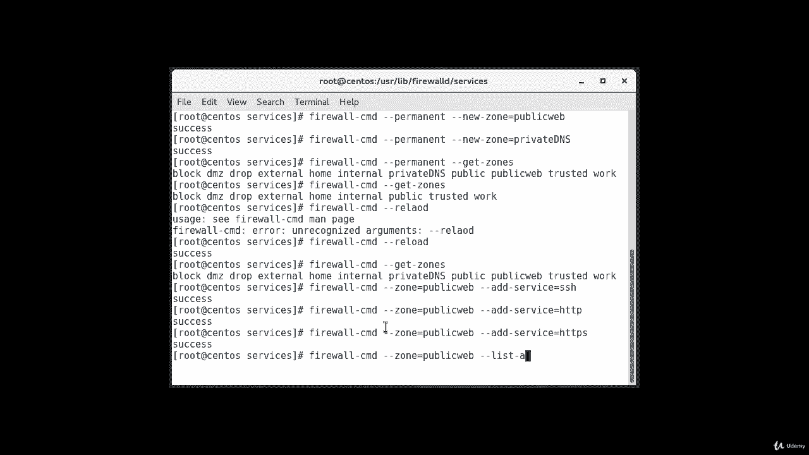
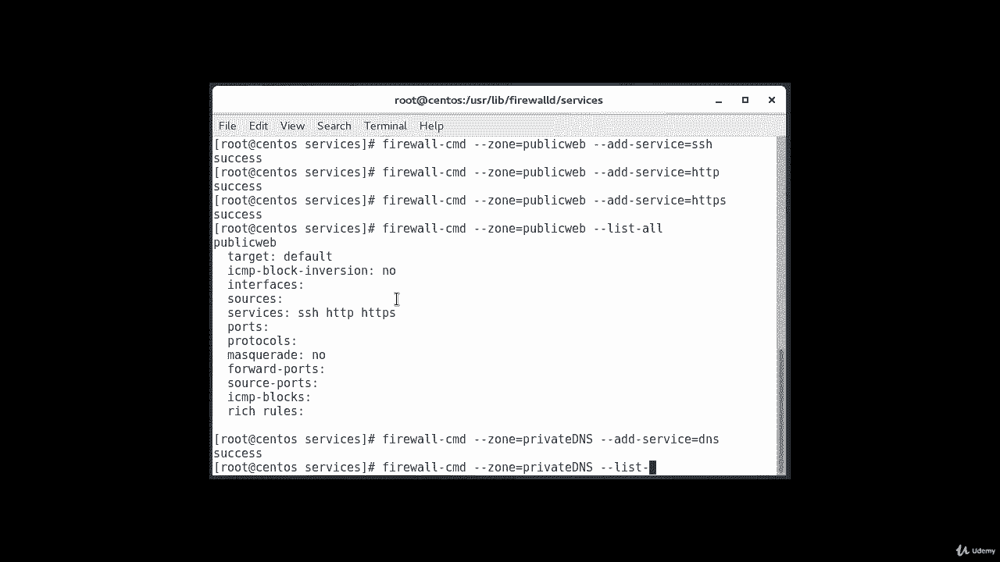
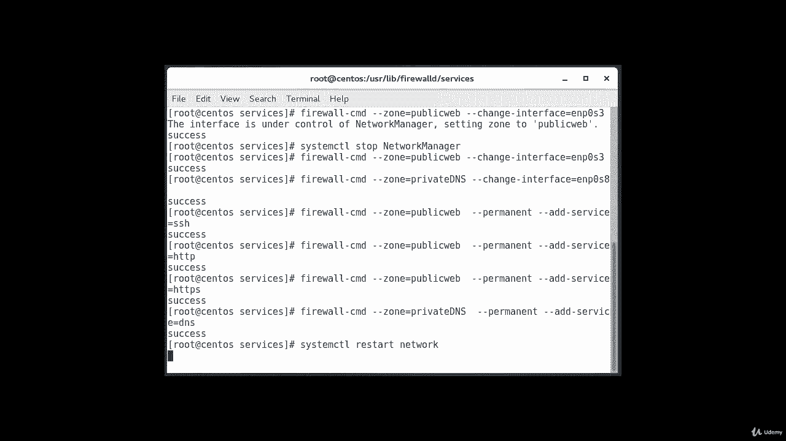
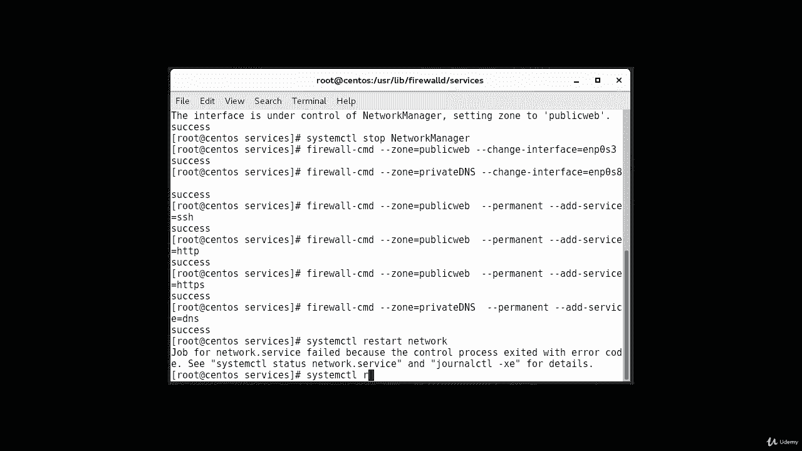
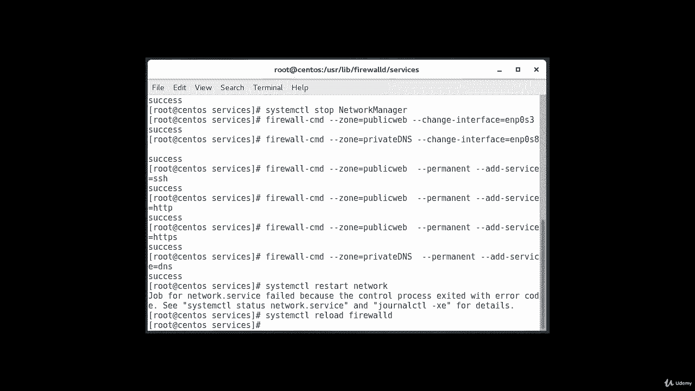
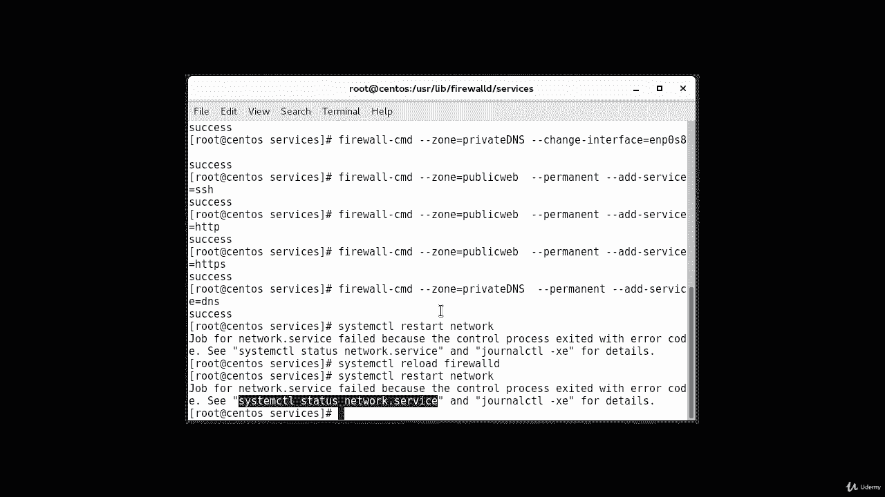
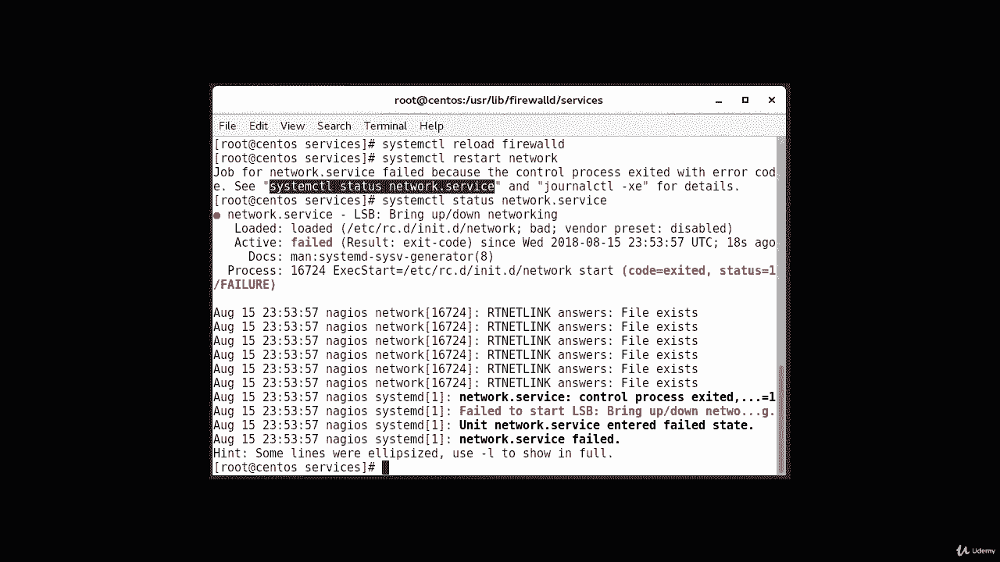
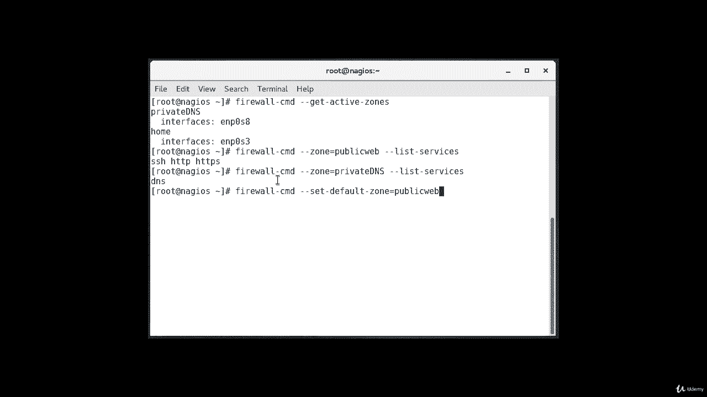

# Red Hat 认证工程师 (RHCE) 课程：P27：5. Firewalld--6. 创建自定义区域 🔧

在本节课中，我们将要学习如何创建自定义的 Firewalld 区域。虽然预定义区域对大多数用户来说已经足够，但创建功能描述更清晰的自定义区域会很有帮助。我们将通过创建两个示例区域，并为其分配服务，来演示整个过程。

## 概述

上一节我们介绍了 Firewalld 的基本概念和预定义区域。本节中我们来看看如何创建自定义区域。自定义区域允许你根据服务的具体功能（例如“公共网站”或“私有DNS”）来组织防火墙规则，使管理更加直观。

## 创建自定义区域

首先，我们需要将新区域添加到防火墙的永久配置中。以下是创建两个区域“public-web”和“private-dns”的命令。

```bash
firewall-cmd --permanent --new-zone=public-web
firewall-cmd --permanent --new-zone=private-dns
```

命令执行成功后，可以使用以下命令验证它们是否已存在于永久配置中。

```bash
firewall-cmd --permanent --get-zones
```

此时，新区域尚未在当前运行的防火墙会话中生效。为了使更改生效，需要重新加载防火墙。

```bash
firewall-cmd --reload
```

重新加载后，再次列出当前活动区域，即可看到新创建的区域。

```bash
firewall-cmd --get-zones
```

## 为区域分配服务

区域创建好后，下一步是为其分配相应的服务。通常，建议先在活动实例中添加规则，测试无误后再将其转移到永久配置。

以下是需要执行的步骤：

首先，为“public-web”区域添加 SSH、HTTP 和 HTTPS 服务。

```bash
firewall-cmd --zone=public-web --add-service=ssh
firewall-cmd --zone=public-web --add-service=http
firewall-cmd --zone=public-web --add-service=https
```

添加完成后，可以列出该区域的所有服务进行确认。



```bash
firewall-cmd --zone=public-web --list-services
```

接着，为“private-dns”区域添加 DNS 服务。

```bash
firewall-cmd --zone=private-dns --add-service=dns
firewall-cmd --zone=private-dns --list-services
```



## 将网络接口绑定到区域

规则配置完成后，需要将网络接口分配到对应的区域以进行测试。

将接口 `enp0s3` 分配给“public-web”区域。

```bash
firewall-cmd --zone=public-web --change-interface=enp0s3
```

将接口 `enp0s8` 分配给“private-dns”区域。

```bash
firewall-cmd --zone=private-dns --change-interface=enp0s8
```

## 将规则保存至永久配置

测试确认配置工作正常后，需要将这些规则添加到永久配置中，以确保重启后依然有效。

使用 `--permanent` 标志重新应用规则：

```bash
firewall-cmd --zone=public-web --permanent --add-service=ssh
firewall-cmd --zone=public-web --permanent --add-service=http
firewall-cmd --zone=public-web --permanent --add-service=https
firewall-cmd --zone=private-dns --permanent --add-service=dns
```

添加永久规则后，需要重启网络服务和重新加载防火墙以使所有更改完全生效。



```bash
systemctl restart network
firewall-cmd --reload
```





> **注意**：在某些情况下，重启网络服务可能会失败。如果遇到问题，可以尝试重启整个系统来解决问题。

## 验证最终配置



系统重启后，需要验证配置是否正确应用。

首先，检查活动区域及其绑定的接口。



```bash
firewall-cmd --get-active-zones
```

然后，分别验证两个区域所配置的服务。

验证“public-web”区域的服务：

```bash
firewall-cmd --zone=public-web --list-services
```

验证“private-dns”区域的服务：

```bash
firewall-cmd --zone=private-dns --list-services
```

## 设置默认区域

如果你想将某个自定义区域（例如“public-web”）设置为其他接口的默认区域，可以使用以下命令：

```bash
firewall-cmd --set-default-zone=public-web
```

## 总结



本节课中我们一起学习了如何创建和管理自定义的 Firewalld 区域。我们完成了从创建区域、分配服务、绑定接口，到将规则永久化并验证的完整流程。通过使用自定义区域，你可以根据网络服务的实际功能来构建更清晰、更易管理的防火墙策略。