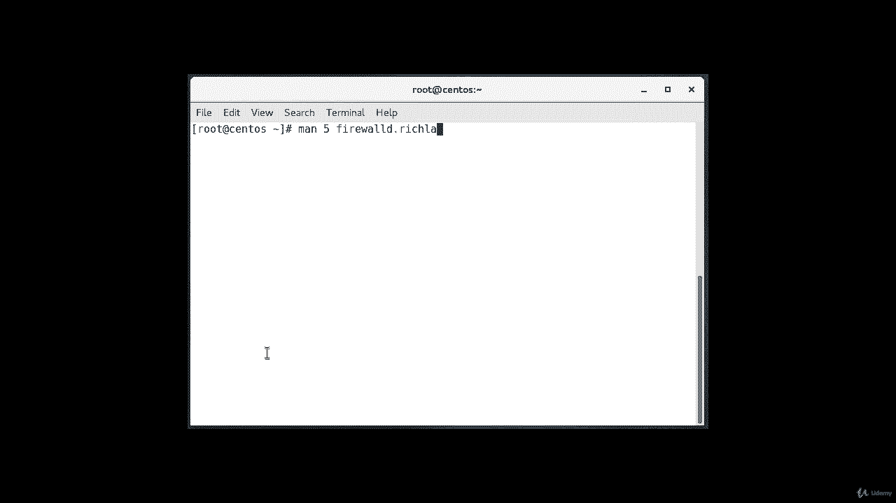
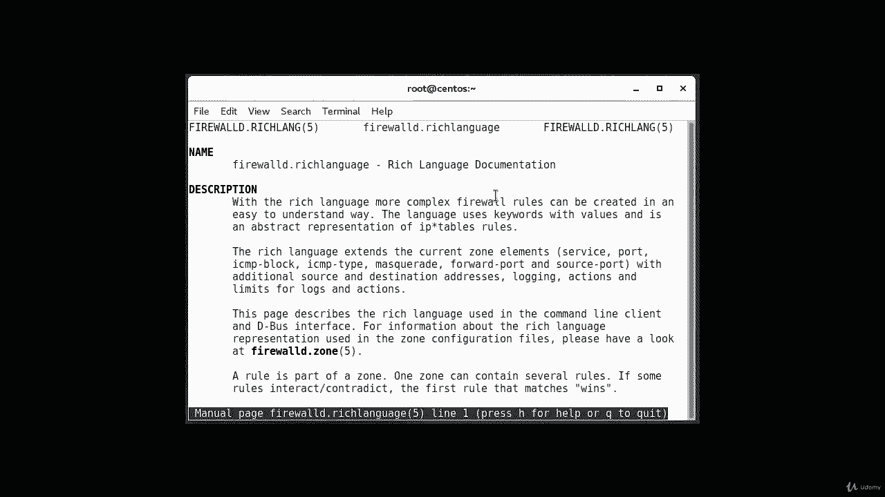
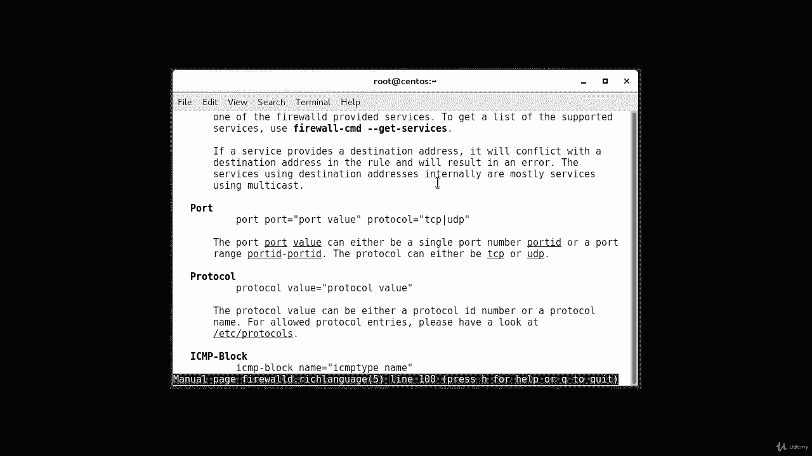
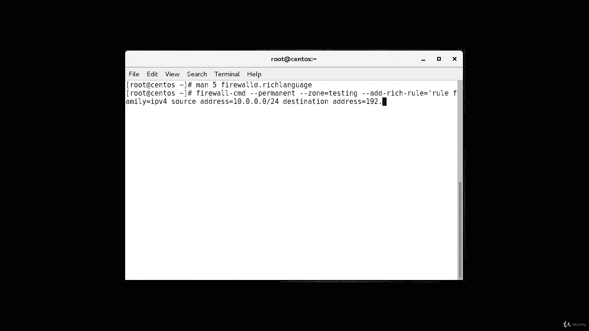
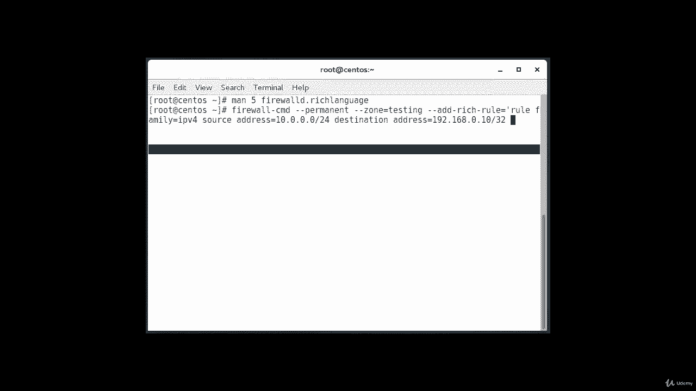
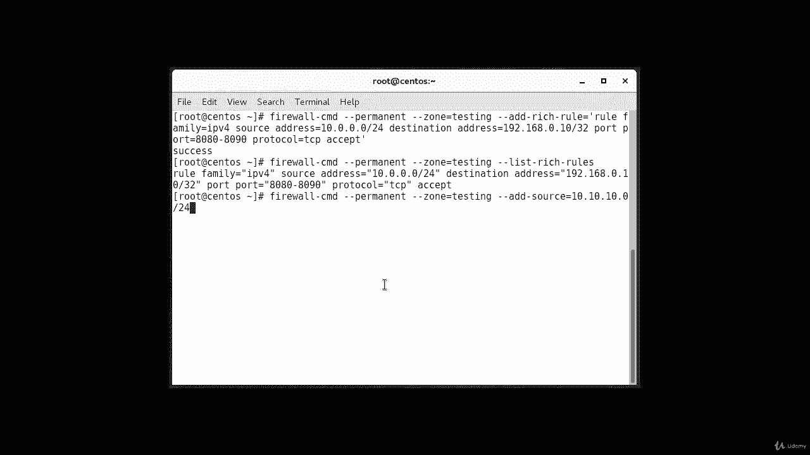
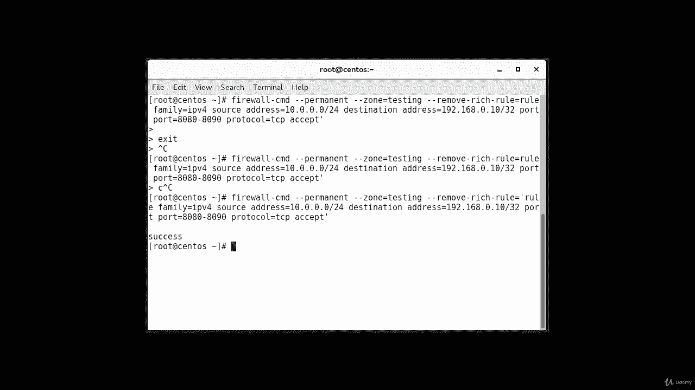

# Red Hat Certified Engineer (RHCE) 课程：P28：6. Firewall rich rules--1. 添加富规则 🔥

在本节课中，我们将要学习防火墙富规则。富规则通过更细粒度的选项提供了更强的控制能力。它们可用于配置日志记录、地址伪装、端口转发和速率限制。

## 富规则概述与语法





上一节我们介绍了防火墙的基本概念，本节中我们来看看富规则。富规则提供了更高级别的控制，并支持更多系统选项。如需了解富规则的语法和更多示例，您可以查阅手册页。



```
man 5.firewalld.richlanguage
```

查阅手册页将为您提供详细的语法和更多关于富规则的信息。如果您正在准备如RHCE或LFCCE等认证考试，并且允许查阅手册页，这将是一个非常有用的资源。

## 富规则的处理顺序

当存在多条规则时，它们会按特定顺序处理。理解这个顺序对于正确配置防火墙至关重要。

以下是规则的处理顺序：
1.  端口转发和地址伪装规则最先被应用。
2.  其次是任何日志记录规则。
3.  然后是任何允许规则。
4.  最后是任何拒绝规则。

数据包将按顺序匹配第一条适用的规则。如果数据包不匹配任何规则，它将命中默认的拒绝策略。接下来，我们将通过一些示例来实践。

## 示例：添加一条富规则



现在，我们通过一个具体示例来学习如何添加富规则。在本示例中，我们将添加一条规则，允许来自 `10.0.0.0/24` 网段的流量，仅访问目标地址 `192.168.0.10` 的 TCP 端口 `8080` 到 `8090`。



使用的命令如下：
```bash
firewall-cmd --permanent --zone=testing --add-rich-rule='rule family=ipv4 source address=10.0.0.0/24 destination address=192.168.0.10/32 port port=8080-8090 protocol=tcp accept'
```

请注意，我们使用了 `--zone=testing`。请确保您已事先创建了名为 `testing` 的区域，否则命令将报错。该命令成功添加了一条规则，其含义是：对于IPv4协议，源地址为 `10.0.0.0/24`，目标地址为 `192.168.0.10` 的流量，允许其访问TCP端口 `8080` 至 `8090`。

## 查看与删除富规则

添加规则后，我们可以列出指定区域中的所有富规则进行查看。

使用以下命令列出 `testing` 区域中的富规则：
```bash
firewall-cmd --permanent --zone=testing --list-rich-rules
```



执行此命令后，您将看到刚才添加的规则显示在列表中。

如果您需要删除这条规则，可以使用移除命令。命令结构与添加时类似，但将 `--add-rich-rule` 替换为 `--remove-rich-rule`。

以下是删除刚才添加的规则的命令：
```bash
firewall-cmd --permanent --zone=testing --remove-rich-rule='rule family=ipv4 source address=10.0.0.0/24 destination address=192.168.0.10/32 port port=8080-8090 protocol=tcp accept'
```

执行此命令后，系统提示操作成功，该条富规则即被移除。

## 课程总结



本节课中我们一起学习了防火墙的富规则。我们了解了富规则能提供更精细的控制，并掌握了其基本语法和处理顺序。通过实践，我们学习了如何使用 `firewall-cmd` 命令添加、查看和删除一条具体的富规则。记住，在配置永久性规则时，务必使用 `--permanent` 参数，并在更改后重新加载防火墙配置或重启防火墙服务以使更改生效。