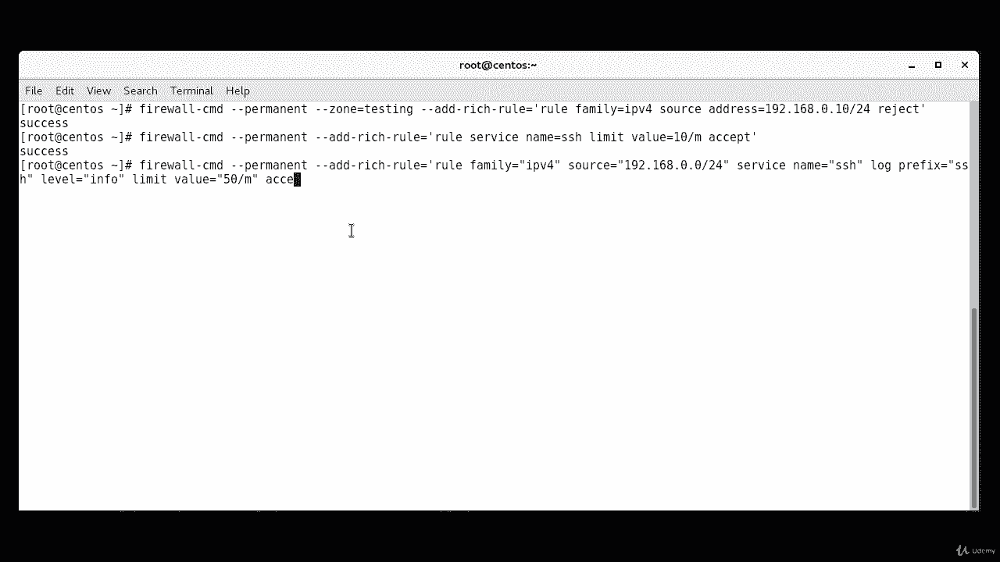
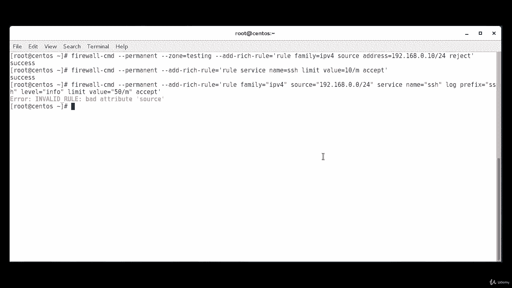
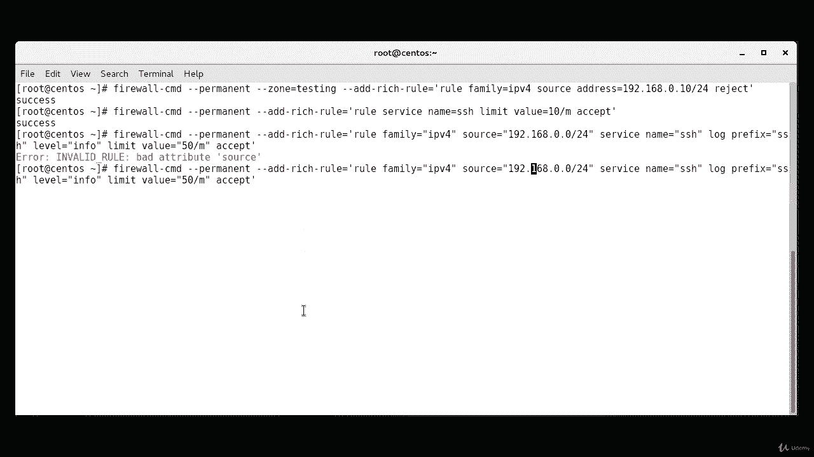
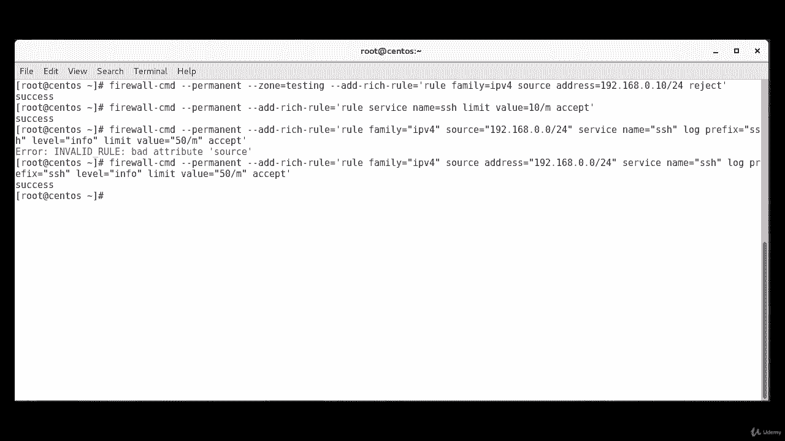

# Red Hat 认证工程师 (RHCE) 课程：P29：6. 防火墙富规则--2. 使用富规则进行拒绝

在本节课中，我们将学习如何使用防火墙的富规则来拒绝特定来源的流量，以及如何利用富规则实现流量速率限制和日志记录。我们将通过具体的命令示例来演示这些功能。

## 创建拒绝特定IP的富规则

上一节我们介绍了富规则的基本概念，本节中我们来看看如何创建一个富规则来拒绝来自特定IP地址的流量。我们将使用 `firewall-cmd` 命令来实现。

以下是创建该规则的命令语法：
```bash
firewall-cmd --permanent --zone=testing --add-rich-rule='rule family=ipv4 source address=192.168.10.0/24 reject'
```
执行此命令后，来自 `192.168.10.0/24` 网段的所有流量将被拒绝。`reject` 动作会向源地址发送一个ICMP包以通知拒绝，这与 `drop` 动作不同，后者会静默丢弃流量而不做任何回应。从安全角度考虑，`drop` 可能更优，因为 `reject` 响应会确认目标系统的存在。

## 使用富规则进行速率限制

富规则不仅可以用于拒绝或接受流量，还可以用于限制特定服务的连接速率。接下来，我们将学习如何限制SSH服务的连接频率。

以下是限制SSH连接为每分钟10次的命令：
```bash
firewall-cmd --permanent --add-rich-rule='rule service name=ssh limit value=10/m accept'
```
此规则将允许SSH连接，但限制每分钟最多只能建立10个新连接。这对于防止暴力破解攻击非常有用。

## 使用富规则记录日志

除了控制流量，富规则还能将特定事件记录到日志文件中，并且可以对日志记录本身进行速率限制。现在，我们来看如何记录来自特定网段的SSH连接尝试。



以下是配置日志记录的富规则命令。请注意，`source` 后必须明确指定 `address` 参数：
```bash
firewall-cmd --permanent --add-rich-rule='rule family=ipv4 source address=192.168.0.0/24 service name=ssh log prefix=ssh level=info limit value=50/m accept'
```
这条规则会记录来自 `192.168.0.0/24` 网段的所有SSH连接尝试，日志级别为 `info`，并且限制每分钟最多记录50条日志条目，以避免日志文件过快增长。



## 总结





本节课中我们一起学习了防火墙富规则的三个高级应用：拒绝特定IP的流量、对服务连接进行速率限制以及配置带有限制的日志记录。通过 `firewall-cmd` 命令和富规则语法，我们可以实现非常精细和灵活的流量控制策略。请记住，在指定源或目标地址时，必须同时声明地址族（`family=ipv4` 或 `ipv6`），并且注意命令参数的正确拼写，例如 `source address` 是一个完整的参数。