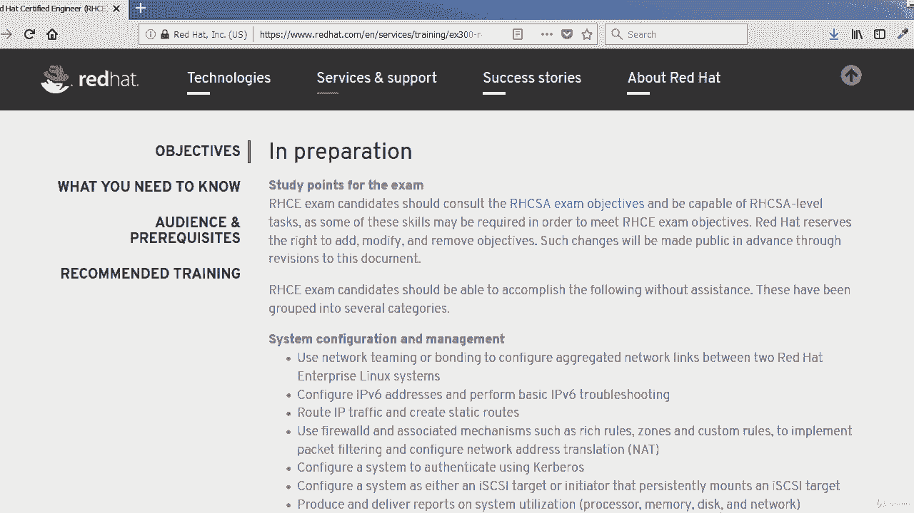
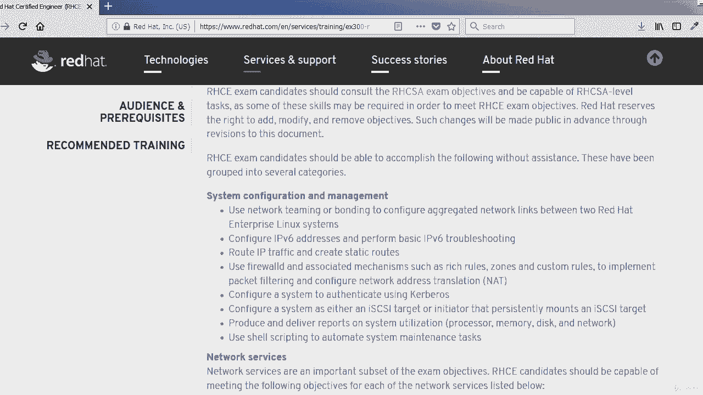
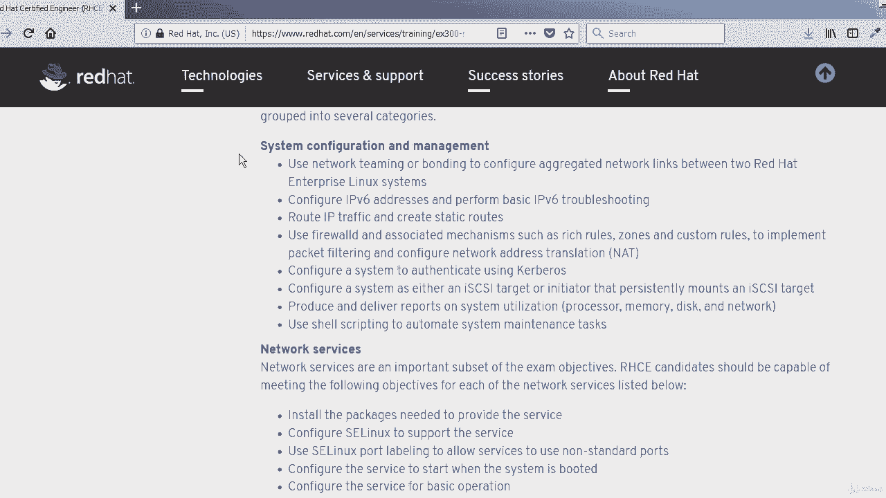
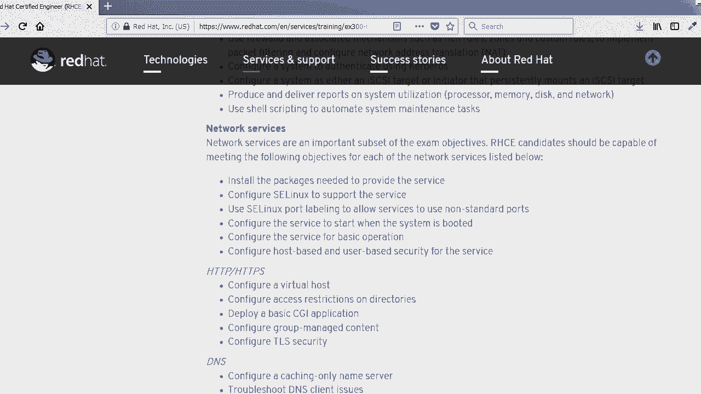
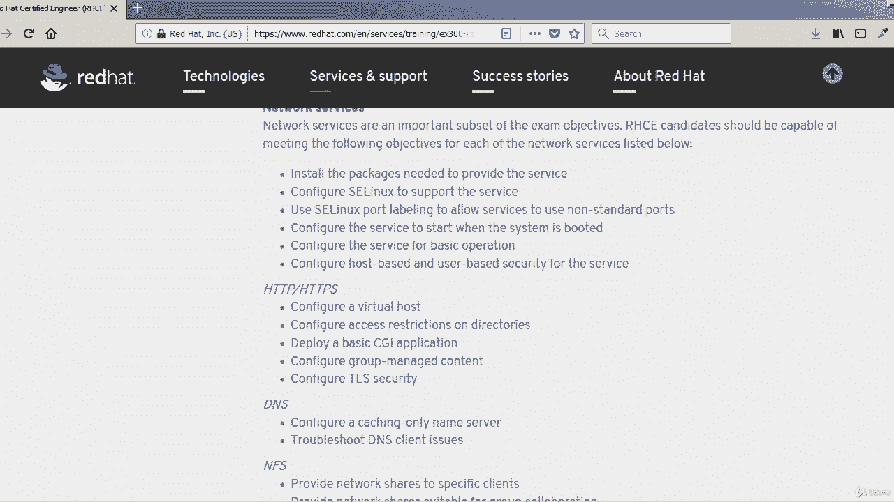
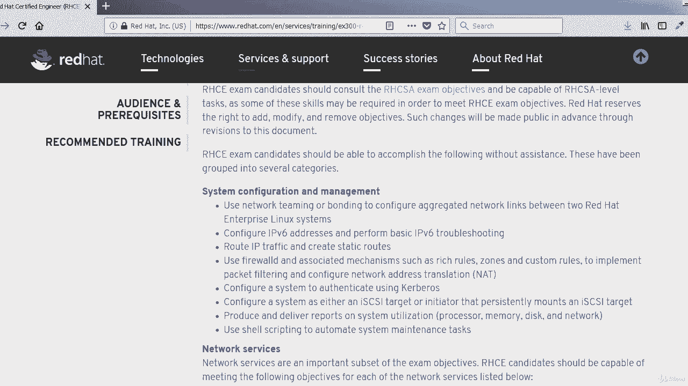
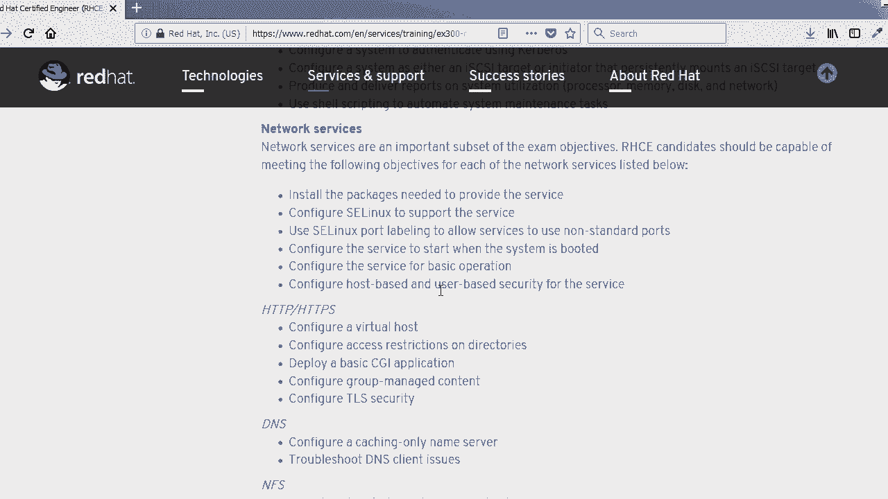
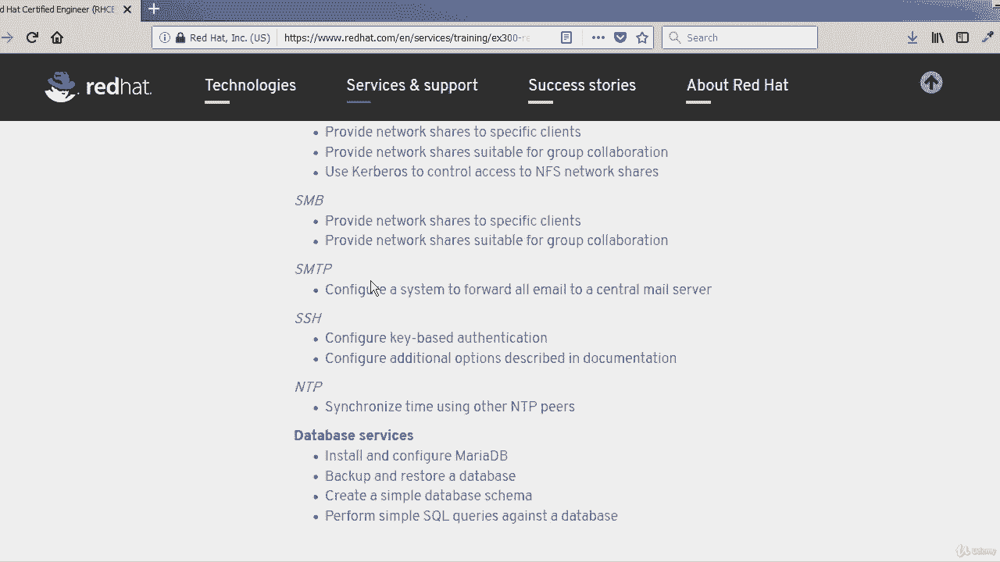
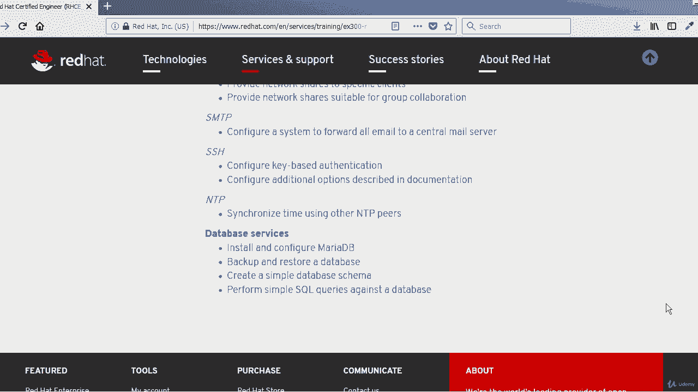

# RHCE认证课程：P2：考试目标详解 🎯

在本节课中，我们将详细探讨红帽认证工程师（RHCE）考试的具体目标。了解这些目标对于规划你的学习和备考至关重要。

上一节我们介绍了RHCE认证的概况，本节中我们来看看构成考试核心的三个主要知识领域。

## 系统配置与管理 ⚙️

系统配置与管理是RHCE考试的第一个主要类别，它要求你掌握一系列核心的系统级技能。

以下是该类别下的具体子目标：

*   **网络聚合**：掌握网络链路聚合（Teaming或Bonding）的配置。
*   **IPv6**：理解并能够配置IPv6网络。
*   **IP流量路由**：配置静态路由以引导IP流量。
*   **防火墙**：使用**FirewallD**服务配置和管理防火墙规则。
*   **Kerberos认证**：配置系统使用Kerberos进行身份验证。
*   **系统报告**：配置系统以生成和报告资源利用率数据。
*   **Shell脚本**：具备编写基础Shell脚本的知识和能力。

## 网络服务 🌐

在掌握了系统基础之后，我们需要将目光转向网络服务。这是RHCE考试中占比最大的部分，涉及多种关键服务的配置与管理。

以下是需要掌握的网络服务列表：

*   **SELinux**：理解SELinux的工作原理，并能进行基本配置。
*   **软件包管理**：掌握在红帽Linux系统上安装、更新和管理软件包。
*   **SELinux端口标签**：为网络服务配置SELinux端口标签。
*   **服务管理**：配置服务在系统启动时自动运行。
*   **服务安全**：配置基于主机和基于用户的服务访问控制。
*   **Apache HTTP服务器**：安装、配置Web服务器，部署CGI应用，并实施基本安全措施。
*   **DNS服务**：配置缓存DNS服务器，并排查DNS客户端问题。
*   **网络文件系统（NFS）**：配置NFS服务以实现文件共享。
*   **Samba服务**：配置Samba以实现Linux与Windows系统间的文件共享。
*   **SMTP服务**：配置邮件服务器。
*   **SSH服务**：配置和管理安全的Shell访问。
*   **时间同步**：使用NTP服务同步系统时间。

## 数据库服务 🗄️

最后，我们进入数据库服务部分。这部分要求你具备基本的数据库操作能力。

以下是关于数据库服务的具体目标：

*   **MariaDB数据库**：安装和配置MariaDB数据库。
*   **备份与恢复**：执行数据库的备份与恢复操作。
*   **数据库结构**：创建简单的数据库表结构。
*   **SQL查询**：执行基本的SQL查询语句。

本节课中我们一起学习了RHCE考试的三大核心目标领域：系统配置与管理、网络服务以及数据库服务。每个领域都包含了若干具体的技能要求，这些将是我们后续课程中逐一深入学习和实践的重点。明确这些目标有助于你构建清晰的学习路径。