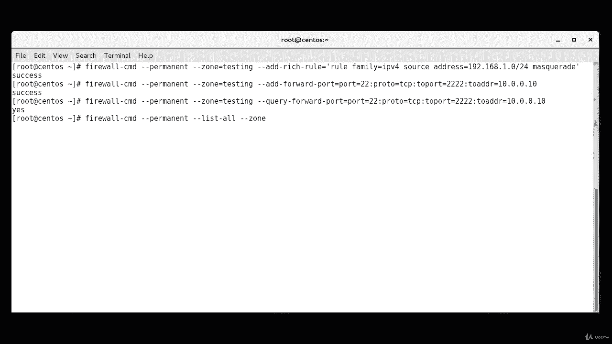
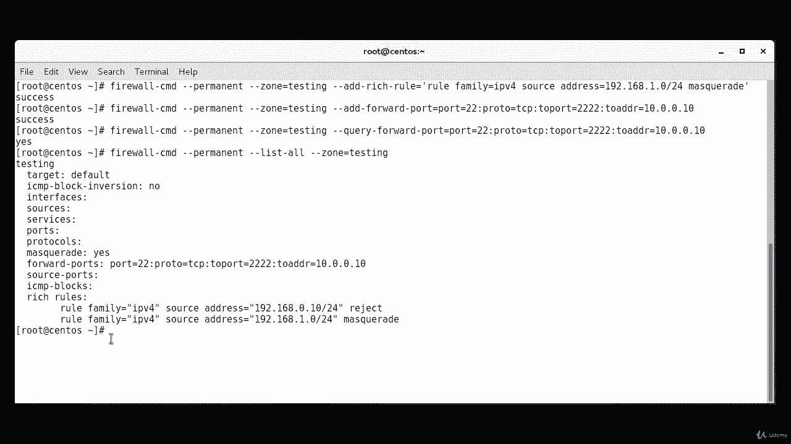
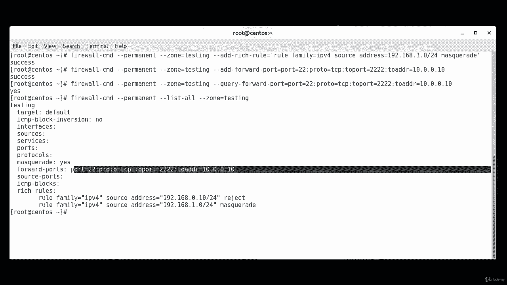
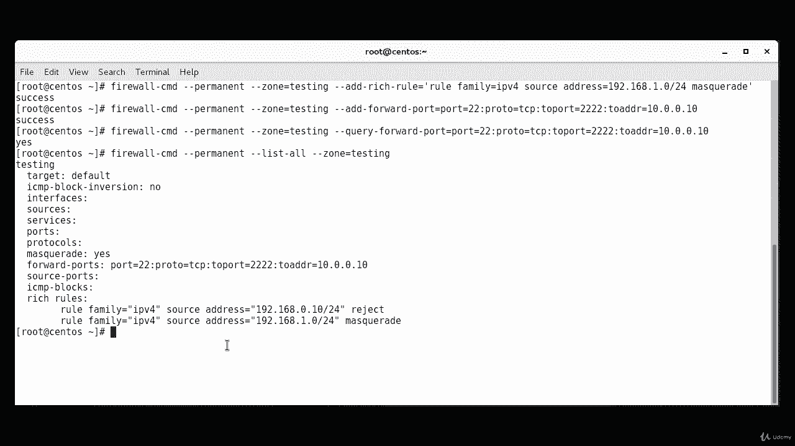
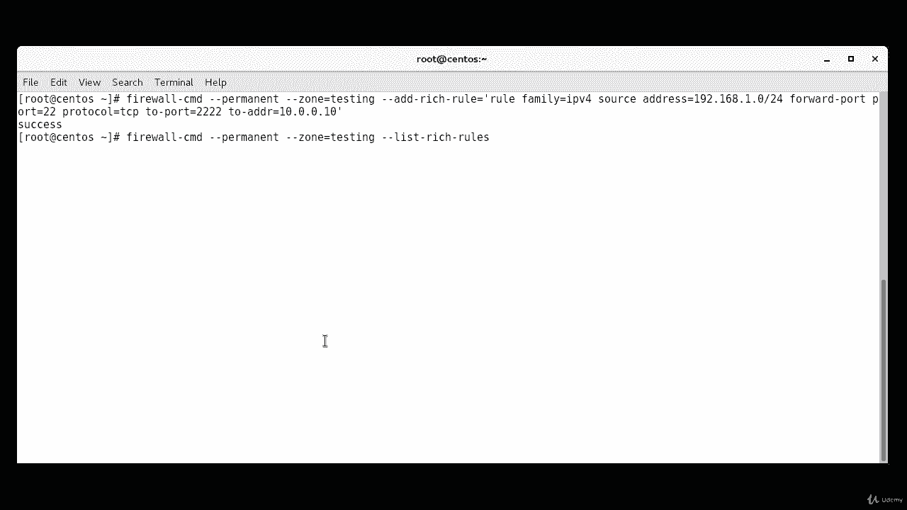
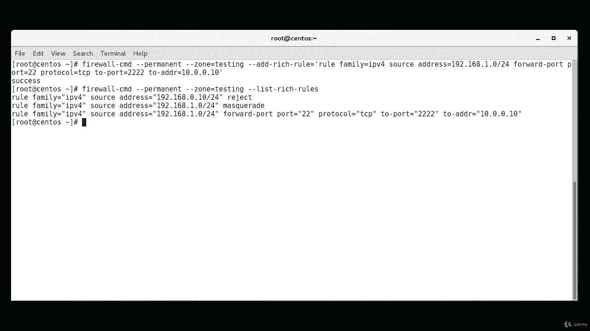

**RHCE课程：P30：防火墙富规则 - NAT与端口转发** 🔧

在本节课中，我们将学习如何使用FirewallD配置网络地址转换（NAT），具体包括**伪装**和**端口转发**两种技术。这两种功能都可以通过`firewall-cmd`命令进行配置。需要注意的是，伪装功能仅支持IPv4，不支持IPv6。

---

### **伪装（Masquerading）**

上一节我们介绍了防火墙的基本规则，本节中我们来看看如何配置NAT。首先讨论**伪装**。伪装功能会将并非直接发送给本系统IP地址的数据包，转发到其预期目的地。发送出去的数据包的**源IP地址**会被修改为本系统的IP地址，而不是原始流量源的地址。对这些数据包的响应也会经过本系统，其目标地址会被修改，以便流量能返回给发起通信的原始主机。

可以在区域上使用`--add-masquerade`指令启用伪装。

以下是启用伪装的命令示例：
```bash
firewall-cmd --permanent --zone=testing --add-masquerade
```
命令执行成功后，系统会提示“success”。

我们可以通过`--query-masquerade`来确认伪装是否已成功启用。由于我们修改的是永久配置且尚未重新加载，因此查询时需指定`--permanent`。
```bash
firewall-cmd --permanent --query-masquerade
```
此时，如果尚未重新加载，查询结果可能显示“no”。

**富规则**可用于实现更精细的控制。例如，以下规则将仅对来自特定源地址的流量进行伪装：
```bash
firewall-cmd --permanent --zone=testing --add-rich-rule='rule family=ipv4 source address=192.168.1.0/24 masquerade'
```
在此例中，只有来自`192.168.1.0/24`网段的流量会被伪装。

---

### **端口转发（Port Forwarding）**

接下来，我们看看**端口转发**。顾名思义，端口转发会将发送到特定端口的所有流量，重定向到本地系统的另一个端口，或者外部系统的某个端口。请注意，如果要将流量转发到外部系统，还需要同时启用前面介绍的**伪装**功能。

在下面的例子中，本地系统会将所有发送到端口22的流量，转发到外部系统`10.0.0.10`的2222端口。此端口转发规则仅适用于“testing”区域中指定的源。

以下是配置端口转发的命令：
```bash
firewall-cmd --permanent --zone=testing --add-forward-port=port=22:proto=tcp:toport=2222:toaddr=10.0.0.10
```





我们可以使用`--query-forward-port`来确认端口转发规则是否已添加。但此命令需要完整的参数才能匹配。
```bash
firewall-cmd --permanent --query-forward-port=port=22:proto=tcp:toport=2222:toaddr=10.0.0.10
```
更好的方法是使用`--list-all`命令查看指定区域的所有配置，这会显示所有已设置的转发端口。
```bash
firewall-cmd --permanent --zone=testing --list-all
```
在输出结果中，你可以找到“forward-ports”部分，确认规则已存在。这也是检查伪装是否启用的另一种方式。





同样，我们可以使用**富规则**进行更精细的控制，例如只针对特定源地址进行端口转发，而不是整个区域。命令格式如下：
```bash
firewall-cmd --permanent --zone=testing --add-rich-rule='rule family=ipv4 source address=192.168.1.0/24 forward-port port=22 protocol=tcp to-port=2222 to-addr=10.0.0.10'
```
此外，`to-addr`参数是可选的。如果省略，端口转发将完全在本地主机上进行。

要查看已配置的富规则，可以使用以下命令：
```bash
firewall-cmd --permanent --zone=testing --list-rich-rules
```

---

### **总结**



本节课中我们一起学习了如何使用`firewall-cmd`命令在FirewallD中配置NAT。我们掌握了：
1.  **伪装**：修改外出数据包的源IP地址。
2.  **端口转发**：将流量重定向到其他端口或主机。
3.  **富规则**：利用富规则实现基于源地址等条件的精细控制。



通过结合使用伪装和端口转发，我们可以有效地管理网络流量，将其引导至不同的目的地。