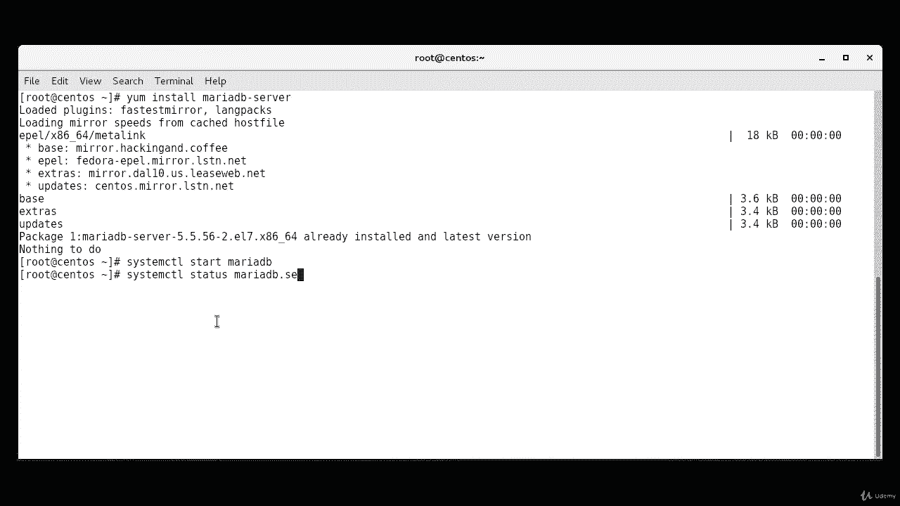
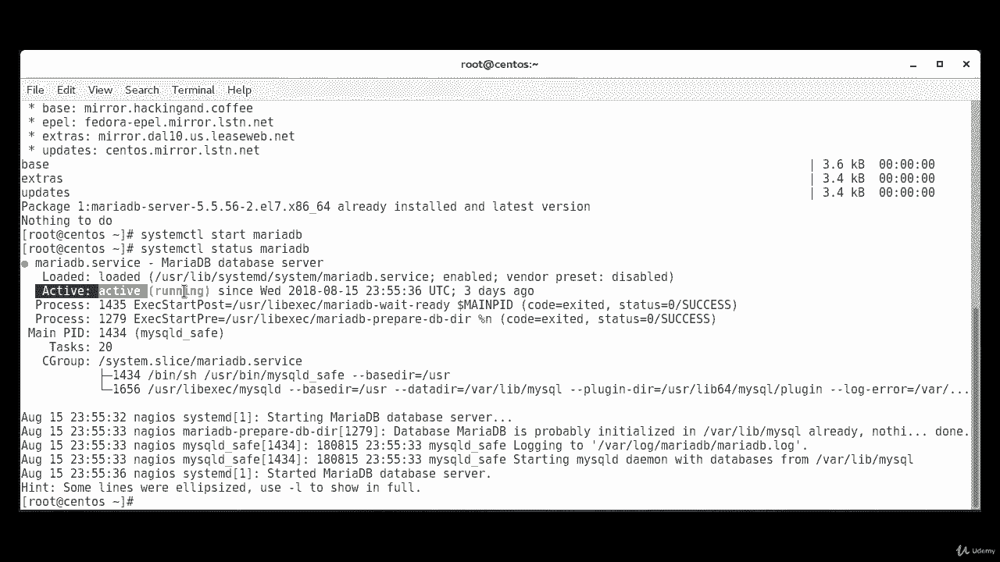
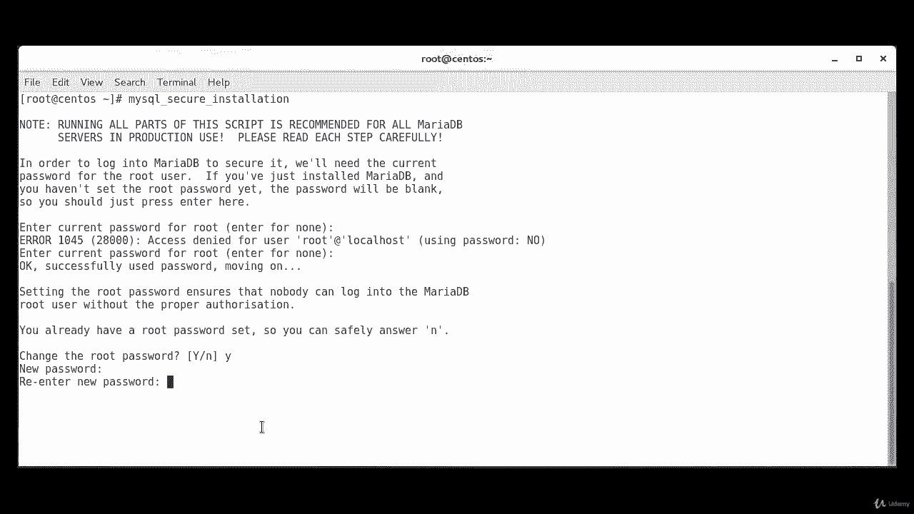
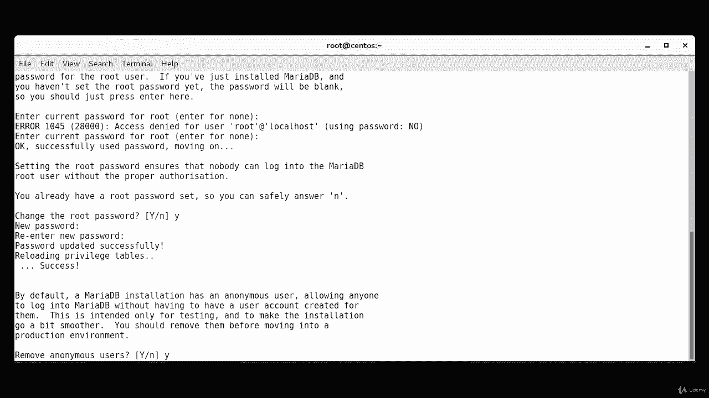
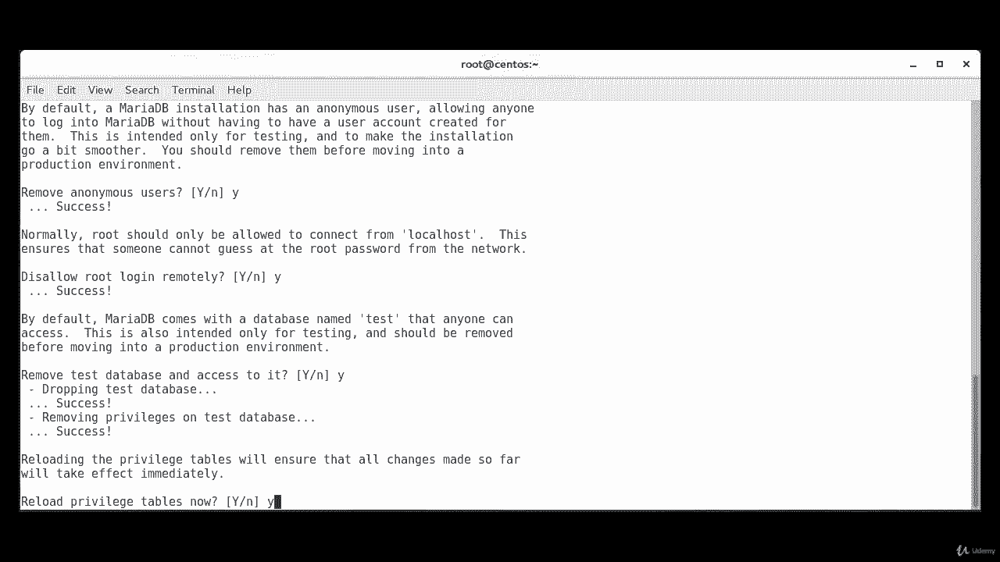
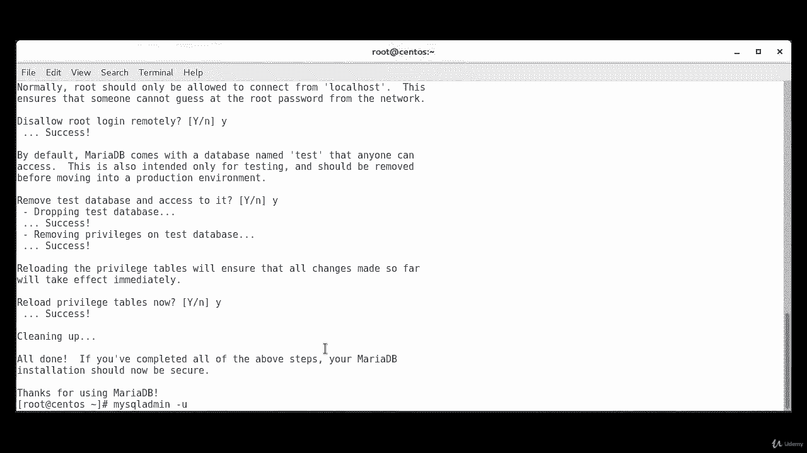
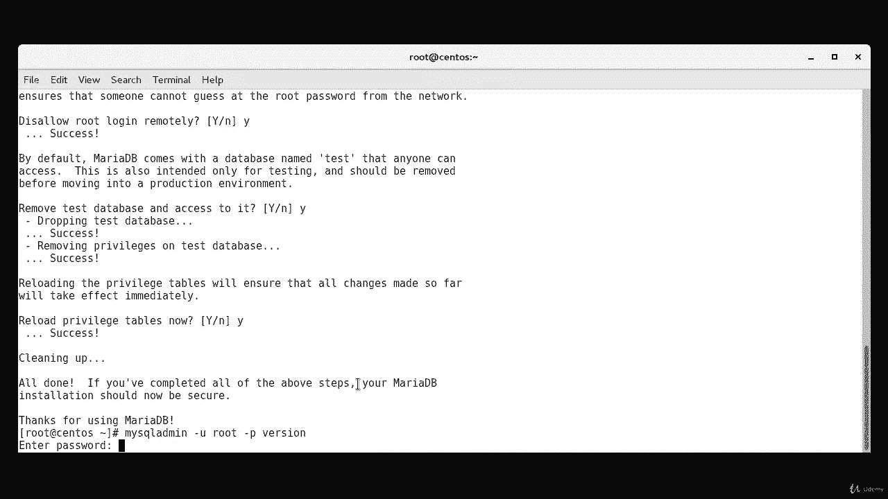
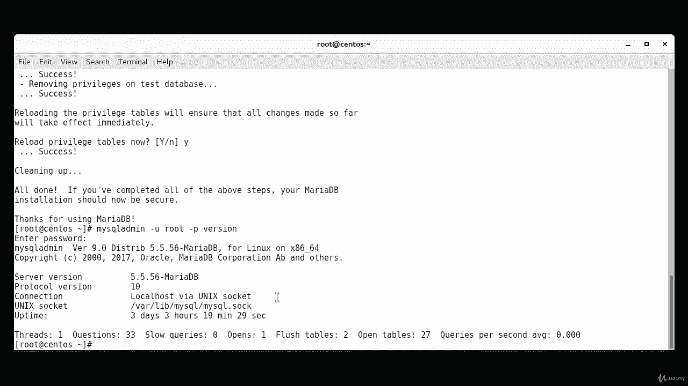
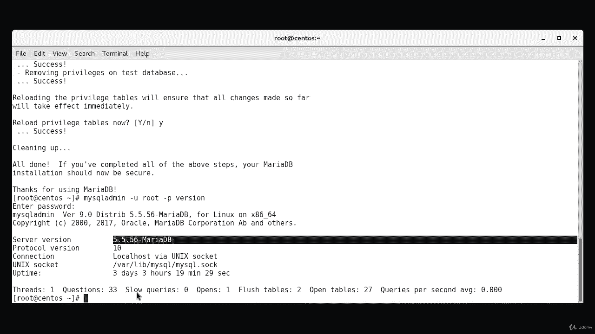

# Red Hat Certified Engineer (RHCE) 课程：P31：MariaDB 安装与验证 🛠️

在本节课中，我们将学习如何在 CentOS 7 系统上安装 MariaDB 数据库服务器，并进行基本的配置与验证。

## 概述

MariaDB 是 MySQL 的一个流行分支，广泛应用于各种服务器环境中。本节教程将引导你完成从安装到安全配置，再到最终验证的完整流程。我们将使用 `yum` 包管理器进行安装，并通过系统服务管理工具 `systemctl` 来控制 MariaDB 服务。

---

## 安装 MariaDB 服务器

首先，我们需要使用 `yum` 包管理器来安装 MariaDB 服务器软件包。



执行以下命令：
```bash
yum install mariadb-server
```
如果软件包尚未安装，系统会提示你确认安装。输入 `y` 并按下回车键即可开始安装过程。

---



## 启动与启用服务

上一节我们完成了 MariaDB 的安装，本节中我们来看看如何启动服务并确保它在系统启动时自动运行。

安装完成后，需要启动 MariaDB 服务。使用 `systemctl` 命令来启动它：
```bash
systemctl start mariadb
```

接下来，检查服务的运行状态以确认它已成功启动：
```bash
systemctl status mariadb
```
如果服务运行正常，你将看到状态显示为 **active (running)**。

为了确保 MariaDB 在每次系统启动时都能自动运行，我们需要启用它：
```bash
systemctl enable mariadb
```
此命令会创建一个符号链接，确保服务在启动时被加载。

---

## 运行安全配置脚本



MariaDB 包含一个安全脚本，用于修改一些默认的不安全设置，例如远程 root 登录和示例用户。





以下是运行安全配置脚本的步骤：
1.  执行命令：
    ```bash
    mysql_secure_installation
    ```
2.  脚本会引导你完成一系列安全设置。通常建议接受所有安全建议，即在每个提示后输入 `y` 或 `yes`。
3.  过程中，你需要为数据库的 `root` 用户设置一个强密码。

---

## 验证安装





在完成了安全配置之后，我们需要验证 MariaDB 是否已正确安装并可以正常工作。



通过以下命令测试连接和版本信息：
```bash
mysqladmin -u root -p version
```
系统会提示你输入在上一步中设置的 root 密码。输入密码后，命令将输出 MariaDB 的版本、连接协议等信息。这证明安装是成功的。

---

## 总结



本节课中我们一起学习了在 CentOS 7 上部署 MariaDB 的完整过程。我们首先使用 `yum` 安装了 `mariadb-server` 软件包，然后使用 `systemctl` 启动并启用了该服务。接着，我们运行了 `mysql_secure_installation` 脚本来加强安装的安全性。最后，我们使用 `mysqladmin` 命令验证了安装结果。现在，你的系统已经拥有了一个基础且安全的 MariaDB 数据库服务器环境。