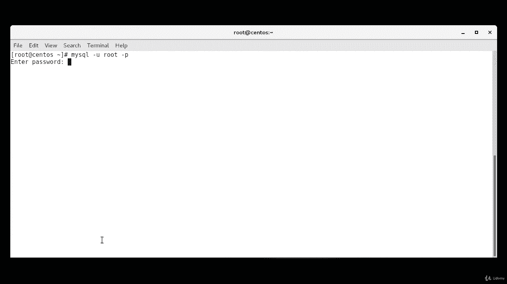
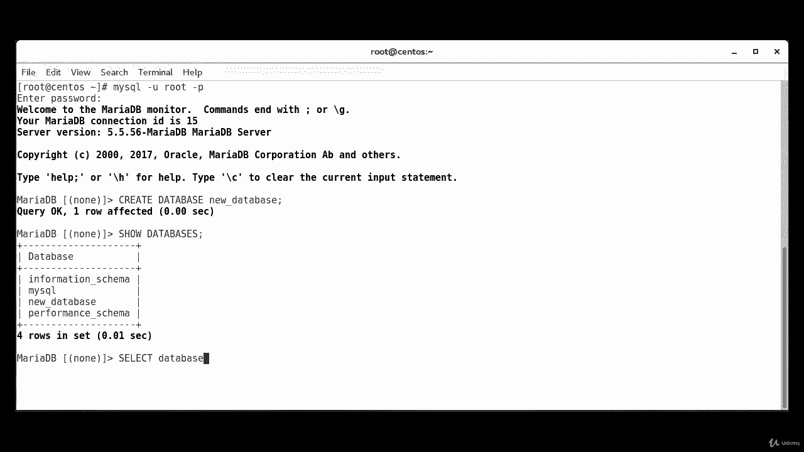
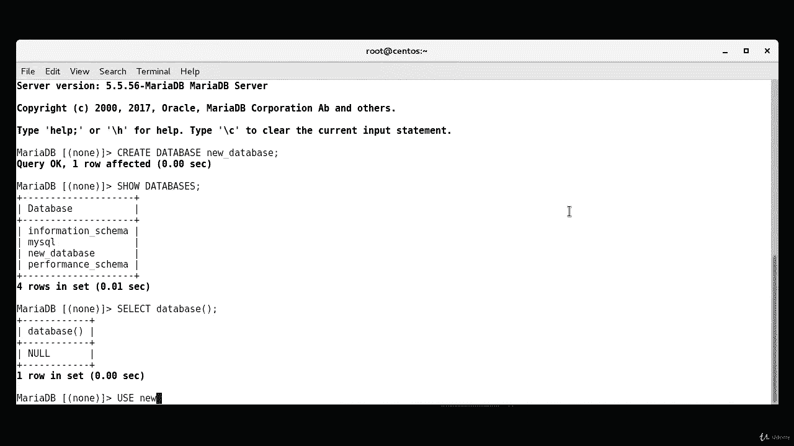
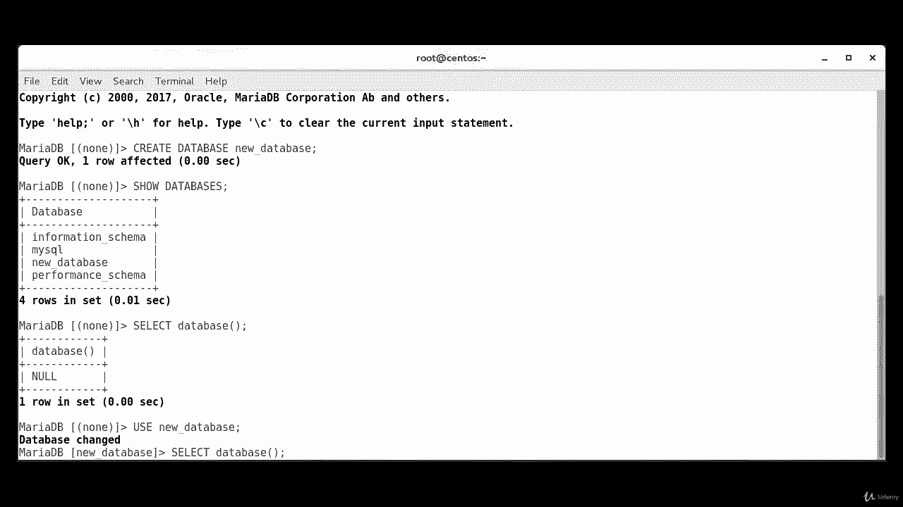
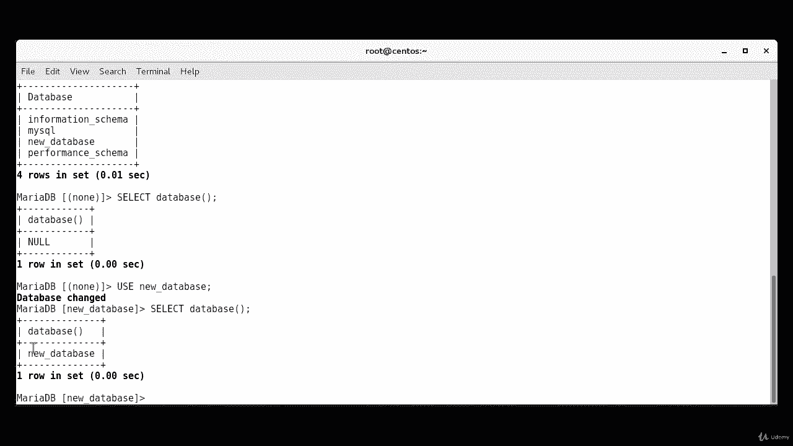
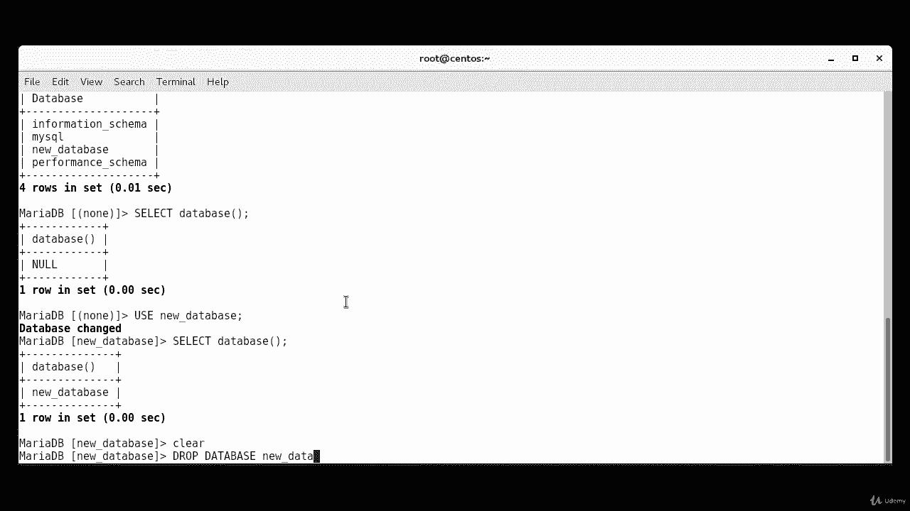
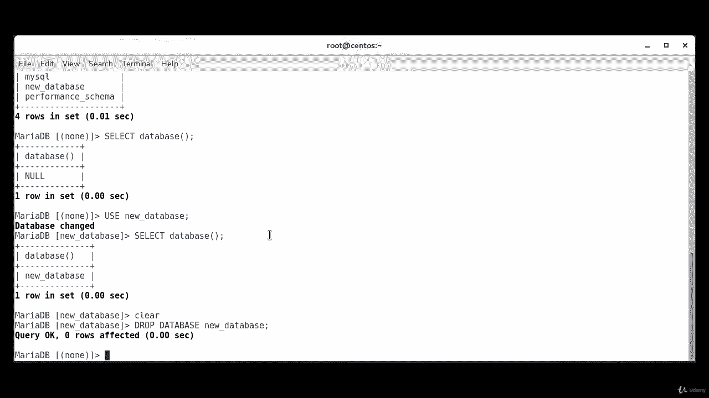

# MariaDB 数据库管理教程：P32：创建与管理数据库 🗄️

在本节课中，我们将学习如何在 MariaDB 中创建和管理数据库。主要内容包括登录数据库、创建新数据库、查看数据库列表、选择当前使用的数据库以及删除数据库。

## 登录 MariaDB

首先，我们需要登录到 MariaDB 数据库。使用以下命令，系统会提示您输入 root 用户的密码。



```bash
mysql -u root -p
```

输入正确密码后，您将成功登录到 MariaDB 数据库系统。

## 创建新数据库

登录成功后，我们可以开始创建数据库。创建数据库的命令是 `CREATE DATABASE`，后面跟上您想为数据库起的名称。

以下是创建名为 `new_database` 的数据库的命令：

```sql
CREATE DATABASE new_database;
```

执行成功后，您将看到 `Query OK, 1 row affected` 的提示，表示数据库已成功创建。

## 查看数据库列表

创建数据库后，您可能想查看系统中已存在的所有数据库。为此，我们使用 `SHOW DATABASES` 命令。



```sql
SHOW DATABASES;
```

执行此命令后，系统会列出所有已配置的数据库名称。

## 选择当前数据库

在 MariaDB 中，如果不明确指定数据库，所有操作将在当前选定的数据库上执行。要查看当前选中的是哪个数据库，可以使用 `SELECT DATABASE()` 命令。



```sql
SELECT DATABASE();
```

如果返回结果是 `NULL`，则表示当前没有选中任何数据库。

为了在后续操作中使用我们刚刚创建的 `new_database`，需要使用 `USE` 命令来选中它。



```sql
USE new_database;
```



执行后，系统会提示 `Database changed`。此时，再次运行 `SELECT DATABASE();` 命令，将显示 `new_database`，确认该数据库已被成功选中。

## 删除数据库

如果需要删除一个数据库，可以使用 `DROP DATABASE` 命令。这是一个不可逆的操作，请务必确认后再执行。



以下是删除 `new_database` 的命令：

```sql
DROP DATABASE new_database;
```

如果删除成功，您将看到 `Query OK, 0 rows affected` 的提示。如果尝试删除一个不存在的数据库，系统会报错提示数据库不存在。

## 总结



本节课中，我们一起学习了 MariaDB 数据库的基本管理操作。我们掌握了如何登录系统、创建新数据库、查看数据库列表、选择当前工作数据库以及安全地删除数据库。这些是进行后续数据表操作和 SQL 查询的重要基础。