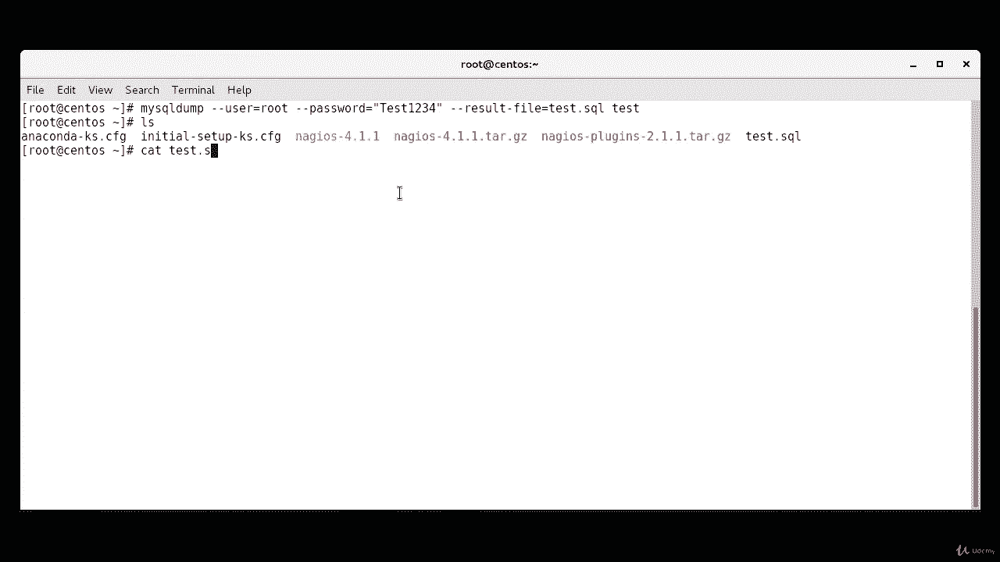
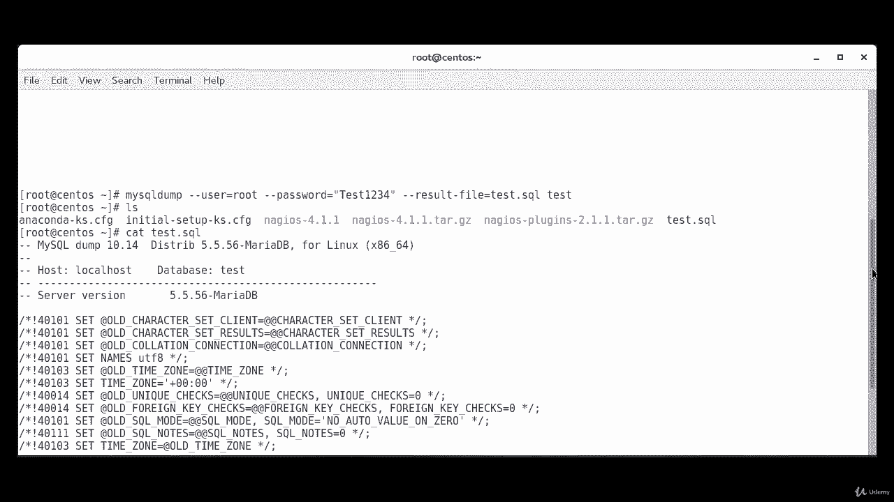
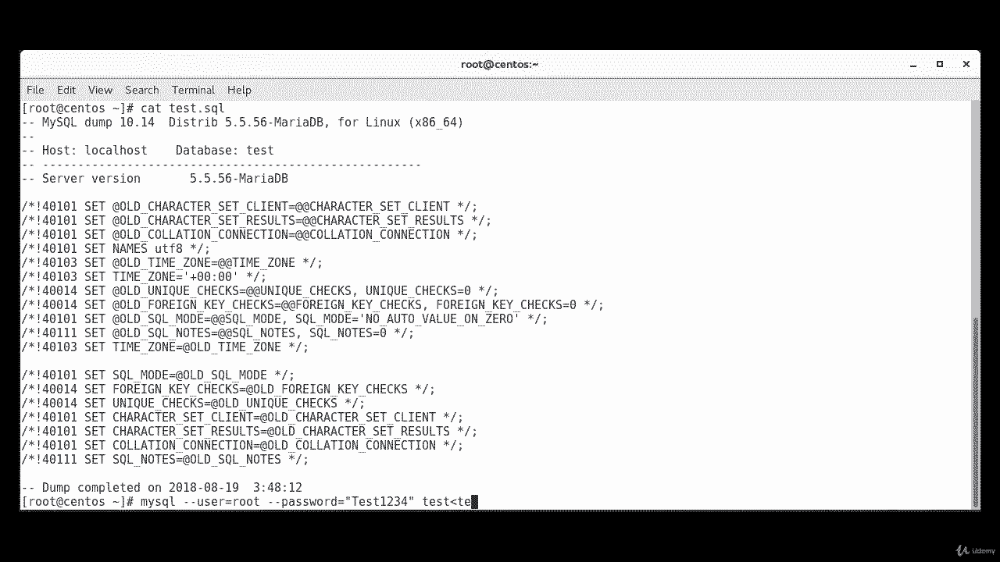
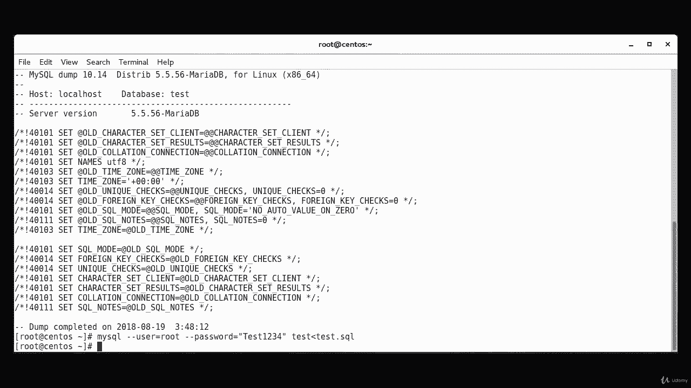

# MariaDB 数据库管理：第7章：备份与恢复 📂

在本节课中，我们将学习如何对 MariaDB 数据库进行备份和恢复操作。这是数据库管理中至关重要的技能，能有效防止数据丢失。

## 概述

我们将首先创建一个测试数据库，然后使用 `mysqldump` 工具对其进行备份，最后练习如何从备份文件中恢复数据库。整个过程将演示基本的数据库维护流程。

## 创建测试数据库

首先，我们需要登录到 MariaDB 并创建一个用于练习的数据库。

1.  使用以下命令以 root 用户身份登录 MariaDB：
    ```bash
    mysql -u root -p
    ```
    输入密码后，您将进入 MariaDB 命令行界面。

2.  在 MariaDB 命令行中，执行以下 SQL 命令来创建名为 `test` 的数据库：
    ```sql
    CREATE DATABASE test;
    ```
    命令执行成功后，系统会提示数据库已创建。

上一节我们创建了测试数据库，本节中我们来看看如何使用 `mysqldump` 命令对其进行备份。

## 备份数据库

`mysqldump` 是一个用于导出 MariaDB 数据库结构和数据的命令行工具。以下是备份 `test` 数据库的步骤。



执行以下命令进行备份。请将 `[your_password]` 替换为您的实际 root 用户密码。
```bash
mysqldump --user=root --password=[your_password] --result-file=test.sql test
```
命令解释：
*   `--user=root`：指定用户名为 root。
*   `--password=[your_password]`：指定对应用户的密码。
*   `--result-file=test.sql`：指定备份输出的文件名为 `test.sql`。
*   最后一个 `test`：指定要备份的数据库名称。



命令执行后，会在当前目录生成一个名为 `test.sql` 的文件。这个文件包含了重建 `test` 数据库所需的所有 SQL 语句。

现在我们已经成功备份了数据库，接下来学习如何从备份文件 `test.sql` 中恢复数据。

## 恢复数据库

恢复数据库是将备份文件中的 SQL 语句重新执行一遍，从而重建数据库和数据。



如果 `test` 数据库在目标服务器上不存在，需要先创建它，因为 `test.sql` 文件通常不包含创建数据库的语句。但在我们的例子中，由于是恢复到原服务器，可以跳过此步。

使用以下命令将备份文件 `test.sql` 导入到 MariaDB 中，以恢复 `test` 数据库：
```bash
mysql --user=root --password=[your_password] test < test.sql
```
命令解释：
*   `mysql`：用于执行 SQL 命令的客户端工具。
*   `--user=root --password=[your_password]`：指定登录凭据。
*   `test`：指定要导入数据的数据库名称。
*   `< test.sql`：使用输入重定向，将 `test.sql` 文件的内容作为命令输入。

执行此命令后，`test.sql` 文件中的所有 SQL 命令（如创建表、插入数据等）都会在 `test` 数据库中运行，从而完成数据恢复。

## 总结

本节课中我们一起学习了 MariaDB 数据库的备份与恢复。
1.  我们使用 `CREATE DATABASE test;` 命令创建了一个测试数据库。
2.  我们使用 `mysqldump` 命令将数据库备份到了 `test.sql` 文件中。
3.  我们使用 `mysql ... < test.sql` 命令成功地从备份文件恢复了数据库。



掌握这些基本操作是确保数据安全的第一步。