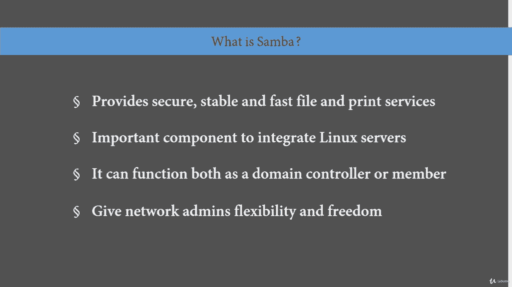
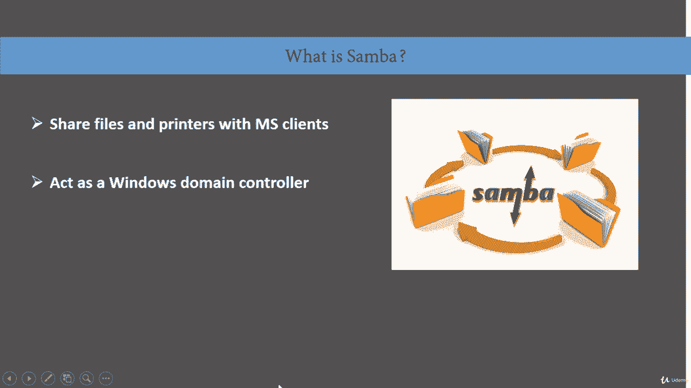
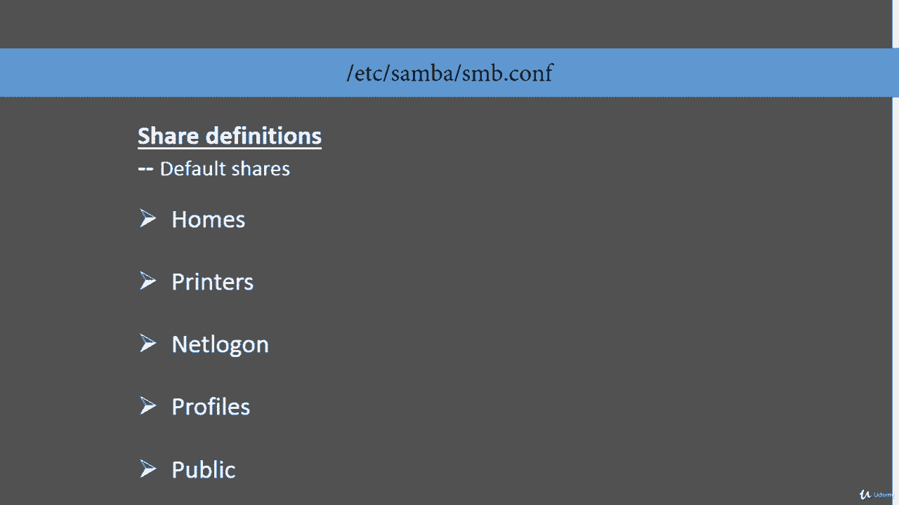

# RHCE课程：P34：Samba文件共享——1. 引言 🖥️

在本节课中，我们将要学习Samba的基础知识。Samba是Linux和Unix系统中实现与Windows系统互操作性的标准程序套件。它使用SMB或CIFS协议，为所有客户端（如各种版本的DOS、Windows、OS/2、Linux等）提供安全、稳定且快速的文件和打印服务。Samba是将Linux/Unix服务器和桌面无缝集成到Active Directory环境中的重要组件，既可以作为域控制器，也可以作为常规的域成员。该软件包为网络管理员在设置、配置以及系统和设备选择方面提供了灵活性和自由度。正因如此，Samba非常流行，应用十分广泛。

## Samba是什么及其用途 📁

上一节我们介绍了Samba的基本概念，本节中我们来看看它的具体用途。

Samba主要用于共享文件和打印机。在一个典型设置中，通常会有一台运行在某种Linux发行版上的Samba服务器，以及多个不同的Windows客户端（如Windows 7、8、10）。打印机也可以连接到同一设置中。这就是Samba的典型用途。它也可以充当Windows域控制器，但这并非必需，它同样可以作为Windows域成员。

## 核心配置文件 📄

了解了Samba的用途后，接下来我们关注其核心配置文件。在Samba配置中，主要有两个文件需要我们处理。

以下是两个主要的配置文件：
*   **`smb.conf`**：此文件通常位于 `/etc/samba/` 目录下，是默认的配置文件。我们需要编辑此文件来配置Samba的整个设置。
*   **`smbpasswd` 文件**：此文件用于同步Samba密码与Linux系统密码，其配置是间接完成的。

## Samba配置文件结构 🏗️

现在，让我们深入了解 `smb.conf` 文件的结构。这个文件是我们需要物理编辑的配置文件，它包含两个主要部分。

### 全局选项

全局选项定义了服务器的整体行为。以下是其主要组成部分：

*   **网络选项**：在此部分设置工作组、主机名和网络接口。
*   **日志选项**：在此部分配置日志文件的大小、轮转策略以及日志服务器的位置（本地或远程）。
*   **独立服务器选项**：此部分用于配置身份验证方式。
*   **域成员选项**：此部分包含此共享上用户的信息，是存储用户信息的后端。
*   **域控制器选项**：此部分是物理存储用户信息的地方，域控制器将包含域成员选项。
*   **浏览器控制选项**：此部分提供网络的可视化视图。这里的“浏览器”指的是网络浏览器，而非互联网浏览器。
*   **名称解析**：此部分是Samba中的NetBIOS配置。
*   **打印选项**：此部分处理驱动程序、打印队列以及安装的打印机数量。
*   **文件系统选项**：Samba提供扩展的文件系统选项，如需使用文件系统，则在此部分配置。

### 共享定义

共享定义是 `smb.conf` 文件的下半部分，用于定义具体的共享资源。以下是常见的共享定义：

*   **`[homes]`**：此部分用于共享用户的家目录。
*   **`[printers]`**：此部分用于定义打印机、打印机驱动程序及所有与打印机相关的信息。
*   **`[netlogon]`**：此部分用于配置网络登录，例如在设置漫游配置文件时，可以在此配置一个可在整个网络中使用的模板配置文件。
*   **`[public]`**：如果存在只读文件系统需要共享，可以在此部分进行分配。

## 总结 📝

本节课中我们一起学习了Samba的基础知识。我们了解到Samba是一个用于Linux/Unix与Windows互操作的重要套件，主要用于文件和打印机共享。我们重点介绍了其核心配置文件 `smb.conf` 的结构，它分为**全局选项**和**共享定义**两大部分。全局选项负责服务器的整体设置，如网络、日志和认证；而共享定义则用于声明具体的共享资源，如用户家目录和打印机。理解这些基本概念是后续进行Samba服务器配置和管理的第一步。