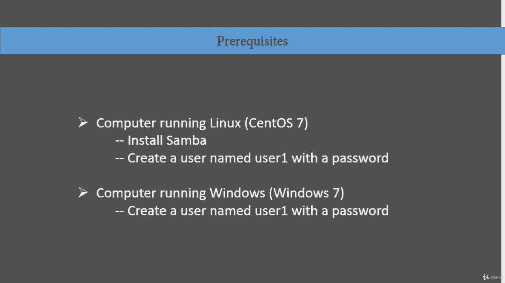
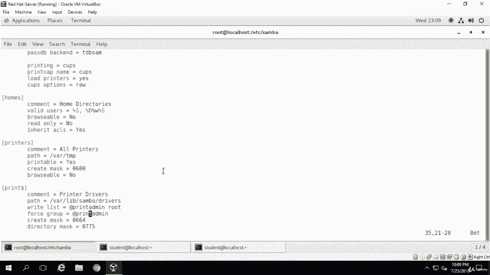

# Linux网络服务：8.2：Samba文件共享配置（第一部分）

在本节课中，我们将开始实际配置Samba服务器，使其能够共享文件。我们将学习配置Samba的三个核心步骤，并了解配置前的准备工作。

上一节我们介绍了Samba的基本概念和配置文件结构，本节中我们来看看如何具体修改配置并启动服务。

配置Samba服务器以开始共享文件，仅需三个步骤：
1.  修改 `/etc/samba/smb.conf` 配置文件。
2.  重启名为 `smb` 的服务进程。
3.  创建SMB用户。

以下是开始配置前需要满足的一些前提条件。如果你像我一样使用虚拟环境（例如VirtualBox或VMware Workstation），请确保：
*   创建一台运行Linux的虚拟机（本例使用CentOS 7，也可使用Ubuntu或其他发行版）。
*   在Linux虚拟机上安装Samba软件包（默认可能未安装）。
*   在Linux上创建一个系统用户（本例将创建用户 `user1` 并设置密码）。
*   准备第二台作为客户端的Windows虚拟机（本例使用Windows 7，其他版本如Windows 8或XP亦可，仅用于测试Samba共享功能）。
*   在Windows上创建相同的用户名 `user1` 并设置密码。

---

现在，我已登录到我的CentOS虚拟机。第一步是安装Samba软件包。使用以下命令：

```bash
yum install samba
```

在我的系统中，Samba已经安装，因此命令会提示软件包已存在。在你的系统中，可能需要执行安装过程。安装完成后，我将清屏以便操作。



Samba的主配置目录是 `/etc/samba/`。现在列出该目录内容：

```bash
ls /etc/samba/
```

我们将要编辑的核心配置文件是 `smb.conf`。在编辑任何配置文件前，尤其是生产服务器上的文件，备份原始文件是一个好习惯。执行以下命令进行备份：

```bash
cp /etc/samba/smb.conf /etc/samba/smb.conf.old
```

现在，我们有了一个名为 `smb.conf.old` 的备份文件，我们将只操作原始的 `smb.conf` 文件。

接下来，使用 `vi` 编辑器打开配置文件：

```bash
vi /etc/samba/smb.conf
```

首先查看 `[global]` 全局设置部分。默认的工作组名为 `WORKGROUP`，我们可以将其修改为其他名称，例如 `LINUXGROUP`。

```ini
workgroup = LINUXGROUP
```

其余全局设置暂时保持默认。接着，查看 `[homes]` 部分，它控制用户家目录的共享。我们同样保持其默认设置。其中 `browseable` 参数决定共享是否在网络上可见，我们选择不可见。`printers` 部分用于设置打印机共享，你可以在此列出所有打印机名称。`printer drivers` 则用于指定打印机驱动程序的路径。

---



本节课中我们一起学习了配置Samba服务器的初始步骤，包括安装软件、备份配置文件以及初步修改全局设置。下一节，我们将继续深入配置具体的共享目录并设置用户权限。