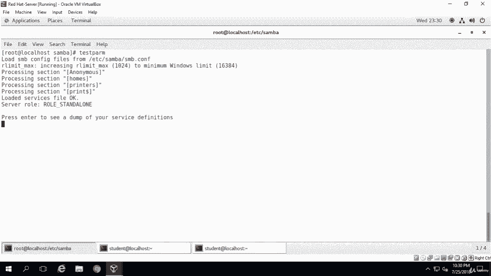

# Red Hat Certified Engineer (RHCE) 课程：P36：8. Samba 文件共享---3. 配置（第二部分）


## 概述
在本节课程中，我们将继续 Samba 服务的配置。我们将安装必要的软件包，配置防火墙，并创建一个允许匿名访问的 Samba 共享目录。通过本课，你将学会如何设置一个基础的、无需身份验证的文件共享服务。

---

## 安装 Samba 客户端与公共包
上一节我们介绍了 Samba 服务的基本安装。本节中，我们来看看还需要安装哪些额外的软件包。

Samba 服务已安装在这台机器上，但还需要安装 Samba 客户端和 Samba 公共包。以下是安装命令：

```bash
yum install samba-client samba-common
```

执行命令后，系统会提示确认安装 Samba 客户端，选择“是”即可。安装完成后，清理屏幕。

---

## 配置防火墙允许 Samba 服务
与 CentOS 7 上的其他服务一样，安装 Samba 后，必须允许其服务通过系统防火墙。

我们需要使用 `firewall-cmd` 命令添加永久规则。执行以下命令：

```bash
firewall-cmd --permanent --zone=public --add-service=samba
```

命令执行成功，表示防火墙规则已添加。

---

## 创建匿名共享目录
接下来，我们将配置一个匿名文件共享。为此，首先需要创建共享目录。

1.  创建目录：
    ```bash
    mkdir -p /srv/samba/anonymous
    ```
2.  修改目录权限：
    ```bash
    chmod -R 0755 /srv/samba/anonymous
    ```
3.  更改目录所有权：
    ```bash
    chown -R nobody:nobody /srv/samba/anonymous
    ```

---

## 设置 SELinux 安全上下文
我们需要为 Samba 共享目录更改 SELinux 安全上下文。使用 `chcon` 命令：

```bash
chcon -t samba_share_t /srv/samba/anonymous
```

此命令将目录的 SELinux 类型设置为 `samba_share_t`，允许 Samba 进程访问。

---

## 编辑 Samba 主配置文件
现在，我们可以打开 Samba 的主配置文件进行编辑，以添加我们的匿名共享配置。

使用 `vim` 编辑配置文件：
```bash
vim /etc/samba/smb.conf
```

在 `[global]` 部分，进行以下修改：
1.  将 `workgroup` 的值修改为 `WORKGROUP`。
2.  添加一行：`netbios name = centos`。
3.  保持 `security = user` 不变。

接下来，在文件末尾添加一个新的共享定义节。以下是该节的内容：

```
[anonymous]
    comment = Anonymous File Server Share
    path = /srv/samba/anonymous
    browsable = yes
    writable = yes
    guest ok = yes
    read only = no
    force user = nobody
```

配置说明：
*   `[anonymous]`：共享节的名称。
*   `comment`：共享的描述信息。
*   `path`：共享目录在服务器上的绝对路径。
*   `browsable`：是否允许客户端浏览此共享。
*   `writable`：共享是否可写。
*   `guest ok`：是否允许来宾（匿名）访问。
*   `read only`：是否只读，这里设为 `no` 表示可写。
*   `force user`：所有访问此共享的文件操作都强制使用 `nobody` 用户身份。

编辑完成后，可以删除配置文件中与打印机相关的示例节（如 `[printers]`），因为它们在本例中不需要。保存并退出编辑器。

---

## 测试配置文件
保存并退出配置文件后，需要测试配置文件的语法是否正确。使用 `testparm` 命令：

```bash
testparm
```

如果一切正常，命令输出将显示“Loaded services file OK.”，并且服务器角色为 `server role: ROLE_STANDALONE`。这表明配置文件没有语法错误。

---



## 总结
本节课中，我们一起学习了 Samba 服务配置的后续步骤。我们安装了必要的客户端和公共包，配置了防火墙规则，创建并设置了匿名共享目录的权限与 SELinux 上下文，最后编辑了 Samba 主配置文件并定义了匿名共享。通过 `testparm` 命令，我们验证了配置的正确性。现在，一个基础的匿名 Samba 文件共享服务已经配置完成。