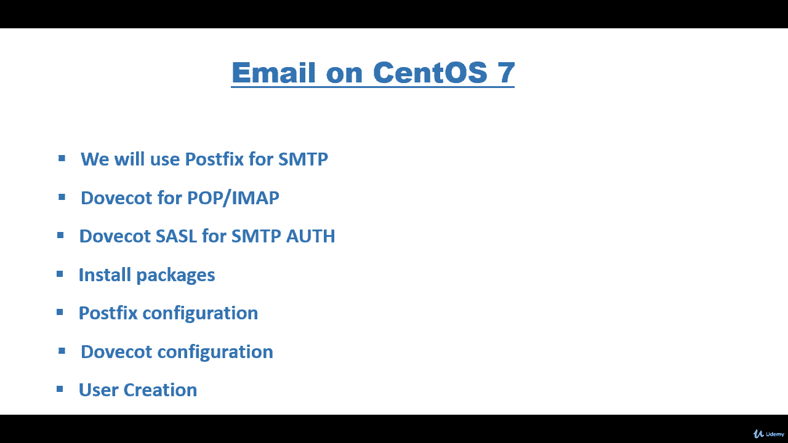
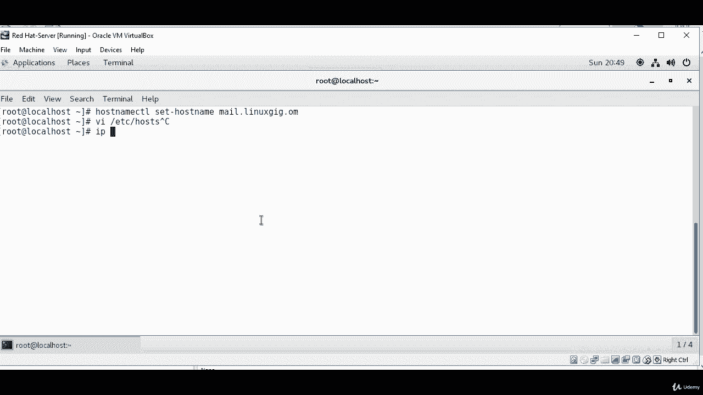
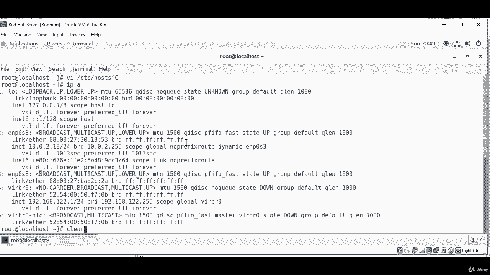
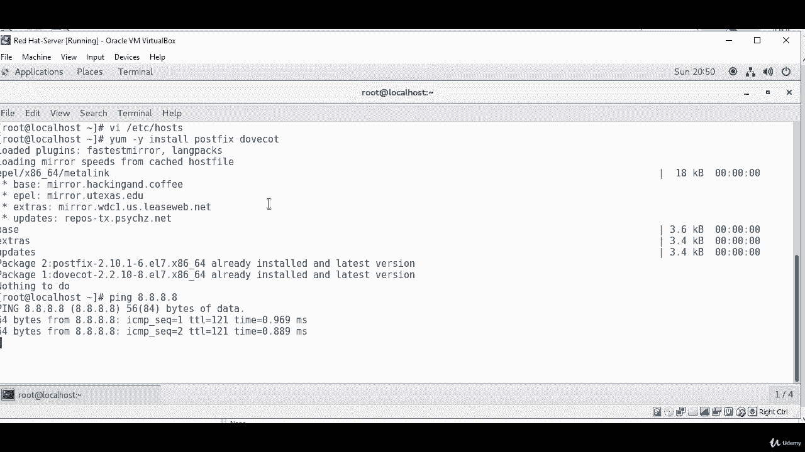
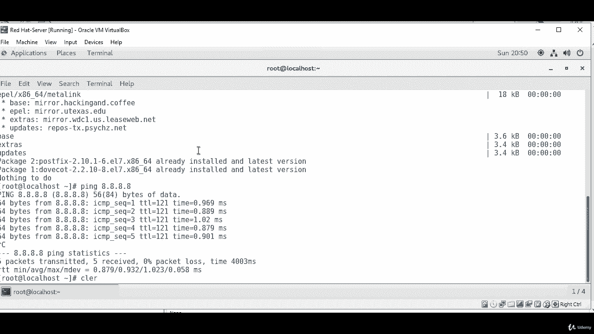

# 邮件服务器搭建教程：P37：安装与配置Postfix和Dovecot 📧

在本节课中，我们将学习如何在CentOS 7服务器上安装和配置一个基础的邮件服务器。我们将使用Postfix来处理SMTP流量，使用Dovecot来处理POP3/IMAP协议，并配置SASL进行SMTP认证。整个流程分为安装软件包、配置Postfix、配置Dovecot以及创建测试用户四个主要步骤。

---

## 第一步：准备服务器环境 🛠️

首先，我们需要登录到CentOS 7服务器并进行一些基础配置。这包括切换到超级用户权限、设置主机名以及配置静态主机名解析。

1.  **登录并切换用户**：使用`su`命令切换到`root`用户，因为后续安装需要管理员权限。
    ```bash
    su
    ```

2.  **设置主机名**：将服务器的主机名设置为一个完整的域名，例如`mail.linux.gig.com`。这有助于邮件服务的正确识别。
    ```bash
    hostnamectl set-hostname mail.linux.gig.com
    ```

3.  **配置主机名解析**：编辑`/etc/hosts`文件，将服务器的静态IP地址与上一步设置的主机名进行绑定。请确保你使用的是服务器的静态IP地址。
    ```bash
    vi /etc/hosts
    ```
    在文件中添加一行，格式为：`[你的服务器IP地址] [你的主机名]`。例如：
    ```
    10.0.2.13 mail.linux.gig.com
    ```

---



## 第二步：安装必要软件包 📦

上一节我们完成了服务器的基础环境设置，本节中我们来看看如何安装邮件服务器所需的核心软件。

以下是需要安装的软件包列表，我们将使用Yum包管理器进行安装：
*   **Postfix**： 用于处理SMTP协议，负责邮件的发送和接收（MTA）。
*   **Dovecot**： 用于处理POP3和IMAP协议，允许邮件客户端从服务器收取邮件。

使用以下命令进行安装。请确保服务器可以正常连接互联网。
```bash
yum -y install postfix dovecot
```
如果软件包已经安装，系统会提示已安装；如果未安装，Yum会自动下载并安装它们。你可以通过`ping`命令测试网络连通性。

---

## 第三步：配置Postfix (SMTP服务) ⚙️

软件安装完成后，接下来我们需要对Postfix进行配置，使其能够作为我们的SMTP服务器运行。

1.  **主配置文件**：Postfix的主要配置文件是`/etc/postfix/main.cf`。我们需要修改其中的几个关键参数。
    ```bash
    vi /etc/postfix/main.cf
    ```

2.  **关键配置项**：找到并修改以下行。如果某些行被注释（以`#`开头），需要取消注释并进行修改。
    *   设置邮件服务器的主机名：
        ```
        myhostname = mail.linux.gig.com
        ```
    *   设置Postfix可接收的邮件域名（修改为你自己的域名）：
        ```
        mydomain = linux.gig.com
        ```
    *   设置发件人地址的域名：
        ```
        myorigin = $mydomain
        ```
    *   指定服务器监听的网络接口（`all`表示监听所有IPv4接口）：
        ```
        inet_interfaces = all
        ```
    *   设置可接收邮件的网络或域名（这里设置为整个域名）：
        ```
        mydestination = $myhostname, localhost.$mydomain, localhost, $mydomain
        ```
    *   设置可信任的网络，允许这些网络内的机器通过本服务器转发邮件（根据你的网络环境设置，例如`10.0.2.0/24`）：
        ```
        mynetworks = 10.0.2.0/24, 127.0.0.0/8
        ```
    *   启用家目录邮箱格式（与Dovecot配合使用）：
        ```
        home_mailbox = Maildir/
        ```

3.  **保存并启动服务**：修改完成后，保存并退出编辑器。然后启动Postfix服务，并设置为开机自启。
    ```bash
    systemctl start postfix
    systemctl enable postfix
    ```

---



## 第四步：配置Dovecot (POP3/IMAP服务) 🔐

Postfix负责邮件的传输，而用户需要通过POP3或IMAP协议来收取邮件。本节我们将配置Dovecot来提供这项服务。

1.  **主配置文件**：Dovecot的配置主要集中在`/etc/dovecot/dovecot.conf`和`/etc/dovecot/conf.d/10-mail.conf`中。
    ```bash
    vi /etc/dovecot/dovecot.conf
    ```
    确保以下协议被启用：
    ```
    protocols = imap pop3 lmtp
    ```



2.  **配置邮箱位置**：编辑邮件存储位置的配置文件，使其与Postfix的配置匹配。
    ```bash
    vi /etc/dovecot/conf.d/10-mail.conf
    ```
    找到`mail_location`选项，将其修改为：
    ```
    mail_location = maildir:~/Maildir
    ```
    这表示邮件将存储在每个用户家目录下的`Maildir`文件夹中。

3.  **启用明文认证（用于测试）**：在测试环境中，我们可以暂时启用明文认证。编辑认证配置文件。
    ```bash
    vi /etc/dovecot/conf.d/10-auth.conf
    ```
    找到并修改以下行：
    ```
    disable_plaintext_auth = no
    auth_mechanisms = plain login
    ```

4.  **保存并启动服务**：配置完成后，启动Dovecot服务并设置为开机自启。
    ```bash
    systemctl start dovecot
    systemctl enable dovecot
    ```

---

## 第五步：创建测试用户并验证 👤

服务配置好后，我们需要一个系统用户来测试邮件的发送和接收。

1.  **创建用户**：使用`useradd`命令创建一个新用户，例如`user1`，并为其设置密码。
    ```bash
    useradd user1
    passwd user1
    ```
    根据提示输入并确认密码。

2.  **测试SMTP连接（可选）**：你可以使用`telnet`命令测试25端口，验证Postfix服务是否在监听。
    ```bash
    telnet localhost 25
    ```
    看到`220`开头的欢迎信息即表示服务正常。

3.  **配置邮件客户端**：最后，你可以在Outlook、Thunderbird等邮件客户端中添加账户进行测试。
    *   **邮件地址**：`user1@linux.gig.com`
    *   **接收服务器（IMAP/POP3）**：`mail.linux.gig.com`
    *   **发送服务器（SMTP）**：`mail.linux.gig.com`
    *   **用户名**：`user1`
    *   **密码**：你为`user1`设置的密码



---

## 总结 📝



本节课中我们一起学习了在CentOS 7上搭建基础邮件服务器的完整流程。我们首先准备了服务器环境并设置了主机名，然后安装了Postfix和Dovecot软件包。接着，我们逐步配置了Postfix作为SMTP服务器处理邮件传输，并配置了Dovecot作为IMAP/POP3服务器处理邮件收取。最后，我们创建了测试用户并概述了如何在邮件客户端中进行配置验证。通过以上步骤，你已经成功部署了一个可用的邮件服务器基础环境。