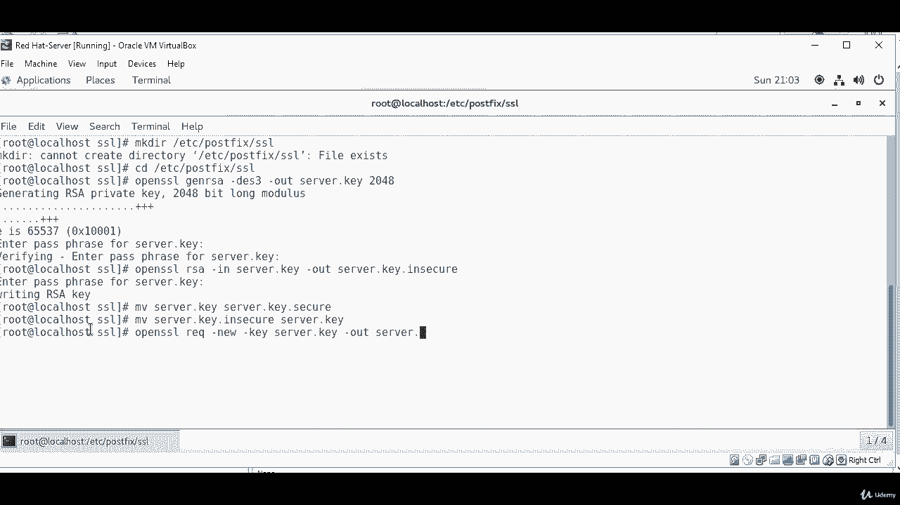
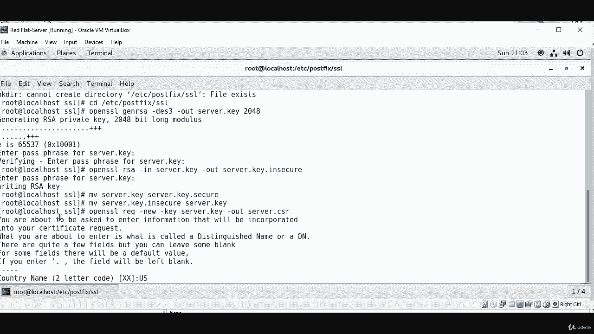
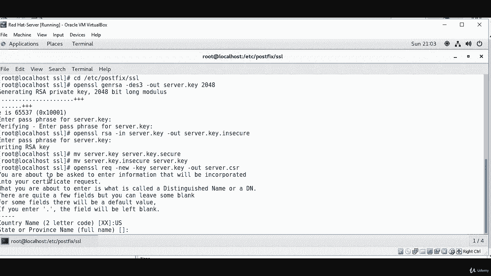
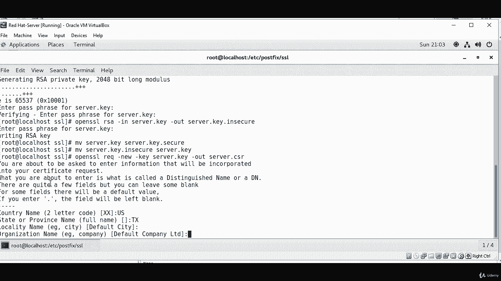
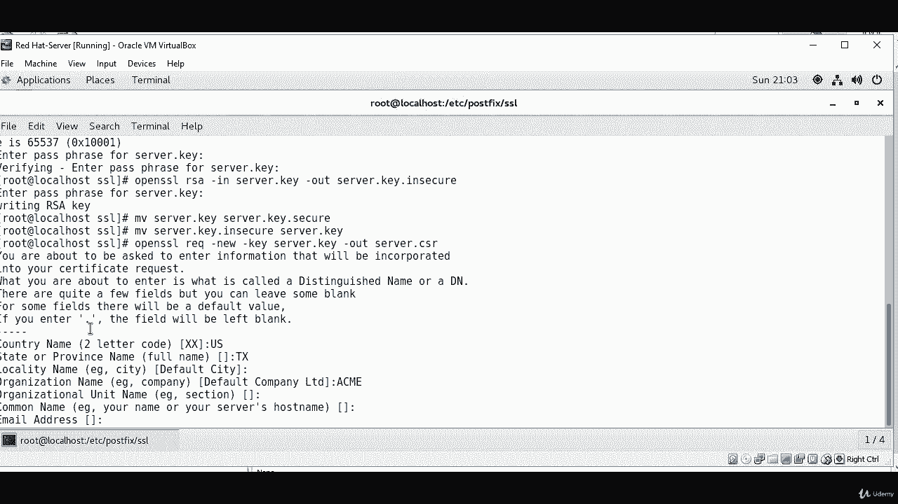
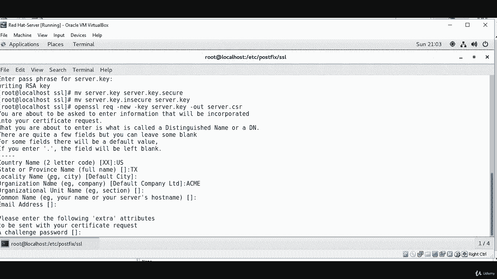
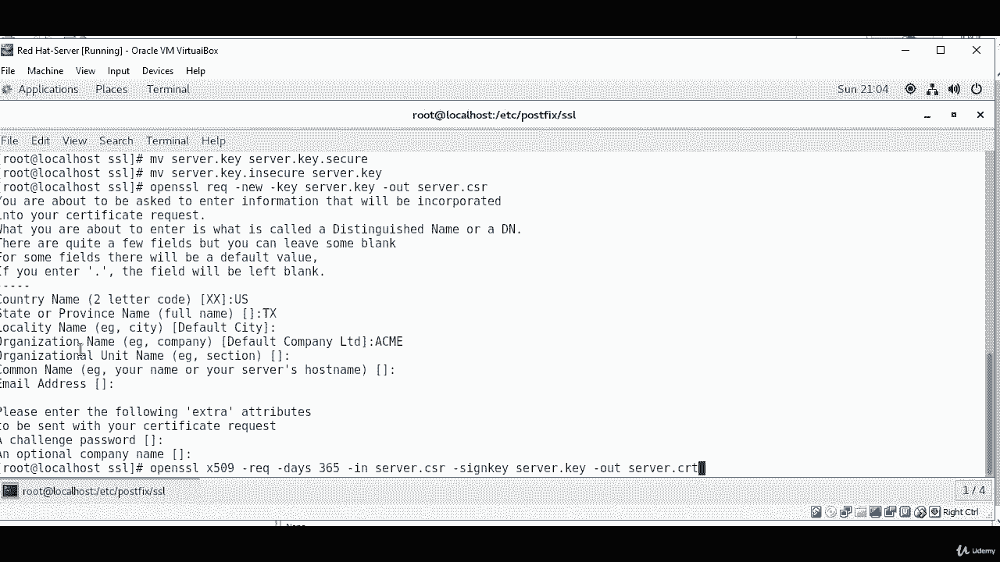

# Red Hat Certified Engineer (RHCE) 课程：P38：9. 邮件服务器--2. SSL证书 🔐

在本节课中，我们将学习如何为邮件服务器创建SSL证书，以实现通信加密。我们将逐步完成生成私钥、创建证书签名请求（CSR）以及最终生成自签名证书的过程。

---

## 创建SSL证书目录

首先，需要为Postfix邮件服务器创建一个存放SSL证书的目录。我已经提前创建好了这个目录。

以下是创建目录的命令：
```bash
mkdir /etc/postfix/ssl
```

创建完成后，进入该目录：
```bash
cd /etc/postfix/ssl
```

---

## 生成私钥

上一节我们介绍了准备工作，本节中我们来看看如何生成加密所需的私钥。

我们将使用`openssl`命令生成一个2048位的RSA私钥。

运行以下命令：
```bash
openssl genrsa -des3 -out server.key 2048
```

执行此命令后，系统会提示您设置一个密码短语（passphrase）来保护私钥。请务必记住这个密码。

---

## 移除私钥的密码保护

为了在服务启动时无需手动输入密码，我们需要移除私钥的密码保护。这通过创建一个不加密的私钥副本来实现。

运行以下命令：
```bash
openssl rsa -in server.key -out server.key.insecure
```

此命令会生成一个名为`server.key.insecure`的无密码私钥文件。

---

## 重命名私钥文件



接下来，我们需要对私钥文件进行重命名，以区分有密码保护和无密码保护的版本。

以下是重命名步骤：
1.  将有密码保护的原始私钥重命名为`server.key.secure`。
2.  将无密码保护的私钥重命名为`server.key`，供服务器使用。



具体命令如下：
```bash
mv server.key server.key.secure
mv server.key.insecure server.key
```

---

## 创建证书签名请求（CSR）



现在，我们需要使用私钥创建一个证书签名请求（CSR）。CSR包含了申请证书所需的信息。

运行以下命令：
```bash
openssl req -new -key server.key -out server.csr
```



执行命令后，会提示您输入一些信息。以下是填写示例：
*   **Country Name (2 letter code)**： 国家代码（如US）。
*   **State or Province Name (full name)**： 州或省名称（如Texas）。
*   **Locality Name (eg, city)**： 城市名称（可留空）。
*   **Organization Name (eg, company)**： 组织名称（如ame）。
*   **Organizational Unit Name (eg, section)**： 部门名称（可留空）。
*   **Common Name (eg, your name or your server's hostname)**： 服务器的主机名或域名（**非常重要**，应填写邮件服务器的FQDN）。
*   **Email Address**： 邮箱地址（可留空）。
*   **A challenge password**： 挑战密码（可留空）。
*   **An optional company name**： 可选的公司名（可留空）。

请根据您的实际情况填写，其中`Common Name`必须正确。



---



## 生成自签名证书

最后，我们将使用私钥和CSR来生成一个有效期为365天的自签名X.509证书。

运行以下命令：
```bash
openssl x509 -req -days 365 -in server.csr -signkey server.key -out server.crt
```

此命令会生成最终的证书文件`server.crt`。

---

## 总结



本节课中我们一起学习了为Postfix邮件服务器配置SSL/TLS加密的全过程。我们逐步完成了从创建目录、生成并处理私钥、创建证书签名请求（CSR），到最后生成自签名证书（CRT）的所有步骤。现在，您已经拥有了`server.key`（私钥）和`server.crt`（证书）文件，可以在后续配置中启用邮件服务的加密通信了。