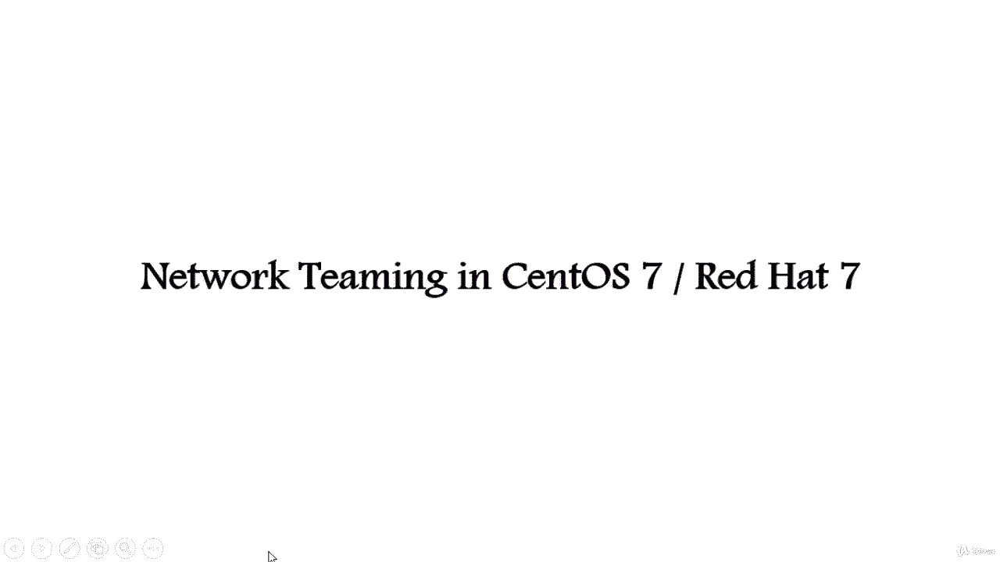
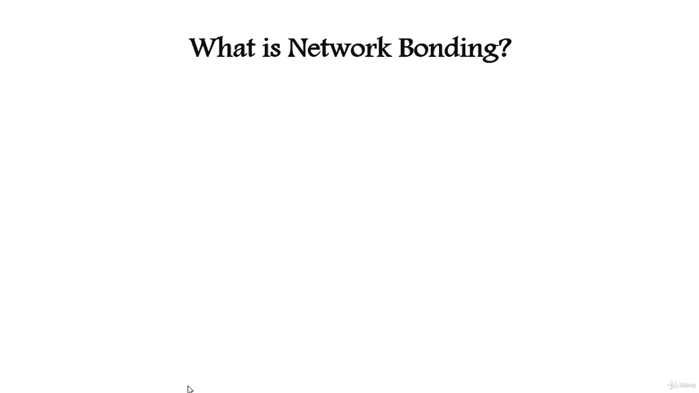
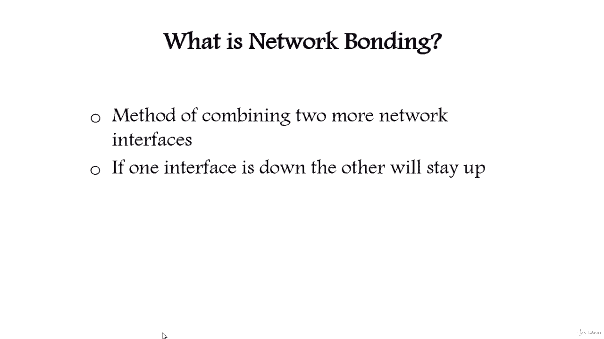
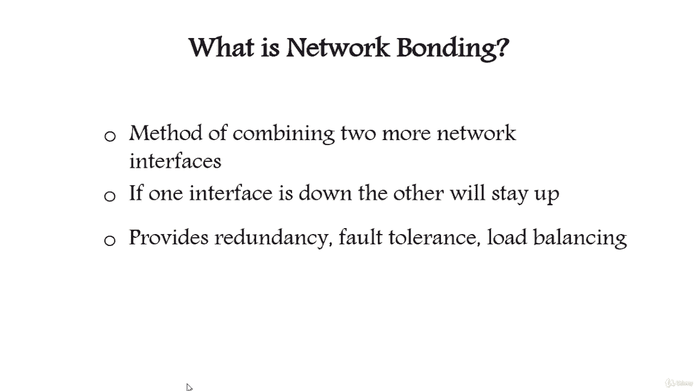
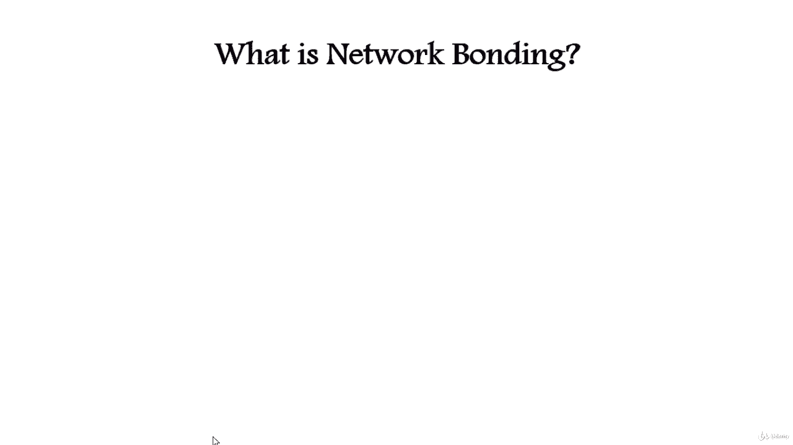
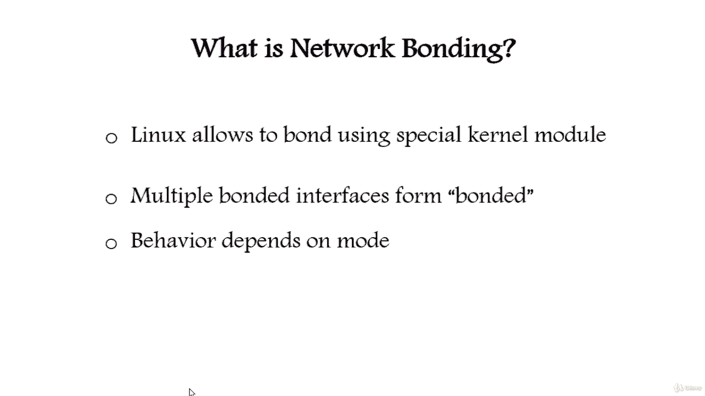

# Red Hat Certified Engineer (RHCE) 课程：P3：2. 网络接口组合（Bonding）👨‍💻

在本节课中，我们将要学习在 CentOS 7 和 RHEL 7 系统中配置网络接口组合（Bonding）的基础知识。网络组合是一种将多个物理网络接口聚合为单一逻辑接口的技术，旨在提升网络性能和可靠性。

## 什么是网络接口组合？🔗

网络接口组合是一种将两个或更多网络接口合并为一个单一接口的方法。

这种方法能增加网络吞吐带宽并提供冗余性。如果一个接口断开或故障，其他接口将维持网络流量畅通。网络组合适用于需要冗余、容错或负载均衡的网络环境。

## Linux 中的网络组合实现 🐧

Linux 系统允许我们使用一个名为 `bonding` 的特殊内核模块，将多个网络接口绑定成单一接口。

Linux 的 bonding 驱动提供了一种将多个网络接口组合成一个逻辑绑定接口的方法。绑定接口的行为取决于所选的模式。通常，这些模式提供热备份或负载均衡服务。

---

本节课中我们一起学习了网络接口组合（Bonding）的基本概念及其在 Linux 系统中的实现原理。我们了解到，通过 bonding 技术，可以有效地提升网络的带宽和可靠性。