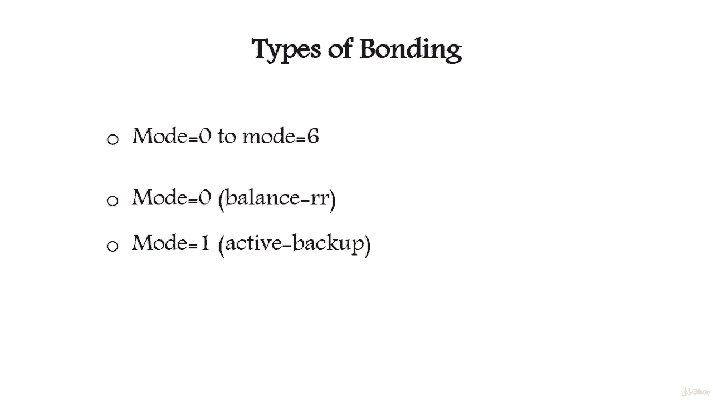

# 网络接口绑定教程：2：网络绑定类型 🔗

在本节课中，我们将要学习网络绑定（Bonding）的七种不同类型。网络绑定是一种将多个物理网络接口组合成一个逻辑接口的技术，旨在提供更高的带宽、负载均衡和故障容错能力。理解每种模式的工作原理和适用场景，对于配置高效可靠的网络至关重要。

上一节我们介绍了网络绑定的基本概念，本节中我们来看看具体的绑定类型。网络绑定模式从 `mode=0` 到 `mode=6`，共分为七种。

以下是七种网络绑定模式的详细介绍：

*   **模式 0：平衡轮询 (balance-rr)**
    *   这是默认模式。
    *   它按照顺序从第一个可用的从属接口到最后一个，依次传输数据包。
    *   此模式提供**负载均衡**和**故障容错**。

*   **模式 1：主备模式 (active-backup)**
    *   在此模式下，绑定中只有一个从属接口处于活动状态。
    *   只有当活动的从属接口故障时，另一个从属接口才会被激活。
    *   绑定接口的 MAC 地址仅在活动端口上对外可见，以避免交换机混淆。
    *   此模式提供**故障容错**。

*   **模式 2：平衡异或 (balance-xor)**
    *   其策略是基于源 MAC 地址与目标 MAC 地址进行异或运算，再对从属接口数量取模。
    *   此算法为每个目标 MAC 地址选择相同的从属接口。
    *   此模式提供**负载均衡**和**故障容错**。

*   **模式 3：广播 (broadcast)**
    *   其策略是在所有从属接口上传输所有数据包。
    *   此模式提供**故障容错**。

*   **模式 4：动态链路聚合 (802.3ad)**
    *   此模式创建共享相同速度和双工设置的聚合组。
    *   根据 802.3ad 规范，它利用活动聚合器中的所有从属接口。

*   **模式 5：适配传输负载均衡 (balance-tlb)**
    *   这是一种不需要特殊交换机支持的通道绑定。
    *   出站流量根据每个从属接口的当前负载进行分发。
    *   入站流量由当前活动的从属接口接收。如果接收流量的从属接口发生故障，另一个从属接口将接管其 MAC 地址。

*   **模式 6：适配负载均衡 (balance-alb)**
    *   此模式包含平衡传输负载均衡 (TLB) 以及对 IPv4 流量的接收负载均衡 (RLB)。
    *   它同样不需要任何特殊的交换机支持。
    *   接收负载均衡是通过 **ARP 协商**实现的：绑定驱动程序会拦截本地系统发出的 ARP 回复，并用绑定中某个从属接口的唯一硬件地址覆盖源硬件地址，从而使不同的对等设备使用不同的从属接口。

本节课中我们一起学习了网络绑定的七种主要模式。每种模式都有其特定的应用场景和优势，例如模式0和模式2侧重于负载均衡，模式1和模式3侧重于高可用性，而模式4、5、6则在特定条件下结合了多种特性。理解这些差异将帮助您根据实际网络需求选择最合适的绑定配置。