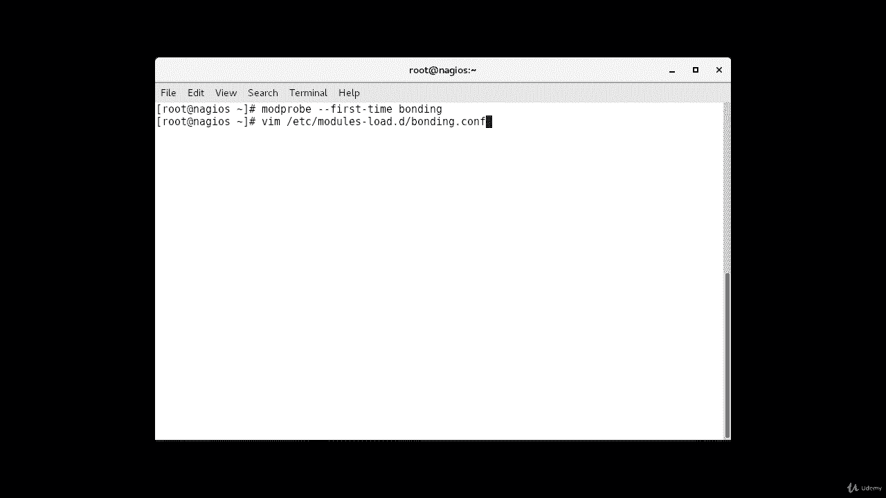
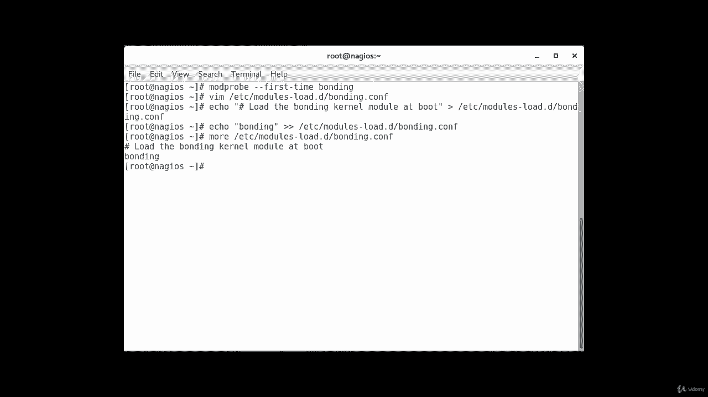
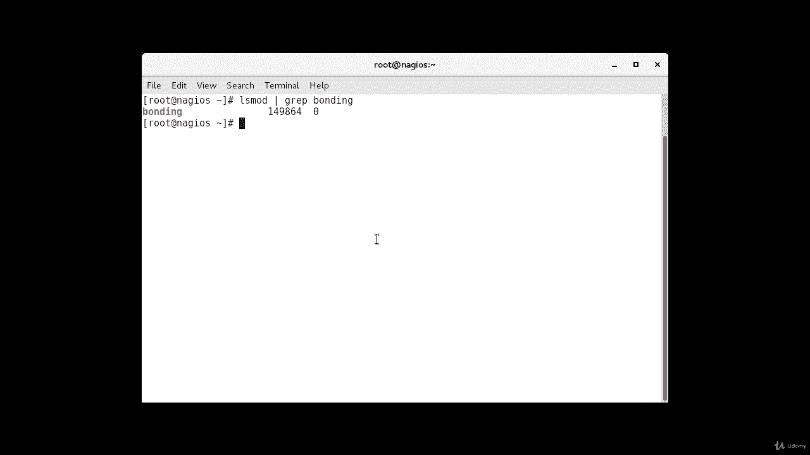

# Red Hat Certified Engineer (RHCE) 课程：P5：2. 网络接口组合（Bonding）-----3. 在 CentOS 7 上启用 Bonding 🔧

## 概述
在本节课程中，我们将学习如何在 CentOS 7 系统上启用网络接口组合（Bonding）功能。Bonding 允许我们将多个物理网络接口绑定成一个逻辑接口，以提高带宽和冗余性。我们将从加载必要的内核模块开始，并确保配置在系统重启后依然有效。

---

## 加载 Bonding 内核模块
首先，我们需要登录到目标服务器。默认情况下，Bonding 内核模块并未启用。因此，我们的第一步是加载它，并确保它在系统重启后能自动加载。

为了加载模块，我们使用 `modprobe` 命令。`--first-time` 选项的作用是，如果模块加载失败，它会向我们发出警报。执行以下命令来加载 bonding 模块：

```bash
modprobe --first-time bonding
```

这条命令将为当前会话加载 bonding 模块。

---

## 确保配置持久化
上一节我们加载了模块，但该设置仅对当前会话有效。为了确保 bonding 模块在每次系统启动时都能自动加载，我们需要创建一个配置文件。

我们将创建一个 `.conf` 文件在 `/etc/modules-load.d/` 目录下。以下是创建和配置该文件的步骤：

1.  使用 `echo` 命令和重定向操作符来创建文件并添加内容，这比手动编辑更高效。
2.  首先，添加一行注释说明文件用途。
3.  然后，添加模块名称。



具体命令如下：

```bash
echo ‘# Load bonding module at boot’ > /etc/modules-load.d/bonding.conf
echo ‘bonding’ >> /etc/modules-load.d/bonding.conf
```

执行完上述命令后，我们可以使用 `cat` 命令来验证文件内容：

```bash
cat /etc/modules-load.d/bonding.conf
```

此时，你应该能看到文件中包含我们刚刚添加的两行内容。

---

## 重启并验证
为了使新的配置生效，我们需要重启服务器。重启后，bonding 模块应该会被自动加载。

重启命令是：
```bash
reboot
```

服务器重启并重新登录后，我们需要验证 bonding 模块是否已成功加载。使用 `lsmod` 命令并配合 `grep` 来过滤出 bonding 相关信息：

```bash
lsmod | grep bonding
```



如果配置正确，命令输出将显示 bonding 模块已启用，这表明我们的设置是成功的。

---



## 总结
在本节课中，我们一起学习了在 CentOS 7 上启用网络接口组合（Bonding）的核心步骤。我们首先使用 `modprobe` 命令手动加载了 bonding 内核模块。接着，为了确保配置持久化，我们在 `/etc/modules-load.d/` 目录下创建了配置文件。最后，通过重启服务器并使用 `lsmod` 命令验证，我们确认了 bonding 模块已成功启用。这些步骤为后续配置具体的 Bonding 接口打下了基础。