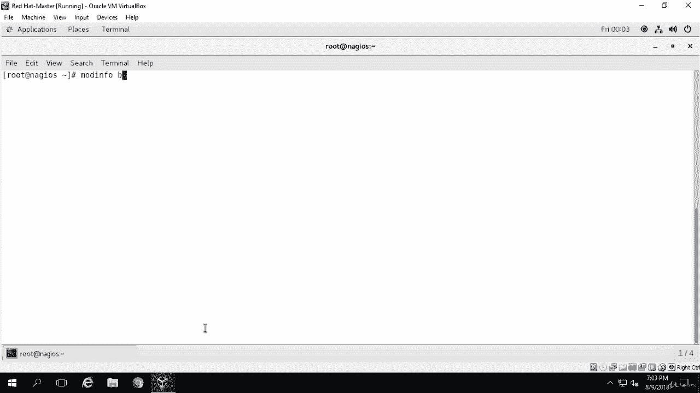
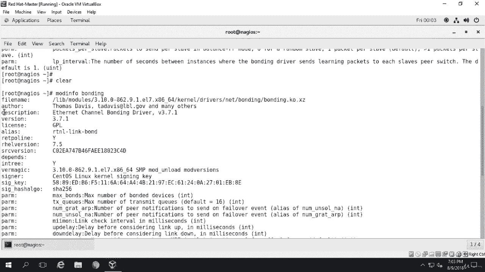
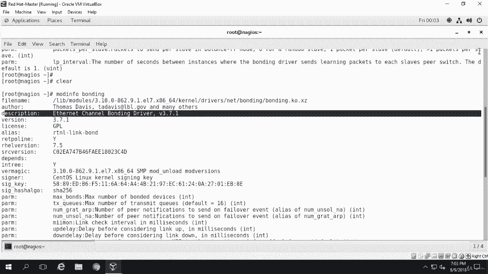
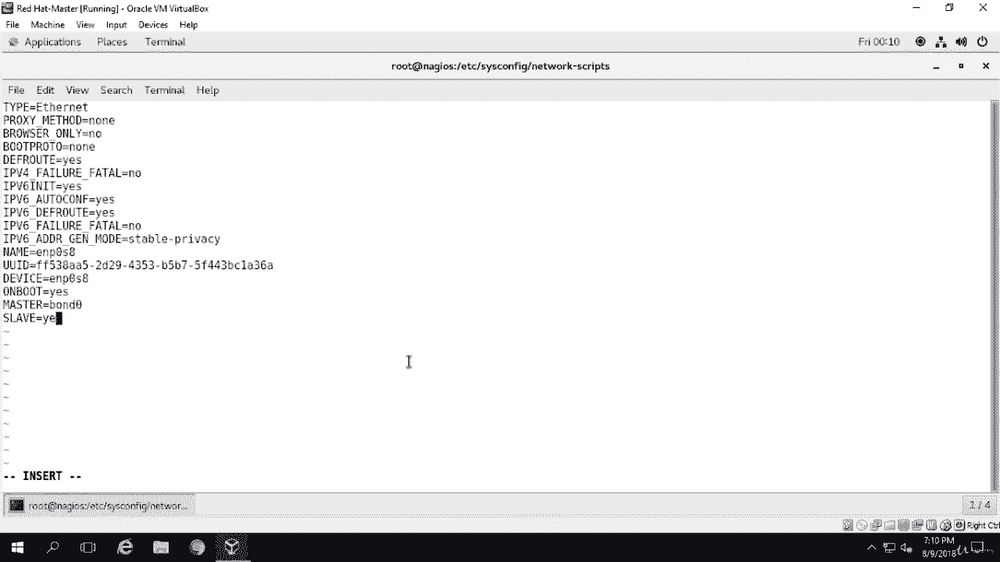
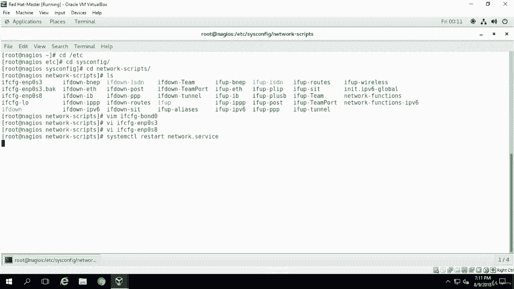
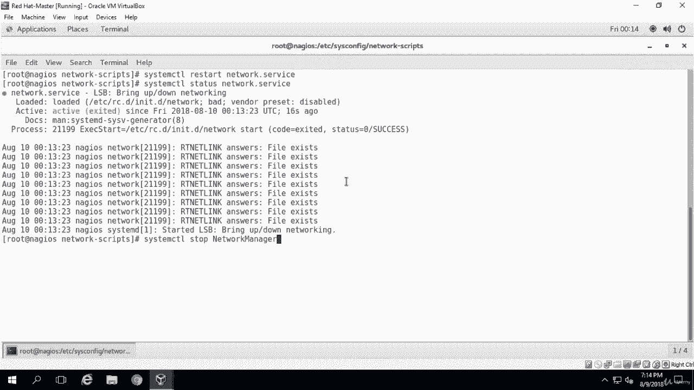
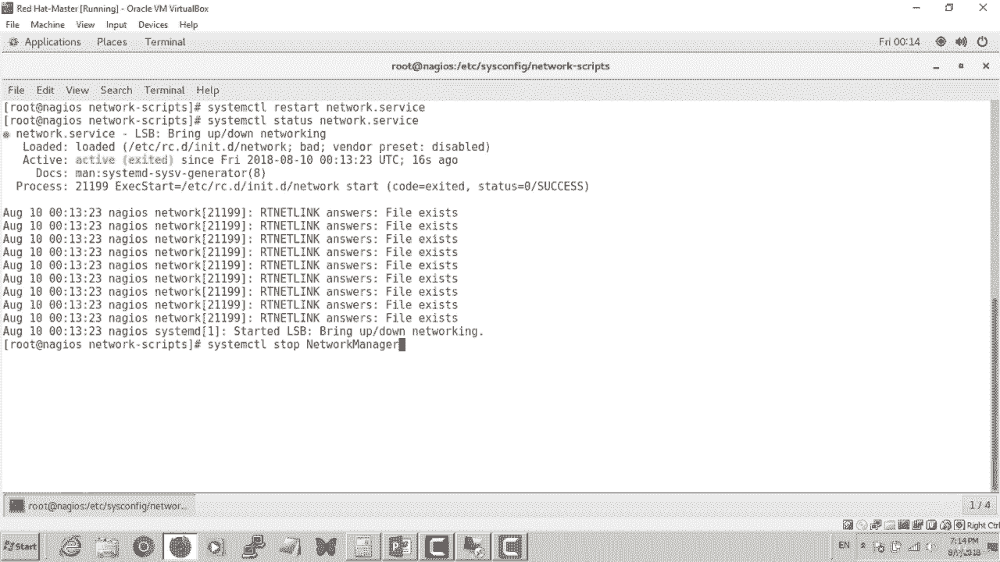
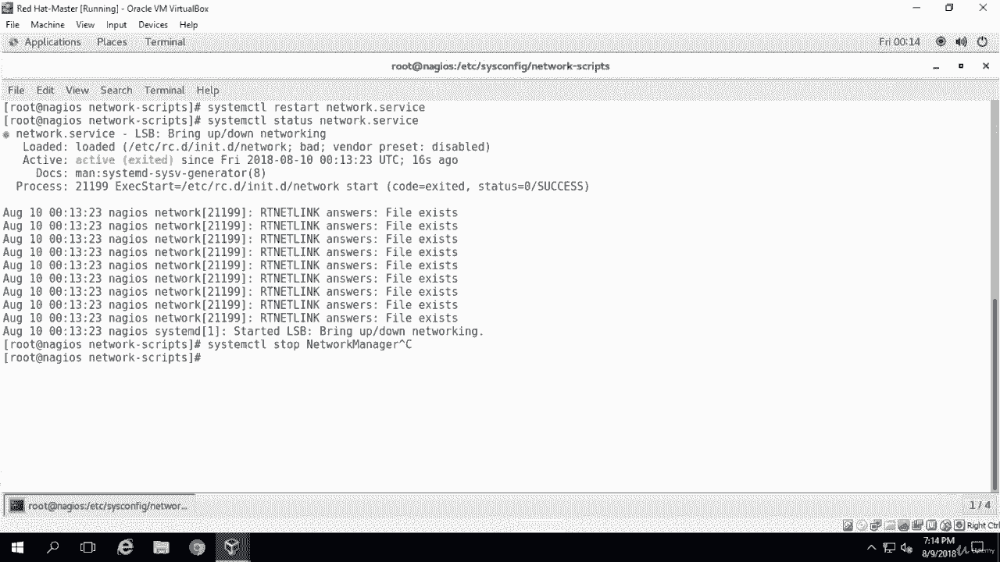

# Red Hat Certified Engineer (RHCE) 课程：P6：2. 网络接口绑定（Bonding）-----4. 编辑 bond0 接口文件



在本节课中，我们将学习如何编辑和配置网络接口绑定（Bonding）的核心文件。我们将创建绑定接口的配置文件，并修改物理网卡的配置文件，使其成为绑定接口的从属设备。最后，我们将重启网络服务以应用配置。



---



上一节我们确认了系统已启用绑定模块。本节中，我们来看看如何创建和编辑绑定接口的配置文件。

首先，我们需要在 `/etc/sysconfig/network-scripts/` 目录下创建绑定接口的配置文件。该目录存放了所有网络接口的配置。

以下是创建 `ifcfg-bond0` 文件的步骤和内容：

```
DEVICE=bond0
TYPE=Bond
NAME=bond0
BONDING_MASTER=yes
BOOTPROTO=none
ONBOOT=yes
IPADDR=192.168.1.70
NETMASK=255.255.255.0
GATEWAY=192.168.1.1
BONDING_OPTS="mode=5 miimon=100"
```

**核心概念解释**：
*   `TYPE=Bond`：指定接口类型为绑定。
*   `BONDING_OPTS="mode=5 miimon=100"`：这是配置绑定的关键参数。`mode=5` 表示使用适配器传输负载均衡模式，它提供容错和负载均衡。`miimon=100` 指定链路监控频率为100毫秒。

接下来，我们需要编辑两个物理网卡（例如 `enp0s3` 和 `enp0s8`）的配置文件，使它们成为绑定接口 `bond0` 的从属设备。

以下是需要添加到每个物理网卡配置文件（如 `ifcfg-enp0s3`）中的关键行：

```
BOOTPROTO=none
ONBOOT=yes
MASTER=bond0
SLAVE=yes
```

**核心概念解释**：
*   `MASTER=bond0`：指明该接口的“主设备”是 `bond0`。
*   `SLAVE=yes`：声明此接口是绑定接口的从属设备。

完成所有配置文件编辑后，需要重启网络服务以使更改生效。使用以下命令：

```bash
systemctl restart network
```

在重启服务后，应检查其状态以确保配置已成功加载：

```bash
systemctl status network
```





有时重启可能会失败。一个常见原因是 `NetworkManager` 服务与传统的 `network` 服务冲突。如果遇到类似“Failed to bring up LSB”的错误，可以尝试停止并禁用 `NetworkManager` 服务：

```bash
systemctl stop NetworkManager
systemctl disable NetworkManager
```

执行上述操作后，再次尝试重启 `network` 服务。



---





本节课中我们一起学习了配置网络接口绑定的实践步骤：创建绑定接口的主配置文件，将物理网卡配置为从属设备，以及如何重启服务并解决可能遇到的冲突问题。这是实现网络冗余和负载均衡的关键配置环节。