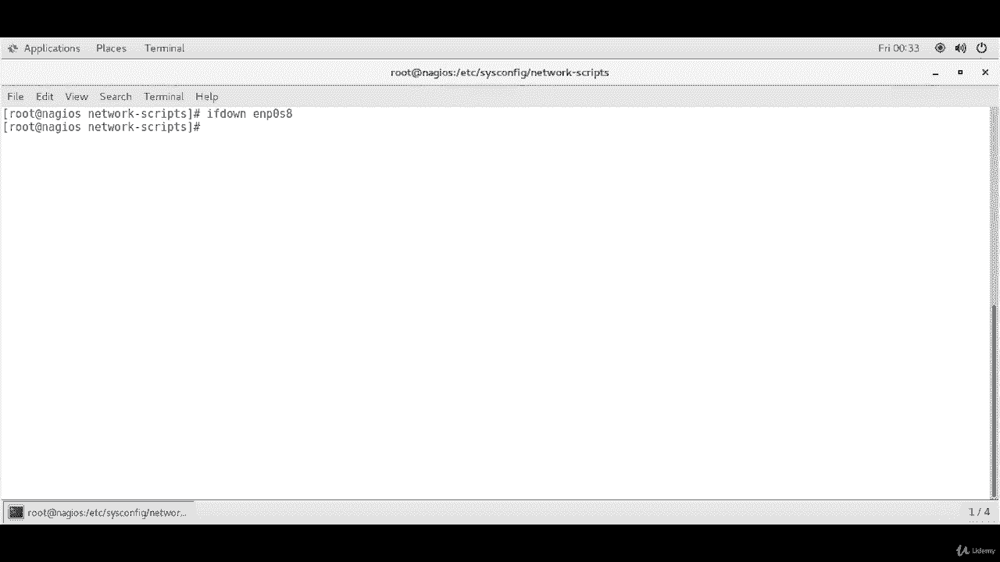
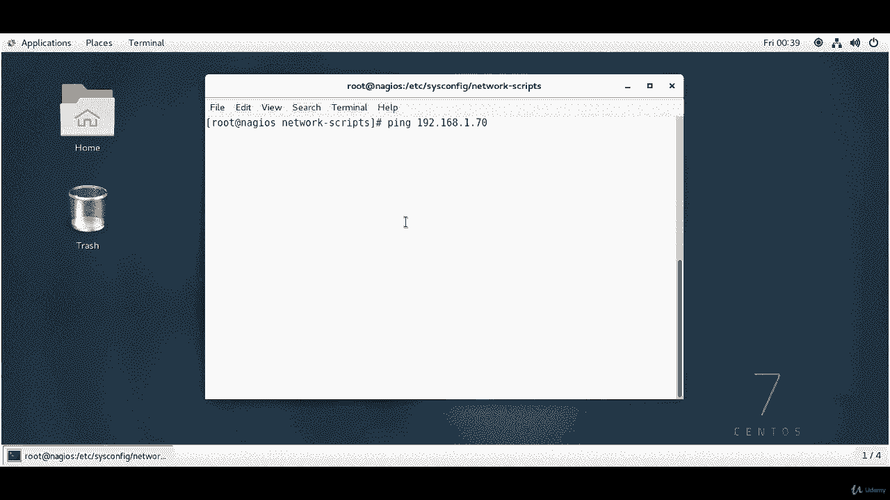
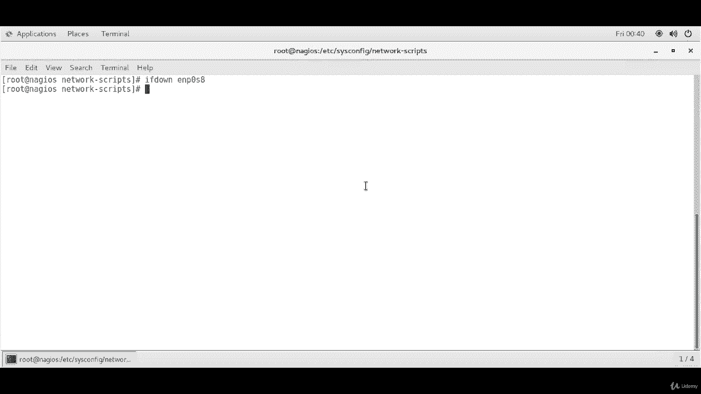
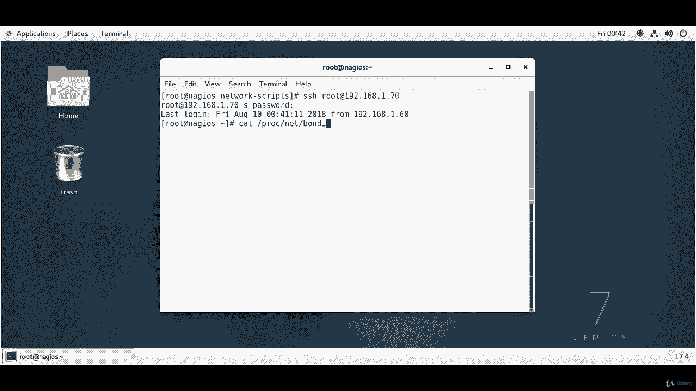

**网络接口绑定（Bonding）教程：P7：2.5：测试接口绑定** 🧪

在本节中，我们将学习如何验证和测试之前配置的网络接口绑定（Bonding）。我们将通过几个步骤来确认绑定是否成功，并测试其故障转移功能。

---

### **验证绑定配置**

首先，我们需要确认绑定接口及其从属接口已正确配置并处于活动状态。

以下是验证步骤：

1.  使用 `ip` 命令查看网络接口状态。
    ```bash
    ip a
    ```
    执行此命令后，您应该看到类似以下的输出：
    *   `enp0s3` 和 `enp0s8` 接口显示为 `SLAVE UP`，表示它们已配置为从属接口。
    *   `bond0` 接口显示为 `MASTER UP`，表示它是主绑定接口。

2.  查看详细的绑定接口设置，包括绑定模式和从属接口信息。
    ```bash
    cat /proc/net/bonding/bond0
    ```
    此命令将显示详细信息，例如：
    *   **绑定模式**：例如 `Transmit Load Balancing (tlb)`。
    *   **从属接口**：列出 `enp0s3` 和 `enp0s8`。
    *   **接口状态**：显示为 `up`，且 `link failure count`（链接故障计数）为 0。

---



### **测试故障转移功能**

上一节我们验证了绑定的基本配置，本节中我们来看看如何测试其核心功能——故障转移。故障转移意味着当一个网络接口失效时，另一个接口能自动接管，确保网络连接不中断。

以下是测试步骤：





1.  模拟一个从属接口故障。例如，关闭 `enp0s8` 接口。
    ```bash
    ifdown enp0s8
    ```

2.  从网络中的另一台客户端机器，尝试 `ping` 绑定接口的 IP 地址（例如 `192.168.1.70`）。
    ```bash
    ping 192.168.1.70
    ```
    如果绑定配置正确，即使一个接口已关闭，您仍应能收到来自 `bond0` 的回复，证明网络连接依然畅通。

3.  您也可以尝试从客户端通过 SSH 连接到绑定接口的 IP 地址，以测试更复杂的网络服务是否正常。
    ```bash
    ssh root@192.168.1.70
    ```



4.  回到配置了绑定的服务器上，再次查看绑定状态详情。
    ```bash
    cat /proc/net/bonding/bond0
    ```
    现在，输出将显示 `enp0s8` 的状态可能变为 `down`，而 `enp0s3` 成为 `Currently Active Slave`（当前活动从属接口）。这证实了故障转移已成功触发。

---

### **总结**

本节课中我们一起学习了如何测试网络接口绑定。我们首先使用 `ip a` 和 `cat /proc/net/bonding/bond0` 命令验证了绑定配置的正确性。接着，我们通过主动关闭一个从属接口并持续从外部客户端进行 `ping` 和 `SSH` 连接，成功测试了绑定的故障转移能力。这些测试确保了我们的绑定配置不仅正确，而且具备高可用性。