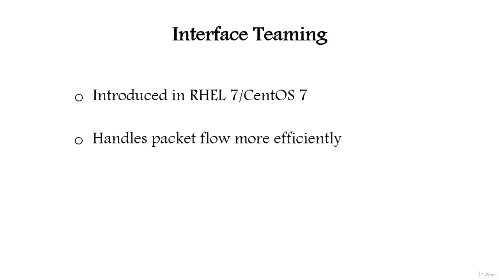

# Red Hat Certified Engineer (RHCE) 课程：P8：2. 网络接口组合 —— 6. 网络接口组合简介 🖧

在本节课中，我们将学习网络接口组合的基础知识。这是一种在 Red Hat Enterprise Linux 7 及类似系统中用于聚合多个网络接口的技术，旨在提高网络连接的带宽和可靠性。

网络接口组合是 Red Hat Enterprise Linux 7 和 CentOS 7 中引入的一项功能。它的作用与传统的网卡绑定相同。组合是一项新特性，它在处理数据包流方面比传统的绑定方式更高效。

网络组合功能由一个内核驱动和一个名为 TeamD 的用户空间守护进程共同实现。此外，一个名为“运行器”的软件负责启用负载均衡功能。

以下是几种主要的运行器模式，它们类似于传统绑定中的模式：

*   **广播**：该模式将所有数据包从所有端口发送出去。
*   **轮询**：该模式以轮询方式，依次从每个端口发送数据包。
*   **主备**：此运行器监控链路状态变化，并选择一个活动端口进行数据传输。
*   **负载均衡**：此运行器监控流量，并使用哈希函数在选择数据包传输端口时，力求达到完美的负载平衡。
*   **LACP**：此模式实现了 802.3ad 链路聚合控制协议。它可以使用与负载均衡运行器相同的传输端口选择机制。

上一节我们介绍了网络接口组合的基本概念和运行器模式，在下一节中，我们将具体讲解如何配置网络接口组合。

本节课中，我们一起学习了网络接口组合的引入背景、基本架构以及几种核心的运行器工作模式。理解这些基础知识是后续进行实际配置的关键。