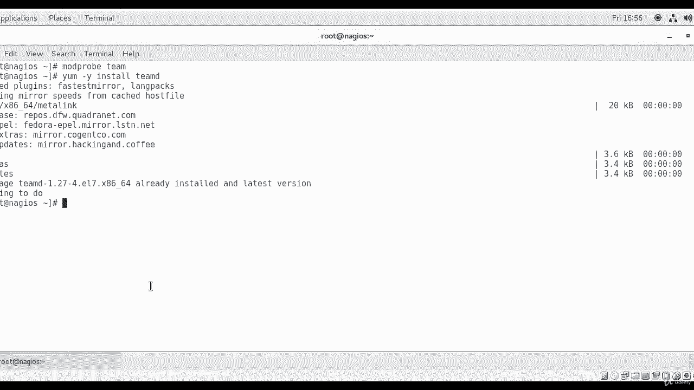
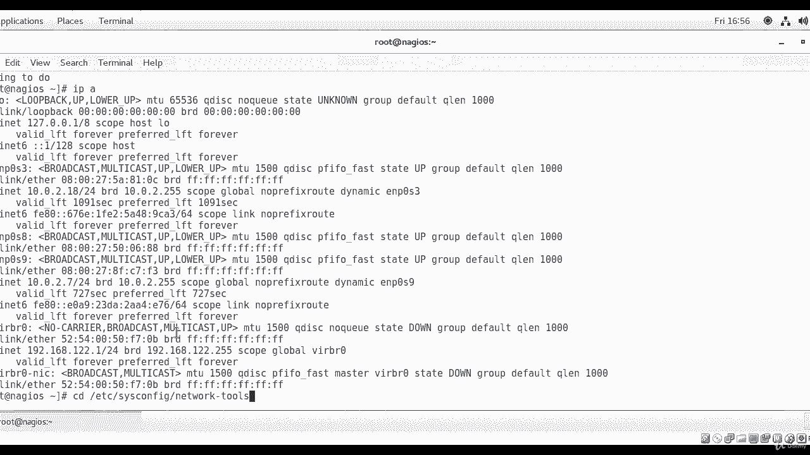
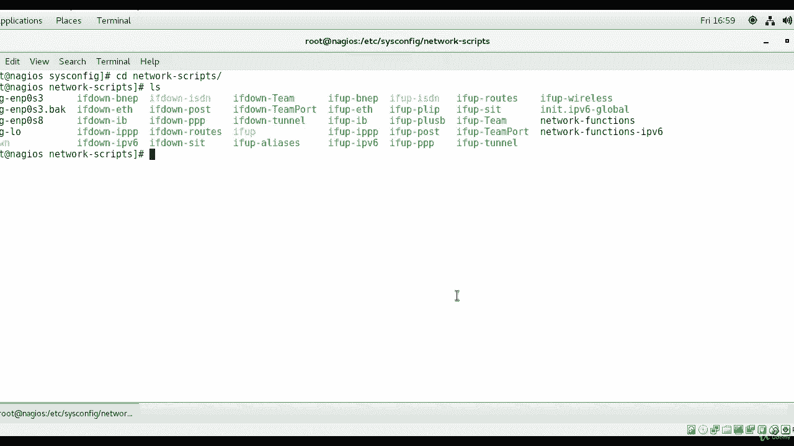
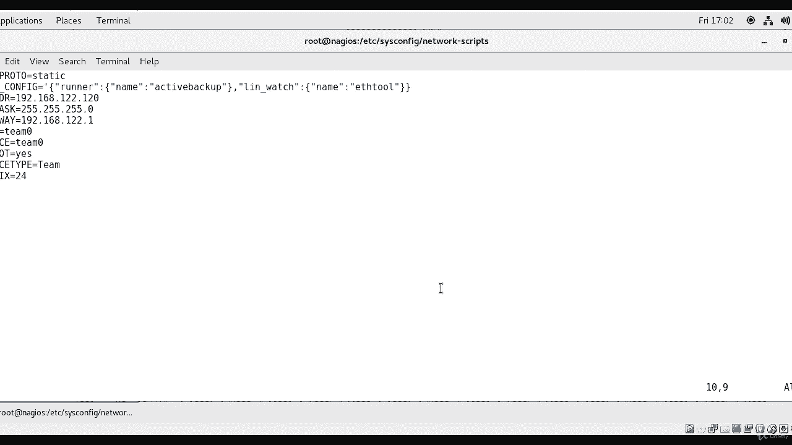
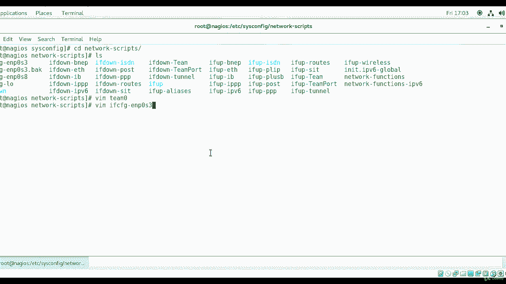
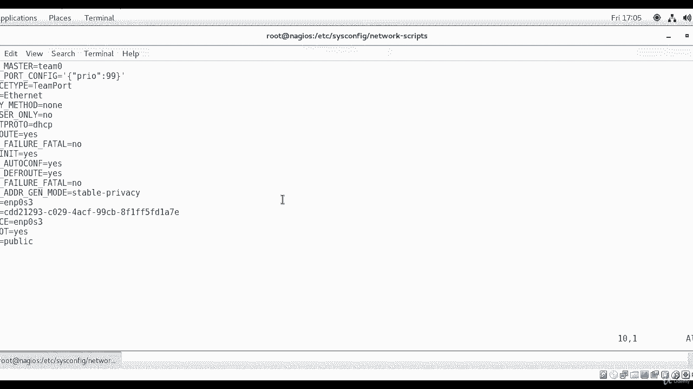
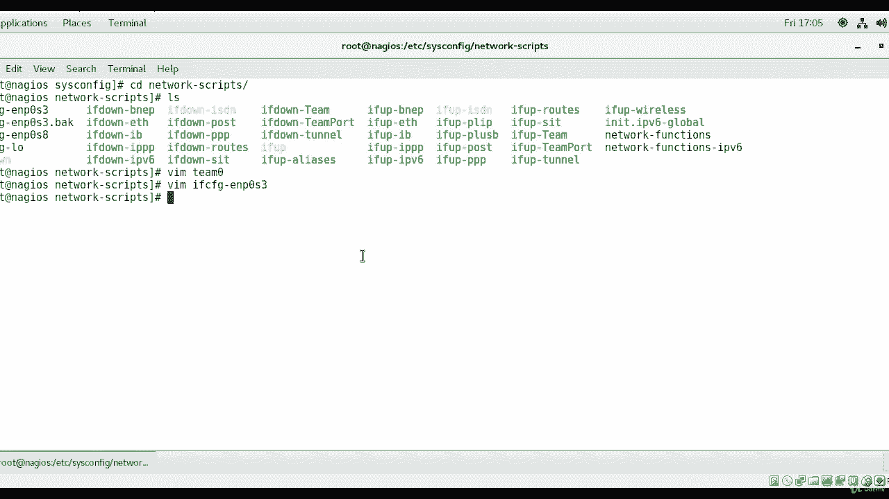
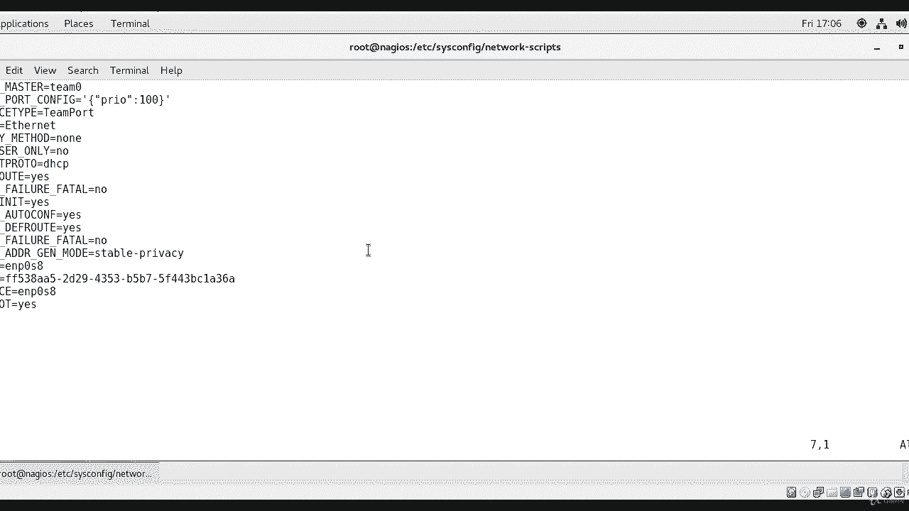
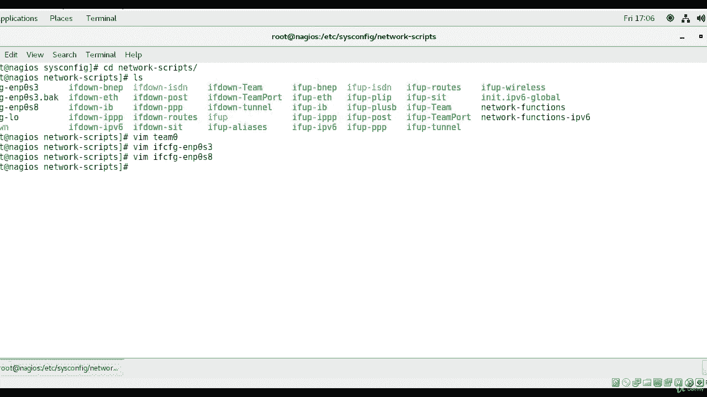

**RHCE 课程：P9：网络接口聚合（Teaming）配置教程** 🖧

在本节课程中，我们将学习如何在 Red Hat 系统上配置网络接口聚合（Teaming）。网络接口聚合可以将多个物理网络接口组合成一个逻辑接口，以提高带宽和冗余性。我们将通过创建配置文件来设置一个名为 `team0` 的聚合接口。

---



首先，我们需要登录到系统并检查 `teamd` 软件是否已安装和运行。

执行以下命令来检查 `teamd` 模块：
```bash
modprobe team
```
如果该命令没有输出，通常意味着模块已加载或系统已准备就绪。



为确保软件包已安装，可以运行：
```bash
yum install -y teamd
```
如果系统提示已安装，则无需操作。如果未安装，此命令将完成安装。



接下来，查看当前系统的网络接口信息：
```bash
ip addr show
```
输出会显示类似 `enp0s3`、`enp0s8`、`enp0s9` 的接口，以及回环接口 `lo`。

现在，我们进入网络配置目录。通常配置文件位于 `/etc/sysconfig/network-scripts/`。我们将在此目录下进行操作。

首先，创建聚合接口 `team0` 的主配置文件：
```bash
cd /etc/sysconfig/network-scripts/
vim ifcfg-team0
```
在 `ifcfg-team0` 文件中，输入以下配置内容：
```
BOOTPROTO=static
TEAM_CONFIG='{"runner": {"name": "activebackup"}}'
IPADDR=192.168.122.120
NETMASK=255.255.255.0
GATEWAY=192.168.122.1
NAME=team0
DEVICE=team0
ONBOOT=yes
DEVICETYPE=team
PREFIX=24
```
配置说明：
*   `BOOTPROTO=static`：设置静态IP。
*   `TEAM_CONFIG`：定义聚合运行模式，这里使用 **activebackup**（主备模式）。
*   `IPADDR`、`NETMASK`、`GATEWAY`：设置聚合接口的IP地址、子网掩码和网关。
*   `NAME` 和 `DEVICE`：指定逻辑接口名称。
*   `ONBOOT=yes`：确保系统启动时激活该接口。
*   `DEVICETYPE=team`：声明设备类型为聚合接口。

保存并退出编辑器。

上一节我们创建了聚合接口的主配置。本节中，我们需要将物理网卡配置为这个聚合接口的成员端口。

以下是第一个成员接口 `enp0s3` 的配置步骤。



创建或编辑第一个成员接口的配置文件：
```bash
vim ifcfg-enp0s3
```
在该文件中，确保包含以下关键行：
```
TEAM_MASTER=team0
TEAM_PORT_CONFIG='{"prio": 99}'
DEVICETYPE=TeamPort
NAME=enp0s3
#BOOTPROTO=dhcp
ONBOOT=yes
```
配置说明：
*   `TEAM_MASTER=team0`：指明该接口隶属于 `team0` 聚合组。
*   `TEAM_PORT_CONFIG`：设置该端口的优先级，数字越大优先级越高。
*   `DEVICETYPE=TeamPort`：声明此设备为聚合端口。
*   注释掉或删除 `BOOTPROTO=dhcp`，避免与聚合接口的静态IP冲突。



保存并退出。

接下来，我们以类似的方式配置第二个成员接口。



创建或编辑第二个成员接口 `enp0s8` 的配置文件：
```bash
vim ifcfg-enp0s8
```
输入以下配置：
```
TEAM_MASTER=team0
TEAM_PORT_CONFIG='{"prio": 10}'
DEVICETYPE=TeamPort
NAME=enp0s8
#BOOTPROTO=dhcp
ONBOOT=yes
```
注意，这里将 `prio`（优先级）设置为 `10`，低于第一个接口的 `99`。在主备模式下，优先级高的接口将成为活动接口。



保存并退出编辑器。

---





本节课中我们一起学习了网络接口聚合的基本配置。我们首先检查并确保了 `teamd` 软件可用，然后创建了聚合接口 `team0` 的配置文件，并最终将两个物理接口 `enp0s3` 和 `enp0s8` 配置为其成员端口，并设置了不同的优先级。完成这些配置后，重启网络服务或系统，新的聚合接口 `team0` 即可生效。