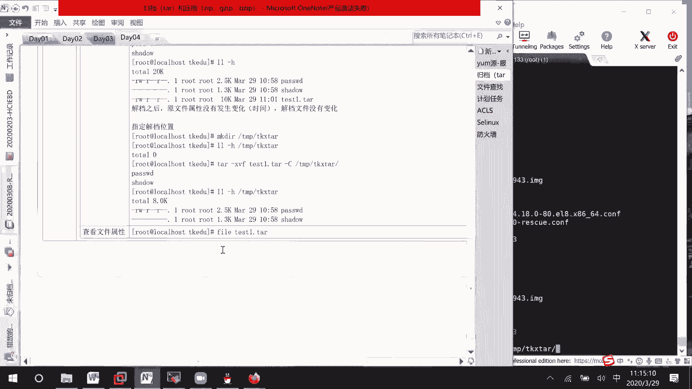

# 01 RHCE8.0视频教程【45课时】 - P11：20200329-RHCE-03_recv - 六竹书生6682 - BV1m84y1f7ss

像这个归档和压缩的话呢，在以前的经验当中，就是说在上午的时候呢会考一个题目，让你去把一些文件给找到了之后，然后呢对找到的一些信息的话呢，去进行归档和压缩，因为是找到了之后再进行归档和压缩。

所以我们这边的话呢先讲归档和压缩，到时候的话呢，再去讲我们文件的一个查找这块的一个信息，好归档和压缩这一块的话呢，主要有两个命令，第一个命令就是PAR，第二个命令的话呢就是和压缩相关的，比如说zip啊。

Zip，还有叫做zip相关的一个信息，这个的话呢归档是什么意思呢，归档就相当于就是说你桌面有很多东西，你拿一个箱子去对它进行一个打包，那好这边打包完了之后呢，整个重量的话是怎么样子啊。

是不是箱子加上实际东西的一个重量，如果是文件的话呢，那这样子就是文件里面的东西以及目录，它的一个大小吗，所以这个如果你归档了之后的话呢，整个文件是变大的，变大多少的话呢，这个不一定。

下面这里的话呢叫做压缩，压缩的话呢，就相当于你们啊像被子啊，衣服啊，放在一个袋子里面去抽气嘛，那现在这样子的话呢，它的体积减少，其实重量的话呢，呃我们在抽气的时候，重量是不是增大了，它这个压缩的话呢。

它会去除一些冗余信息嘛，它的质量不是质量，它的整个文件的大小，文件是变小的，知道吧，像这个归档的话呢是变大，但是压缩的话呢它是变小的，这边我们的话呢先来看归档，再看压缩。

最后的话呢去看归档和压缩结合在一起，V档的话呢，嗯我这边去到tap目录，我把这些给关了先哈，Cd temp，我把下面所有的信息的话呢给清空掉，随便去创建一个目录，比如说TKEDU。

里面的话呢呃就是说在我们的TKEDU下面，现在什么东西都没有，我现在的话呢去拷贝几个文件过来，E d c password，E d c shadow，拷贝到我的TKDU，那好现在里面的话呢它就有东西了。

我顺便的话呢用带单位的形式的话呢，去显示一下它的一个大小，一个是2。5K，一个的话呢是一个叫做1。3K，这个的话呢是我们前期的一个实验准备哈，这里进归档的话呢，第一个就是说。

我怎么样去把它收拾在一个盒子里面，命令的话呢就是TAR，我们来看一下help的一个信息，它有哪些呢，我就挑几个去讲一下哦，太多了，第一个这个大写的C的话呢，它表示你要去指定个目录。

然后这里的话呢是不是有个小写的C呀，小写的C的话呢，它代表的意思就是correct去进行一个创建，然后这边的话呢有一个叫做小写的TT的话呢，是干嘛呢，就是说显示里面的一些东西嘛。

XX就是啊EXEX就是解绑的一个意思吗，所以我们这边的话呢会用到的就是CX，V的话呢就是去显示过程，F的话呢，比如说你归档成一个文件之后，它叫什么名字，或者到时候呢去解答哪个文件嘛，这F就指定名字。

那行就看这几个就够了，其他的话呢你们有需要的话，自己再去看一下好吧，这里tr我进入到TKEDU哈，tr减CVFC的话呢创建V显示过程，F就说你这个文件归档了之后叫什么名字，比如说我叫做test1吧。

后面的话呢我们基本上会以tr结尾，这样子的话呢就是说更容易去进行一个标识吗，知道它是一个tar文件，后续如果想要去使用的话呢，那么我就说用它去进行一个解答吗，我们这里面的话呢有哪些文件呢。

第一个是password，第二个文件是不是shadow啊，就表示我想要把两个文件给打包进去，如果有第三个文件，你再写名字也是可以的，或者写一个信号所有的文件吗，那好他这边的话呢显示的过程是什么意思呢。

我先打包password文件，再把shadow文件的话呢给放进去，下面这里的话呢，我们来看一下它的一个叫做文件信息，目前是什么样子的，LL他的话呢减H吧，你看一个叫做2。5K和1。3K的文件压缩。

就是说归档了之后的话，文件大小是10K，所以这边的话呢可以说明叫做归档之后，文件是进行增大的，而且的话呢还有什么东西呢，归档之后文件变大，原文件不删除，原文件它是不删除的，不删除的那行，下面这里的话呢。

如果说我们现在想要去解绑，因为这边的话呢，它本身就已经有password文件和shadow文件，在这边，如果说我解绑成功了之后呢，可能也看不出效果吗，我把这两个文件先给你们删了。

password和shadow，这个时候的话呢里面没有东西，我来解答一下ta2刚才说了，C的话呢是进行一个创建，那解档呢X比如说我也想要显示过程，后面的话呢就是说呃test，这边是不是指定不了啊。

这边的话呢你要去说一下，对哪个文件去进行一个解答，知道吧，这边在解档的时候呢，他先把password给拿出来，再去把shadow文件的话给拿出来，你看这两个文件它解答出来了。

而且的话呢时间还是原来的时间，就是说我归档进去了之后呢，文件的一些属性它是没有发生变化的，没有发生变化的，啊这个的话呢没有什么样的一个问题啊，就是给你们去记录一下，就结档之后哦，原文件属性。

没有发生变化，他的话呢连时间都没变，然后这边的话呢在结档之后，解档文件没有变化对吧，稍等一下，我看一下，可以指他这个的话呢是可以指定的，我们等一下的话呢会去说一下，因为有个减大C的。

就是说减减大C的一个选项嘛，就是说去指定一下，你可能要归档到哪里去，或者说解档到哪里去吗，好吧，这个稍等一下，那好这边的话呢，就那我提前来说一下这个问题啊，如果说想要指定解档位置。

我的话呢在tap目录下去创建一个目录，叫做TTKX2好吧，现在这个目录下面的话呢，就是说什么东西都没有，那我现在如果说想要指定到哪里去呢，它减XVF，我的话呢是想要test减大写的C。

就说去指定放到哪里去，这边的话呢就是说放到这个temp tk，x part里面去，LLL减H的话呢，这边目录下面就有指定解档位置，看一下会长位置的话呢，它也是类似的，好吧也是类似的。

下面这边的话呢我们来看一下把这个归档，这个就是说是怎么样去进行一个解档的，然后的话呢如果因为他这个归档之后的话呢，原文件没有删除，其实我觉得不太好，能不能在归档的时候的话呢，帮我把原文件给删除掉呢。

减CVF这边的话呢你就说归档了之后，比如说叫做test2点T，然后的话呢对哪些文件呢，password文件删的文件，它后面有个选项叫做remove fires l l，减去它的一个叫做原文件的话。

那就不见了，稍等一下，这边也就是说嗯归档之后删除原文件，然后的话呢，然后的话呢，刚才问能不能去指定一下它归档的一个位置吗，那你看呃我这边的话呢先把它给解压出来哈，呃不用吧。

CD我们到temp下面叫做TKX塔好吧，那我这边的话呢把它归档到我的TKDU下面，好不好，PAR减CVF这边的话呢不是想要放到temp，叫做TKEDU下面吗，比如说我的名字叫做test3part。

对谁呢，在temp下面的pk x part叫做password，还有呢pp下面的TKX2下面的叫做shadow文件，我把它就是说进行一个归档，并且在归档的时候呢把源文件给删除掉，回车我看一下啊。

嗯from member，我知道了，这边成员的名字前面不要加这个成员，如果要去归档的时候呢，后面直接登上一个目录就好了，诶password，我知道，他这边的话呢只是一个提示报错吗，又没有报错。

报错又没有报错，L s temp t k e d u，这边是不是就多了一个叫做test3啊，Test3，他这边的话呢，就是呃把它前面的一个叫做绝对路径给删了，然后的话呢它是给我们归档成功了，归档成功了。

所以你们这边的话呢到时候再做的时候，因为我这边特地进到这个目录里面进来嘛，其实就想要去归档password和shadow，如果说是对这个目录下，所有信息进行归档的话呢。

就把这个password改成星号就行了，也不需要去写这么多东西了，明白吗，稍等一下，这边的话呢归档文件到指定位置，他的话呢，这里C这里，你直接就去写上完整的路径就可以了，然后后面这边在归档的时候呢。

就不需要去跟上这么多东西了好吧，然后如果说想要去解档到特定位置的话呢，那你就这样子去做嘛，就这样子去做，这没有问题啊，CD我们的TTKDU，然后这边的话呢我们因为现在做练习，所以文件会很规范。

叫做TP点TT结尾吗，但是有时候的话呢，一些文件我根本不知道它是什么格式，下载下来的话呢，就是一个test，用cat也不行，用CD也不行，那这个时候怎么办呢，你们要记得可以用这个叫做fire。

去看一下它的一个叫做属性是怎么样的，发现这是一个叫做tar文件，那你的话呢就要想着去先对它进行一个解绑吗，然后的话呢再进行一个使用好吧，这里，下面这边的话呢，刚才讲的是对单个文件进行的一个叫做回答。

下面这边的话呢我们来讲一下，对某个目录去进行归档的话呢，它有什么样的一个区别，一个的话呢就是说我直接在这边，就因为我等一下想要回档到TKEDU，下面来嘛，比如说我的话呢直接去归档它的一个不存目录。

到时候解压出来的话呢是怎么样的，第二种情况，就是说我进入到不成目录再进行归档，解压出来的情况又是怎么样子的，好吧，你看A减CBF，比如说我这边的话呢put一点踏，我的话呢直接去归档boot新号。

这种情况的话呢，就是说对这个目录下的所有文件进行归档，后面就不要跟上remove on了哈，下次开机就开不起来了，你看我这边归档完了好吧，X v f，叫做bot1，我的话呢放到这个TKX呃，tr丹东去。

哦不对，temp tk x t k x2当中去，你看LSTEMTKX塔，是不是这边的话呢看到是不是一个目录啊，好吧，这是一个，对目录进行归档，就说会有两种情况，它归档出来的形式的话，那是不一样的。

像这种形式去归档的话呢，我到时候解绑了之后，就是一个目录，稍等一下，结档之后，是一个目录，然后下面这种情况的话呢，它是解档之后是里面一个一个的文件，这个时候怎么做呢，Cd boot。

然后呢TCVF我比如说叫做boot2点，它是对谁呢，对新号，我还是把它放到自己的一个叫做pp t k e d u，下面，好吧，对这下面的所有文件，比如说我这样子去进行一个归档，我们来看一下效果哈。

虽然归档过程其实没有什么样的一个区别，我现在CD到temp t k e d u，这里是不是有个bot2啊，我来解答TX，减大写的c t camp t k x塔，回车，稍等一下。

l s temp t k x塔，你看从刚才的话呢只有一个boot的一个情况，就是说刚才的话呢，它只有一个叫做boots的一个情况吗，诶我怎么现在找不到了呢，哦在这你看从刚才只有一个步骤的情况。

到现在解压完成之后呢，里面是不是就是和boot，是原先的步骤是一模一样的东西啊，所以这个的话呢，解绑之后是目录里面的内容形式，而不是一个目录，这个的话呢就看你们的需求有限的话呢。

可能就是说希望结档了之后的话呢，就是一个目录的话，那建议你用这种，如果说希望解，或许别人拿到你的包结档了之后的话呢，是一个一个就说是里面的一一项，一项内容的话呢，那你就使用下面这种形式好吧。

这个的话呢是这样子，考试的时候呢，他没有很严格的要求，到底就是说结档了之后是一个目录啊，还是一个还是一个，就是说文件只要你能对它进行一个归档啊，就是说归档就可以了行吗，那像我们归档和减档的话呢。

就讲到这里过，下面这边的话呢。

