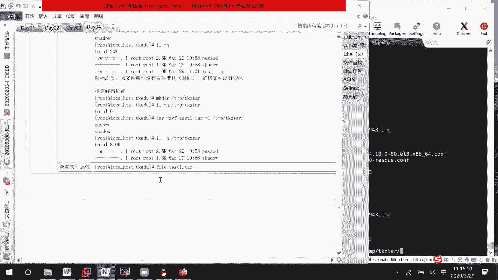

# Linux归档与压缩：01：归档基础


在本节课中，我们将学习Linux系统中归档与压缩的基础知识。归档是将多个文件或目录打包成一个文件的过程，而压缩则是通过算法减少文件的大小。我们将从归档开始，了解其基本概念和常用命令。

## 归档的概念

归档类似于将桌面上的多个物品放入一个箱子中。归档后的文件大小等于原文件大小加上归档格式本身的开销，因此**归档后文件通常会变大**。这与压缩不同，压缩会去除冗余信息，使文件变小。

## 归档命令 `tar`

Linux中最常用的归档命令是 `tar`。以下是其常用选项：
*   `-c`：创建新的归档文件。
*   `-x`：从归档文件中提取（解档）文件。
*   `-v`：显示详细的处理过程。
*   `-f`：指定归档文件的名称。
*   `-C`：指定解档的目标目录。

## 基础归档操作

上一节我们介绍了归档的概念和`tar`命令，本节中我们来看看如何使用`tar`命令进行基本的归档与解档操作。

首先，我们准备实验环境，创建目录并复制两个文件。

```bash
cd /tmp
mkdir TKEDU
cp /etc/passwd /etc/shadow TKEDU/
ls -lh TKEDU/
```

现在，我们将这两个文件归档为一个文件。

```bash
cd TKEDU
tar -cvf test1.tar passwd shadow
ls -lh
```

命令执行后，会生成一个名为 `test1.tar` 的归档文件。可以看到，归档文件的大小大于两个原文件大小的总和，这验证了归档会增大文件体积。同时，原文件 `passwd` 和 `shadow` 依然存在。

接下来，我们删除原文件，然后从归档文件中解档恢复它们。

```bash
rm passwd shadow
tar -xvf test1.tar
ls -lh
```

解档后，两个文件被恢复，且文件属性（如时间戳）保持不变。

## 指定归档与解档位置

默认情况下，`tar`命令在当前目录进行操作。我们可以使用选项来指定文件的位置。

以下是常用操作示例：

1.  **指定解档位置**：使用 `-C` 选项可以将文件解档到指定目录。
    ```bash
    mkdir /tmp/TKX2
    tar -xvf test1.tar -C /tmp/TKX2/
    ls -lh /tmp/TKX2/
    ```

2.  **归档时删除原文件**：`tar`命令本身不提供此功能，但可以结合管道和`rm`命令实现。更常见的做法是先归档，再手动删除原文件。
    ```bash
    tar -cvf backup.tar file1 file2 && rm file1 file2
    ```

3.  **归档指定目录的内容**：归档整个目录时，根据当前路径的不同，解档后的结构也会不同。
    *   **方式一**：在目录外部归档，解档后会生成该目录。
        ```bash
        tar -cvf boot1.tar /boot/*
        tar -xvf boot1.tar -C /tmp/TKX2/
        # 解档后，/tmp/TKX2/ 下会有一个 boot 目录
        ```
    *   **方式二**：进入目录内部再归档，解档后是目录内的文件，而不会创建外层目录。
        ```bash
        cd /boot
        tar -cvf /tmp/TKEDU/boot2.tar *
        cd /tmp/TKEDU
        tar -xvf boot2.tar -C /tmp/TKX2/
        # 解档后，/tmp/TKX2/ 下直接是 boot 目录内的文件
        ```

## 文件格式识别

有时我们下载的文件没有明确的扩展名。可以使用 `file` 命令来查看文件类型，以决定如何处理。

```bash
file unknown_file
# 如果输出显示为 “POSIX tar archive”，则说明它是一个tar归档文件，需要用 tar -xvf 来解档。
```

## 总结



本节课中我们一起学习了Linux归档的基础操作。我们了解了归档与压缩的区别，重点掌握了`tar`命令的`-c`（创建）、`-x`（解档）、`-v`（显示过程）、`-f`（指定文件名）和`-C`（指定解档目录）等核心选项。通过实践，我们学会了如何对文件和目录进行归档、解档，以及如何指定操作路径。归档是进行文件备份和整理的重要步骤，为后续学习文件压缩打下了基础。