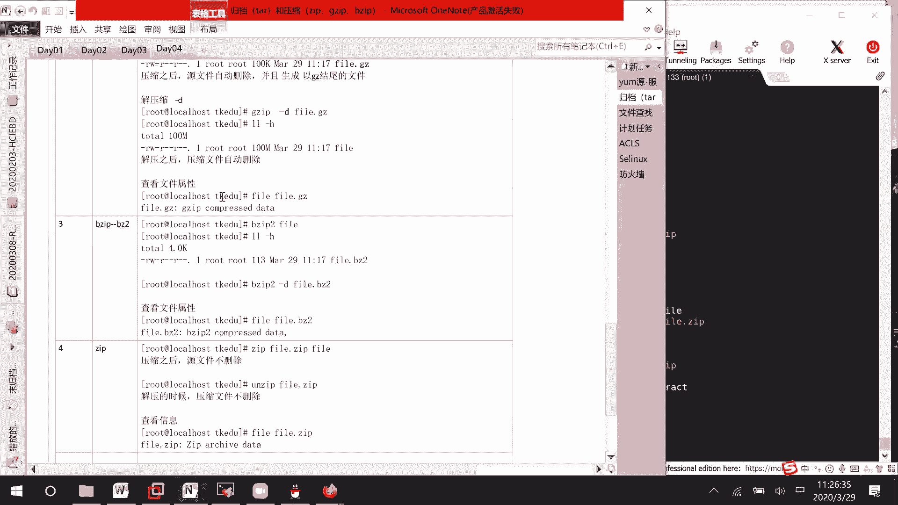

# Linux文件压缩与解压：01：常用压缩工具详解


在本节课中，我们将要学习Linux系统中几种常用的文件压缩与解压工具，包括`gzip`、`bzip2`和`zip`。我们将通过实际操作，了解它们的基本用法、特点以及相互之间的区别。

## 准备测试文件

为了清晰地展示压缩效果，我们需要先创建一个足够大的测试文件。如果使用像`passwd`或`shadow`这样的小文件，压缩效果将不明显。

以下是创建测试文件的步骤。我们将使用`dd`命令从`/dev/zero`设备（一个提供无限零字节流的特殊文件）读取数据，生成一个100MB大小的文件。

```bash
dd if=/dev/zero of=/tmp/file bs=1M count=100
```

执行上述命令后，使用 `ll -h` 命令查看，可以确认在 `/tmp` 目录下生成了一个名为 `file`、大小为100MB的文件。

## 使用 gzip 进行压缩与解压

上一节我们准备好了测试文件，本节中我们来看看第一种压缩工具：`gzip`。

`gzip` 命令的压缩操作非常简单。其基本语法是 `gzip [选项] 文件名`。如果想查看压缩过程的详细信息，可以使用 `-v` 选项。

```bash
gzip /tmp/file
```

执行压缩后，再次使用 `ll -h` 命令查看，会发现原来的 `file` 文件（100MB）消失了，取而代之的是一个名为 `file.gz` 的新文件，其大小显著减小（例如变为100KB左右）。这说明：
*   压缩后，源文件会被自动删除。
*   会生成一个以 `.gz` 为后缀的新文件。

压缩完成后，自然需要解压。`gzip` 的解压命令是 `gzip -d`。

```bash
gzip -d /tmp/file.gz
```

解压后，`file` 文件恢复，其大小变回100MB，并且 `.gz` 压缩文件被自动删除。解压出的文件会保留原始文件的属性信息（如时间戳）。

## 使用 bzip2 进行压缩与解压

了解了 `gzip` 之后，我们来看看压缩率通常更高的 `bzip2` 工具。

`bzip2` 的用法与 `gzip` 非常相似。默认情况下，直接使用 `bzip2` 命令即可压缩文件。

```bash
bzip2 /tmp/file
```

压缩完成后，源文件 `file` 会被自动删除，并生成一个后缀为 `.bz2` 的新文件 `file.bz2`。通过 `ll -h` 查看，可以发现其压缩后的体积可能比 `.gz` 文件更小。

解压 `.bz2` 文件同样使用 `-d` 选项。

```bash
bzip2 -d /tmp/file.bz2
```

## 使用 zip 进行压缩与解压

最后，我们来看一下跨平台兼容性更好的 `zip` 格式。它的操作与 `gzip`/`bzip2` 有些不同。

首先，`zip` 的压缩和解压是**两个独立的命令**：`zip` 用于压缩，`unzip` 用于解压。查看帮助信息可以确认这一点。

以下是 `zip` 压缩的语法，需要指定压缩后的文件名和待压缩的源文件。

```bash
zip /tmp/file.zip /tmp/file
```

执行后，会生成 `file.zip` 文件，而源文件 `file` **不会被删除**，这与 `gzip` 和 `bzip2` 的行为不同。

为了演示解压，我们先删除源文件。

```bash
rm -f /tmp/file
```

然后使用 `unzip` 命令进行解压。

```bash
unzip /tmp/file.zip
```

解压后，源文件 `file` 被恢复，而压缩包 `file.zip` 文件**同样不会被自动删除**。

## 总结

本节课中我们一起学习了三种常用的Linux压缩工具：
1.  **gzip**：命令为 `gzip` 和 `gzip -d`，生成 `.gz` 文件，压缩/解压后**自动删除**源文件/压缩包。
2.  **bzip2**：命令为 `bzip2` 和 `bzip2 -d`，生成 `.bz2` 文件，通常压缩率更高，压缩/解压后**自动删除**源文件/压缩包。
3.  **zip**：命令为 `zip` 和 `unzip`，生成 `.zip` 文件，跨平台性好，压缩/解压后**不会自动删除**源文件或压缩包。



理解它们之间的这些区别，能帮助你在不同场景下选择合适的工具进行文件处理。