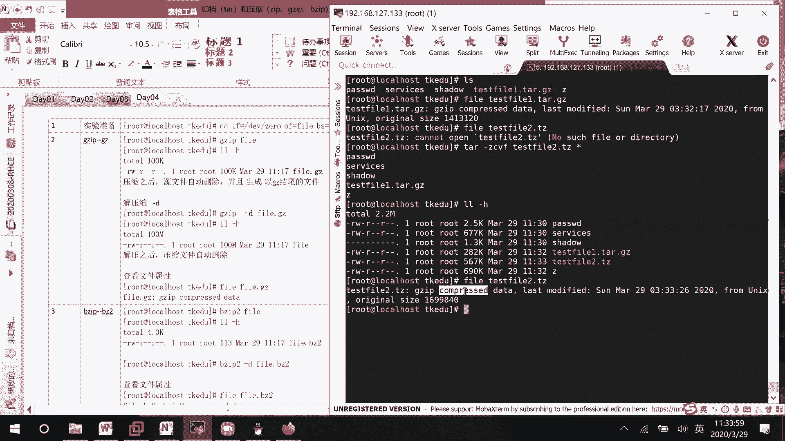
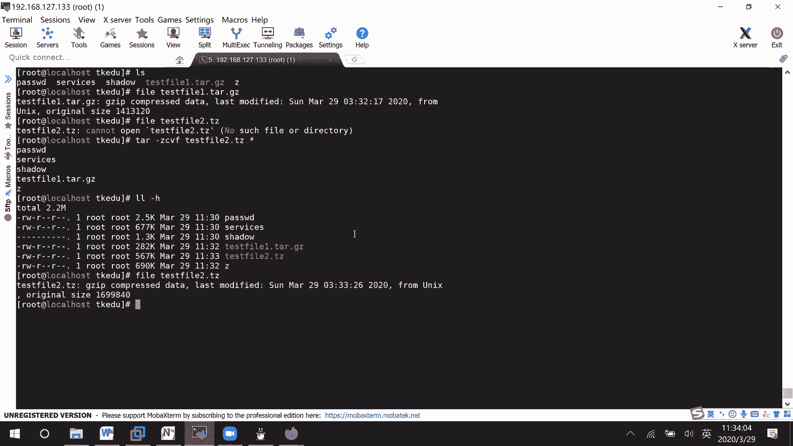
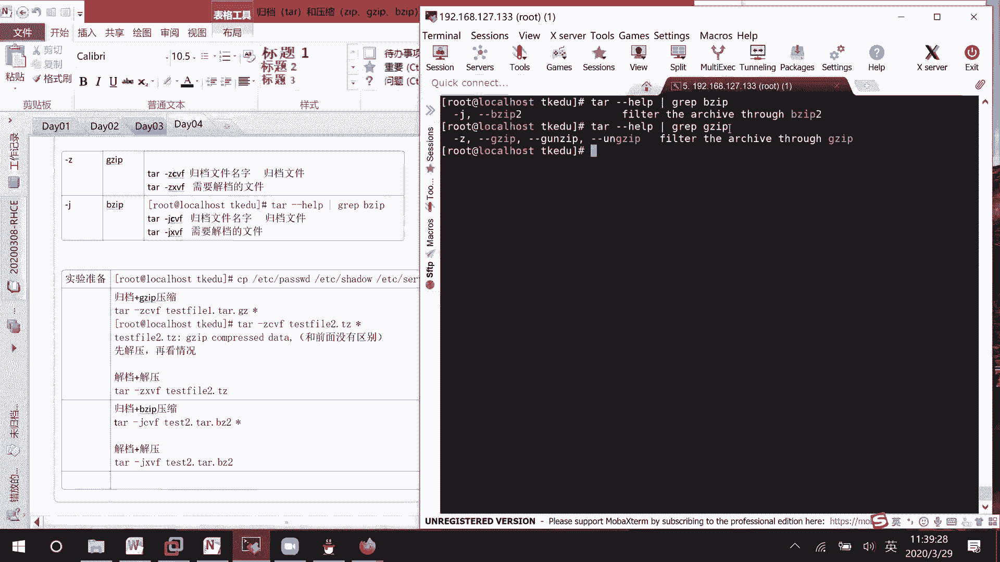

# Linux文件管理：05：归档与压缩工具详解 📦


在本节课中，我们将要学习Linux系统中两个非常重要的文件管理工具：归档与压缩。我们将了解如何将多个文件打包成一个归档文件，以及如何使用不同的压缩算法来减小文件体积，并掌握它们结合使用的技巧。

---

## 归档与压缩的基本概念

上一节我们介绍了文件查找，本节中我们来看看如何高效地管理和传输多个文件。归档工具 `tar` 可以将多个文件或目录打包成一个单一的文件。压缩工具（如 `gzip`、`bzip2`）则可以减小文件的大小，便于存储和网络传输。它们通常结合使用。

## tar命令：归档与解档

`tar` 命令是主要的归档工具。它的基本使用模式如下：

*   **归档（打包）**：将多个文件合并成一个 `.tar` 文件。
    *   命令格式：`tar -cvf [归档文件名.tar] [要归档的文件或目录...]`
    *   `-c` 代表创建归档。
    *   `-v` 显示详细过程。
    *   `-f` 指定归档文件名。

*   **解档（解包）**：从 `.tar` 文件中提取出原始文件。
    *   命令格式：`tar -xvf [归档文件名.tar] [-C 指定解档目录]`
    *   `-x` 代表提取文件。
    *   `-C` 选项用于指定解档的目标目录。

> 注意：`tar` 命令的选项前的短横线 `-` 有时可以省略，例如 `tar cvf` 也是有效的。

## 结合压缩工具使用

单纯的归档并不减少文件体积。`tar` 命令可以方便地与压缩工具结合，实现“一键打包并压缩”或“一键解压并解包”。

以下是 `tar` 命令中用于指定压缩格式的选项：

*   `-z`： 使用 `gzip` 进行压缩或解压，生成 `.tar.gz` 或 `.tgz` 文件。
*   `-j`： 使用 `bzip2` 进行压缩或解压，生成 `.tar.bz2` 或 `.tbz2` 文件。

> 提示：可以通过 `tar --help` 命令查看所有选项。常见的压缩格式如 `zip` 需要单独使用 `zip`/`unzip` 命令，`tar` 命令本身不直接支持。

### 归档并压缩

当我们需要将文件打包并压缩时，使用 `-c`（创建）模式，并加上对应的压缩选项。

例如，使用 `gzip` 压缩：
```bash
tar -czvf archive_name.tar.gz file1 file2 dir1
```
此命令会将 `file1`, `file2`, `dir1` 打包并压缩，生成 `archive_name.tar.gz` 文件。



例如，使用 `bzip2` 压缩：
```bash
tar -cjvf archive_name.tar.bz2 file1 file2 dir1
```
此命令会生成 `archive_name.tar.bz2` 文件。



### 解压并解档

当我们拿到一个压缩过的归档文件时，使用 `-x`（提取）模式，并加上对应的压缩选项。

例如，解压 `.tar.gz` 文件：
```bash
tar -xzvf archive_name.tar.gz
```
此命令会解压并解包 `archive_name.tar.gz` 文件到当前目录。

例如，解压 `.tar.bz2` 文件到指定目录 `/tmp`：
```bash
tar -xjvf archive_name.tar.bz2 -C /tmp
```

## 操作演示与注意事项

让我们通过一个实际操作来加深理解。首先，复制几个测试文件到当前目录。
```bash
cp /etc/passwd /etc/shadow /etc/services .
```

现在，我们使用 `gzip` 格式进行归档压缩：
```bash
tar -czvf test1.tar.gz passwd shadow services
```
执行后，会生成 `test1.tar.gz` 文件。使用 `file` 命令查看其属性，会显示为 `gzip compressed data`。

接下来，我们使用 `bzip2` 格式：
```bash
tar -cjvf test2.tar.bz2 passwd shadow services
```
生成 `test2.tar.bz2` 文件，其属性显示为 `bzip2 compressed data`。

**关键点**：压缩选项（如 `-z` 或 `-j`）必须放在模式选项（`-c` 或 `-x`）之后，但在 `-f` 选项之前，否则命令会报错。

如果你不确定一个压缩文件是否由 `tar` 归档而成，最稳妥的方法是先尝试用对应的压缩工具解压（如 `gzip -d file.gz` 或 `bzip2 -d file.bz2`），再查看解压出的文件类型。如果确认是 `tar` 归档文件，再用 `tar -xvf` 解包。

## 课程总结与练习

本节课中我们一起学习了Linux下的归档与压缩。
1.  我们掌握了 `tar` 命令进行文件归档（`-c`）与解档（`-x`）的基本方法。
2.  我们学习了如何将 `tar` 与 `gzip`（`-z`）和 `bzip2`（`-j`）压缩工具结合使用，实现高效的打包压缩与解压解包。
3.  我们明确了命令选项中 `-c`/`-x` 决定操作模式，而 `-z`/`-j` 决定使用的压缩格式。

在实际考试或应用中，文件归档压缩常与文件查找命令结合，例如查找特定文件后再进行打包。请务必牢记 `-z` 对应 `gzip`，`-j` 对应 `bzip2`。如果忘记，随时使用 `tar --help | grep bzip` 这样的命令来查询。



现在，请尝试完成以下练习来巩固知识：
*   在您的家目录创建一个测试目录，放入几个文件。
*   分别使用 `gzip` 和 `bzip2` 格式将该目录打包压缩。
*   将压缩包解压到 `/tmp` 目录下进行验证。