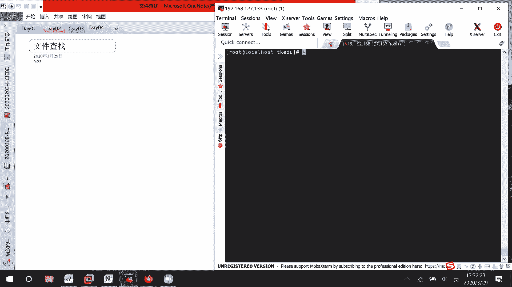

# 01 RHCE8.0视频教程【45课时】 - P14：20200329-RHCE-06_recv - 六竹书生6682 - BV1m84y1f7ss

下午这边的话呢我们要开始这个文件，查找这一块东西。

如果说你是在图形化界面当中的话呢，也是可以去查找的，R o t，然后呢自己去输入一下密码，这边的话呢嗯比如说进入到桌面当中，按一下键盘上的那个叫做windows键，稍等一下。

你看这边的话呢，你就可以去sir去，比如说你想要去找什么，就在这里去输入，但这个的话呢可能找出来的东西不是特别准确。

好吧，我们今天下午的话呢要去讲几个命令，有几个命令的话呢之前是讲过的，第一个which，第二个where is，第三个的话呢locate，第四个的话呢found的这边的话呢。

建议大家重点掌握这个放的这个的话呢，就是说一定会去，就是说像之前的版本当中是一定有考到的，而且有时候的话呢你们在公司当中，比如说去安装一些环境啊，或去查找一些文件啊，又放的会更多一点。

这边像这个位置的话呢，什么时候会常用到呢，查询命令的脚本的时候，就比如说LS这个命令是在哪里呢，我会用这个V去做吗，然后像这个where is的话呢，什么时候会去做呢。

where is有时候的话呢也是会去查询一些命令啊，一些工具它所在的一些位置，像这个locate的话呢，嗯他就说全局全局的话呢去进行一些搜索，搜索文件，但是这个locate的话呢，它关联了一个数据库。

这个数据库的话呢一周更新一次，也就是说你可能现在啊，比如说我这边我现在随便去创建一个TCHAA，你比如说locate aa，他可能就找不到，因为像这个的话呢，它就是说还没有被更新，还没有被发现吗。

所以如果想要使用locate的话呢，到时候需要先刷新一下，就是说更新一下不就，可他的话呢保存了一些信息在里面，接下去的话呢我们来看一下，还有一个的话呢叫做FD，FD的话呢它功能很强大。

你可以根据文件的名字去查找，还有呢文件的一些属性去查找，还有呢文件生成的时间去查找，还有的话呢文件的所有者啊，等东西的话呢去进行查找明白吗，我们这边的话呢呃虽然这个位置之前我们学过。

还是要来简单的去看一下好吧，首先w i c h help，这边的话呢后面是不是嗯稍等一下，你看which有选项，你跟选项没有选项的话呢，你就把命令给跟上去吗，他的话呢写出完全的命令路径。

就说输出命令的一个完整路径嘛，学LS你看在user bean下面嗯，上次课的话呢，在不是上次课，就是说后面的话呢，有一位同学在群里面去问了一个问题啊，就比如说像这个tree。

我的话呢之前可能city user bean对吧，我是不是这样子去做这个，后面再讲脚本的时候呢，我们会讲到，因为LLT它的话呢，我们把它定义成一个叫做脚本的一个文件，这边的话呢就是说看不到哈。

它是一个脚本，就相当于你们在做编程，做开发的时候是一个可运行的文件嘛，我前面斜线加上一个A点斜线，tree就表示要运行这个文件，后面再加一个home，表示我想要指定去看混目录下的一个信息吗，明白吗。

这我之前跟他解释过了，也跟你们说一下哈，好稍等一下WLSVP，这样子的话呢都可以去进行一些查询，我就不再看了哈，他就查询一些脚本，然后像这个where is呢，我们来看一下WHEREE，他这边的话呢。

也就是说去定位一些二进制的圆啊，或者一些叫做帮助的一些文档信息，这个命令他后面的话，你看这里就跟着不是一些command了吗，就不是一个命令了嘛，你看我while is l s。

它这边的话显示出来什么哦，LS它的一个脚本文件在哪，他的一些main文件在哪，还有一些比如说他的一些呃，这个应该是他的也是main文件在哪里啊，就这样子，好像VIM它的一些文件是怎么样子的。

VIM的脚本在哪，它的一些相关的哦哦案例案例文件啊，还有一些main文件啊，在哪里，你看都可以给我们显示出来，where is的话呢比我们的一个which，你可以想成就是说更加详细一点。

which的话呢只是去看一下它的一个脚本，这个的话呢连他帮助信息的呃，就是说连他帮助的一些文档的话呢，都可以去显示出来，好下面这边的话呢我们就是说来locate吗，Locate，我CD到ten啊。

CD到tap目录下，我把这些文件全部给删掉，然后呢我这里随机的去创建一个文件哈，touch20200329回车，现在locate去查找吗，他的话呢就是说在相同的目录下，好像就是说都没有查询到。

都没有查询到，因为这个的话呢因为后面出现什么，NO such file or direct嘛，他的话呢在m locate vv当中的话呢，没有看到信息，没有看到信息，现在要做的事情是什么呢。

先更新数据库，然后呢再查找，那你就可以查找到了，更新数据库的操作，update bb就这条命令后面不用去跟，如果你的系统的话呢运行比较久了，那么他update的话可能要久一点。

因为我这个的话呢是上个环境，所以我有事没事的话呢，就快照还原一下，接下去locate202002A稍等一下，嗯LLS4，Locate，2020，323稍等，Locate2。

locate202003219诶，他这里没有查找到哈，稍等一下二区，我的话呢在这边创建一个ABC文件，再来更新一下，看，Locate a b c，A那现在这个的话呢又出来，你看这里有。

因为像在pap目录下的话呢，是一些临时文件，它的话呢就没有根，就没有给你显示出来嘛，所以这里要稍微注意一下，它在进行定位的话呢，temp目录下的东西，是没有给你去进行一个查找的。

其他位置的东西的话呢会进行一个查找，这个注意一下就行了，稍等哈，我想一下哈，在哦在这update，这边的话呢注意点，不会去查找我们temp目录下的信息，因为这个因为tap下面的信息，是一个临时文件嘛。

所以的话呢这边就没有让他去找，就不能让他去找，下面这边的话呢我们来看一下放的，因为这个放的话呢它比较重要比较重要，我这边的话呢先把ABC给删除掉，我来make一个dir test，这样等一下的话呢。

这个实验做完了之后，我就把这个目录给删掉就行了嘛，我也有很多垃圾文件，下面这里啊我的话呢去创建几个文，就说呃文件，然后的话呢到时候再去创建几个目录，touch aa1到五创建了五个。

接下去创建小写的BB1到五，创建一个大写的AA1到五，然后的话呢我这边的话呢，再来创建一个大写的A小写的A吧，然后还有AAX吧，后面再跟个X这样子好吧，就说我串了一堆比较乱的一个文件。

等一下的话呢就是说让我们去进行一下查找，好查找一点，首先第一个我们的话呢，指定名字去进行一个查找，比如说指比如说指定文件的名字进行查找，我这边的话呢，比如说想要去查找AAE的一个文件，这个该怎么办。

他的话呢你看啊b help，他这边的话呢你看叫做CU2，就说比某个文件更新的，或者的话上面这里还有我找一下，这里好像没有写，这里的话呢是一些表达式哈，DP这个的话呢目标这边的话呢它的信息不全。

那我们的话呢来看一下它的main文件，这边的话比如说我去找一下name，稍等哈，Option，Option，稍等一下，我看一下能不能找到，如果不能找到的话呢，那我这边就直接去进行一个说了哈。

这是name哦，这里可以，这里的话呢，反正就是还可以根据一些小组的信息啊，这些去进行一个查找嘛，这边哦在这里name，你看根据文件的一个信息，文件的一个名字去进行查找吗，所以他这边的话呢属性很多。

我这一个一个的话呢把它给列出来好吧，首先根据文件名字怎么样去查找main文件的话呢，你们自己回去慢慢看，我这边的话呢就不再进行一个详细说明了，放的，AAE回车，我们来看一下。

是不是就看到了一个叫做小写的AAER，如果说他这个的话呢，叫做，大小写敏感的，然后如果说考试的时候呢，希望对大小写，对大小写大小写不敏感的话怎么办呢，有一个选项，就就是说还是name选项在前面加一个I。

他的话呢就对你的一个嗯字，就说后面要查找的关键字里面的话呢，大小写就不敏感了，你看两个结果的话呢，是不是全都有啊，我这个结果的话呢就不去给你们列出来吧，这样子你们到时候去看的时候呢，方便一点，稍等一下。

右手，然后下面这里的话呢，它的一个叫做FOUNDLAND的话呢，这样子得到的一个结果叫做大写的A啊，小写的AI是不是全都查询出来了，接下去的话呢我们再来看一下，刚才我是不是创建了一个文件。

叫做后面有E呀，二啊三啊这些这些东西啊，如果说我想要去查找，比如说以AA或者大写的A或者小写的A开头的，任何文件该怎么办，你就说查找文件中文件的名字中，包含某些关键字的时候，这该怎么办。

他的查找的话呢也是使用比如说减name啊，或者减name，但这边的话呢因为就是说有些关键字，那也就说明有些字符now在查找的时候呢，是不是就不能准确的去提供啊，这边的话呢就涉及到通配符。

通配符的通配符的话呢，我们到时候再讲那个脚本的时候，会给你们提到的，这边的话呢我就去简单的讲那么一个好吧，我们来看一下found的减N就表示忽略大小写吗，比如说AA打个问号回车。

这个的话呢我再来创建一个文件TCHAA12，你看这一个问号表示什么意思啊，一个问号问号的话呢，表示后面有一个字符，那我们经常还会用到的，比如说新号，新号的话呢，它是怎么样子啊，表示后面有零个或多个字符。

你看这后面的话呢一个字符都没有，是不是也可以出来啊对吧，信号，这个通配符的话呢，和你们平时用到通配符也基本上都是一样的，表示后面有零个有有任意一个字符吧，这个的话呢就是说大于等于零就可以了好吧。

命名的话呢是这样子，对下面这边我再补充一条就好了，OK下面这边的话呢我再补充一条就好了，这个没有什么样的一个问题哈，然后接下去的话呢，我再去创建几个比较大的一个文件，下面的话呢。

比如说我们等一下要去根据文件的大小去进行，查找的话呢，该怎么办，E d e e v zero of，比如说REDS等于一到count的话呢，等一二，三，零五好，这边的话呢我们去创建这么五个文件。

我给你们复制一下哈，这边的话呢文件创建好了，接下来根据文件大小去进行查找，那我们都知道大小的话呢，是不是用size来表示啊，那这边在查找的时候，选项的话呢相相同的肯定也是size，你看放的减as。

我如果说后面跟一个一，他这里什么都没有，如果说我跟一个二啥都没有，em出现了这个文件，出现这个文件，你们这边的话呢有没有觉得很奇怪，我这边在整个系统当中的话呢，嗯一兆或者两兆的文件肯定是很多的。

为什么这里只出现了一个file2，而没有出现其他的文件，像我们目前这种形式啊，就是说根本没有说，就是说在什么目录下进行查找吧，表示就是说如果没有指定，什么目录下查找的话，他的话呢就在本目录查找。

我们这些形式的话呢根本都没有指定路径，是不是只去指定名字了，如果说我想要指定从根目录下开始去查找呢，放的从哪里开始查找，或者从哪里就说在哪里进行查找嘛，后面再跟上一个属性，这边的话呢就会去查找。

所有大小为两兆的一个文件，这个应该能听明白哈，稍等一下，就是说不仅仅我们size的话呢，它是这样子的，向上面查找一些文件的，叫做嗯它的一个名字的时候呢，你没有指定，他也只在当前的目录下去查找的。

如果说你这边的话呢要指定特定的目录的话，你们一定要注意放到后面跟上目录，然后呢再跟选项，再跟属性值明白吧，上面这种的话呢就直接放的没有目录，直接就呃选项，然后的话呢就跟属性值知道吧。

上面这个的话呢就是当前公布，下面这个呢从根目录开始去进行一个查找，确定一个查找，这里的话呢就是说嗯这个size的话呢等于多少大，这个是一个叫做等于，因为就是说如果从根目录去查找的话呢。

嗯文件搜索速度就是说需要一点时间，我这边就不从根目录下去查找了，接下去如果说我要去查找查询文件大于两兆的，该怎么办，它的选项的话呢，还是size只是说大于两兆，你是不是就加两招就行了，文件二，文件三。

文件四，因为是3~4兆，五兆是不是都比我大小于呢，是不是减就可以了，这个根据文件大小去进行一个过滤查询，文件小于两兆的，然后下面这里的话呢我们再来看一下，有时候比如说我们的话呢想要去查找文件，大于两兆。

小于四兆的，这该怎么办，就说查询一个范围，查询文件大于两兆，小于四兆的，如果说要大于等于的话呢，其实你根据这个情况是去改一下就行了，你看这边怎么做呢，放的首先我们是不是去查找size啊，一样大于两兆。

并且这个就是说这两个之间的关系的话呢，是不是一个叫做并且或者是一个叫做与，或者是一个和大于两兆和小于四兆的一个关系，那英文单词的话呢，是不是有一个叫做and and的缩写的话呢，就是减A嘛。

and size小于四兆，那查出来的话呢，是不是只有一个三兆的一个文件好吧，如果说你想要去就是大于等于两兆，小于四兆呢，减size2M减A这样子吗，A这边大于等于两兆，估计就不行了哈。

估计是我的一个逻辑或者哪里写错了吧，你们这边的话呢就这样子应该在这里size嗯，加二应该是我逻辑哪里写错了，等一下再去看哈，然后下面这里的话呢，如果说我们要去看一个东西查询文件，他的话呢小于两兆。

然后呢大于四兆，这个的话就是说是不是或者，这个关系啊，或的话呢英文单词是不是or啊，那这边的话呢就减O嘛，所以这边就是放的size小于两兆，或者size大于四兆回车，你看是不是除了一个叫做三兆的。

还有一个他这个就包含了自己本身，小于符号的话呢，是包含本身，但是大于符号的话呢，它没有包含没有包含，稍等一下，我这是在拉大一点，啧啧啧，这个的话呢应该没有什么很大的问题啊，就是说关于我们的话呢。

怎么样去对大小的话呢去进行，就是说去进行一个选择去进行选择，然后下面这边的话呢，就比如说我想要去根据文件的所有者啊，所在主啊，还有一个比如说像文件的所有人的id，文件所有人的所在组的id去进行查找的话。

那该怎么办好吧，这边的话呢，那下面因为想要去根据文件的所有者，还有的话呢所在组，比如说他们的一个名字，或者一些id的信息去查找，那我们是不是要去准备实验数据啊，这边所有人的文件全都是root的。

那其实查找起来是没有效果的，我在系统当中的话呢，嗯我随便去创建几个用户，User add，一个叫做user1，user2U这三吧，那这个用户的话呢把它给创建起来之后，相应的他们的一个组的话呢。

是不是也会去创建下user1user2，User3，你看是不是相同的组，是不是也创建起来了，这边的话呢我们稍微去修改一下，上之前的话呢，我们是学过怎么样去修改文件的所在组啊，所有者啊，对不对。

修改就是change owner，比如说user1这个用户，user2这个小组，比如说AA1文件，AA2文件你可以去改吗，对不对，他改了，那好下面这边的话呢我就改这两这两个就好了。

上面这边多创建几个用户，是让你们去看一下，现在的话，我如果说想要去根据用户文件的所有者，去进行一个查找，根据文件的所有者去查找，那这边的话呢是不是应该就是user，那found的减user谁呢。

user1是不是A1A2，然后的话呢，如果说想要去查找文件的一个所在组呢，相同的这边是不是应该就是group啊，你看EROUP，你看A1A2是不是查询出来了，接下去的话呢。

就比如说我想要去根据用户的id去进行查找，我们平时在创建用户的时候，UID是不是用户的id，你看那这边也就是说found uid，10011001是A1A2，然后呢。

如果根据用户的一个叫做GD1002的话呢，是不是user2啊，那这边也能查找出来吗，这个应该是简单的哈，没什么问题，稍等我这边复制一下，下面这边的话呢我们再来去看一下。

如果说我想要去根据文件的类型去进行查找呢，根据文件的类型去进行查找，因为我们文件类型的话呢，它有很多种，像普通的普通文件，还有一些目录文件，对不对，还有一些快设备文件，这边我们不那么复杂。

比如说就想要去查找普通文件和一个目录文件，它的一个区别，那我们这边的话呢没有任何目录，我去创建一下目录吧，那现在是不是就有目录了，怎么去就说我们这边的话呢，怎么样去进行一个查询呢，查询目录。

它的一个选项的话呢就是TYTE，T y p e fd t y p e，我现在是不是要查询目录，目录的话呢，是不是一个D啊，你看D1到D5的话呢，就查询出来了，然后下面这边的话呢。

比如说我想要去查询文件呢，你不可能写一个减号吧，它这个的话呢是识别不出来的，如果说你要查询的是文件的话呢，这边写一个f fire，这个需要去记一下其他东西的话呢，没有什么东西要去记的好吧。

就这里减F就说普通的文件，下面这边的话呢我们来看一下，再来看一下，我比如说想要去根据创建时间来进行查询，我的话呢这边就比如说想要去查询，创建超过一天了，查询创建的文件啊，叫做时间超过一天了。

这边的话呢怎么样去进行一个查询啊，他的话呢是不是就是BD，然后后面这里呢correct加一，表示这个时间的话呢是超过一天的，这个correct time，稍等一下，因为这些文件的话呢。

都是我们刚刚创建出来的嘛，所以的话呢效果不是很好，看不出来，我们这边的话呢，是不是可以去去给这个文件去修改一下时间啊，好吧，先来修改文件时间吧，你们这边的话呢还记得怎么样去修改吗。

part去这边的话呢有一个选项D，他的话呢是不是就可以使用某一个时间啊，或者的话呢，减T是不是可以使用一个时间戳的话呢，去进行一个替代，这一个D的话呢也好，T的话也好，只是说写的格式的话呢是不一样的。

你看叫做TT减T那就是二零，比如说20年3月20日，然后呢13。十十三。30分零零秒去创建的，创建了一个文件叫什么呢，test1吧，诶等一下2020哦，这里少了一个003，20133000。

就是说年份是四位数，其他的月份和日的话呢，它们各自都是两位数，然后接下去几点24小时格式的，几分几秒好吧，当减T他这边的话呢，Invalidate，稍等啊点T这个是没有问题的，2020。

还需要一个这个东西吗，那这个时间搓，他这个就说到几分过就行了，后面的话呢几秒可以不用去跟，就说到几分过就可以了，到几分过就可以了，就是说不需要到几秒那边过好吧。

然后我们这边的话呢来看一下l l test1，你看是不是就是3月22号啊，现在的话呢我们再来放一下，嗯这边加一就超过一天，这边他的话呢20号应该是超过九天，八天吗。

十天放的3月20号火线的系统时间是多少，是3月29号，我看一下correct，加一，超过一天的那个文件就是了呀，稍等我先看一下，我看一下要不要加个day，Correct e d a y10。

加1000诶，这个是对的呀，超会放的，Correct time，稍等我看一下，FIND减减，Help，name叫做FDTIME，C t m d，嗯they start，这个是开始，不是这个。

By studies was last change，多少个小时之前，放correct time，超过一，他这边也没有出来，教主我看一下啊，给它里面去写点东西，看2H减T20200320。

然后的话呢far你数一下，看03201330，嗯嗯他这时间改过来了，叫做，等一下v i m fire1，哦我知道了它里面本身有东西的，他这个的话呢没有去给我查询出来哈，其他文件倒是有查询出来。

就本地的这个文件的话呢，没有去给他查询出来，没有给他查询出来，这个命令线有点问题啊，RETIME创建时间，创建时间超过一天了吗，我这个创建的时间的话呢，把它设置的是3月20号，这个是没有问题的。

但这个文件就没有查询出来，这个先保留一下，然后这个的话呢就是说再去查询一下好吧，后面的话呢是不需要去跟day的，不需要去跟day的，然后下面这边我们来找一下，就是说创建时间它是小于一天的呢。

唉这些文件倒出来，你看这个test1的话呢，系统把它记录为小于一天，小于天，而不是大于天的，那估计的话呢去修改一下时间戳的话呢，它是没有用的，修改时间戳的话呢，只是说可能啊今天创建了。

我对文件去进行一下修改，而不是说他真实的是在那天去创建的吗，好吧，这个修改了一个时间，说他还没有用，这里下面下面这边的话呢，查询创建文创建的文件，他的话时间小于一天了。

命令的话呢还是一个叫做same time，只是说这边的话呢写一个减一就可以了，刚才你们可以看到这个c time后面的话，那真的是什么啊，你后面写的N它会去给你去乘上24的，去乘上24的。

下面这里我们再来看一下，比如说想要去看一下，文件创建时间超过5分钟的有哪些，查询文件创建时间超过5分钟的，那这边就不是c time了，它的话呢是一个叫做c minute，或者你的话呢就这个天乘上0。

0几也可以吗，放的c minute，比如说超过5分钟，这些文件都超过5分钟了，比如说超过9分钟了，就这些文件超过9分钟，因为像嗯dd之后的话呢，这些文件它是不是我们后面才去创建的，可能都是在48。

或者就说其他的一些时间在创建了，它就没他，他的话呢就没有去超过4分钟嘛，就没有在这边去进行一个显示了，好吧，CBMX超过几分钟的，然后接下去的话呢，那既然有大于几分钟，肯定要小于几分钟，那你就说写减号。

如果说固定的几分钟的话呢，你就不需要再写加号减号这个东西了，直接比如说5分钟或4分钟，过6分钟，自己直接这样子去写就行了，知道吧，他这边在记录的时候不是那个时间哈，我知道了，不对。

因为我这估计是我这个目录啊，它创建的时间本身就比较新，里面的文件不可能那么早，也有可能我这在显示的时候怎么哦，这个前面有个点，对不对，可以啊，所以这边的话呢，嗯刚才说的就是说具体是几分钟的话。

那前面就不需要再跟上，比如说加号减号啊这些东西了好吧，文件创建时间等于7分钟的话，好吧，然后下面这边的话呢还有一种什么呢，比如说想要去查询创查询文件，某个文件之后创建的文件。

比如说我想知道哪些文件是在我AAX之后，去创建的，那这个的话呢，是不是就是说比我更新的一些文件啊，女儿比我更新的，那查找的话呢就是放的correct newer，后面的话呢，AAX嘛比ax更新了。

可因为这些文件的话呢，它被修改了之后，也认为是更新的，好吧，这里诶等一下，这边好吧，上面这边的话呢就是去根据各个属性进行查询，我的话呢就讲这些在考试的时候呢比较简单。

之前考试的时候呢就根据明智去进行一个查询，他的话呢就是说是一些指定的名字，指定的名字，所以的话呢你们就不需要去关心，大写还是小写了，不需要关心，你们的话呢就写这种，因为他已经指定确定了名字了吗。

你就使用name选项就可以了，不需要使用i name，明白吗，好下面这边的话呢，我们都已经查找到这么多东西了，如果说我想对查找的结果进行操作，这个又该怎么办，就是说对查找结果进行操作。

那这边的话呢我们都知道的found names，比如说AA是不是查找出来这些东西啊，我们以前是不是学过管道符啊，前面的执行结果做前面的执行结果，作为我的后面的执行输入嘛，LS减L，但是你看一下。

我刚才查询出来的只有一些AAERAN5，这些东西，现在呢V它也出来了，这就说明我这种形式的话呢，它是不能生效的，不能生效的，那具体如果真的想要去执行的话，怎么办呢，管道符你还是要的这边添加一个选项。

AXARGS就表示后面呢有一些选项，LS减L，你看是不是就对这个A1啊，A1AA2A三这些信息去进行一个显示，所以呢这个在之前的一个基础之上多了，就说在之前管道服的基础上的话呢，多了一个选项。

这个选项的话呢，表示后面这个命令是想要去执行，前面的一些信息，就是说不是所有的命令都那么规范，个别命令的话呢，可能不会按照以前的一些习惯来嘛，知道吧，查询的结果进行，这是第一个就是说再次进行操作。

然后还有呢，如果说我想要把这些查询到的东西进行删除呢，是不是RM rf啊，这个时候你再来看一下，叫做稍等found a a开头的ARDSLS减L，你看这边的话呢，因为没有查询出来任何东西。

所以他的话呢就把所有的东西去进行一次执行，对吧，因为没有查询到任何东西，他的话呢就会把当前目录的信息的话呢，去进行一个执行，所以这个ARDS的话稍微还是有点问题的，能看出来吧。

不用管道符直接连接LS这个的话呢，因为后面的话我还要去讲一种情况，就是说你直接这样子对吧，不用管道符，直接跟LS直接这样子吗，哦你说直接把这个LS作为一个选项去做对吧，哦我知道你的意思了。

那像他说的话呢，就是说像这边去跟一个LS的话，那确实也是可以的对吧，所以这边的话呢去新增加一种方法，叫做啊直接这样子去LS，我们上面的话呢如果去跟上一个选项，就是说有管道服的那种形式的话呢。

可以发现有问题，他的问题是什么呢，如果没有东西查询到，又对该目录进行显示，这边的话呢像这种新增加的方式，就王良说的嘛，放的刚name的话呢，他就没有这种问题了，如果查询不到的话呢，他就不会去进行显示。

因为现在的话呢，ls s是作为选项一样的去进行一个使用，那这边的话呢如果说我要进行一个RM rf呢，套现又不行了，诶等一下man放的LS，你等一下，他这边就是说可以。

这里的话呢可以去进行一个LS的一个显示，这里els printer的话打印也可以的，那像我这边如果说要去进行一个删除呢，王洋有没有什么办法并删除，这边的话呢减RM应该是没有的吧对吧，但像上面这个的话呢。

它可以去RM一下，就是说像这种作为选项的话呢，它的一些命令还是比较有限的好吧，就对甘露如果有有问题，就没有查询的东西，就进行一个对咱们有好，下面这边的话呢我们继续来看一下，像这种的话呢。

它的一个格式是有局限性的，不是说所有的命令都能执行，但是这种格式的话呢它也有问题，我们的话呢现现现在下面说另一种方式，另一种方式他的话呢还有一种格式是什么呢，叫做比如说放的em。

我把和BB相关的给查询到好吧，后面这里跟王阳说的一样，跟一个选项执行执行什么呢，RM叫做RF，后面这里打一个花括号，这个花括号是干嘛呢，EXEC前面的执行结果，我用花括号来进行一个承接。

就相当于我去执行RM杠F它的一个结果吗，接下去他这个格式的话呢稍微比较难记，后面跟一个反斜线，再跟一个分号表示表示这条命令就结束了，回车，这个时候的话呢，你看EXEXECLS减L稍等一下，这样子。

你看因为没有查询到的话呢，是不是就是说就不会去进行一个显示啊，而且像这个EXEC的话呢，它的音就说它也不会像XARGS的话呢，会有那些问题，但是的话呢支持的命令的话呢又比较多一点。

所以这里的话呢第三种方式，EXEC的一个方式，这个AXARJS的一个形式，这边的话呢就作为选项的一个形式嘛，其实我这个也是一个选项，也是一个选项，只是说进行了一个扩展而已，进行了一个扩展而已。

这种的话呢它就不会有太大的一个问题，就稍微来说格式难记一点，大家的话呢去给他记住就可以了，好吧，这没有问题啊，这个的话呢是怎么样对我们得到的结果，去进行一些执行操作，没有问题吧。

下面这边的话呢我再去讲一种查找方式，就让你们自己去练习一下了，好吧，再坚持一下哈，我们刚才的话呢像时间所有者全都讲过了，现在比如说想要去根据权限查询文件，虽然说根据权限的话呢查询不是很多。

但是我们自己好歹也得去了解一下嘛，嗯这边的话呢，我就把这些文件先全部给删除掉吧，然后再来叫做touch aa，1~5重新去创建一下，这边的话呢就随便去修改，比如说全剧mod修改权限吗。

哦4241个叫做AA1的好吧，我这边的话呢根据权限去进行查询，它的一个选项是什么呢，CONNE你就跟一个PERM就可以了，IP的话就不用去跟了，他是一个缩写，你看found permit。

比如说我想要去查424的回车，这边的话呢是不是只查询到一个，像这种模式的话呢，它就是一个严格匹配，我去查询所有者的位置，要有四，就说四的这个权限所在组的话呢，二然后呢其他用户的话呢有个四的权限。

或者你看我再来change句mod777AA2放的permit，424这边它是不是啥权限都有啊，但是的话呢像放的permit，424是固定匹配某一个权限固定匹匹配，就是说每一位的权限我都得把它给匹配中。

这里每一个每一种用户类型的权限，必须全部匹配上，我才可以，没有匹配上的话呢是不可以的，下面这边的话呢我们再来看一下另一种，如果说我只想要去查看所有者拥有读的权限，或者所在主拥有写的权限，或者其他用。

用户拥有一个叫做服务的权限就可以了，该怎么办，就是说任意一种用户拥有，就是说拥有我想要查询的权限，你都给我返回回来，这个该怎么写呢，比如说啊我希望所有者要有毒，如果所有者没读呢，也可以，所所在组的话。

那有写，如果所在组没有写权限的，也可以，其他用户你有毒，就这三个的话呢，你给我满足一个就可以了，这个的话呢怎么办呢，放的还是这样子，permit只是说前面加个斜线424，你看这边12345全都出来了。

为什么呀，我的一个所有者，大家是不是全都有读的权限，然后这个的话呢，像这个其他用户是不是也全都有读的权限啊，我这边给你们去改一下，比如说比如说圈圈mod，我的一个叫做索者减去一个R，这个时候去查找A5。

是不是还有为什么呢，他其他用户是不是还有读的权限，如果说我把他其他用户读的权限也剪掉，再来查，是不是AA5就没了，现在的AA5的话呢，它的所有者没有我想要的读权限，它的所在主没有我想要的写权限。

它的其他用户也没有，我想要的一个叫做啊读权限，所以就不能被查询到了，如果是我想他被查询到呢，很简单，圈去mod，我是不是给他，可以给他其他组加一个叫做无权限就可以了，只要三就说三类用户的话呢。

拥有任意一个权限就能够被查询到，这个能明白吗，上面这上面这个的话呢是严格匹配，下面这个就是说某一类的用户，拥有某个权限就行了，拥有某个权限就行了好吧，然后的话呢，现在下面这里呢还有一个还有一种形式。

最后一种形式啊，如果说我希望什么呢，叫做每每任意任意一种用户至少具备该权限，还能被查询到，比如说还是424为例，我的话呢所有者至少要有一个R权限，你用RW也可以，其他用所在组呢你要有一个W权限。

其他权限我不管，然后叫做其他用户呢，你一定要按还有一个R权限，其他权限有没有呢，我不管，也就是说这三种权限，你三类用户当中必须要具备，缺一个都不行，怎么样去找呢，Found permit，减号424。

你看AA1和A2被查询到了，因为四权限两个人都有二权限，两个人都有四权限，两个人都有吗，如果说我希望这个叫做A4也能被查询到，怎么办，是因为他的话呢所有者的独有，其他用户的独有。

是不是就是缺了一个所在组的血啊，全剧mod g加上WAA4，这个时候你看它能不能被找到，是不是也可以被找到了，所以这边的话呢，就是说一定任意一种用户至少具备该权限，我的话呢。

后面这边就是说每一个位置去设置了，一个叫做嗯用户的一个呈现是怎么样子的吗，好吧。

