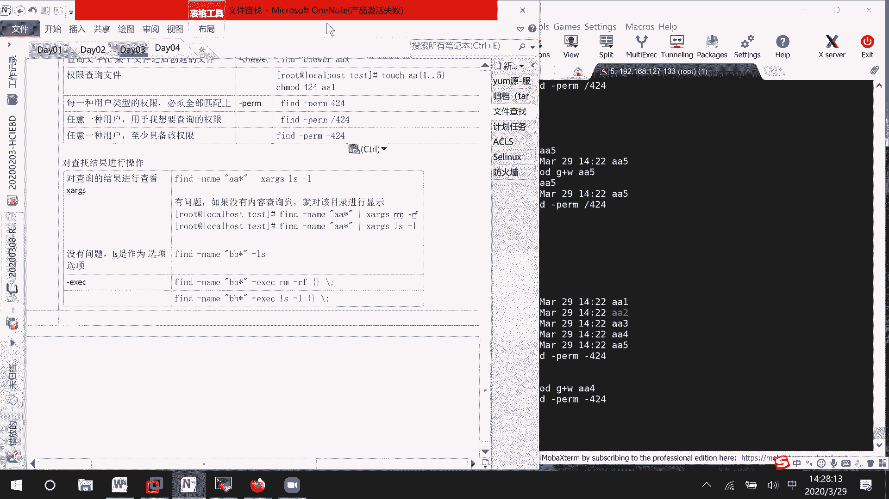

# RHCE 8.0 课程：P14：文件查找与管理


在本节课中，我们将学习在 Linux 系统中查找文件的多种方法。掌握这些命令对于系统管理和故障排查至关重要。我们将重点介绍 `which`、`whereis`、`locate` 和功能强大的 `find` 命令，并学习如何对查找结果进行进一步操作。

## 图形化查找简介

在图形化界面中，您可以通过搜索功能查找文件。例如，按下键盘上的 Windows 键，在搜索框中输入关键词即可。但这种方法可能不够精确，因此我们主要学习命令行工具。

## 命令行查找工具概览

我们将学习四个主要的查找命令：`which`、`whereis`、`locate` 和 `find`。其中，`find` 命令功能最强大，是考试和实际工作中的重点。

### `which` 命令

`which` 命令用于查找**命令**的完整路径。它告诉我们一个可执行命令位于文件系统的哪个位置。

**基本语法：**
```bash
which [命令名]
```

**示例：**
```bash
which ls
```
此命令会输出 `ls` 命令的完整路径，例如 `/usr/bin/ls`。

### `whereis` 命令

`whereis` 命令不仅查找二进制可执行文件，还会查找其源代码和帮助手册（man page）的位置，提供的信息比 `which` 更详细。

**基本语法：**
```bash
whereis [命令名]
```

**示例：**
```bash
whereis vim
```
此命令会列出 `vim` 的可执行文件、源代码和手册页的路径。

### `locate` 命令

`locate` 命令通过查询系统预建的数据库来快速查找文件。它的搜索速度很快，但数据库通常每周更新一次，因此可能找不到最新创建的文件。

**基本语法：**
```bash
locate [关键词]
```

**重要提示：**
如果刚创建了文件，使用 `locate` 可能找不到。此时需要先更新数据库：
```bash
updatedb
```
然后再次使用 `locate` 进行查找。

**注意：** `locate` 默认不会搜索 `/tmp` 等临时目录下的文件。

## 强大的 `find` 命令

`find` 命令是文件查找的瑞士军刀。它可以根据文件名、大小、所有者、修改时间、权限等多种属性进行查找，并且支持逻辑组合。

**基本语法结构：**
```bash
find [搜索路径] [选项] [操作]
```
如果不指定搜索路径，则默认在当前目录及其子目录中查找。

### 1. 按文件名查找

这是最常用的查找方式。

*   **精确查找：** 使用 `-name` 选项，它区分大小写。
    ```bash
    find -name "aa1"
    ```
*   **忽略大小写查找：** 使用 `-iname` 选项。
    ```bash
    find -iname "aa1"
    ```
*   **使用通配符：**
    *   `?` 代表任意一个字符。
    *   `*` 代表零个或多个任意字符。
    ```bash
    find -name "aa*"   # 查找所有以 "aa" 开头的文件
    find -name "aa?"   # 查找以 "aa" 开头，后面紧跟一个字符的文件
    ```

### 2. 按文件大小查找

使用 `-size` 选项，单位可以是 `k` (KB), `M` (MB), `G` (GB)。

*   **查找等于 2MB 的文件：**
    ```bash
    find / -size 2M
    ```
*   **查找大于 2MB 的文件：**
    ```bash
    find / -size +2M
    ```
*   **查找小于 2MB 的文件：**
    ```bash
    find / -size -2M
    ```
*   **查找大小在 2MB 到 4MB 之间的文件（使用 `-a` 表示 “并且”）：**
    ```bash
    find / -size +2M -a -size -4M
    ```
*   **查找小于 2MB 或大于 4MB 的文件（使用 `-o` 表示 “或者”）：**
    ```bash
    find / -size -2M -o -size +4M
    ```

### 3. 按所有者和所属组查找

*   **按所有者查找：** 使用 `-user` 选项。
    ```bash
    find /home -user user1
    ```
*   **按所属组查找：** 使用 `-group` 选项。
    ```bash
    find /home -group group1
    ```
*   **按用户/组ID查找：** 使用 `-uid` 和 `-gid` 选项。
    ```bash
    find / -uid 1001
    ```

### 4. 按文件类型查找

使用 `-type` 选项。常见的类型有：
*   `f`： 普通文件
*   `d`： 目录
*   `l`： 符号链接

**示例：**
```bash
find /tmp -type f   # 查找 /tmp 下的所有普通文件
find . -type d      # 查找当前目录下的所有子目录
```

### 5. 按时间查找

可以按文件的访问时间、修改时间或状态改变时间进行查找。
*   `-atime`： 访问时间
*   `-mtime`： 修改时间
*   `-ctime`： 状态改变时间（如权限、所有者变更）

时间以“天”为单位，`+n` 表示 n 天以前，`-n` 表示 n 天以内。

**示例：**
```bash
find /var/log -mtime +7   # 查找 /var/log 下修改时间超过7天的文件
find . -ctime -1          # 查找当前目录下状态在1天内改变过的文件
```

### 6. 按权限查找

使用 `-perm` 选项。

*   **精确权限匹配：** 查找权限**恰好**是 644 的文件。
    ```bash
    find . -perm 644
    ```
*   **任意匹配（/）：** 查找**任意类别用户**（所有者、组、其他）**只要拥有**指定权限即可的文件。例如，查找所有者有读、或组有写、或其他用户有读权限的文件。
    ```bash
    find . -perm /421
    ```
*   **必须匹配（-）：** 查找**所有类别用户**都**至少拥有**指定权限的文件。例如，查找所有者至少有读、组至少有写、其他用户至少有读权限的文件。
    ```bash
    find . -perm -421
    ```

## 对查找结果进行操作

找到文件后，我们经常需要对它们执行进一步操作，如查看详情、删除等。

### 方法一：使用 `-exec` 参数

这是最标准的方式。`{}` 代表查找到的每个文件，命令以 `\;` 结束。

**示例：** 查找所有 `.log` 文件并显示其详细信息。
```bash
find /var/log -name "*.log" -exec ls -l {} \;
```

**示例：** 查找所有 `.tmp` 文件并删除。
```bash
find /tmp -name "*.tmp" -exec rm -f {} \;
```

### 方法二：使用 `xargs` 命令

通过管道将 `find` 的结果传递给 `xargs`，`xargs` 会将其作为参数传递给后面的命令。

**示例：** 查找所有 `.conf` 文件并打包。
```bash
find /etc -name "*.conf" | xargs tar -czf conf_backup.tar.gz
```
**注意：** 如果 `find` 没有结果，某些命令可能会对当前目录进行操作，使用时需留意。

### 方法三：`find` 的内置动作

`find` 命令本身提供了一些简单的动作，如 `-ls` 和 `-delete`。

**示例：**
```bash
find . -name "core" -ls      # 以长格式列出找到的 “core” 文件
find . -name "*.swp" -delete # 直接删除所有 .swp 文件
```

## 总结

本节课我们一起学习了 Linux 中强大的文件查找功能。我们介绍了：
1.  **基础命令：** `which` 和 `whereis` 用于定位命令本身。
2.  **快速查找：** `locate` 依赖数据库，速度快但可能不是最新。
3.  **高级查找：** **`find`** 命令是核心，它可以根据文件名、大小、时间、权限、所有者等几乎所有属性进行查找，并支持复杂的逻辑组合。
4.  **结果处理：** 学习了使用 `-exec`、`xargs` 和内置动作对查找到的文件进行后续操作。



熟练掌握 `find` 命令的用法，将极大地提升您在 Linux 系统上进行管理和维护的效率。