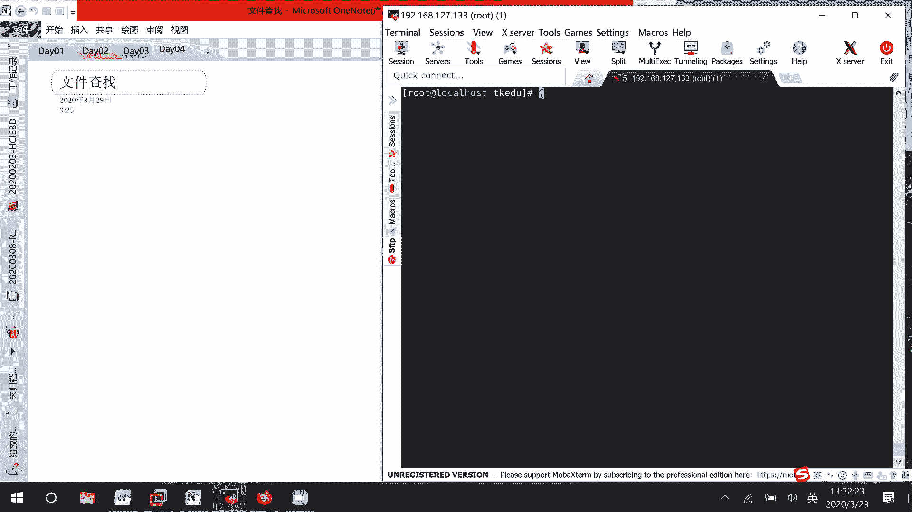
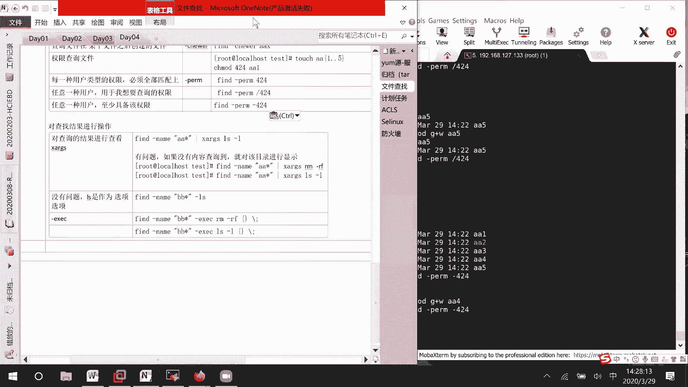

# Linux文件管理：01：文件查找命令详解





在本节课中，我们将要学习在Linux系统中查找文件的各种方法。我们将重点介绍 `which`、`whereis`、`locate` 和功能强大的 `find` 命令，并详细讲解 `find` 命令如何根据文件名、大小、所有者、类型、时间和权限等属性进行精确查找。掌握这些命令对于系统管理和日常运维至关重要。

## 命令概览

以下是几个常用的文件查找命令及其简要介绍。

*   **`which`**：用于查找并显示给定命令的绝对路径，主要用于查找可执行文件（命令）。
*   **`whereis`**：用于定位命令的二进制文件、源代码文件和帮助手册页的位置。
*   **`locate`**：通过查询预建的数据库来快速查找文件，但数据库通常不是实时更新。
*   **`find`**：功能最强大的实时查找工具，可以根据多种条件（如名称、大小、时间、权限等）在指定目录及其子目录中进行搜索。

## `which` 与 `whereis` 命令

上一节我们介绍了几个查找命令的基本用途，本节中我们来看看 `which` 和 `whereis` 的具体用法。

`which` 命令用于查找系统命令的存放位置。例如，要查找 `ls` 命令的路径，可以执行：

```bash
which ls
```

该命令会输出类似 `/usr/bin/ls` 的结果，即 `ls` 命令的完整路径。

`whereis` 命令提供的信息比 `which` 更详细。它不仅显示命令的路径，还会显示其帮助文档和源代码（如果存在）的位置。例如：

```bash
whereis ls
```

执行后，你可能会看到二进制文件、手册页等不同路径的列表。

## `locate` 命令

接下来，我们看看 `locate` 命令。`locate` 命令依赖于一个定期更新的文件数据库，因此查找速度非常快。但这也意味着它可能无法找到刚刚创建的文件。

例如，创建一个新文件后立即使用 `locate` 查找，可能无法得到结果：

```bash
touch newfile.txt
locate newfile.txt
```

此时，你需要先更新 `locate` 命令的数据库：

```bash
updatedb
```

更新数据库后，`locate` 命令就能找到新创建的文件了。需要注意的是，出于安全考虑，`locate` 数据库通常不包含 `/tmp` 等临时目录下的文件信息。

## `find` 命令：基础与文件名查找

现在，我们进入本节课的核心部分——`find` 命令。`find` 命令功能强大，可以实时遍历文件系统进行查找。其基本语法结构为：

```bash
find [路径] [选项] [操作]
```

如果不指定路径，则默认在当前目录及其子目录中查找。

首先，我们学习如何根据文件名进行查找。这是最常用的查找方式之一。

以下是 `find` 命令根据文件名查找的几种常见用法：

*   **精确查找**：使用 `-name` 选项进行精确的、大小写敏感的文件名匹配。
    ```bash
    find /home -name “myfile.txt”
    ```
*   **忽略大小写**：使用 `-iname` 选项进行不区分大小写的文件名匹配。
    ```bash
    find /home -iname “myfile.txt”
    ```
*   **使用通配符**：可以使用 `*`（匹配任意多个字符）和 `?`（匹配单个字符）进行模糊查找。
    ```bash
    find . -name “*.log”      # 查找所有.log结尾的文件
    find . -name “file?.txt”   # 查找如file1.txt, fileA.txt的文件
    ```

## `find` 命令：根据文件大小查找

除了按名称查找，`find` 命令还可以根据文件大小进行筛选。这在我们需要清理磁盘空间或查找特定大小的文件时非常有用。

文件大小的单位可以是：
*   `c`：字节
*   `k`：千字节 (KiB)
*   `M`：兆字节 (MiB)
*   `G`：吉字节 (GiB)

以下是基于文件大小的查找示例：

*   **查找等于特定大小的文件**：
    ```bash
    find / -size 2M
    ```
*   **查找大于特定大小的文件**：
    ```bash
    find /var/log -size +10M
    ```
*   **查找小于特定大小的文件**：
    ```bash
    find /home -size -1k
    ```
*   **查找大小在某个范围内的文件**（使用 `-a` 表示“并且”）：
    ```bash
    find / -size +1M -a -size -5M
    ```
*   **查找大小小于或大于某个值的文件**（使用 `-o` 表示“或者”）：
    ```bash
    find / -size -1k -o -size +10M
    ```

## `find` 命令：根据所有者/组与类型查找

在Linux系统中，每个文件都有所属用户和用户组。`find` 命令可以据此进行查找。

*   **根据文件所有者查找**：使用 `-user` 选项。
    ```bash
    find /home -user alice
    ```
*   **根据文件所属组查找**：使用 `-group` 选项。
    ```bash
    find / -group developers
    ```
*   **根据用户ID或组ID查找**：使用 `-uid` 和 `-gid` 选项。
    ```bash
    find / -uid 1001
    find / -gid 1002
    ```

此外，`find` 命令还可以根据文件类型进行查找，使用 `-type` 选项。

以下是常见的文件类型标识符：

*   **`f`**：普通文件
*   **`d`**：目录
*   **`l`**：符号链接

例如，要查找当前目录下的所有子目录，可以执行：

```bash
find . -type d
```

## `find` 命令：根据时间查找

`find` 命令另一个强大的功能是根据文件的访问时间、修改时间或状态变更时间进行查找。这对于查找最近变动过的文件非常有用。

时间参数说明：
*   `atime`：访问时间
*   `mtime`：文件内容修改时间
*   `ctime`：文件状态改变时间（如权限、所有者）

时间以“天”为单位，`+n` 表示 `n` 天以前，`-n` 表示 `n` 天以内，`n` 表示正好 `n` 天前。

以下是基于时间的查找示例：

*   **查找7天内被修改过的文件**：
    ```bash
    find /etc -mtime -7
    ```
*   **查找超过30天未被访问的文件**：
    ```bash
    find /var/log -atime +30
    ```
*   **查找比某个文件更新的文件**：使用 `-newer` 选项。
    ```bash
    find . -newer reference_file.txt
    ```

## `find` 命令：根据权限查找

最后，我们学习如何根据文件权限进行查找。这在安全检查或权限审计时非常实用。

使用 `-perm` 选项可以按权限模式查找文件。

*   **精确权限匹配**：查找权限**恰好**是 `644`（即 `rw-r--r--`）的文件。
    ```bash
    find . -perm 644
    ```
*   **任意匹配（/）**：查找**任何一类用户**（所有者、组、其他）只要拥有指定权限即可的文件。例如，查找任何人有读权限的文件。
    ```bash
    find . -perm /444
    ```
*   **必须匹配（-）**：查找**每一类用户**都**至少**拥有指定权限的文件。例如，查找所有者有读、组有写、其他有执行权限的文件。
    ```bash
    find . -perm -421
    ```

## 对 `find` 结果执行操作

仅仅找到文件通常还不够，我们往往希望对找到的文件进行进一步处理，例如查看详情、删除或打包。

`find` 命令可以通过 `-exec` 或 `xargs` 将查找到的结果传递给其他命令。

*   **使用 `-exec` 选项**：这是 `find` 命令的内置操作方式。`{}` 代表找到的文件，命令以 `\;` 结束。
    ```bash
    # 查找所有.txt文件并显示详细信息
    find . -name “*.txt” -exec ls -l {} \;
    # 查找所有.log文件并删除
    find /var/log -name “*.log” -exec rm -f {} \;
    ```
*   **结合 `xargs` 命令**：通过管道将 `find` 的结果传递给 `xargs`，再由 `xargs` 构建并执行命令。这种方式在处理大量文件时可能更高效。
    ```bash
    # 查找所有临时文件并删除
    find /tmp -name “*.tmp” | xargs rm -f
    ```

**注意**：在使用删除等危险操作前，建议先使用 `ls` 或 `echo` 命令预览将要操作的文件列表，确认无误后再执行。

## 总结



本节课中我们一起学习了Linux系统中多种文件查找方法。我们首先了解了 `which`、`whereis` 和 `locate` 等快速查找命令的适用场景。然后，我们深入探讨了功能最强大的 `find` 命令，学习了如何根据文件名、大小、所有者/组、文件类型、修改时间和权限等多种条件进行精确查找，并掌握了如何对查找结果执行进一步操作（如 `-exec` 和 `xargs`）。熟练运用这些查找技巧，将极大地提升你在Linux环境下的工作效率和问题排查能力。