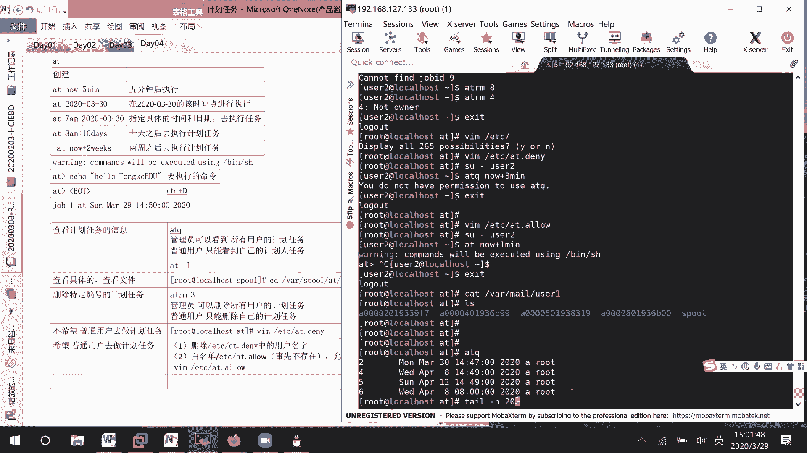
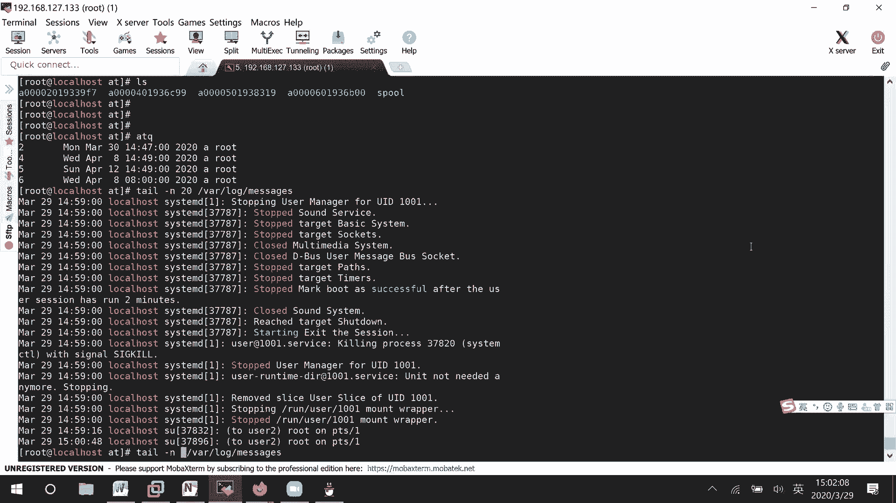
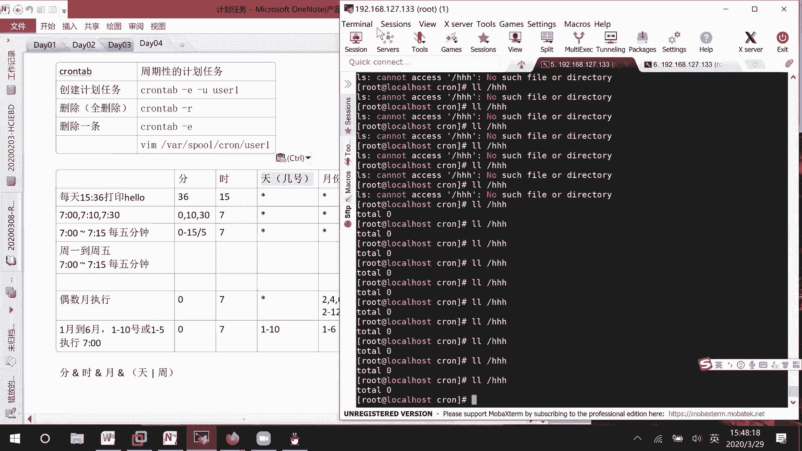

# 01 RHCE8.0视频教程【45课时】 - P16：20200329-RHCE-08_recv - 六竹书生6682 - BV1m84y1f7ss

现在开始的话呢讲计划任务，计划任务这一块的话呢，我们会去讲两种方式的计划任务，第一种方式的话呢叫做at它的一个计划任务，这个的话呢是一次性的计划任务，好像你们的话呢去定一个闹钟。

他的话呢只在今天早上想一次，后面就不再想了，然后还有一个的话呢叫做countable，这个是什么呢，周期性的计划任务，就比如说我每周的工作日去进行一个闹铃，然后周末周日的话呢不去闹铃嘛，不会去讲这两种。

之前的话呢就是说考试的时候考到了，是这个叫做嗯第二个第二个，所以呢你们就说有重点，有重点性的话呢，第二个一定要掌握，就是说第一个的话呢你也可以去掌握嘛，好我们在学习的时候呢，先来学习第一种的一个形式。

叫做at的一个形式，他的话呢只执行一次就不执行了，那这边的话呢我们来看哈，首先它的话呢是怎么样去做的，At help，这里的话呢C可能就是说去创建一个呃任务，然后呢QFQ的话呢。

就是说去显示一下他有哪些任务吗，我们的话比如说想要去进入一个交互式的界面，去进行操作，怎么办呢，at比如说什么时候去执行呢，后面跟上一个时间点嘛，跟上一个时间点，比如说叫做嗯，我们现在看一下帮助文件吗。

man a t这边的话呢，他也就是说在特定的时间去执行命令，我看一下这边的话呢就是一些时间的格式嘛，几几月几日几年几月几日几年，然后的话呢就说你后面跟上一个日期的话，比如说2020年3月30日。

那也就是说明天的这个时间点，他的话呢会去进行一个执行，还有一种呢你可以就是说去加上某一个时间，这也是可以的行吗，或者就是说呃在三天之后的四点，或者什么时候的话呢去进行一个执行。

这里的话呢就是说有说明时间格式的话呢，去怎么样去写哈，好建，这边的话呢，我们来看一下我们自己如果要去写的话，该怎么办，at后面跟一个时间点，比如说我这边的话呢，希望5分钟之后去进行一个执行吗，加五呃。

5now加5minute，你看进来了，然后后面的话呢，这里你可以就说去执行一个脚本啊，或者就是说就写一些简单的命令啊，它也是可以的，command will就是说会去执行这些一些脚本，这边的话呢。

我们等一下就去在某个地方去写一个脚本好吧，或者这边就一扣去诶，然后this is hello，EBU吧，就这样子吧，回车，然后呢接下去不是已经好了吗，对吧，这件事做好了。

那就是CTRL键加上B他的话呢就可以进行退出，或者输入一个叫做尖括号，EOT的话呢，他也可以去进行进行一个结束的，这里的话刚才是不是45分啊，我加了5分钟之后的话呢，是不是就是50分50分。

他这个格式我这边的话呢就说5分钟后，执行，然后这里的话呢就是说要执行的命令是什么，或者后续的话呢我们写写了脚本之后，你这边的话呢就放一个脚本的名字也是可以的，然后这边的话呢CTRL加D键按住之后。

它的话呢就可以进行一个结束行吧行，然后的话呢如这个是5分钟之后，我如果说希望是嗯明天去执行呢，At20200330，明天有30号吗，回车稍等一下呃，2020，in mouse number哦。

这写反了减号，这里就说明天的某个时间，我这边的话呢随便去写吧，一扣去20200320码回车，DOT诶，他这边UT的话呢没有直接结束，就说如果你在写脚本的时候呢，UT可能是可以的。

但是这边的话呢按一个CTRL加V，它就相当于退出了这个文件的编辑，知道吧，这里的话呢，你看我明明就写了明天的一个时间点，就是说日期它后面这边的话呢，是不是时间都给你了，如果说没有去指定具体的时间的话。

这边就是说在明天的这个时候去进行一个执行，2020年0330到该时间点，进行执行，这个没有问题吧，如果说我希望在明呃，明天或者后天早上的七点去进行一个执行呢，at7点am202003，比如说三零吗。

回车线这里的话呢，是不是也可以去做20200330呃，叫做，七的零七冒号零零吧，我随便说一些东西，CTRLD提交一下，这个的话呢，就是说指定具体的时间和日期去进行一个执行。

指令具体的时间和日期去执行命令啊，或者脚本嘛去执行任务好吧，这没什么问题，下面这边的话呢，或者说我希望十天之后，或者或者说我希望两个星期之后去执行了，这里就是at10天之后再加上10days吗，稍等哈。

这这前面的话呢需要去写一下，今天加上十天之后，好吧，看这里的话呢，今天加上时间之后，就是4月8号嘛，如果说今天加上两周之后呢，哎等一下一扣去BBB，两周之后的话呢，它可能就是一个叫做4月12号嘛，对吧。

没问题，所以这里的话呢，时间他还如果说你有一个具体时间的话呢，那就是呃加上比如说十天之后的早上八点，那也就是说八点或者8。8M吧，然后呢以扣去好吧，你看这里的话呢是不是就十天之后的八点。

因为如果你没有写具体的时间的话，那就以当前的时间去做，有具体的时间的话呢，那你就去指定一下嘛，嗯这个的话呢就是说十天之后据执行计划任务，而这里的话呢，下面这也就是说两周之后去执行计划任务，等一下。

这个没有什么样的一个问题啊，接下去我们这边的话呢讲了半天的一个创建，他的话呢呃怎么样去创建，你们一线应该是了解了哈，那我这里的话呢怎么样去查看，我目前的话呢有没有存在一些计划任务呢，查看计划任务的信息。

那这里也就是说是at q吗，可以去查询，这里的话呢嗯就比如说4月8号啊，3月30号啊，是不是全都有啊，然后的话呢这是谁的计划任务啊，然后呢星期几去执行啊，这个的话呢是第几个啊，是不是全都有啊。

全都有在这边，那好这个的话呢没有什么样的一个问题啊，稍等我看一下先嗯，这个ATQ，这个只是说看到的话呢是一个简略的信息，除了这个ATQ之外，还有什么呢，AT减L他们的话呢看到的信息全都是一样的。

都是去查看计划任务，下面这边如果说我想要去看每某一个信息呢，某一个信息，你看这个可不可以啊，ATQ2回车，它的话呢没有什么样的一个反应啊，我们现在的话呢想去查看具体的，像这个AT减L2，它也无动于衷。

我们的话呢可以去查看文件，这些计划任务保存的目录在哪里呢，CD v a r s pro sp里面存在很多东西，其中有一个就是我们的at的计划任务，Cd，We are poor at，你看就这么多。

但是的话呢它这里就说嗯，是使用随机的一个名字去进行命名的，不太方便去看，不太方便去看，我们的话呢可以随便去cat一下，比如说A002002019339F的，这个的话呢。

是就是我们刚才写的某一个计划任务啊，202003-20吗，这边的话呢都有说，这边的话呢它就是一些脚本的一个信息，谁去执行它，然后呢到时候有结果了之后呢，发送给谁，然后呢在哪一台设备上去进行一个执行啊。

以及其他的一些信息，知道吧，然后后面这里比如说要一扣取某一个信息吗，以扣取某一个信息，这没问题啊，就是说去cat这个文件下面的东西就行了，然后这里的话呢，我们刚才呃是不是创建的第一个计划任务。

就是5分钟之后执行，我没记错的话，好像50的时候应该执行了吧，但现在这里都没有他的信息的话呢，放到哪里去了呢，mail稍等一下，One mail，诶root怎么没了呢，VAR叫做mail。

这个root的信息就在这里，这边的话呢它是给我们的一个root，去发了一封邮件，发了一封邮件，Cd root l s，这边的话呢ls4杠A，这边好像就是说没有去把它给显示出来，那我们等一下的话呢。

用普通用户的话呢去做一下，然后再看到他的东西吧，那边哈我的话呢怎么样去创建，怎么样去查看，全都看到了，如果说我想要去把某一个计划任务给删除掉呢，一种方法你的话呢CD哇哦，CD vs pro叫做at。

稍等一下，这里你的话呢可以把某个文件给删除掉，但是他这个文件的话呢我们不是很熟悉，直接删除的话呢，万一删错计划任务的话，那你什么东西都没了，知道吗，那现在的话呢我们可以这样子，At remove。

后面的话呢你去跟上编号，比如说我的话呢想要去删除第三个计划任务，你看at cue，他的话呢第三个数就没了，这里删除特定编号的计划任务，好下面这边的话呢，就比如说我使用一个普通用户去做一下。

我的计划任务吧，s u user1这边的话呢让他去做一个计划任务，at比如说now加上3分钟之后，然后的话呢让他去显示一下日期好不好，CTRLD提交一下，现在这里的话呢。

你看Q是不是就看到有一个是A用户，他自己去做的，然后呢这边EXITFQ，你看我root用户的话呢，是不是可以去看到所有用户的一个叫做嗯，计划任务的信息对吧，稍等一下，这边叫做管理员。

可以看到所有用户的计划任务，然后的话呢普通用户只能看到自己的计划任务，行，然后现在这边的话呢，我再去切换到一个普通用户下面去啊，S u user2，他的话呢sq哦不对，at比如说now加上2分钟。

他也去显示一个对的好吧，CTRLD一下，现在的话呢这个user2，它可以自己去把自己的计划任务给删除掉的，at r m8哦不对，rm8他的话呢比如说rm4不行，因为的话呢这个计划任务不是他的。

然后这边的话呢叫做管理员，可以删除所有用户的优化任务，但是普通用户只能删除自己的计划任务的，明白吗，下面这边如果说我的话呢，不希望普通用户去做计划任务的话，我怎么样去禁止它呢。

那这个需要我们的管理员来进行一个配置，这边的话呢在etc下面，就是说应该有一个at deny的文件，这个的话呢就是一个黑名单，DNIGHT就是黑名单，你不想让谁去做计划任务。

就把他的名字写在这个文件当中去，你看回车我不想要留着二去做计划任务嘛，去写进去，现在你看啊，我再切换到user2，At you now，加上比如说3分钟他就没他，他的话呢就不能去做了，那现在的话呢。

如果说你希望某个用户去做计划任务呢，有两种方式，第一种方式删除at design中的叫做用户名字吧，每个用户的话呢占用一行，占用一行，还有一个的话呢，是不是他还有个文件，既然有den。

他肯定有一个叫做ALLOW文件，Long，就是说允许的一个文件，这两个文件的话呢要注意一下是允许优先的，这个是啊，你可以把它想成白名单嘛，他的话呢是允许优先的，我们可以来试一下好吧。

EXIT这边的话呢v i m at，它的话呢这个文件白名单默认是不存在的，需要我们自己先去创建好吧，事先不存在，需要我们自己去创建，那创建好了之后呢，我们就把user2的名字写进去吗。

写完了之后保存退出，我再切换到user2，这个时候at q哦不对，at now加上1minute，是不是又可以去做了，又可以去做了吗，这没有问题啊，就是说两种方法。

你的话呢去选择一种方法就可以了就可以了，二选一，At one，好一个，这边的话估计是我的一个邮件，没有那个吗，我看一下哈，好的这，叫做，嗯嗯换12log message。

4stop，这个不是，这。

等一下四十七五十九，它的一个计划任务信息的话呢，在这边去执行的时候，我现在没有看到哈，没有看到说这边的话呢去补充一个东西啊，刚才有个同有个学员问到了，就是说对于这个查看的话呢。

这个目录只有管理员有权限去查看的，那他问了一个问题，就是说如果普通用户想查看具体的信息，就是说自己的具体信息，这个的话呢该怎么办呢，有一个命令就是at它，它的话呢也是这个叫做at。

然后这边的话呢有一个选项你们可以看一下，这个的话呢叫做减C的啊，这边的话呢是减C的一个选项，你的话呢可以去看一个具体的叫做at点C，稍等一下，At q，你看我这边是不是有第十个at t减C。

我这边的话呢跟上第十个，这边的话呢就是我具体的一个计划任务相同的，如果说管理员的话呢，他想要去看呢，it减C，比如说第二个他也能看到的好吧，这边的话呢就是说查看具体内容，普通用户这个和管理员都能去用。

呃管理员就是at减C，后面的话呢去跟上编号就可以了好吧，然后这边的话呢来看一下，就是刚才提到了一个MM的选项的话呢，叫做man at，这里的话呢点M它确实的话呢有一个作用是A，等一下减M。

这边的话呢有一个作用，就是说send mail to you，When the job has no，就说已经完成了，他如果说没有输出的话呢，会给你去发一个通知嘛，但是我这边root用户的话呢。

他好像没有给我去发，我的话呢试一下一个叫做普通用户好吧，USP这边的话呢at q哦不对，at然后这边的话呢就应该是一个叫做M，后面的话呢我们再去跟一个时间，比如说now加上一分钟好吧，哦不对，开始弄嗯。

user1的话我好像没有给他权限对吧，诶我看一下，at etc叫做at叫做DENISE，我知道了，因为白名单也同时启用的话呢，会以这个白名单为主，如果里面没有看到这个用户的名字的话呢，那好就做不了了。

SU到user1这边的话呢就是at now价at诶，at now加上一分钟，然后这边的话呢叫做DTECTRLD一下，他的话呢在24的时候应该要去执行一下的，我们的话呢看一下他这边有没有哈。

V a r s pro mail，因为我们用的是一个user1去做嘛，再过半分钟左右能不能看到好吧，然后的话呢你们就他如果看不到的话呢，你可以怎么样去做呢，你这边在运行一些命令的时候。

到时候就是说可以把它执行，结果是不是可以追加到某一个地方去啊，还记得吗，Q比如说呃now加上一分钟诶，等一下now加上哦，不是at就是at now加上一分钟怎么了，DE执行结果，我这个重定向到啊。

加盟就是说我就跟目录下吧，test at好吧，CTRLD一下，等一下的话呢，就去看根目录下有没有这个文件吗，行吧，At v a r s pro mail user1，他这边的话呢没有去给它写进来哈。

要奇怪一点，我们等一下的话呢，这边呃，等到诶他也是24的时候吗，但干这个时间都已经过了呀，这时间都已经过了，他的话呢可以的，就是说我刚才去试了一个什么呢，At，加上一分钟，我的话就是user ADD。

比如说20200329的用户好吧，CTRLD一下，这边的话呢id叫做20200329诶，他这时间我又过了哈，the add2020test吧，等到26的时候呢，应该这个用户就可以去创建出来了。

哦对对对对对，阮燕顺说的对，我突然是的，他不说，我这个问题都没有想到，list叫做，Post fix，对他这个的话呢，我就装了一个这个东西，像没有相关的其他东西，还有像POSTFIX啊，我全都没装。

难怪这里一直收不到，你看这些全都是一个available，你们应该把这个POSTFIX，还有一个mail的话呢，把它给装起来应该就可以了哈，我竟然没有往这方面去想，之前的版本当中的话呢。

它这个POSTFIX是默认已经装起来了，稍等一下，Post，他们不需要start，然后这里的话因为嗯直接量子去做的话呢，用户应该是已经创建起来了，然后的话呢我想一下哈，我这边再来做一个计划任务。

L s v a r s pool remail，下面这边的话呢，比如说SU到user1吧，再来创建一个at now，加上一呃，稍等一下，2+1分钟，比如说的话呢DATE我们这边等一下试一下。

看他的话呢执行了之后，有没有去进行一个记录吧，Test，回车CTRLD，等到28分的时候看它有没有好吧，这是一个对邮件服务面包，稍等一下哈，后续啊，用户做计划任务的时候，回去检查是否在白名单中存在。

不存在不能创建，这边的话我来看一下cat vs普for mail user，济南user1，哦root他不能去看诶，我刚才是一个user1呀，他应该时间到了，应该也要去执行的。

不会是在执行的时候在根目录下去创建它，没有权限吧，应该是没有权限哈，不不不，他post fix的话也是可以的，收发邮件吗，稍等一下，我看一下app，app上要减M这边的话呢。

比如说是now加上a minute扣血，啊这个又慢了一下，稍等我再测试一下，At vr s s cool remail，什么A这边的话呢AA他就有说的有对，他这边的话呢其实邮件的话呢一直有在发。

就是我那个邮件服务的话呢没有装没有装，就导致的话呢他这边邮件的话呢一直没有收，没有收到没有收到，看到了吧，好吧对，这个是的哈，因为在以前的版本当中的话呢。

它这个POSTFIX的话呢都是默认已经安装起来了，都默认已经安装起来了，所以这里的话呢要注意一下哈，你们如果说想要去看到一个效果的话呢，呃去把这个日安装和邮件服务相关的，邮件服务的话呢。

你们有些人可能比较习惯于去用mail，这边的话呢叫做这个POSTFIX的话呢，他也可以去用的，在以前的版本当中的话呢，默认情况下我们做邮件服务的话呢，就是用这个POSTFIX，你看现在我只要去执行。

就有收到一些邮件信息，他就可以陪我去提醒了，这边现在嗯镜像的话呢虽然越来越大了，但是很多很多东西的话呢都没有去预装了，没有去预装了，这个是的哈，那好那到这里过的话呢。

我们的一个at就没有什么样的一个问题了，就没有什么样的一个问题，然后下面这边的话呢我们再来看一下叫做con table，这个东西的话呢是干嘛呢，也就是说是定时就说周期性的计划任务，周期性的计划任务。

就好像说我今天执行了，明天还想执行呢，也是可以的，你只要在创建的时候是那样子就可以了，它的一个创建命令就是CURTABLE连接help，你看U的话呢，你可以去指定特定用户。

然后的话呢如果不指定就用户当前而root自己吗，E的话呢就是去编辑L的话呢，去进行一个显示，它如果要移除的话呢，是一个RR的话呢去进行一个移除好吧，On table，比如说E这you谁去创建呢。

user1来进行一个创建，你看我进来了之后，这个是什么temp目录下有一个什么chrome table，点随机的一串字符，其实我们现在在这里的话呢，就是去编辑计划任务的嗯，稍等你看，变化。

你看是不是就有这个文件，就再去编辑一个文件，如果说你现在又不想要编辑呢，直接冒号Q就可以了好吧，命令的话呢是这个命令，然后下面这边的话呢，嗯我们如果说要往里面去写东西，它的话呢是有一些固定的格式的。

这格式的话呢一定要记住D，它的话呢各个属性之间用空格来分隔，第一个的话呢就是说几分钟，第二个的话呢几点，第三个的话呢其实也就是我们平时说的几号，你是29号还是30号，这边的话呢几月份月份。

然后后面这边的话呢就是B级，就是说星期几你是星期一呀，星期二啊，还是星期三嘛，然后在下面这里的话呢，嗯要写的就是你想要去执行的命令是什么东西，现在的话呢，就比如说我希望在每天早上的七点。

给我去打印一个卡罗好吧，明天早上七点打in打印hell，这边的话呢怎么样去呢，分7。0，那这里是不是就零分啊，七点是不是就是七啊，每天早上是不是不管是一号还是30号，我都要打个新号，几月份。

因为每天就打新号，每这样子周一到周日的话都打嘛，接下去执行什么呢，encode是爬楼嘛，就这样子就行了好吧，我这边的话呢就比如说是每天什么时候呢，15：36分吧，去打印这个东西。

那那那这里的话呢就是三六十五好吧，三十六十五点每天三个星号1coach叫做什么呢，Hello，就这样子，或者的话呢，你在这边去给它加一个引号也是可以的，这边我们来保存退出一下好吧，编辑好了之后。

你就保存退出，就保存退出那行，这边的话呢我们保存退出完毕，这里就说添加了一个新的计划任务嘛，我们现在的话呢哦再来看一下其他的一个格式，就比如说我现在的话呢希望每天早上啊，因为可能定闹钟。

一下子的话呢叫不醒了，七点定一个，07：10分去定一个，然后呢07：30分去定一个，那这个格式怎么去写呢，这也就零，37点每天早上，那你的话呢就这样子去写就可以了，知道吧，然后呢你你想要去显示什么东西。

自己这边的话呢就去写什么东西吗，而下面这里的话呢，就比如说我希望七点，7。15分，每5分钟执行一次，执行一次，这个怎么写呢，那你总不能零五十十五吧，如果万一时间更多呢，0-0到15÷5。

就是说间隔时间吗，七然后呢新号诶，等一下，然后这里新号，这里的话呢就是新号嘛，如果说我希望嗯周一到周五早上，你这样子去执行，嗯然后的话呢其他时间的话呢就不要去执行了，这个的话呢该怎么样去做呢。

你们来看一下前面这些的话，那肯定是一样的，现值是说是不是多了一个周一到周五啊，你可以12345写一下，或者的话呢周一到周51。5就可以了，好吧，就这样子去写，现在的话呢下面还有一个需求是什么呢。

比如说我这边的话呢，希望什么东西呢，叫做，我想想哈，比如说偶数月，执行命令，但是呢不是偶数列的话呢，那我就不去执行了吗，这个该怎么样去做呢，前面的话呢比如说也是时间都一样吧，每天早上七点去做。

几号的话呢，我这边不管你，我只要就是偶数列就行了，偶数列是不是2468十十二啊，还有一种写法呢，二到12÷2能取，就是说能除尽的，那我就把你拿过来，不能除尽的，那就不拿嘛。

然后的话呢这里如果说偶数月的周一周到周三，123，还有一个星期六，那你就这样子去写它的一个时间就可以了，知道吗，如果说我这边的话呢，希望嗯什么呢，因为有时候的话呢可能在执行一些命令的时候。

我希望就是说嗯音乐啊，6月他的话呢1月到6月，他每个月的一号到10号，如果是周一到周五的话呢，如果是周一到周五，那你这样子的话呢，就是说去执行我的命令，七点去执行命令，就说是这样啊，1月到6月。

你一号到10号的话呢，去进行一个执行，如果说这边不是，如果这边应该是或或，这个什么意思呢，就是说每个月一号到10号的话呢，我都会去执行这个命令，并且1月到6月，如果是周一到周五的话呢，我也会去执行。

像这边的话呢，十和分这两个要同时满足，但是几号和星期几的话呢，他们两个是一个或的关系，两个满足一个就可以了，如果能同时满足，那肯定就更好了吗，知道吧，他两个是就是说嗯两个1~10，如果说啊一号的话呢。

你看啊是周日，因为我这边的话呢设置了1~5都执行对吧，这边我设置1~5在执行，你这周日我执不执行呢，我是执行的，因为你在我一到10号这个范围里面吗，我是不需要去管，你是星期几的，然后接下去像这个17号。

不在我这个叫做几号的范围内吧，我执行吗，我是直行的，为什么呢，我受周一到周五这个时间去控制的吗，明白吧，它的格式的话呢就是这样子，星期几和我们的嗯，就是说几号的话呢，它是一个或的关系。

其他之间的关系是一个和的关系，要同时去进行一个满足，所以的话呢你们可以这样子去想啊，分以上十以上，然后的话呢接下去以上我们的几天，他的话呢就是说去货上我们的第几周就可以了，就是说整个条件为真的话呢。

那就可以去执行，没有为真的话，那就不能去执行了，好吧，那好这边的话呢我们来看一下，刚才就说去执行了一个计划任务嘛，创建了一个计划任务啊，pro cable减L，这边的话呢就是说没有任何的一个计划任务。

我这边来cat一下，We are poor mail root，他这边的话呢嗯没有去进行一个打印，稍等一下，我刚哦我知道了，我刚才好像是使用user1去做的对吧，不是我的一个root用户。

那这边的话呢我该打印的好像是hello，还是什么东西的，一扣血，我看一下这边的话呢，好这个看到root那里去了，然后稍等一下root，root不对，我要看其他人的user1的哦。

user1这边没有东西没有东西，没事啊，稍等chrome table gu，我看一下啊，on table杠，六杠1user15点，比如说叫做是44分，就不跟了，后续发一下好吧。

crown table减L哦，哦减UU的一，他这个事情的话呢是存在的是存在的，那这边的话呢让他等一下，看自己的话呢能不能去进行一个操作，所以我们等一下再看结果，这边的话呢就比如说root。

他自己想要去创建怎么办呢，USA减E就可以了，里面的话呢你直接直接去写吗，比如说每天早上的七点钟，比如说这边的话呢我就一扣去good，就这样子就行了，然后这边的话呢pro table减L他的话有一条。

我这边的话呢如果还想要去编辑，第二条呢，每天早上的八点钟1coach m o r n i n g，这个时候你再来看L它的话呢，就是有两条信息了吗，如果说我现在的话呢，阳居山主呢啊减这里的话呢。

就是说一条信息都没有了，他这样一删的话呢，其实会把所有的信息给删了，你如果说你如果说想要去删除，某一个特定的信息呢，啊CORTABLE简易进去了之后的话呢，把某一行的信息你把它给去除掉就可以了吗。

知道吧，稍等一下这个呃，这里创建删除这个的话呢全删除，是这样子的，就一个计划任务都没有了，后面跟一个减U的话呢，他就说去删除特定的用户，特定的用户，然后这里嗯叫做如果说你不他普通用户的话呢。

自己也可以去做计划任务的，不想要去做的话呢，和前面那个叫做DNA啊或者allow啊，全都是一样的，把名字的话呢给添加进去就可以了，好吧，V r s p on table cd，这边进来的时候。

你看这里的话呢，因为就是说user1他有一个计划任务，每天去进行一个执行嘛，所以的话呢，如果说你要去删除一条计划任务的话，有两种方式，第一种就是chrome到D，你再去删除某一个，第二个呢。

那你就嗯vim某个文件e a r s cool chrome，后面的话呢去跟上用户的名字，你再去编辑它，这个的话呢都是一样的好吧，叫做VR s pro，叫做male，时间是没有错的呀，我看一下。

我用这个root来做一个看，啊47分15点信号信号信号，这里的话呢就是叠第一吧，等一下哈，它的一个结果在邮件当中的话呢，应该也也会去显示的，也会去显示的，稍等一下，考试的时候呢。

基本上就是想要去考你们这个格式，把这个格式给掌握了就可以了，它的一个结果嗯，现在又没有去说明了，邮件服也装了，这边的话呢能不能成功此换一种方式吧，这边的话呢我就不对了。

就那个DIR在根目录下叫做创建一个HHH10，01：48分时间应该没写错哈，这个其实就是会创建出来，但是不知道为什么，我现在邮件服务的话呢也装了对吧，他没有去提醒，没有去进行一个提醒。

这里的话呢是能创建成功的，那这里的话呢没有什么问题，和之前的话呢一样。

