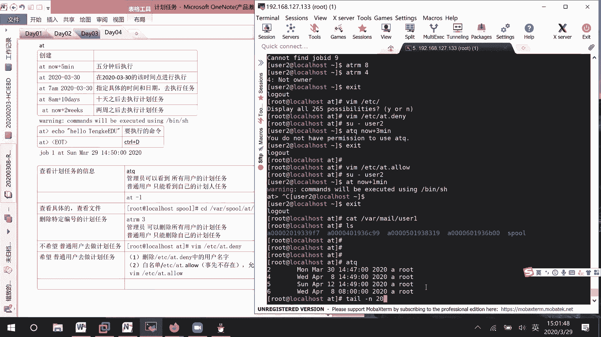
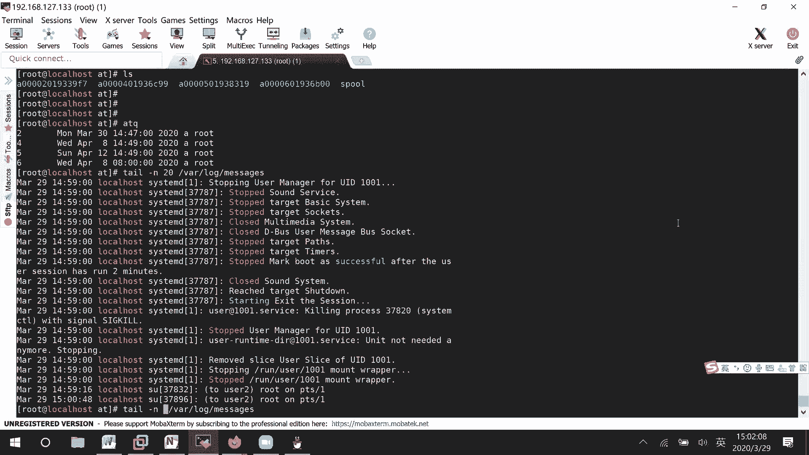
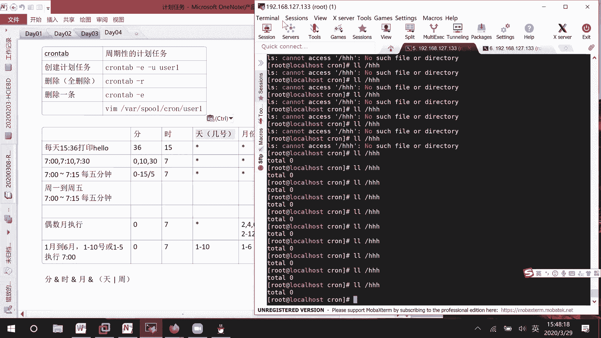

# RHCE8.0 视频教程：P16：计划任务管理


## 概述
在本节课中，我们将学习 Linux 系统中的计划任务管理。计划任务允许我们在指定的时间自动执行命令或脚本，这对于系统自动化管理至关重要。我们将重点学习两种类型的计划任务：一次性计划任务 `at` 和周期性计划任务 `crontab`。

---

## 一次性计划任务：at

上一节我们介绍了计划任务的基本概念，本节中我们来看看第一种类型：一次性计划任务 `at`。`at` 命令用于安排一个在特定时间点仅执行一次的任务，类似于设置一个只响一次的闹钟。

### 创建 at 计划任务
使用 `at` 命令创建任务的基本语法是：`at [时间]`。执行此命令后，会进入交互式界面，等待用户输入要执行的命令。

以下是创建 `at` 计划任务的几种时间格式示例：

*   **相对时间**：例如，5分钟后执行。
    ```bash
    at now +5 minutes
    ```
*   **绝对日期**：例如，在2020年3月30日执行。
    ```bash
    at 2020-03-30
    ```
*   **具体日期和时间**：例如，在明天早上7点执行。
    ```bash
    at 7:00am 2020-03-30
    ```
*   **复杂时间**：例如，10天后的早上8点执行。
    ```bash
    at 8:00am +10 days
    ```

在交互式界面中输入完命令后，按 `Ctrl + D` 组合键提交任务。

### 管理 at 计划任务
创建任务后，我们需要知道如何查看和管理它们。

以下是管理 `at` 计划任务的常用命令：

*   **查看任务列表**：使用 `atq` 或 `at -l` 命令可以列出所有等待执行的 `at` 计划任务及其编号。
*   **查看任务详情**：使用 `at -c [任务编号]` 命令可以查看指定任务的详细内容。普通用户和管理员都可以使用此命令查看自己的任务，管理员可以查看所有任务。
*   **删除任务**：使用 `atrm [任务编号]` 或 `at -r [任务编号]` 命令可以删除指定的计划任务。普通用户只能删除自己的任务，管理员可以删除所有用户的任务。
*   **任务文件位置**：`at` 计划任务的文件保存在 `/var/spool/at/` 目录下，但文件名是随机的，不建议直接操作文件。

### 控制用户访问权限
系统管理员可以控制哪些用户可以使用 `at` 命令。

以下是控制用户访问 `at` 命令的方法：





*   **黑名单 (`/etc/at.deny`)**：将用户名写入此文件，则该用户无法使用 `at` 命令。文件默认存在。
*   **白名单 (`/etc/at.allow`)**：将用户名写入此文件，则只有列表中的用户可以使用 `at` 命令。此文件默认不存在，需要手动创建。**注意：如果 `at.allow` 文件存在，则只有该文件内的用户被允许，`at.deny` 文件会被忽略。**

### 关于任务执行通知
`at` 任务执行后，系统会尝试通过邮件将命令的输出发送给任务所有者。这需要邮件服务（如 `postfix`）正常运行。如果未安装邮件服务，可能无法收到通知，但任务本身会正常执行。

---

## 周期性计划任务：crontab

上一节我们学习了一次性任务，本节中我们来看看更常用的周期性计划任务 `crontab`。`crontab` 用于安排周期性的任务，例如每天、每周或每月执行，类似于设置一个重复响铃的闹钟。

### 编辑 crontab 计划任务
使用 `crontab -e` 命令可以编辑当前用户的周期性计划任务。这将打开一个文本编辑器，每行代表一个计划任务。

每个 `crontab` 任务行有固定的格式，由6个字段组成，字段间用空格分隔：
```
分钟 小时 日期 月份 星期 要执行的命令
```

以下是各个字段的取值范围和特殊符号说明：

*   **分钟 (0-59)**
*   **小时 (0-23)**
*   **日期 (1-31)**
*   **月份 (1-12 或 jan, feb 等)**
*   **星期 (0-7，其中0和7都代表周日，或 sun, mon 等)**
*   **命令**：需要执行的命令或脚本的完整路径。

特殊符号：
*   `*`：代表所有可能的值。例如，在“小时”字段为 `*` 表示每小时。
*   `,`：用于指定多个值。例如，`1,3,5` 在“星期”字段表示周一、周三、周五。
*   `-`：用于指定一个范围。例如，`9-17` 在“小时”字段表示上午9点到下午5点。
*   `/`：用于指定间隔频率。例如，`*/10` 在“分钟”字段表示每10分钟。

**重要规则**：“日期”字段和“星期”字段是“或”的关系，只要满足其中一个条件，任务就会执行。其他字段（分钟、小时、月份）是“与”的关系，必须同时满足。

### crontab 任务示例
以下是几个 `crontab` 任务配置示例：

*   **示例1**：每天7点整执行 `echo “Hello”`。
    ```
    0 7 * * * echo “Hello”
    ```
*   **示例2**：每周一到周五的早上7点15分执行脚本。
    ```
    15 7 * * 1-5 /path/to/script.sh
    ```
*   **示例3**：每月1号到10号，以及1月到6月内每周一到周五的早上7点执行命令。
    ```
    0 7 1-10 1-6 * /some/command
    0 7 * 1-6 1-5 /some/command
    ```
    （注意：日期和星期是“或”关系，所以上述两行任务会分别触发。）

### 管理 crontab 计划任务
创建好任务后，同样需要管理工具。

以下是管理 `crontab` 计划任务的常用命令：

*   **列出任务**：`crontab -l` 可以列出当前用户的所有 `crontab` 任务。
*   **编辑任务**：`crontab -e` 是编辑任务的唯一推荐方式。
*   **删除所有任务**：`crontab -r` 会删除当前用户的所有 `crontab` 任务（请谨慎使用）。
*   **为其他用户管理**：管理员可以使用 `crontab -u username -e` 来编辑指定用户的计划任务。
*   **文件位置**：用户的 `crontab` 配置文件保存在 `/var/spool/cron/` 目录下，以用户名命名。可以直接编辑，但更推荐使用 `crontab -e` 命令。

### 控制用户访问权限
与 `at` 命令类似，也可以通过 `/etc/cron.deny` 和 `/etc/cron.allow` 文件来控制用户对 `crontab` 命令的使用权限，规则相同（白名单优先）。

---

## 总结
本节课中我们一起学习了 Linux 系统中两种重要的计划任务工具。
*   **`at` 命令**：用于安排**一次性**执行的任务。我们学习了如何创建、查看、删除任务，以及如何通过 `at.deny` 和 `at.allow` 文件管理用户权限。
*   **`crontab` 命令**：用于安排**周期性**执行的任务。核心是掌握其时间格式 `分钟 小时 日期 月份 星期 命令`，并理解日期和星期的“或”逻辑。我们同样学习了任务的编辑、查看和管理方法。



熟练掌握计划任务，是实现系统运维自动化的基础技能。