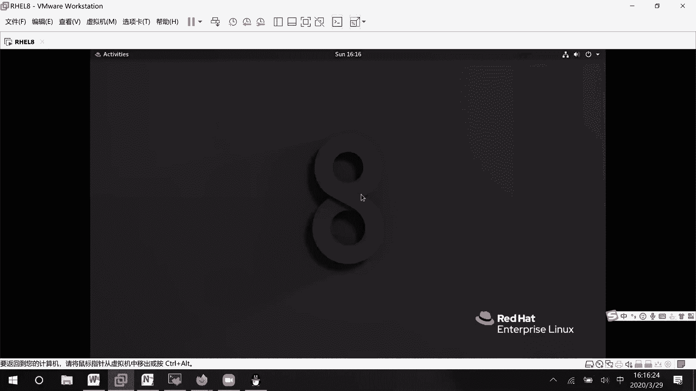

# 01 RHCE8.0视频教程【45课时】 - P17：20200329-RHCE-09_recv - 六竹书生6682 - BV1m84y1f7ss

下面这边的话呢我们来看一下这个叫做cl，之前在考试的时候呢，他也有这个A4L的，这个的话呢有什么样的一个作用呢，你在想我们平时在设置用户的时候呢，是不是只能对三种类型的用户去进行，一个设置啊。

所有者所在组和其他用户，那最多的话呢就是说如果有三个用户，它要拥有拥有不同权限的话呢，你可以把这三个用户放到不同的类型当中，比如说这边有个tom，还有一个叫做BB艾克的话呢。

JERRY他的话呢我希望tom的话呢有一个叫做读取线，of b的话呢，有一个叫做写权限，然后这个JERRY的话呢有什么权限呢，有一个叫做执行权限，那现在的解决办法，你可以把痛变成这个文件的所有者。

bob的话，文件的所在组JERRY的话呢，是不是其他用户啊，现在万一再来了一个用户叫做TKEDU，我如果说希望他有一个叫做RW权限怎么办，三类用户都已经分完了，那现在的话呢第四个用户。

他如果属于U这个小组，那好tom的话呢就多了一个写权限了吗，哦不对，U的话呢，那tom的话就没有没有这个，你对这个文件就不能读了，只能去执行了，对不对，所以的话呢这边我们去引出一个新的内容，叫做ACL。

他的话呢可以可以这样子的，根据特定的用户或者小组，设置权限的或者线的话，这个前面都是用户嘛，万一我这边的话呢来了一个叫做the loop1，我希望这个小组的人呢有什么权限呢，RWX的权限你的话咋整。

是不是也做不了，所以的话呢A4L可以解决，就是说三种以上的一个权限设置，三种以上的权限设置，这边的话呢我我就说CD到根目录下，我把没有用的一个文件的话给删除掉。

make a di r这边随便去写一个A4L，我的话呢等一下的操作，就在这个目录里面去操作，你看我root touch一个AA文件，然后的话呢，现在的一个所有者和一个叫做所在组的话呢。

是不是全都是我们的一个叫做root用户啊，然后LL杠D我看一下ACLS，他的话呢是不是也全都是我的一个叫做root用户，我把我先把这个目录的权限去改一下，圈圈mod777，就是说我只改它这个本身。

这样子的话呢，到时候有人如果想要来访问的话呢，可以先进入目录吧，到时候的话呢里面的文件能不能访问的话呢，再说嘛，好吧，你看现在这边的话呢，root用户这个A文件对于root用户是可读可写。

然后的话呢对于root组可可读，对于其他用户的话呢是不是一个可读，现在这边的话呢我们来看一下，有一个用户叫做user1用户，它属于user1这个主，他的话呢没有属于其他小组了吗。

它就属于user1这个小组，我这边SU到读者一吧，先在这里去等待一下，先在这里等待一下，然后的话呢你看对于这个叫做AA文件，目前来说应该是一个可读的一个状态吧对吧，可读状态。

那这边的话你看CD c l s cat aa确实能看到，如果说我想要去编辑vim AI，他的话呢啊存退出会报错对吧，现在user1对于这个叫做AA文件来说，是一个其他用户，其他用户它是没有写权限的。

那我现在的解决办法有什么呢，第一个给AA文件的其他用户，物语一个叫做W权限，这个肯定是能解决的，就是说全剧mod加WAA文件，然后的话呢这样子加进去的话，是所有人都能去进行一个操作了。

我们这边用第二种方法，六点，叫做user1有权限，其他人没有，你看我们先来看一下它这边的一个A4，L的权限是怎么样子的，EIA4LAA稍等啊，哎我这边的话呢写错了，Get fa sl。

AA前面少了一个F加ASL也可以啊，fire sl吗，你看这里文件的名字是谁，所有者是谁，所在主，是谁文件的所有者，你看文件的所有者中间冒号，就是说对于所有拥有我这个文件的呢，都是一个可读可写小组呢。

任何小组，也就是说我这小组里面的任何成员都是可读的，其他的任何用户也全都是可读的，所以这里这边的话呢查看文件的ACL权限，我们看的方法就是这样子，然后下面这里的话，如果想要去设置给这个叫做user用户。

还是一个用户，我们怎么样去设置呢，EFACL你看他这边的话呢，第一个如果你是修改的话，那就modify吗，然后的话呢如果你想要移除呢，X取消掉吗，如果说你想要去给某个叫做文件。

去设置特定用户的一个权限呢，这边的话呢好像没有去写出来哈，稍等一下嗯，MASFACL这边的话呢，我来看一下M修改里面的话呢，是不是就要去写规则了，规则这边的话呢稍等哈，这里你的话呢前面就写选项。

后面这里呢UU的话呢，就代表某个用户里面的话呢，你可以去写具体什么用户，它的具体权限是什么，或者呢即某个具体的小组，它的一个就是说小组的名字是什么呀，它的一个权限是什么吗，明白吧，现在下面这里的话呢。

我给你们来写一下哈，你看这里就是案例examples，再者FSL修改用户哪个用户呢，有什么权限，哪个文件行吗，It f a c l m，我现在的话呢想要去修改用户哪个用户呢。

user1用户我希望他怎么样呢，可读可写对哪个文件呢，AA文件AA文件里设置用户的权限，这个时候我们再来get一下，Get fa cl aa，你看是不是就多了一个叫做user一样，它的一个权限。

现在呢我比如说VMA是不是就可以了，保存退出了呀，如果说现在切换到一个user2呢，V i m a a a，等一下BIMACL下面的AA，他的话呢就没有写了一个权限了，明白吗，因为我刚才加了一个哦。

稍等一下，我随便写吧，哈哈WQU的二，稍等一下哈，我看一下SU到user2，这边是一个user user1，点ALLAA文件，我看一下RWR，这边什么时候把文件的所有者和所在组，改成user2了呀。

我看有改过吗，这个AA文件的所有者和所在组怎么会使，稍等一下，我看一下，怎么会是user2，等一下我看一下嗯，是我什么时候去改的吗，我没有改过呀，对吧，稍等一下，为什么这个user2。

为什么这个文件的权限变成了一个叫做user2，你们等我一下，我看一下，我记得我好像是没有改过这个权限呀，root对吧，LL哦，这里开始就user2了，我这里没有改哦。

刚才是这边操作了之后回来看了一下之后，他就user2了，你们稍等我一下，我来看一下，这个太奇怪了吧，好像没有执行什么圈之梦的呀，重新来一下哈，我这边的话呢，比如说parch bd文件。

Get f a c l b b，它是root，我set f AC l m u user1，它有读写权限，vb文件，这个时候嗯他这个权限没改啊，我这边如果说vim不对，SU到user2VIMECLUB。

刚才我是做了什么吗，哦我知道了，我好像加了一个，他这个加了一个强制退出之后啊，他的话呢就是说权限就有了，你看啊它就变了，叫做VIM嗯ACLS，我里面创建一个cc，随便去写一些东西保存退出。

然后这边的话呢你来看啊，V i m a c l c c，ESC冒号WQ，他这个是退不出去的，但是冒号WQ感叹号是退出去了，应该是默认情况下，这个用户的话呢是做了配置。

就是说应该加入到了管理员那个主当中去了，cat叫做，112，他这个就比较神奇了哈，你看他这个就直接去改掉了，我就加一个感叹号，他就改掉了，叫做什么呀，我想一下叫做b DC password。

User 21002fashire，这没什么问题，等一下。

这个问题也太严重了吧，加了个感叹号之后，直接把权限就是文件的属性都给改掉了，嗯我现在的话呢想要去看一下设置，Disco log，等一下。

稍等一下，这以前这个正常情况下是不能这样子去做的，User，User2，他现在就是一个普通用户，他现在选中的就是一个标准用户，这个的话呢我是把它加入到管理员小组当中，但是这个的话呢就是一个普通的用户啊。

他这个问题有点大，我来创建一个看普通用户吗啊test29，Password r o t123 r o t 123，诶等一下，卧槽二九标准用户ROT123，ROOT123嗯，我看一下号，问号吧，好吧好吧。

密码太简单了，点一下。

他这个的话呢这系统也太搞笑了吧，VM比如说我su test嗯，二九，嗯我用root去进行一个切换吧，因为我刚才密码设置太复杂了，I m a c l，然后下面的一个叫做AA文件，Warning。

你看立刻就可以去修改，他这个的话呢就是说把权限的话呢，还移给了这个，哦也有可能是和我的目录权限改的太大有关系，全剧mod，我再来试一下，呜呜呜，我这个就是，Change mode。

Change honor，它的一个叫做ROT冒号ROT多了文件，都改过来了，然后的话呢像这个test29的话，它属于其他用户，应该只能读到，也能进行插入，哦现在可以了，我知道为什么了。

刚才的一个原因的话呢是什么呢，就是我把目录的权限开的太大了，就是说目录的权限开的太大了，我刚才设置了一个777嘛，所以的话就是说所有人的话呢，可以对我们目录下面进行操作。

我现在把它改成一个叫做五五就可以了哈好吧，现在的话呢你看这个叫做谁呢啊，Test29，对于AA文件的话呢，是不是不能编辑啊，我这边就set f AC l m u test29，他比如说RW好吧。

对于AA文件，AA来说，你看现在我再来去写一下，2号WQ线就可以了，刚才的那个原因的话呢，是我太冲动了，把权限的话呢改的太大了，那这样子的话呢所有人都可以去进行编辑，但这个效果是在的。

现在好吧，所以这边的话呢你们等一下再做实验的时候呢，不要像我那么冲动，把权限改的那么大，那行这边的话呢我们来看一下叫做设置权限，它就这样子去设置的get f a4LAA文件，如果说我这边的话呢。

想要去再添加一个叫做谁呢，留着一的话呢，有读写执行，稍等一下呃，set f AC l user读写执行，Get fa cl aa，你看是不是两个用户的权限的话呢，都会存在在这里啊，都会存在在这里。

而且对比起其他的一些文件来说，我们设置了这个叫做FA cl之后的话呢，有什么特别的地方，后面有个加号，这边注意一下，如果某个文件，有ACL后面有加号，明白吧，是这样子的那行。

现在的话呢这个我比如说不想要了，这个就是说像test29，我现在不想要，让他的话呢能去进行一个写操作，怎么样去回收呢，就是sf sl减x you谁呢，test29吗，比如说把所有的权限都回收了。

AA文件回车，现在的话呢你看再来get f AC l a a，他的话呢user29的话呢，是不是就没有权限了，所以这里稍微注意一下，叫做回收权限，就这样子去进行一个操作，如果说你还想去回收。

比如说嗯user1的权限的话，那相同的一个命令吗，相同的一个命令，那现在的话呢，如果说你想要去对某一个小组去设置权限了，那这边就set f AC l还是M还是G哪个小组呢。

比如说user1这个小组什么权限呢，读写权限对于哪个文件呢，AA文件LL啊不对，Get f a c l a a，你看这边的话呢是不是就多了一个user1，如果你想要去进行一个回收呢，那也是一样的。

就是这个X嘛，哎等一下哦，稍等，是这个叫做G这边的话呢是一个X就可以了吗，Get f a l l a a，对不对，好，这边的话呢小组的设置，稍等啊，第一个怎么样去进行一个设置，第二个的话呢。

就是说怎么样去对小组的权限进行一个回收，进行一个回收，那这边的话呢没有什么问题，我们的话呢在之前是不是有说过一个东西，叫做mask的，还记得吗，那个you must这边的话呢，它也是有一个叫做野马的哈。

因为像我这边的话呢，可能给这个UI设置了权限，或者的话呢给一个叫做group设置了权限，这些权限的话呢是不是都非常的大，我现在希望他们的话呢，目前所有就是说特定用户，它的一个权限只有读的权限。

其他权限性就是说不能生效的话，怎么样去做呢，mask它的一个呃好处就是说对于特定的用户啊，我现在希望让他的就是说个别权限是生效，如果有的话他就生效，如果没有的话，那就不能生效嘛，这个的话呢怎么办呢。

有一个命令sf a4L减M减M还是修改，现在的话呢要修改的它是它的一个mask，这里的话呢也就是说我去修改所有的用户，这里默认mask是不是RWX，表示所有权限都能生效吗，现在就是说针对所有用户。

让它只有一个叫做普全性生效，你看这个时候再来get fa4L稍等啊，你看effective是不是只有一个叫做R权限，你看这边我的话呢切换到user一上面来，他的话呢之前正常情况下读取这个权限的话呢。

是不是应该是可读可写，可执行啊，但现在呢AA文件他的话呢是不是一个叫做read only，read only吗，就是说他这个是有问题的啊，那好然后现在的话呢有了这个权限之后。

其他权限的话呢就是说它不生效，那现在如果说希望把这个权限给回收回来呢，稍等啊，就说这样子吗，X哦等一下，我看一下啊，嗯group Missing，回收二选项诶，第四个1234，那这样子的话呢。

M就不修改了，Get f a c l，这边再去设置一遍吗，就是呃MRWX嘛，按下FACLAA就可以了，好吧，把它就是说原来的话呢是什么权限，你就把它给设置回去就行了吗，把它设置回去就行了。

那就是说之前就是说对于mask的属性的话呢，它就会没有掉了，没有掉了，这是一种方式，我最后把这个知识点讲完的话，那咱们就结束了，所以大家再稍微坚持一下子就好了哈，这里就是说怎么样去赋予这个的话呢。

怎么样去回收它，回收的话呢，还有另一种方法的，等一下cf a4LAA回收的话呢，你看set f AC l m you，谁呢，U的一，我给他设一个R权限好吧，这个时候再来get一下。

就说你去设置任何的一个用户权限的话呢，你看它的一个mask全都会被回收，就是说后面临时生效的权限的话，它就没有了，他就没有了，而且你可以发现这边的话呢，它的一个mask变成了一个叫做R权限。

执行权限的话，那就没有了就没有了行吧，就一个RW权限，就是说执行权限的话，那就没有了，回收的两种方式，一种的话呢主动回收测试新的mask，第二种的话呢就是修改任意的A4L，然后mask会失效，好吧。

这个的话呢是我们cl里面的一些信息，我们的话呢就讲到这里过了，你们的话呢知道怎么样去设置权限，怎么样去回收权限就可以了好吧，这个SALINUX呢和我们的防火墙，这次课的话呢讲不到了。

那我们就说下次课再去讲，你们把环境的话呢去做。

