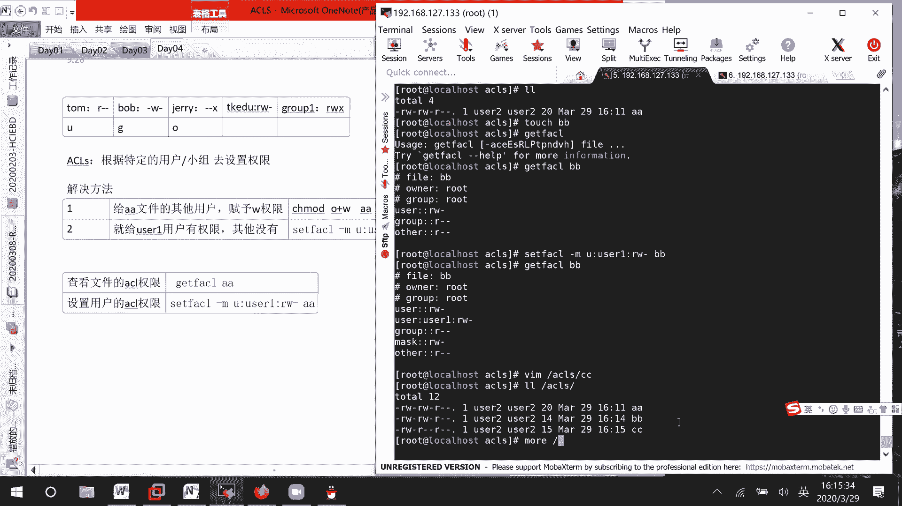
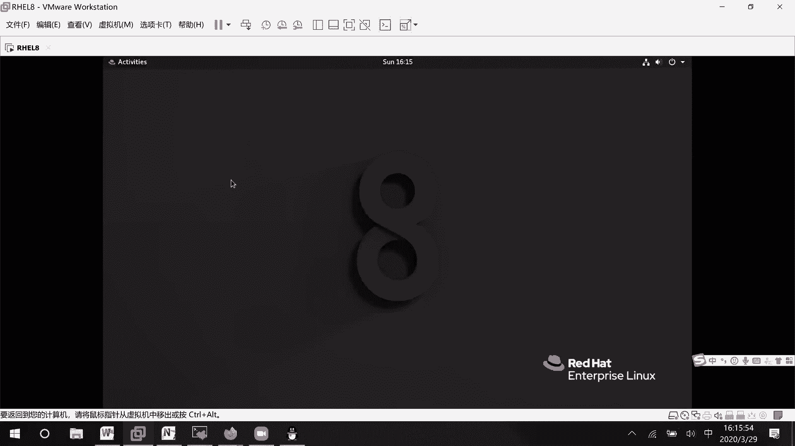
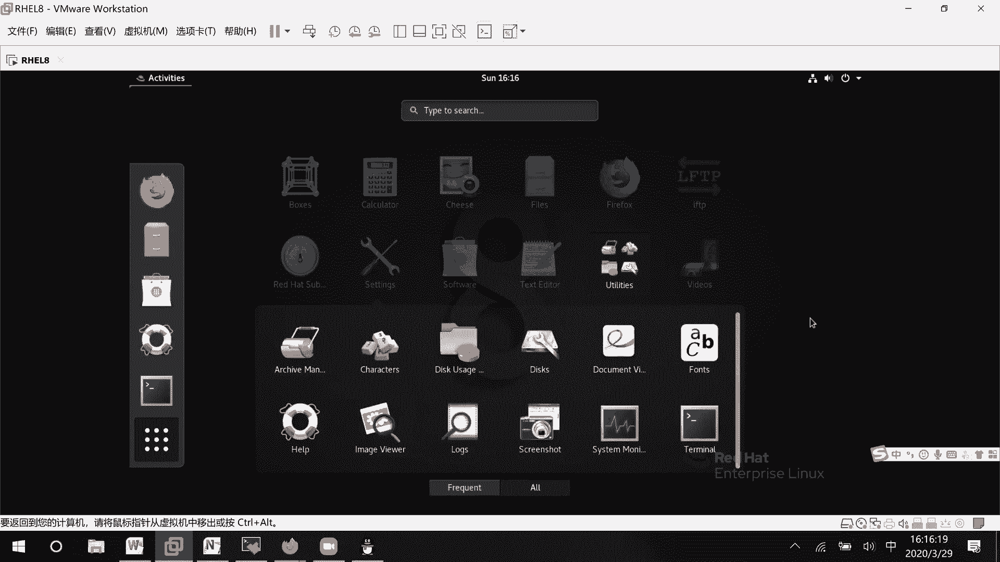
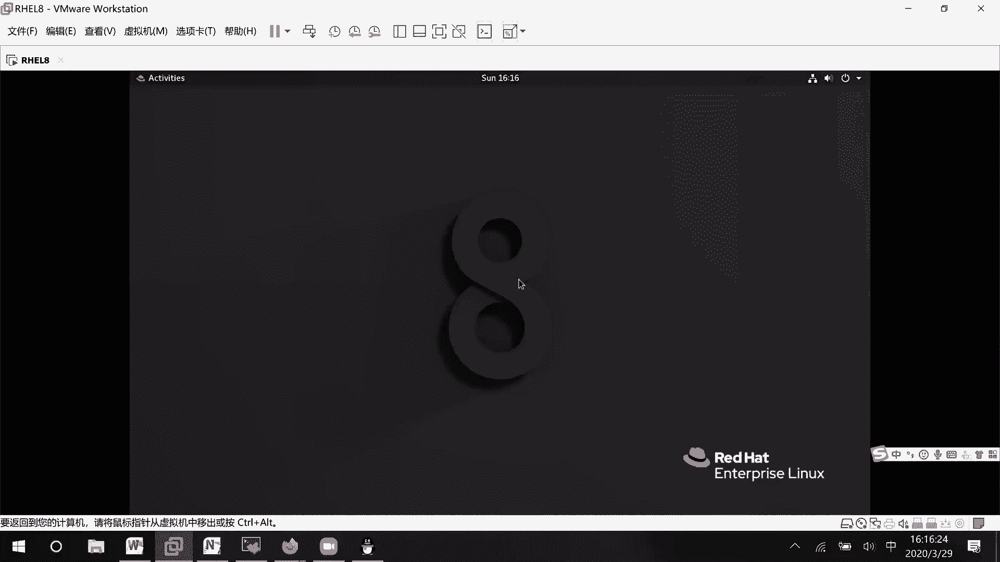
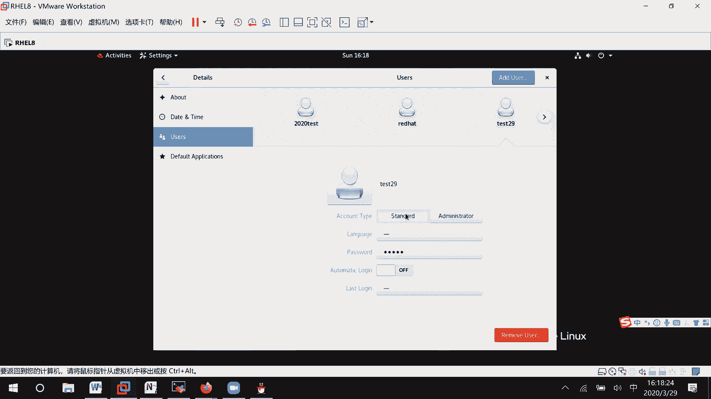
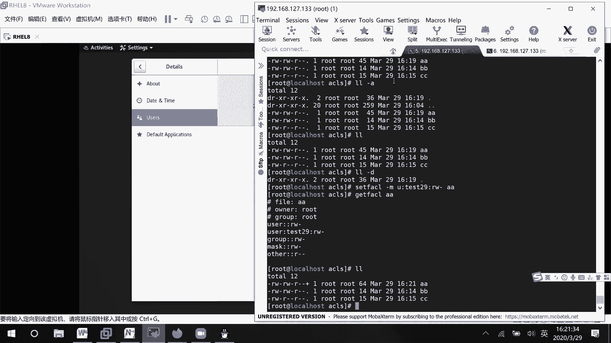
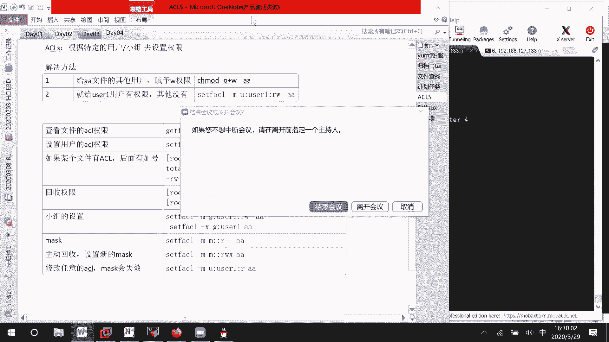

# RHCE 8.0 课程：P17：访问控制列表（ACL）详解 🔐


在本节课中，我们将要学习访问控制列表（ACL）的概念及其应用。ACL 是一种强大的权限管理机制，它允许我们为超出传统“所有者、所属组、其他用户”三类之外的特定用户或组设置精细的文件访问权限。

## 传统权限模型的限制

上一节我们介绍了基本的文件权限设置。传统权限模型只能为三类用户设置权限：**所有者**、**所属组**和**其他用户**。这在实际场景中可能不够灵活。

例如，假设有三个用户：Tom、Bob 和 Jerry。我们希望 Tom 有读取权限，Bob 有写入权限，Jerry 有执行权限。我们可以将 Tom 设为文件所有者，Bob 设为所属组成员，Jerry 设为其他用户。但如果第四个用户 TKEDU 需要读写权限，传统模型就无法直接满足，因为三类用户角色已经分配完毕。ACL 正是为了解决这类“三种以上权限设置”的需求而引入的。

## 什么是 ACL？

ACL 允许系统管理员根据特定的用户或用户组来设置文件或目录的权限，突破了传统三类用户的限制。它不仅可以为用户设置权限，也可以为特定的组设置权限。

## 环境准备与基础操作

以下是实验前的准备工作，我们创建一个专用目录并设置基础权限。

```bash
# 切换到根目录并创建实验目录
cd /
mkdir acl_demo
cd acl_demo

# 创建一个测试文件
touch aa
ls -l aa
```

此时，文件 `aa` 的所有者和所属组都是 `root`。我们修改目录本身的权限，确保其他用户可以进入：

```bash
# 设置目录权限为 755，允许其他用户进入
chmod 755 .
```

## 查看与设置 ACL 权限

### 查看文件的 ACL 权限

使用 `getfacl` 命令可以查看文件或目录的 ACL 权限信息。

```bash
getfacl aa
```
命令输出会显示文件的所有者、所属组以及为特定用户或组设置的额外权限规则。

### 为用户设置 ACL 权限

使用 `setfacl` 命令可以为特定用户添加权限。其基本语法为：
`setfacl -m u:<用户名>:<权限> <文件名>`

以下是为用户 `user1` 添加对文件 `aa` 读写权限的示例：

```bash
setfacl -m u:user1:rw aa
getfacl aa
```
现在，输出中会多出一行，显示用户 `user1` 拥有读写（`rw`）权限。



### 为用户组设置 ACL 权限



同样，我们可以为特定的用户组设置权限。语法为：
`setfacl -m g:<组名>:<权限> <文件名>`





以下是为组 `user1` 添加读写权限的示例：

```bash
setfacl -m g:user1:rw aa
```



## 权限掩码（Mask）的作用

在 ACL 中，`mask` 定义了除所有者和“其他用户”之外，所有指定用户和组所能拥有的**最大有效权限**。即使你给某个用户赋予了 `rwx` 权限，如果 `mask` 是 `r--`，那么该用户的有效权限也只有读权限。

### 设置与修改 Mask

你可以直接修改 `mask` 来限制权限。



```bash
# 将 mask 设置为只读
setfacl -m m::r aa
getfacl aa
```
此时，查看 ACL 信息，会发现 `effective`（有效权限）列可能发生变化，例如之前拥有写权限的用户，其有效权限可能变为只读。

### 恢复 Mask

要恢复原始的 `mask`（通常是 `rwx`），可以重新设置：

```bash
setfacl -m m::rwx aa
```
或者，**修改任意一条 ACL 规则（用户或组）也会导致系统重新计算并更新 `mask`**，通常会将其恢复为所设置规则权限的并集。

## 回收 ACL 权限

当需要撤销为特定用户或组设置的 ACL 权限时，可以使用 `-x` 选项。

以下是回收权限的操作方法：

```bash
# 回收用户 test29 的所有 ACL 权限
setfacl -x u:test29 aa

# 回收组 user1 的所有 ACL 权限
setfacl -x g:user1 aa
```

执行后，再次使用 `getfacl` 命令查看，相应的规则会被移除。

## 识别启用了 ACL 的文件

系统中有 ACL 权限的文件，在使用 `ls -l` 命令查看时，权限位末尾会显示一个加号（`+`）。

```bash
ls -l aa
# 输出可能类似：-rw-rw-r--+ 1 root root 0 Mar 29 10:00 aa
```
这个 `+` 号表明该文件拥有扩展的 ACL 权限。

## 注意事项与总结

在实验过程中，请注意目录权限的影响。如果将父目录权限设置得过于宽松（如 `777`），可能会意外导致用户能够修改文件属性。建议在实验时保持合理的目录权限（如 `755`）。



本节课中我们一起学习了访问控制列表（ACL）的核心知识。我们了解了 ACL 如何解决传统权限模型的不足，掌握了使用 `getfacl` 查看权限、使用 `setfacl` 为用户和组添加或回收权限的方法，并理解了权限掩码（`mask`）的作用机制。ACL 是实现精细化权限管理的重要工具，请务必通过实践来巩固这些操作。