# RHCE 8.0 课程：P18：SELinux 基础与配置


在本节课中，我们将要学习 Linux 系统中一个重要的安全增强功能——SELinux。我们将了解它的基本概念、工作原理，并通过实际操作学习如何查看、修改文件与进程的标签，以及如何管理 SELinux 的工作模式。

## 概述：什么是 SELinux？

SELinux 是 Linux 内核中一个增强型的安全模块。它与传统的文件权限控制不同，提供了一种更严格的访问控制机制。简单来说，即使一个文件被设置为 `777` 权限，如果 SELinux 的规则不允许，特定的进程也无法访问该文件。

上一节我们介绍了课程的整体安排，本节中我们来看看 SELinux 的核心概念。

## SELinux 的核心概念：DAC 与 MAC

传统的 Linux 文件权限管理称为 **自主访问控制**。在这种模式下，文件的所有者可以自主决定谁可以访问该文件以及拥有何种权限（如读、写、执行）。例如，命令 `chmod 777 file` 会使所有用户都能对文件进行任何操作，这存在安全隐患。

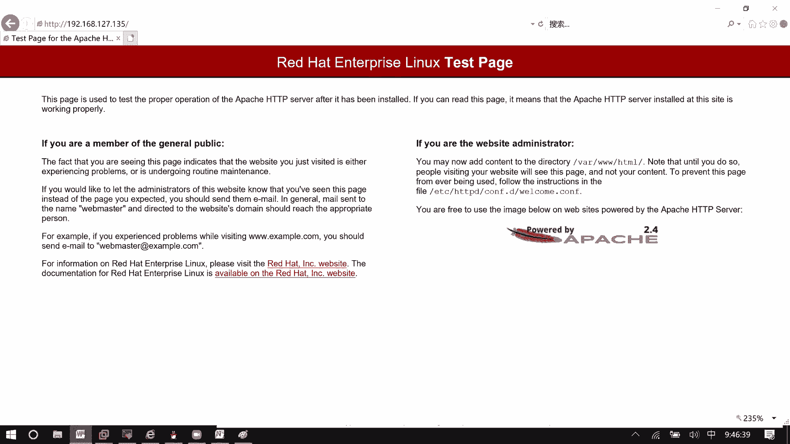

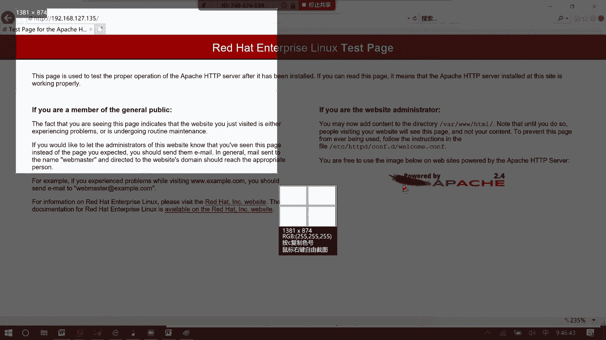

SELinux 实现了 **强制访问控制**。它为系统中的每个**文件**和**进程**都分配了一个安全上下文。只有当进程的上下文与文件的上下文匹配时，访问才被允许。这就像给文件和进程都贴上了“标签”，访问控制基于这些标签进行。

**核心公式**：
```
允许访问的条件 = 传统文件权限检查通过 + SELinux 上下文匹配
```

## 查看 SELinux 上下文

在学习如何修改标签之前，我们首先需要知道如何查看它们。

以下是查看文件 SELinux 上下文的方法：

*   **查看文件上下文**：使用 `ls -Z` 命令。`-Z` 选项专门用于显示 SELinux 安全上下文。
    ```bash
    ls -Z /path/to/file
    ```
*   **查看进程上下文**：使用 `ps -auxZ` 命令。在进程列表前会显示每个进程的上下文。
    ```bash
    ps -auxZ | grep process_name
    ```

## 实践：通过 Apache HTTPD 服务理解上下文

为了直观地理解上下文如何影响访问，我们将以 Apache HTTPD 服务为例进行实验。

### 实验准备：安装与配置 Apache

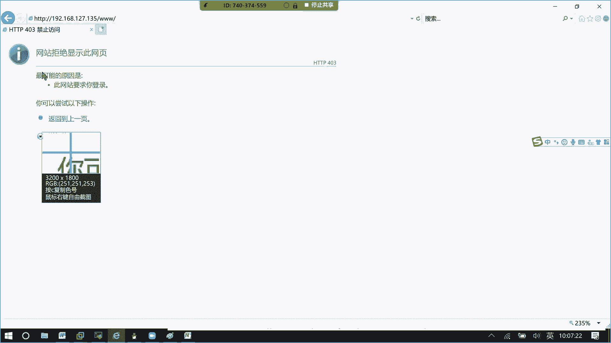

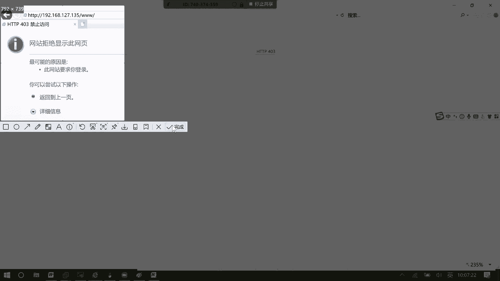

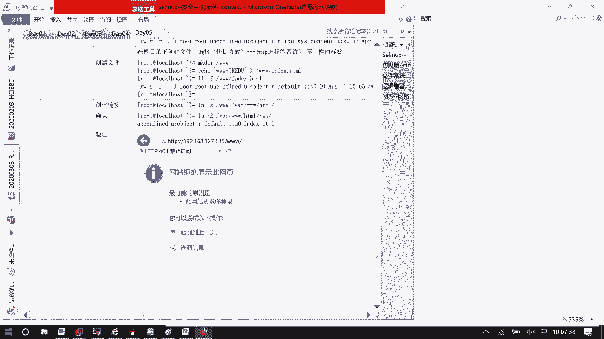

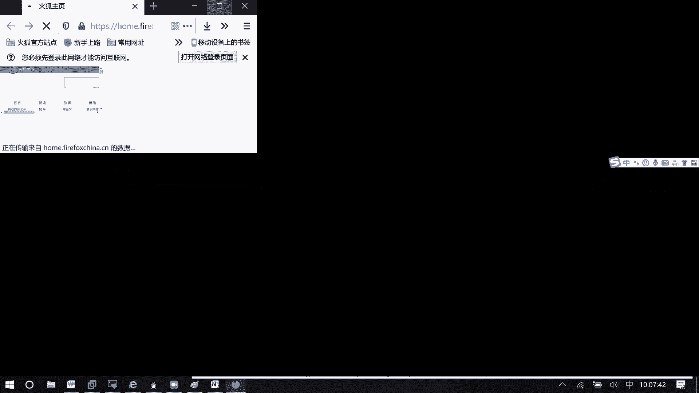

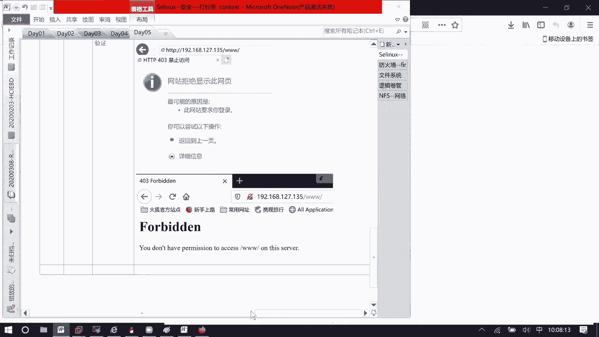

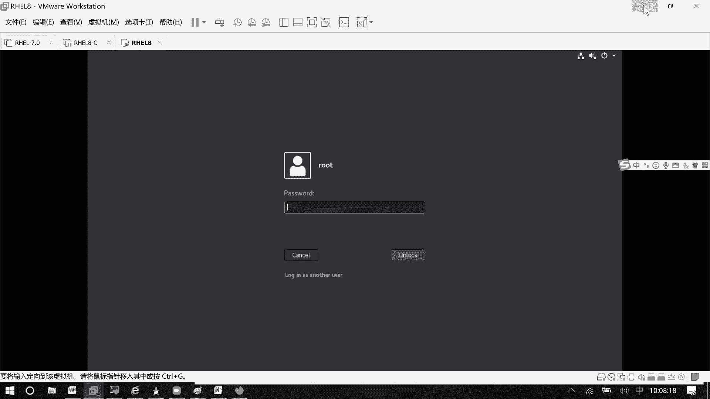

首先，我们需要确保系统可以安装软件包，并安装 Apache HTTPD 服务。

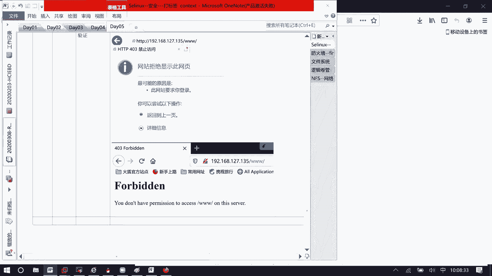

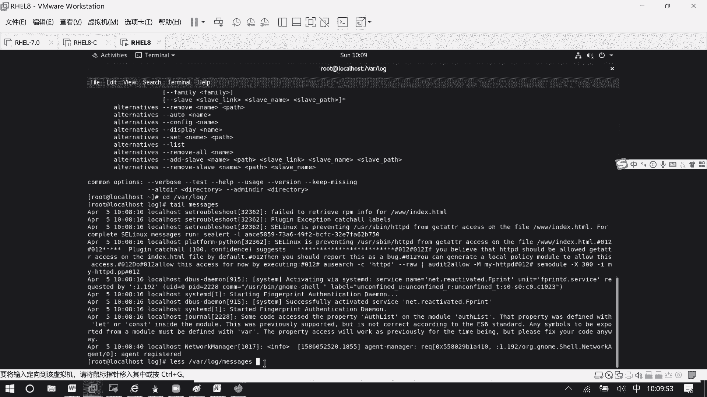

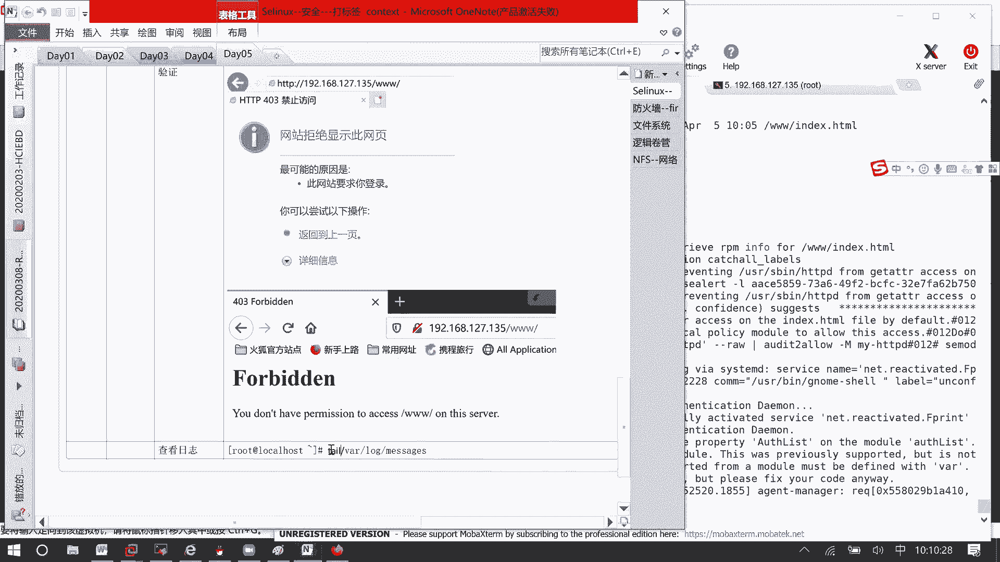

1.  **配置 YUM 源**：如果系统没有可用的 YUM 源，需要挂载安装镜像并创建源文件。
    ```bash
    # 挂载光盘镜像
    mount /dev/sr0 /mnt
    # 创建 YUM 源配置文件
    vi /etc/yum.repos.d/local.repo
    ```
    在配置文件中添加以下内容（路径需根据实际情况调整）：
    ```ini
    [BaseOS]
    name=BaseOS
    baseurl=file:///mnt/BaseOS
    gpgcheck=0
    enabled=1

    [AppStream]
    name=AppStream
    baseurl=file:///mnt/AppStream
    gpgcheck=0
    enabled=1
    ```
2.  **安装 Apache**：
    ```bash
    yum install httpd -y
    ```
3.  **启动服务并测试**：为了排除其他安全策略干扰，我们先临时关闭防火墙，然后启动 Apache 并访问测试页面。
    ```bash
    systemctl stop firewalld
    systemctl start httpd
    ```
    在浏览器中访问服务器的 IP 地址（如 `http://192.168.127.135`），应能看到 Apache 的默认测试页面。

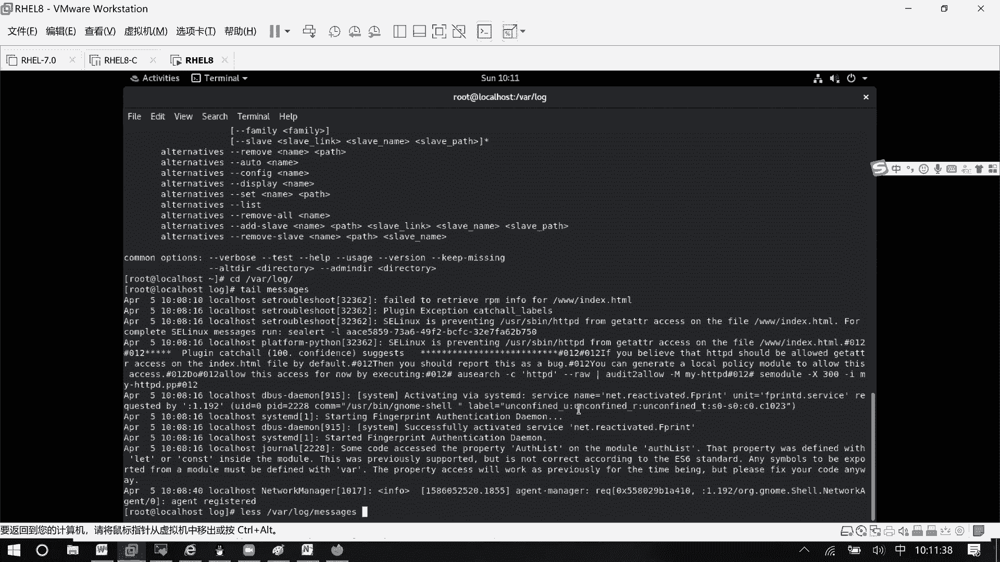

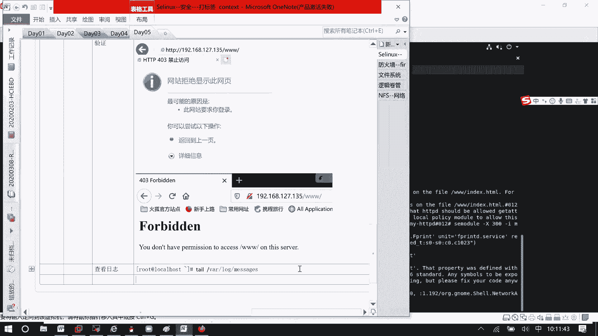

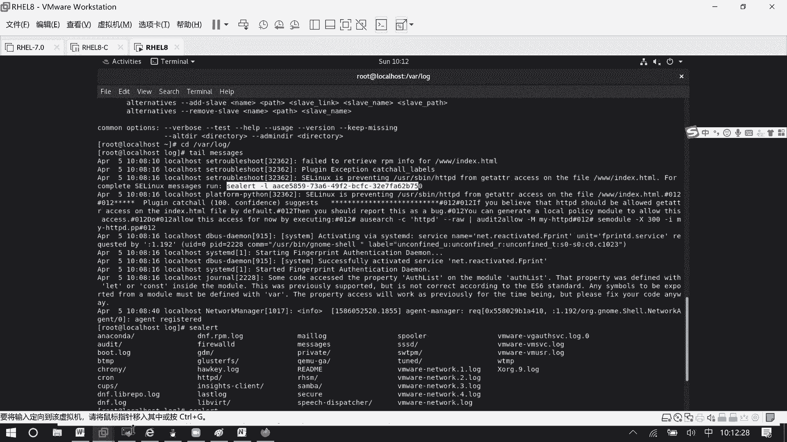

### 实验：上下文不匹配导致访问失败

现在，我们创建一个新文件，并尝试通过 Apache 访问它，观察 SELinux 如何工作。

1.  **在非 Web 目录创建文件**：
    ```bash
    touch /www/index.html
    echo "This is a test page." > /www/index.html
    ```
2.  **创建符号链接到 Web 目录**：Apache 默认访问 `/var/www/html`。我们将 `/www` 目录链接过去。
    ```bash
    ln -s /www /var/www/html/www
    ```
3.  **尝试访问并分析问题**：在浏览器中访问 `http://<服务器IP>/www`。你会看到 **403 Forbidden** 错误。
4.  **检查原因**：查看日志或使用 `sealert` 命令，会发现错误原因是 Apache 进程的上下文 (`httpd_t`) 与 `/www/index.html` 文件的上下文 (`default_t`) 不匹配，因此访问被 SELinux 阻止。
    ```bash
    sealert -a /var/log/audit/audit.log
    # 或查看最近的消息
    tail -f /var/log/messages | grep -i selinux
    ```

### 修改文件的 SELinux 上下文

既然问题是上下文不匹配，我们可以通过修改文件的上下文来解决。

以下是修改文件上下文的几种方法：

*   **方法一：直接指定上下文**：使用 `chcon` 命令。
    ```bash
    # 将 /www 目录及其下所有文件的上下文改为和 /var/www/html 一致
    chcon -R --reference=/var/www/html /www
    ```
*   **方法二：恢复默认上下文**：使用 `restorecon` 命令。这会将文件的上下文恢复为系统为该路径预设的默认值。
    ```bash
    restorecon -Rv /www
    ```
*   **方法三：设置默认上下文规则**：使用 `semanage fcontext` 命令可以为特定路径永久添加默认上下文规则，之后在此路径下创建的文件会自动获得该上下文。
    ```bash
    # 添加规则：/www(/.*)? 路径的默认上下文为 httpd_sys_content_t
    semanage fcontext -a -t httpd_sys_content_t '/www(/.*)?'
    # 使新规则立即生效
    restorecon -Rv /www
    ```
    **删除规则**：
    ```bash
    semanage fcontext -d '/www(/.*)?'
    ```

修改上下文后，再次访问 `http://<服务器IP>/www`，页面应该可以正常显示。

## 管理 SELinux 工作模式

SELinux 有三种主要的工作模式：

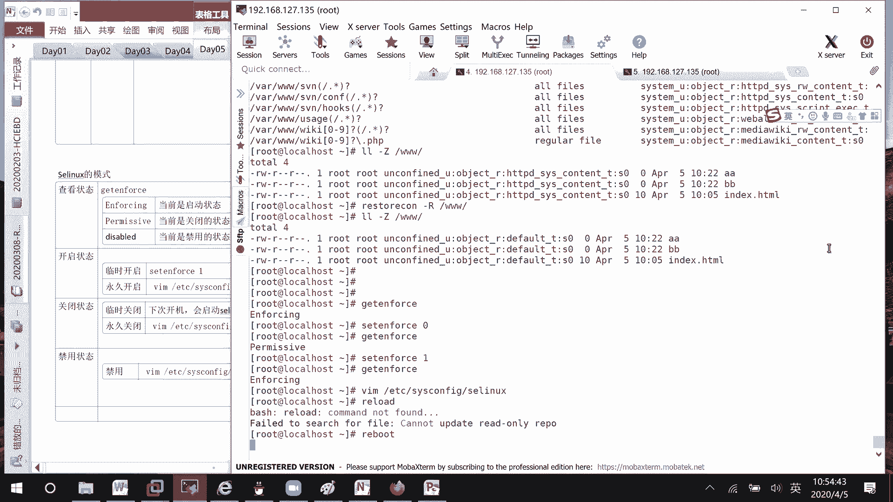

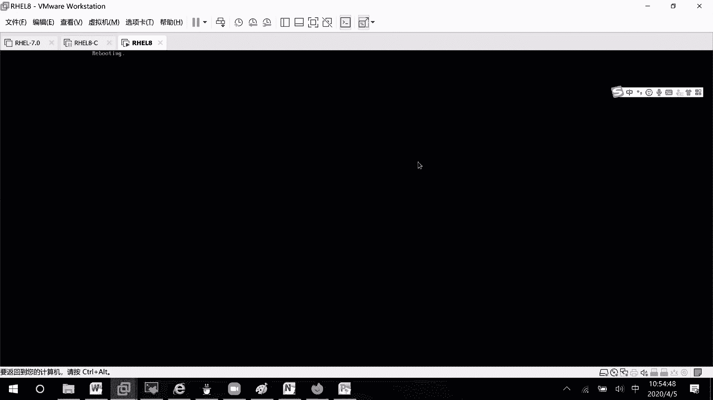

*   **Enforcing**：强制模式。违反 SELinux 规则的行为将被阻止并记录到日志。
*   **Permissive**：宽容模式。违反 SELinux 规则的行为只会被记录到日志，而不会被阻止。常用于故障排查。
*   **Disabled**：禁用模式。SELinux 被完全关闭。

以下是管理 SELinux 模式的方法：

*   **查看当前模式**：
    ```bash
    getenforce
    ```
*   **临时切换模式**（重启后失效）：
    ```bash
    # 切换到 Enforcing 模式
    setenforce 1
    # 切换到 Permissive 模式
    setenforce 0
    ```
    *注意：无法从 Disabled 模式临时切换到其他模式。*
*   **永久修改模式**：需要编辑配置文件 `/etc/selinux/config`，修改 `SELINUX=` 后的值为 `enforcing`、`permissive` 或 `disabled`。修改后需要**重启系统**才能生效。
    ```bash
    vi /etc/selinux/config
    # 将 SELINUX=enforcing 改为所需模式
    ```

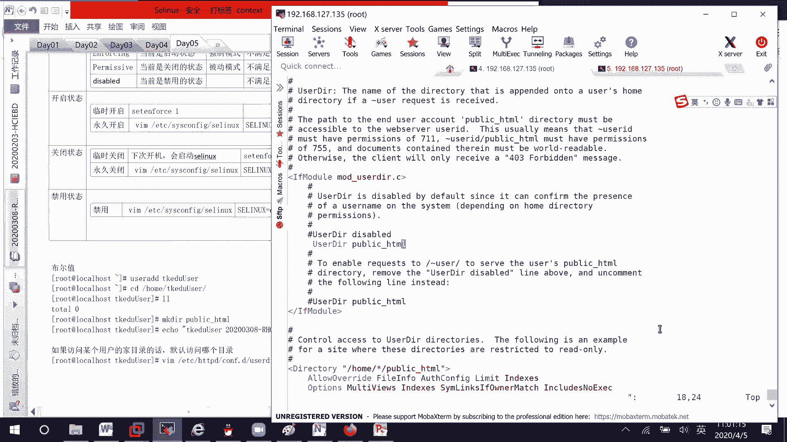

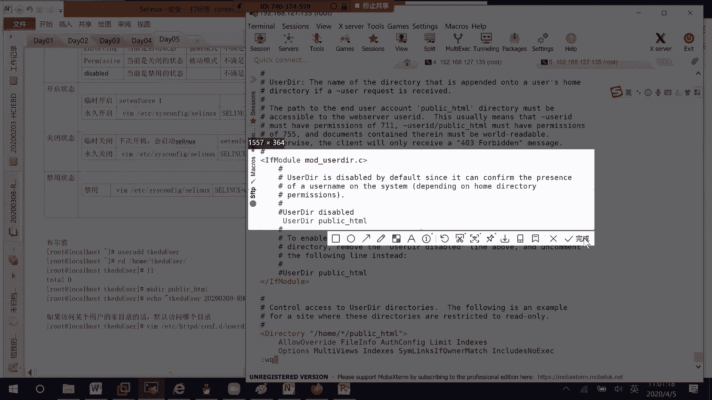

## SELinux 布尔值：精细化的策略开关

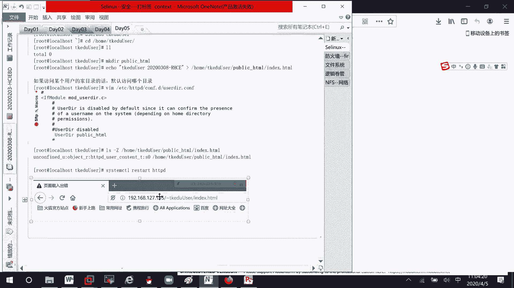

SELinux 策略中包含许多布尔值，它们是更细粒度的开关，用于控制特定功能是否被允许。例如，“是否允许 HTTPD 服务访问用户家目录”。

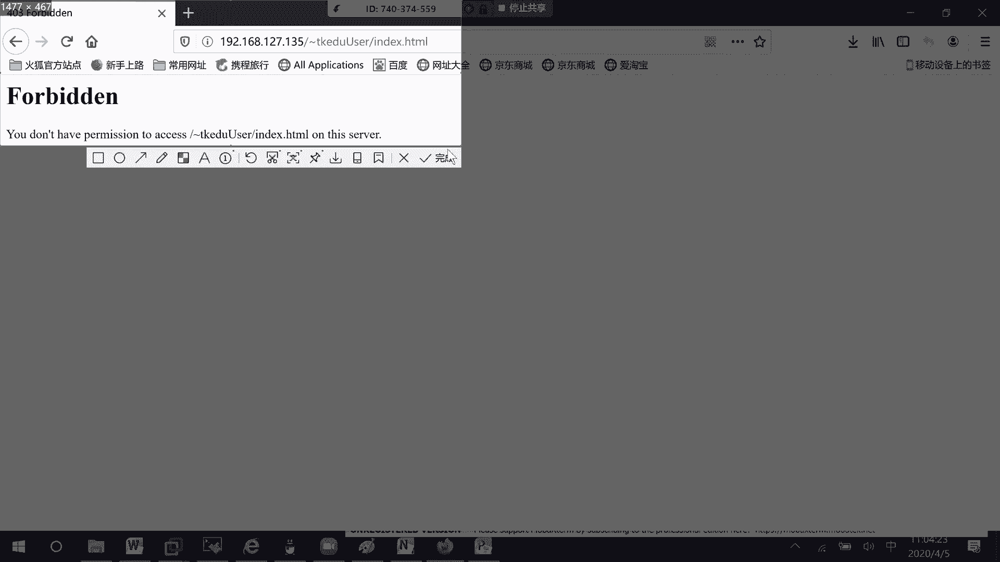

*   **查看所有布尔值**：
    ```bash
    getsebool -a
    ```
*   **查看与 HTTPD 相关的布尔值**：
    ```bash
    getsebool -a | grep httpd
    ```
*   **设置布尔值**（以允许 HTTPD 访问用户家目录为例）：
    ```bash
    # 临时设置
    setsebool httpd_enable_homedirs on
    # 永久设置（-P 参数）
    setsebool -P httpd_enable_homedirs on
    ```

## 总结

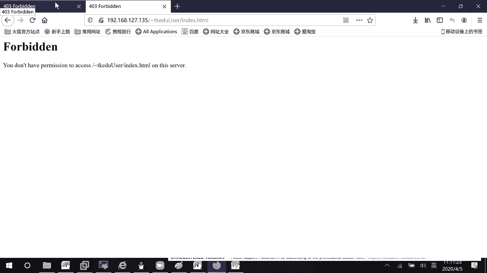

本节课中我们一起学习了 SELinux 的基础知识。我们理解了强制访问控制与自主访问控制的区别，掌握了查看和修改文件、进程上下文的方法。我们通过 Apache 服务的实验，亲眼验证了上下文不匹配如何导致访问失败。此外，我们还学习了如何管理 SELinux 的三种工作模式（Enforcing, Permissive, Disabled）以及如何使用布尔值对 SELinux 策略进行更精细的控制。掌握这些知识，是理解和配置 Linux 系统安全的重要一步。