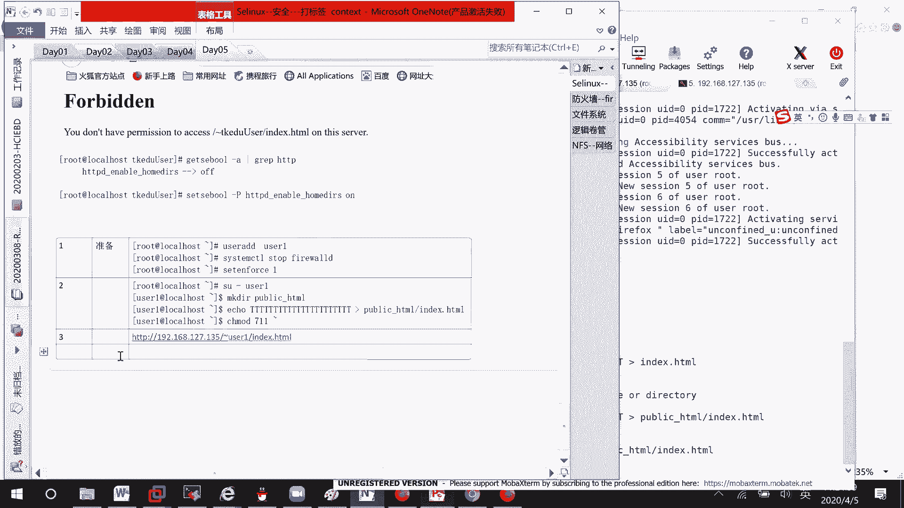
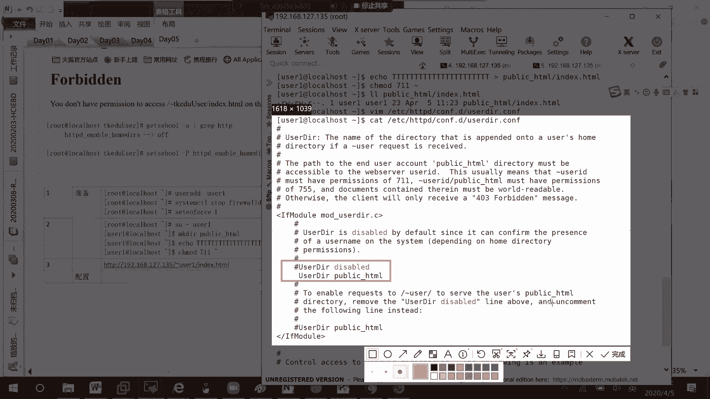
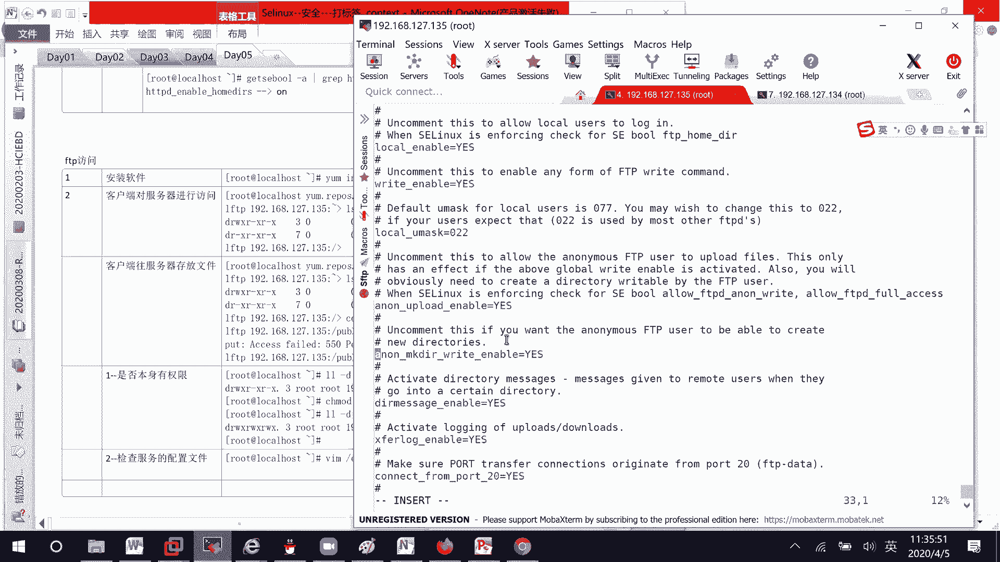
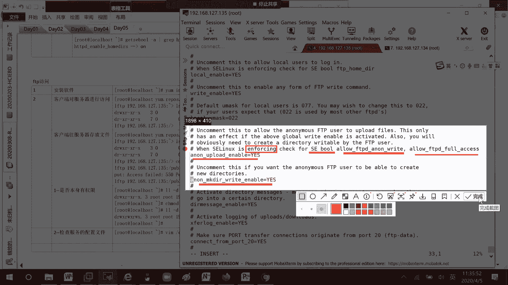
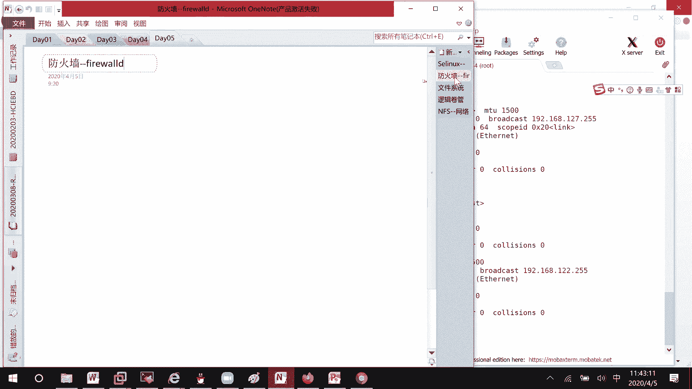

# Linux服务配置实战：P19：用户目录访问与FTP服务配置


在本节课中，我们将学习如何配置Apache HTTP服务器以允许用户通过个人目录访问网页，以及如何配置vsftpd服务以允许匿名用户上传文件。这两个任务都涉及到文件权限、服务配置和安全增强Linux（SELinux）布尔值的调整。

## 🔧 准备工作：创建用户与目录



上一节我们介绍了服务配置的基本概念，本节中我们来看看具体的准备工作。首先，我们需要创建一个测试用户并为其建立网页目录。



1.  创建用户 `user1`。
    ```bash
    useradd user1
    ```
2.  关闭防火墙并禁用SELinux（为简化实验环境）。
    ```bash
    systemctl stop firewalld
    setenforce 0
    ```
3.  切换到 `user1` 用户，创建个人网页目录和文件。
    ```bash
    su - user1
    mkdir public_html
    echo "Hello World" > public_html/index.html
    ```
4.  将 `public_html` 目录的权限设置为 `711`，确保Apache进程（作为其他用户）有执行权限进入该目录。
    ```bash
    chmod 711 ~/public_html
    ```

## 🌐 配置Apache用户目录访问

准备工作完成后，接下来我们配置Apache以允许通过 `~username` 的URL格式访问用户个人目录。

1.  编辑Apache的用户目录配置文件。
    ```bash
    vim /etc/httpd/conf.d/userdir.conf
    ```
2.  找到并取消注释以下两行，以启用用户目录功能。
    ```apache
    UserDir public_html
    <Directory "/home/*/public_html">
        AllowOverride FileInfo AuthConfig Limit Indexes
        Options MultiViews Indexes SymLinksIfOwnerMatch IncludesNoExec
        Require method GET POST OPTIONS
    </Directory>
    ```
3.  重启Apache服务使配置生效。
    ```bash
    systemctl restart httpd
    ```
4.  此时通过浏览器访问 `http://服务器IP/~user1` 可能仍会失败，因为SELinux（若开启）默认阻止HTTPD访问用户家目录。

## 🛡️ 调整SELinux布尔值

若SELinux处于强制模式，我们需要调整相关布尔值以允许HTTPD服务访问用户家目录。

1.  查看与HTTPD用户目录相关的SELinux布尔值。
    ```bash
    getsebool -a | grep httpd_enable_homedirs
    ```
2.  默认该值为 `off`。将其设置为 `on`。
    ```bash
    setsebool -P httpd_enable_homedirs on
    ```
3.  再次通过浏览器访问 `http://服务器IP/~user1/index.html`，即可成功看到“Hello World”页面。

**关键点**：若网页访问出现403错误，请检查 `public_html` 目录权限是否为 `711`，以及其下的 `index.html` 文件是否具有可读权限（如 `644`）。

## 📁 配置vsftpd匿名上传



上一节我们配置了HTTP服务，本节中我们来看看如何配置FTP服务。我们将配置vsftpd允许匿名用户登录并上传文件。



以下是配置vsftpd匿名上传功能的步骤：

1.  **安装vsftpd软件包**。
    ```bash
    yum install -y vsftpd
    ```
2.  **修改vsftpd主配置文件**。编辑 `/etc/vsftpd/vsftpd.conf`，确保以下参数设置正确：
    ```bash
    anonymous_enable=YES          # 允许匿名登录
    anon_upload_enable=YES        # 允许匿名用户上传文件
    anon_mkdir_write_enable=YES   # 允许匿名用户创建目录
    ```
3.  **设置FTP共享目录权限**。匿名用户的根目录通常为 `/var/ftp/`。我们需要确保目标上传目录（如 `pub`）具有写权限。
    ```bash
    chmod 777 /var/ftp/pub/
    ```
4.  **调整SELinux布尔值**。如果SELinux处于强制模式，必须开启相关布尔值。
    ```bash
    setsebool -P ftpd_anon_write on
    setsebool -P ftpd_full_access on
    ```
5.  **重启vsftpd服务**。
    ```bash
    systemctl restart vsftpd
    ```
6.  在客户端使用FTP命令连接服务器，即可进入 `/var/ftp/pub/` 目录并上传文件。

**故障排查思路**：若上传失败，请按顺序检查：1) 目录文件系统权限；2) vsftpd配置文件参数；3) SELinux布尔值与状态。

## 📝 总结

本节课中我们一起学习了两个核心的网络服务配置。

首先，我们配置了Apache HTTP服务器的用户目录访问功能，关键在于正确设置目录权限（`711`）和开启SELinux布尔值 `httpd_enable_homedirs`。

其次，我们配置了vsftpd服务支持匿名上传，涉及修改配置文件参数、开放文件系统写权限，以及设置 `ftpd_anon_write` 和 `ftpd_full_access` 这两个关键的SELinux布尔值。



这两项实践清晰地展示了在RHEL/CentOS系统中，配置服务不仅需要修改软件自身的设置，还必须充分考虑Linux系统的文件权限和安全策略（SELinux）的影响。