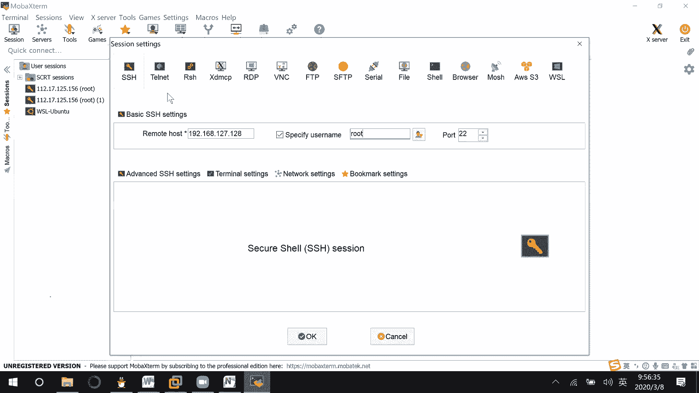
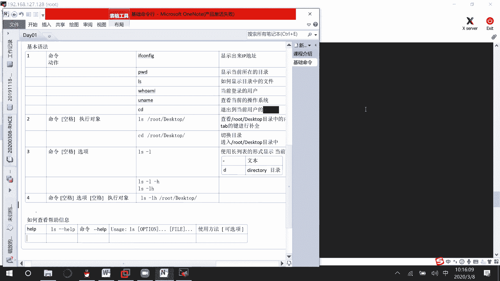

# 01 RHCE8.0视频教程【45课时】 - P1：20200308-RHCE-01 - 六竹书生6682 - BV1m84y1f7ss

嗯今天的话呢就是说我们要开始上课，上的是那个叫做红帽八的一个课程。

他的话呢就是说基本上和七的话呢，有一个比较大的一个改动是什么呢，稍等一下，我去建一个笔记哈，叫做我们先来做一个简单的课程介绍哈，就像我们之前红帽，你们你们有没有人就说学过红帽期的啊，这样子啊。

先首先第一第一节课的话呢，我们做一个简单的课程介绍，就说你们之前有没有人已经上过红毛期了。

我应该说话，你们应该能听到吧，现在能听到吗。

这边的话呢我们来看一下，就是红帽的话呢之前考的一直都是七的版本，然后现在的话呢进行一个改改革嘛，他现在的话呢从7。0的话呢，进入到一个8。0的一个时代，然后像之前的话呢，你们如果有学过红帽的IHCE。

就是说7。0的版本，他学的是三门课，I h124，然后呢RH134，还有的话呢RH254这三门课，像这个124和134的话呢，主要是学一些基础的一个命令，他这边H这个叫做124和134的话呢。

是组成了我们的一个叫做RH，CSA的一个初级课程，然后呢IGC的话呢，它算是一门高中级的一门课程，然后现在的话呢GC8。0它是这样子的，他前面两门课的话呢没有变化，H124，R h134。

然后的话呢第三门课变了，它变成了一门课，叫做RH294，稍等一下，对294，像以前的话呢在RG254当中的话呢，会去讲一些服务的搭建，比如说像3WDNS的这些搭建吗，然后像现在的第三门课的话呢。

他考的是一个ANCIABLE，这个的话呢是我们HCA当中的一门课，像前面两个的话呢，它全都是一些基础的命令行，虽然是我们HCSA里面的好吧，我们这边来看一下嗯，这里，这边的话呢就是说h cc属于初级。

就是我们该说那两门课，他的话呢在初级当中考它的考试代码是200，然后接下去的话呢，第一门考试考完了之后才可以去考，第二门叫做300这门考试嘛，然后的话呢300考完了之后，如果你们有人是学ca的。

然后你才可以去考ca的一个考试，他的话呢就是说一个一个等级，必须就是说逐级去考的，不能跳级去考的，是这样子的，他到时候考试的形式是怎么样子的呢，因为嗯7。0是这样考的，8。0的话呢基本上还没有考。

还没有考，他的话呢就是说形式应该是一样的，HCSA和HCE的话呢，一天考的在同一天考，然后的话呢上午考HCC他的考试时间的话呢，我没记错的话是2。5个小时，然后下午的话呢我们考HCEGCE的话呢。

因为之前嘛之前是3。5个小时呃，七版本的时候呢，如果你考h cc2。5个小时的话，那基本上就是半个小时到一个小时之内，你可以做完的，然后的话呢下午的话呢他这个3。5个小时。

有时候三点考要考个三个小时左右能考完，然后他这个考试的话呢，就是说是啊一个班级的同学，大家组织起来，比如说十个人到十个到12个左右吧，组织一场要么在上海考，要么在杭州考，就说是你们自己。

根据你们班级的一个情况的话呢，考老师会去约时间给你们去安排考试的，然后这个课程上完了之后呢，我们会有一个呃考试模拟，我这先补录屏哈名字，然后的话呢是怎么样子的呢，考试他的话呢就说是300分通过哦，不对。

300分满分210分通过，他这个的话呢通过还是比较简单的，你们就说不要考到210，210分以下就可以了，考过了之后呢，基本上在三个工作日内，他就会给你的邮箱的话呢，去发HCSA和HCE的一个成绩。

然后你的一个证书的话呢，需要去红帽的官方去进行一个申请，好吧就这样子，那好这个的话呢是我们的一个考试，他这里的话呢三门课，124134294，我们先上124，他这个就是一个课程的代号而已。

134294294，这边的话呢我们来看一下这个administrator，一的话呢，它就是我们的一个124124的话呢，它主要讲解的是什么东西呢，呃我们基础知识还有命令行这些东西。

然后你来看一下这个的话呢，是我们124里面会讲的命令行，就是说像我们如果要去操作LINUX操作系统的话呢，它的命令它的格式有哪些呢，我该怎么样去做，然后呢管理物理存储，也就是说像我们windows当中。

可能C盘当中有一些呃windows目录啊，或者user目录，这些目录有什么样的一个作用呢对吧，然后接下去安装和配置软件呃，服务这个的话呢，也就是说亚目园这些我要怎么去搭建呢，然后这里这个的话呢。

就是说我们怎么样去建配置IP地址啊，然后怎么样去控制防火墙，然后接下去监控和管理，这个就是说像我这个进程的话呢，正在运行，我怎么样把它给关掉，然后这里就文件权限管理，用户管理，日志管理，然后这里的话呢。

也就是说使用它的一个分析系统，去定位我们的一个故障，就故障检查，然后这里的话呢SSH就说登录到我们的啊，LINUX当中来，好吧好，这个的话呢是他的一个课程大纲，我等一下的话呢去发给你们。

因为他的一个课程大纲的话呢，本来是一个全英文的，然后我们这边老师的话呢把它翻译成中文的，发给你们好吧，这个就不去讲了，然后你们可以看一下，就是这个是294的这门课，他的标签的话呢123456只有六个。

但是他的话呢属于单单独的一门课，这门课的话呢会稍微比较难一点，就是说自动化运维嘛对吧，所以前面前面两个学的稍微轻松一点，然后第三个的话呢会稍微难一点哈，然后现在开始的话呢。

我们先来上我们第一门课叫做RH124，在这里的话呢，先给你们来讲一下它的一个命令行的一个结构，就是说它的一个基础，因为咱们已经安装过了嘛对吧，基础部分，在这里的话呢。

我们主要要去熟悉一下我们LINUX的界面，然后的话呢还要去使用我们的一个终端，就是说使用mini哈去进行一个操作，稍等一下目标，然后的话呢你们可以看到。

我们现在的话呢安装的是一个叫做呃红帽。

红帽八的一个系统嘛，它这边的话呢也是这样子滑动解锁，然后这里的话呢red hat在这边的话呢，你们在安装系统的时候，它会让你去设置一个超级管理员的密码。

就root的密码，还有一个普通correct user，对不对，这个的话呢就是一个普通的用户，我们创建起来的，在这里的话呢先来了解第一个东西，在windows中，权限最大的用户是谁啊。

是我们的administrator或者admin，对不对，在我们的LINUX中呢，权限最大的，这边的话呢你们要知道是这个叫做ROT，就说像一些类似的LINUX系统的话呢，它基本上都是一个ROT的。

所以有时候你们在试一些系统的超级，管理员的时候呢，不是A的命，基本上也就是ROT了。

知道吧，这个要稍微注意一下，那好那我现在如果说想要以管理员的用户登录，怎么办呢，刚开始学习的时候，如果你用普通用户登录，会出现一些比较多的叫做权限的一个问题吗，那我们如果想要以管理员登录。

就在这儿点击一下，然后这里输入ROOT，然后呢next密码是多少的话呢，你自己去输入一下，稍等一下。

这样子等一下的话呢，它就可以进入到我们的LINUX操作系统了。

那好在这里的话呢，可以发现它是不是整个界面的话呢全都是空的，什么都没有，然后如果是你第一次，因为我之前已经开机开过了，如果你第一次进入的话呢，它还会有一系列的引导过程，就什么欢迎你啊，设置语言这些吗。

你设置完了之后呢，就是这样子一个空白的界面吗。

那我们先来看一下这边的叫做左上角，这边的话呢按了一下之后，是不是有这些东西出来，在这里的话呢。

这个呃就相当于我们那个windows键，他的话呢就出来一些功能菜单嘛。

这个就浏览器这个文件，然后这个的话呢软件，然后这是一些帮助对吧，然后像这个就是一个终端，然后像这里的话呢九个点的，他就把所有的应用程序的话呢给你显示出来了，这个是常用的。

然后这里的话哦哦我最近没有常用了，这里的话呢是目前所有的一些叫做软件，在这里嘛，对不对，好这边的话呢或者你按下windows的键，它也可以直接取出来的，我们的话呢打开这个terminal。

就终端我们运行的一些命令的话呢。

都会在这里进行一个运行，好吧，我们来看一下这个的话呢，终端它是提供给我们使用者的一个界面，他的话呢稍等一下这个中端。

有时候的话呢你们可以听到一个叫做FASHISHELL，他这个share的话呢，其实就是可以就是说命令special，就是说脚本的一个壳嘛，对不对，他的话呢是提供给我们使用者去使用的界面。

它其实的话呢就是一个命令行的解释器，这个东西的话呢其实和什么东西很像呢，和我们windows当中它的一个叫做3D，那个界面的话呢是很像的，全都是去执行一些命令行吗。

那我们这边better share的话呢，比起这个windows的CMD的话呢，它可以执行更加复杂的一些脚本，就是说复杂的脚本语言，知道吧，所以我们上LINUX课程。

虽然让你们安装了一个叫做图形化界面嘛，但是主要就是说有些人用windows用习惯了，我们怎么样迁移到LINUX当中来，在课程学习当中的话呢，会和windows进行一些简单的一个对比，好吧。

那好这边的话呢我们来看一下。

比如说我现在的话呢，想要去做一些基础的一个操作，因为就是说我每次打开这个界面的话呢，相对来说是不是会比较麻烦一点。

比较麻烦一点，我这边先教你们如何进行远程登录，就是说像有时候服务器的话呢，可能在你公司你的话呢可以聘到他，如果说我想要去对它进行一个登录的话，那该怎么办嘛，这个的话呢后面有一个专门的课程。

叫做SH的话呢，会教你们怎么去做，我这边的话呢，先来简单的去演示一下如何进行登录好吧，那首先第一步，如果说我现在自己的电脑，想要对虚拟机进行登录的话，那这台设备它是不是要先有IP地址。

我的话呢才能对它进行登录啊，所以第一步配置HEIHCERHEL8。0，IP地址这边的话呢怎么样去配置。

我们来看一下嗯，这里的话呢它这里就是说这边有个小三角矩形，你的话就不要按照这个关机键，小三角形，这里有个我wired的，就是有限嘛，你点一下这边点击connect连接一下。

有没有发现就这个小的connect，因为这边的话呢不太好截图哈，哦可以截图给你们去截一下嗯。

估计是冲突了吗，哦可以啊，我给你们截一下，就这个小三角形。

然后这个的话呢去点击一下，你默认情况下应该是一个off的。

然后这边的话呢呃我把这个放下面来哈。

然后这里的话，它这边的话就是有一个网线的一个形式，现在我们先来学第一个命令，就是说如何查看IP地址啊，那这个命令就是if configure，在我们windows当中去看IP地址的话呢。

咱们看的是不是IPCONFIG，但是在LINUX当中是if configure看到了吧，然后你看这边就是我们哦网卡的一个名字，对不对，然后下面这里的话呢这些你都不用去看，我们主要去看第二行。

这个INTINET什么意思呢，你这个网卡的IP地址是多少，野马是多少，然后这就是说这个网段的广播地址是多少，我们主要看这个192168127。128，不同人的话呢获取到的IP地址是不一样的。

所以你们这边不需要纠结为什么和我不一样。

只要能获取到就行了，知道吧，那好这边就是说使用if configure，我们去看一下IP地址，我这边的话呢看到的一个IP地址是多少呢，是192168127。128，对不对，然后现在好。

第二步我的话呢想通过windows进行远程登录，这边的话呢远程登录的软件有很多，你们自行去选择，比如说有些人用过CRT或者那个叫做x shell，它就是一个软件，或者像我这边的话呢，用这个叫做mob。

用这款软件mobile x ten，这个的话呢我等一下给你们发这个，你们就说想要什么都可以，我这边的话呢给你们发这个，我之前没给你们发的，原因就是怕你们一开始得到太多软件之后，不知道怎么去用好吧。

那好这里有了之后呢，怎么去用呢，首先因为你们可能一开始的界面就这一个嘛，你可以怎么去用呢，这边有个叫做session点击一下，然后我们现在是SH，然后我远端的主机是多少呢，192168127。128。

用户名，这个一定要勾上我才能去写的ROOT对不对。

稍等我给你们去截个图，如果是这个软件的话，首先是session，然后SH把这个给选上，注意这个要勾上，很多人都会忘记了。

然后接下来的话呢就说OK一下，稍等哈，OK一下。

你看，然后这里的话呢就让你去输入一下，root的一个名字，你第一遍输入了之后，比如说后后续还是这个地址的话呢，他就不用再输入了，他会帮你把密码给记住，ROOT123回车就说yes嘛。

我用这个软件的原因是什么呢，因为我这边传文件的话呢，很快虽然x shell也能传文件吗，但x shell的话可能要破解什么的，相对来说麻烦一点好，你看他就登录上来了嘛。

那这里的话呢等一下再给你们去登录啊。

这个就是说连接连接进来呢，这样子就可以了。

输入一下密码，现在的话呢我们来看一下，就是说要进行一些基本的一个操作啦。

基本语法，我们的话呢在进行一个LINUX命令的时候呢，它的结构有哪几种呢，主要命令的话呢我们可以分成四种，其实看起来的话呢应该就是说三种就可以了，三种，首先第一种结构就是单独的一个命令的形式。

就好像我们刚才if configure，我想要去查看IP地址，if configure是不是就给我们显示出来IP地址啊，所以就一个命令的形式，就是说发出一个动作，就好像说嗯我中午要吃饭。

你就说没有说没有说吃饭，你说我中午吃吃的话，是不是就一个动作就一个动作，吃饭或者吃面，其实都有可能嘛，然后除了这个if configure之外的话呢，我们还有什么样的一个命令呢。

这边你们来看一下，我把这个缩小一点，你看除了这个叫做if config之外，还有其他的什么样的一个命令，比如说我现在在哪里，我想要知道我现在在哪里，我在哪儿，他的话呢有一个命名叫做PWD。

像这个是不是就入场，因为其实我们知道，我们如果说在这个windows桌面上的话呢，它是在它是不是也是会在一个目录下面，就比如说在我们那个嗯C盘user哈哈top下面嘛。

对不对，如果说我这边的话呢去打开这么一个目录上面，这里是不是可以发现我在C盘user哈哈。

desktop hc下面，所以其实我们对操作系统在进行操作的时候呢，其实都是会基于目录去操作的，后续我们在进行一些配置的时候呢，你一定要知道你想要配置的文件在哪里。

那我是不是就应该进入到相应的目录当中去啊，或者我是不是需要知道我当前是在哪里啊，这里PWD显示当前所在的目录，这条命令的话呢一定要记住，因为后续的话呢，可能在进行一些服务配置的时候，你都不知道自己在哪。

那你的话呢就是根本不会想到，怎么样去切换目录嘛，在这里你一定要有所所在位置的一个概念，能明白吗，root那好现在的话呢就好像说我们windows当中。

我只要在这个目录当中。

是不是就可以看到这些文件啊，那现在的话呢，我在LINUX当中如何显示目录中的文件呢，这里有个命令的话呢叫做ls，叫做l s ls s的话呢，就是显示目录下面的一个东西，好吧。

list ls s这应该没有什么样的一个问题，那好这边的话呢我们现在进来了，我们如果想要看一下当前登录的用户是谁，有些人说这边不就能看到吗，我等一下再来跟你们讲这边的一个结构。

如果说想要使用命令的方式呢，有一个叫做who am i，我是谁吗，那这个的话呢就可以看到当前登录的用户是谁，然后现在这里的话呢，就比如说呃我想要去看一下我windows。

就是说我现在知道我在windows的系统当中，是不是可以计算机右键属性。

这边是不是可以看到一个windows的一个信息啊，那如果说我想要看一下我当前是不是LINUX啊。

或者怎么样呢，他这边有一个叫做u man的一个命令，你可以去看一下，我这边的话呢运行的是一个LINUX的一个信息，不是UNIX好吧，unit详细信息的话呢，等一下再让你们去看这边查看，当前的操作系统。

这个的话呢应该没有什么样的一个大问题哈，那好这个的话呢是第一个，我就说先简单简单的介绍这几个先，然后接下去第二个，就比如说我的话呢想要吃饭吃面，他是不是会有个执行对象，所以第二种结构命令。

再加上我们的执行对象，对什么样的东西去进行一个执行吗，就是说不一定所有的命令的话呢，它都有执行对象的，有些命令有，有些命令没有，那好这边的话呢，你看我现在是不是在一个叫做ROT下面。

这边是不是有什么desktop，如果说我想要去看ROOT下面的desktop，该怎么去看呢，比如说我想要去查看某个目录的信息，查看r o t desktop目啊，目录中的内容。

你们现在就是说先根据颜色去辨认一下，像这种蓝色的话呢，它全都是一个目录的，后面会跟你们去说怎么样去查看它的一个属性，好吧，你看l s r o t desk top，你们像这些命令的话呢。

一定要记住用ta b的键去进行补全，你看我这边比如说输了一个ROO，按下tab键，输了一个大写的DED的话呢，按tab键没用，为什么呀，我按两下的话，他可以把所有以D开头的都给我。

我按一下第二个字母E再按一下tab键，它是不是就补全了呀，因为没有人，第二个单词是一个E了吗，回车现在的话呢里面是空的，就说明在ROT下面的话呢，没有任何的一个信息。

所以这个就是说去查看特定目录的一个信息，然后的话呢这边我们再来看一下，我现在所在的目录是不是一个ROTR，如果说我想要去进入到这个目录呢，进入，这个目录，所以现在的话呢要讲一个命令。

它叫做切换目录的一个命令，切换切换目录，它的一个命令的话呢叫做CD，比如说我要去r o t best top吗，你看现在我的一个目录是不是就变过来了，我后面的话呢诶稍等一下，我那边不应该选那个。

你看这样子的话呢，它是不是就把我的目录的话呢，进行了一个切换啊，那像这个的话呢，就是说是后面跟那个呃，CD跟上了一个执行对象嘛，如果说我直接输CD可不可以呢，你们前期的话呢，反正在试都是没有关系的。

好吧，这边你看他是不是就回来了呀，这个目录的话呢，嗯这边后面会跟你们去讲的，你看直接就是一个CD的命令，它是怎么样的，退出到当前用户的家目录，这里有个加目录概念，每个人都有一个家目录。

就好像我们每个人有自己的家嘛，去存储自己的一个信息，如果你CD后面不跟任何东西，它就是退出到自己的一个家目录，如果说你后面跟上信息呢，就切换到相应的目录当中去，能明白吧，命令了之后的话呢。

它是回车才能生效的，而且你们这边的话呢稍微自己去住一下，命令和这个执行对象之间的话呢，用什么东西去分割啊，中间是有空格去进行分隔的，你一个空格，两个空格都没有关系，你只要给它加上空格就可以了。

他知道进行分隔就可以了，明白吗，一定要空格去对它进行一个分割，好吧，那好下面这里的话呢我们来看一下第三种形式，第三种形式是怎么样的，那像我这里，比如说LS看到了这里面的一些信息，对不对。

那这个文件大小是多少呢，那这个是一个目录还是文件呢，我是不知道呀，所以这边的话呢第三种形式就是命令，还是这样子空格，然后后面的话呢加上修饰词，就比如说我想去啊吃饭吃得快一点，吃快点啊，吃慢一点，对不对。

或者我想要去查看他的详细信息，查看它文件大小啊，是不是都能看，这边你看就是这样子，LS空格，如果你是修饰词的词的话呢，前面是一个横线开头的减号，比如说我想要去查看详细的信息。

跟一个L长列表的形式去进行一个显示，这个命令，LS杠L它这个的话呢使用长列表的形式，显示当前目录里面的信息，因为你看我如果没有去指定特定目录的话，那显示的是不是就当前的一个目录，这边的话呢他信息很多。

我现在的话呢就教你们看一下前面这里啊，如果说以横线开头的文件，它是一些文本文件，三列这里以这个横线开头的，它是一个叫做文本文件，然后的话呢如果说以这个D开头的D，他这个D的意思是不是。

就这个direct d i r e c t o r y，这个的话呢就是说表示这是一个目录，他的话不是普通的文本文件，因为像我们普通的文本文件呢，是不是进行一个查看目录呢，目录下面是不是再去存放文件。

所以这个的话呢是他们的一个区别，能明白吧，然后接下去的话呢这里是一个权限，你们不用管它，所有者所在组，不用管它，这边是什么呢，文件的大小是多少，那你们来看一下，像这个1406，它的大。

它的一个单位是多少，它是一个G的一个单位呢，还是照的单位呢，还是KB的单位，还是一个B的单位呢，那这个是不是就不知道了，如果说我想知道它的一个文件大小，横线H这边没有任何的一个信息，因为这个H的话呢。

必须去配合这个L去使用的L长列表的信息，横线H也就是说你先把这个信息给我显示出来，我这个H的作用是干嘛呢，让你这个文件大小的去加上一个单位，你看这里的话呢是不是1。4K啊。

也就是说它默认的一个呃文件的单位的话呢，是一个叫做B你跟上了一个H之后呢，它会给你带上一个单位，K了1。4K了，然后像这些六的呢，就表示你的话呢本身的话就是连1K都没到，我就没有办法给你去带单位吗。

那如果说你的选项一多的话呢，像LS杠H杠A啊，这样子是不是就很麻烦，像我们之前的话呢都学过像提取公因式，对不对，他们两个的话呢是不是全都可以，全都是以横线开头啊，那我审一下，把这两个选项写在一起。

用一个横线就可以了，你看得到的结果一不一样，得到的结果是不是一样的呀，所以的话呢像这个如果你有多个选项，或者这里的话呢也叫做选项哈，如果你有多个选项的话呢，你是可以对它进行一个合并的。

变成这样子的一个形式，LS横线横线H变成LS横线，LH就可以合并了，然后接下去的话呢我们来看一下第四个，第四个的一个格式是什么呢，命令空格，然后接下去选项空格，他这个就很全的一个命令了哈。

然后后面的话呢再加上执行对象，稍等一下，我这里估计他这个的话就是这样子，就是说命令选项加执行对象，比如说我想要去看一下啊，R o t desktop，下面它的一个详细信息是怎么样子的。

那命令的话呢是不是就这样子，LS横线LH，然后的话呢这边再跟上，你想要去查看的目录是哪个吗，只是说我现在这个目录下面的话呢，没有任何东西，没有办法让你去进行一个查看，对不对，所以我们的命令的话呢。

基本上就这四种形式，命令命令加执行对象，命令命令和选项，然后呢命令选项执行对象好吧，这边的话呢他的命令有很多，你的话呢经常使用到的话，就是说20%其实都不到，其实是怎么样呢，如果说我想要使用的哪个命令。

我现在是知道了，我怎么样去知道它的一个用法呢，这边就是说教你们如何查看帮助信息，帮助信息的话呢有好几条命令可以去查看，其中第一条叫做help的一个命令，就比如说刚才我这边的话呢一直在讲。

比如说LSLS怎么去用的呢，L s help，他这边不行，他这边的话呢你要加两个横线减减，Help，你帮我一下，这样子也就是说命令跟在前面，后面减减help。

他就可以来帮你了，我这边的话呢把这个放大一点诶，只有这么长，你看这边的话呢我们可以看到，稍等一下，我找一下他开始的地方，你看叫做LS减减help，这里的话呢就教你怎么样去用use age，LS方括号啊。

这个叫做中括号的话呢。

表示这个你是一个叫做可有可无的一个信息吗，使用方法，就是说命令一定要有这个方方方中括号，把它括起来的东西呢，可选项，你看像，你看像这个LS它是不可以单独执行啊，LS加目录的形式是不是可以啊。

LS选项加目录的形式是不可以啊，LS一定要有，但是这个选项和文件的话呢，你是可有可无的，根据你自己的情况去定义嘛。

然后下面这里的话呢，再来看一下下面这一串东西是什么东西呢，就是说对你这个命令它的一个行含义的话呢，进行了一个解释，显示information about fire，就是说显示你的一个文件信息。

默认情况下是怎么样的，默认情况下显示的是你当前所在的目录，就好像我在C盘，单在桌面上看到的，是不是桌面文件夹下面所有东西，比如说在C盘看到是不是C盘的所有东西，如果说我想要看D盘是不是要打开D盘。

所以这条命令的话呢，默认显示当前目录的一个信息，然后这里的话呢你可以去跟上这些选项嘛对吧，然后我们现在的话呢你看下面这些全都是选项，全都是选项，这里我们的话呢可以看到它，下面这里有对单位进行一个说明。

他的话呢是以1000为单位的对吧，1000为单位，然后的话呢像刚才我们来看了几个几个选项哈，叫做一个是LL是干嘛，Use a long list format，就是说使用一个长列表的形式嘛。

用我们中国话说的话呢，就是说显示它的详细信息，使用长列表的形式显示它的一个详细信息，他这有大L和小L是不一样的，然后接下去的话呢，我们刚才还用了一个叫做H对吧，Human read readable。

就是说人类可读，人类可读，也就是说带单位去进行一个显示，但是他这边的话呢有个什么呢，With l and s，就是使用L和S的话呢去进行一个使用，其实这里的话呢我们使用L它其实也可以用的。

因为L先把你的一个信息给显示出来嘛，我再给你去加单位吗，然后像这个S的作用是干嘛呢，size把你的一个文件大小给打印出来，S可以不用好吧，然后的话呢嗯这边还有一些选项。

我们来看一下，带你们去看几个，首先第一个，比如说你的话呢可以这样子ELS减A，或者按他说的减减ALL，这两个命令是一模一样的，只是说一个的话呢是缩写的一个形式，一个的话呢它的选项是全称的一个形式。

它的作用是一样的，这边的话呢减减A什么样的一个作用，我们来看一下是干嘛，不要忽略掉以点开头的条目，就是说不要忽略什么条目呢，study with一点开头嘛，也就是说不要忽略以点开头的文件。

显示一点开头的文件，这个文件是什么文件呢，在我们的LINUX当中叫做隐藏文件，就好像我们windows中毒的时候，是不是会有一些dollar开头的文件，是不是一些隐藏文件，这个文件和它类似。

但是呢我们这个文件不是不是不是病毒文件，它是一些正常的隐藏文件好吧，但有时候隐藏文件呢，也可能就是说一点开头你就看不到了嘛，可以用这条命令去检查一下，然后这里的话呢就是说呃他去显示这个点啊。

点点开头的这个到时候再说好吧，然后的话呢减D什么意思呢，显示目录他自己不要显示目录，它里面的一个东西嘛，你看就比如说我LS，它是不是显示这个root下面的信息啊，如果说我想要显示我root本身呢。

跟一个减D的一个选项，你看是不是就显示我的一个自身啊，我自身的一个信息，如果说你再跟上一个L，它就显示出我自身是一个目录大小的话呢，是4096B，比如说加个H它是不是就变成一个单位啊，所以这里的话呢。

它的一个选项可以组合起来去使用的，这边我们可以发现一个点表示目录本身，对不对，表示目录本身，再来看一下LS杠A回车，这个呢一个点表示的是我目录本身，那这两个点表示什么东西，两个点呢。

两个点的话呢表示的是上一层级的目录，就像什么呢。

我这边的话呢是不是在一个C盘user啊，哈哈desktop hc下面，我的上一层级信息是不是就桌面，对不对，是不是这样子，所以的话呢像我这边如果说我CD点回车，你看它是不是就进到了一个根目录下面来。

所以这个表示上一层级我的上级的一个信息，那这边的话呢，我们先来简单的去看一下，我们系统的文件组织形式，像我们windows当中的话呢，它是不是有C盘，有D盘，有一盘。

然后C盘下面的话呢又有一系列的一个目录，D盘下面有一系列目录，E盘下面是不是有一系列的一个目录啊，但是他们的话呢是不是全都是在此电脑下面，对此电脑下面C盘D盘，E盘分成了好几个区，然后像这个C盘的话呢。

是不是可以作为一个顶级的一个目录，比如说C盘下面的什么东西，D盘下面的什么东西，对不对，这个，叫做C盘，D盘，E盘的话呢，它作为的是一个windows中，CDE作为顶级目录，然后在这个目录下面的话呢。

再去新建其他的一些文件，那在我们的LINUX当中呢，LINUX当中的话呢没有windows这么复杂，在LINUX中就一个顶级目录，也就是说只有一个CDE这样子的一个角色，他的目录的名字就叫做斜线。

在斜线下面的话呢，我们可以去创建一系列的一个目录。

我们来看啊，我这边给你们来画个图，诶等一下，我这个知识点讲完了之后呢，会让你们休息一下，所以这边的话呢你们先稍微听一下，稍等一下，你看这边的话呢，它有一个目录叫做斜线的一个目录。

然后在斜线目录下面的话呢有哪些呢，VN对不对啊，DEV对不对，还有的话呢home对不对，所以这边的话呢有很多的一个目录诶，他这边怎么不行啊，嗯比如说VN，等一下会跟你们去稍微解释一下这些目录。

它有什么样的一个含义，然后像这个DV下面的话呢，是不是还有一个叫做home目录，然后像这个home目录下面的话呢，是不是还有其他的LIB这些目录啊，然后的话呢呃我们看一下，它应该有一个root目录在哪。

哦在这我把这个root给写下来，root目录再点点，你看这个是第一集，然后接下去，就比如说像我们刚才比较熟悉的这个根目录，下来了之后，是不是有个root目录，那我想要去看一下root目录有哪些信息呢。

是不是l s root，那这边的话呢root下面确实还有信息，稍等啊，你们来看一下，在它下面的话呢，还有一个比如说叫做普通的一个文件anna code。

然后的话呢还有就比如说叫做desktop的document，U c u m e n t s，然后的话呢比如说还有一些music的一个目录，对不对，M u s i c，然后的话呢还有其他的一个目录。

那你来看一下它这个结构的话呢，我们称它为什么结构呢，这边上面是不是一个顶级的根目录啊，根目录下面的话呢它有很多其他的一些目录，然后某一个目录下面的是，还有其他的一个目录啊，他这种结构的话呢。

我们称之为倒挂树的一个结构，你看正常的时候一棵树根在下面，然后呢它上面可能会有分叉，对不对，然后这边是不是再分叉，这样子的话呢就是说上面比较茂盛嘛，但像这个LINUX的一个结构的话呢，是上面比较不茂盛。

下面比较茂盛，所以的话呢是像一棵树一样倒过来的。

我们称它为倒挂树的一个结构。

他这边的话呢会有很多的一个目录行吗，这边的话呢嗯就是这样子的一个目录结构，然后这边我跟你们去讲了，一个叫做help的一个帮助查看，你们自己的话呢，给你们13分钟时间，自己先去简单的做一下连接到平台好吧。

